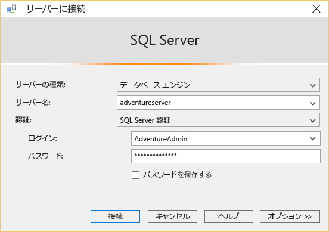
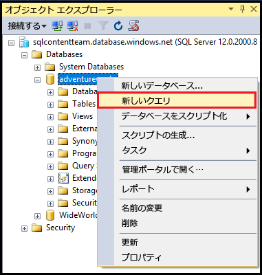
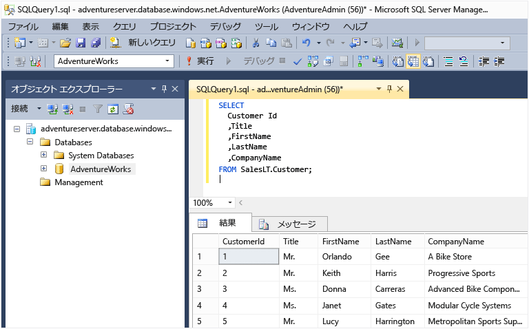

<properties
	pageTitle="SQL Database への接続 - SQL Server Management Studio | Microsoft Azure"
	description="SQL Server Management Studio (SSMS) を使用して Azure で SQL Database に接続する方法について説明します。次に、TRANSACT-SQL (T-SQL) を使用して、サンプル クエリを実行します。"
	metaCanonical=""
	keywords="SQL データベースへの接続、SQL Server Management Studio"
	services="sql-database"
	documentationCenter=""
	authors="stevestein"
	manager="jeffreyg"
	editor="" />

<tags
	ms.service="sql-database"
	ms.workload="data-management"
	ms.tgt_pltfrm="na"
	ms.devlang="na"
	ms.topic="get-started-article"
	ms.date="01/21/2016"
	ms.author="sstein" />

# SQL Server Management Studio を使用して SQL Database に接続し、T-SQL サンプル クエリを実行する

> [AZURE.SELECTOR]
- [C#](sql-database-connect-query.md)
- [SSMS](sql-database-connect-query-ssms.md)
- [Excel](sql-database-connect-excel.md)

この記事では、SQL Server Management Studio (SSMS) を使用して Azure SQL データベースに接続し、TRANSACT-SQL (T-SQL) ステートメントを使用して簡単なクエリを実行する方法を示します。

まず、Azure に SQL データベースが必要です。[Microsoft Azure SQL Database の概要](sql-database-get-started.md)の手順に従えば迅速にデータベースを作成できます。ここでの例は、その記事で作った AdventureWorks のサンプル データベースに基づいていますが、クエリの実行までの同じ手順を他の SQL データベースに対して適用できます。

## SQL Server Management Studio (SSMS) のインストールと起動

SQL Database で作業を行う場合、最新のバージョンの SSMS を使用する必要があります。これを取得するには、[SQL Server Management Studio のダウンロード](https://msdn.microsoft.com/library/mt238290.aspx)に関するページを参照してください。最新のバージョンであれば、最新の更新が利用可能な場合に SSMS が自動的に通知します。

## SSMS を起動し、SQL データベース サーバーに接続する

1. Windows 検索ボックスで、「Microsoft SQL Server Management Studio」と入力し、デスクトップ アプリをクリックして SSMS を起動します。
2. **[サーバーに接続]** ダイアログ ボックスの **[サーバー名]** ボックスで、SQL データベースをホストするサーバーの名前を *&lt;servername>*.**database.windows.net** の形式で 入力します。
3. **[認証]** リストで、**[SQL Server 認証]** を選択します。
4. サーバーを作成した際に設定した**ログイン**と**パスワード**を入力し、**[接続]** をクリックして SQL Database に接続します。

	

### 接続が失敗した場合

接続の失敗の最も一般的な原因は、サーバー名、ユーザー名 (*&lt;;servername>* はデータベースではなく論理サーバーの名前です)、パスワードの間違いや、サーバーがセキュリティ上の理由で接続を許可しないといったものです。最初に接続する場合、または IP 構成の変更により接続が失敗する場合、[最新バージョンの SSMS](https://msdn.microsoft.com/library/mt238290.aspx) は Azure のログインを要求した後、Azure でファイアウォール ルールを作成します。以前のバージョンを使用している場合は、エラー メッセージで IP アドレスが報告されます。この IP アドレスを Azure でサーバーのファイアウォール規則に追加する必要があります。サーバーのファイアウォールの設定が、ローカルのコンピューターの IP アドレスからの接続や SSMS クライアントが使用する IP アドレスからの接続を許可するようになっているか確認してください。この 2 つの IP アドレスが異なることがあります。詳細については、「[方法: ファイアウォール設定を構成する (Azure SQL Database)](sql-database-configure-firewall-settings.md)」を参照してください。

## サンプル クエリの実行

論理サーバーに接続すると、データベースに接続し、サンプル クエリを実行できます。[Microsoft Azure SQL Database の概要](sql-database-get-started.md)で AdventureWorks サンプルを使用してデータベースを作成していないと、このクエリは機能しません。学習を進めるには、飛ばして次のステップに進んでください。

1. **オブジェクト エクスプローラー**で、**[AdventureWorks]** データベースに移動します。
2. データベースを右クリックし、**[新しいクエリ]** を選択します。

	

3. クエリ ウィンドウに、次のコードをコピーして貼り付けます。

		SELECT
		CustomerId
		,Title
		,FirstName
		,LastName
		,CompanyName
		FROM SalesLT.Customer;

4. **[実行]** ボタンをクリックします。次のスクリーン ショットに、成功したクエリを示します。

	

## 次のステップ

SQL Server で可能な方法とほぼ同じように、T-SQL ステートメントを使用して Azure にデータベースを作成して管理することもできます。SQL Server で T-SQL を使用するのに慣れている場合は、「[Azure SQL Database TRANSACT-SQL 情報](sql-database-transact-sql-information.md)」で相違点の概要を参照してください。

T-SQL を初めて使用する場合は、「[チュートリアル: TRANSACT-SQL ステートメントの作成](https://msdn.microsoft.com/library/ms365303.aspx)」と「[TRANSACT-SQL リファレンス (データベース エンジン)](https://msdn.microsoft.com/library/bb510741.aspx)」を参照してください。

<!---HONumber=AcomDC_0128_2016-->