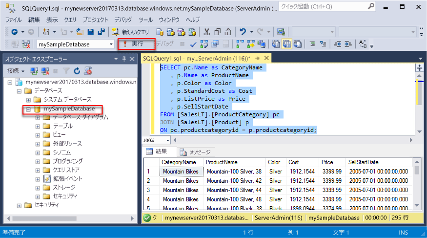
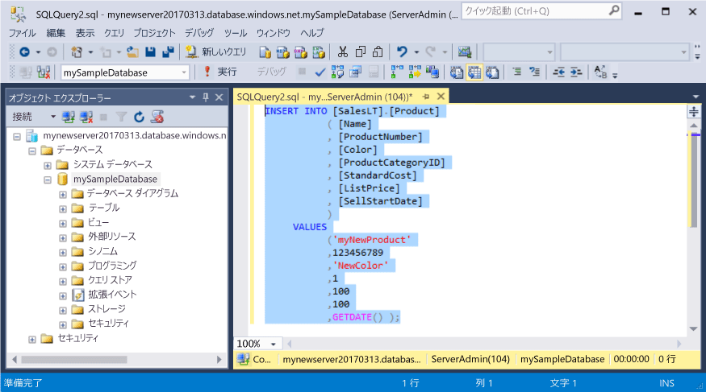
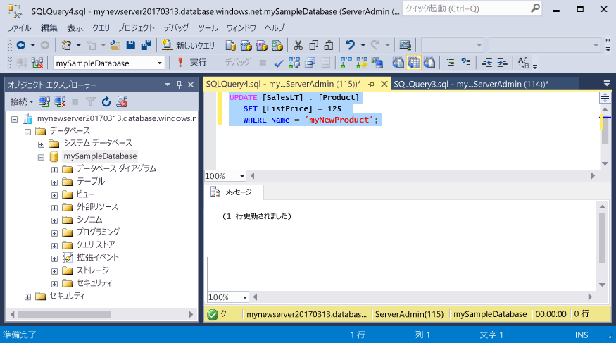
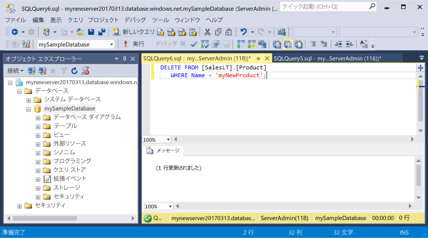

# <a name="azure-sql-database-use-sql-server-management-studio-to-connect-and-query-data"></a>Azure SQL Database: SQL Server Management Studio を使って接続とデータの照会を行う

[SQL Server Management Studio](https://msdn.microsoft.com/library/ms174173.aspx) (SSMS) を使用して、ユーザー インターフェイスまたはスクリプトで SQL Server リソースの作成と管理を行います。 このガイドでは、SSMS を使用して Azure SQL データベースに接続し、照会、挿入、更新、削除の各ステートメントを実行する方法について詳しく説明します。

このクイック スタートでは、次のクイック スタートで作成されたリソースが出発点として使用されます。

- [DB の作成 - ポータル](sql-database-get-started-portal.md)
- [DB の作成 - CLI](sql-database-get-started-cli.md)

開始する前に、必ず最新バージョンの [SSMS](https://msdn.microsoft.com/library/mt238290.aspx) をインストールしておいてください。 

## <a name="get-connection-information"></a>接続情報の取得

Azure Portal で、Azure SQL Database サーバーの完全修飾サーバー名を取得します。 その完全修飾サーバー名は、SQL Server Management Studio でのサーバーへの接続に使用します。

1. [Azure ポータル](https://portal.azure.com/)にログインします。
2. 左側のメニューから **[SQL データベース]** を選択し、**[SQL データベース]** ページで目的のデータベースをクリックします。 
3. そのデータベースの Azure Portal ページの **[要点]** ウィンドウで、**サーバー名**を見つけてコピーします。

    

## <a name="connect-to-the-server"></a>サーバーへの接続

SQL Server Management Studio を使用して、Azure SQL Database サーバーに対する接続を確立します。

1. Windows 検索ボックスに「**SSMS**」と入力し、**Enter** キーを押して SSMS を開きます。

2. **[サーバーへの接続]** ダイアログ ボックスで、次の情報を入力します。
   - **[サーバーの種類]**: データベース エンジンを指定します
   - **[サーバー名]**: 完全修飾サーバー名を入力します (**mynewserver20170313.database.windows.net** など)
   - **[認証]**: SQL Server 認証を指定します
   - **[ログイン]**: サーバー管理者アカウントを入力します
   - **[パスワード]**: サーバー管理者アカウントのパスワードを入力します
 
    

3. **[接続]**をクリックします。 SSMS でオブジェクト エクスプローラー ウィンドウが開きます。 

    

4. オブジェクト エクスプローラーで、**Databases** フォルダー、**mySampleDatabase** フォルダーの順に展開して、サンプル データベース内のオブジェクトを表示します。

## <a name="query-data"></a>データのクエリを実行する

[SELECT](https://msdn.microsoft.com/library/ms189499.aspx) Transact-SQL ステートメントを使用して、Azure SQL データベースのデータを照会します。

1. オブジェクト エクスプローラーで **mySampleDatabase** を右クリックし、**[新しいクエリ]** をクリックします。 データベースに接続された空のクエリ ウィンドウが開きます。
2. このクエリ ウィンドウに次のクエリを入力します。

   ```sql
   SELECT pc.Name as CategoryName, p.name as ProductName
   FROM [SalesLT].[ProductCategory] pc
   JOIN [SalesLT].[Product] p
   ON pc.productcategoryid = p.productcategoryid;
   ```

3. ツール バーの **[実行]** をクリックして、Product と ProductCategory のテーブルからデータを取得します。

    

## <a name="insert-data"></a>データを挿入する

[INSERT](https://msdn.microsoft.com/library/ms174335.aspx) Transact-SQL ステートメントを使用して、Azure SQL データベースにデータを挿入します。

1. ツール バーの **[新しいクエリ]** をクリックします。 データベースに接続された空のクエリ ウィンドウが開きます。
2. このクエリ ウィンドウに次のクエリを入力します。

   ```sql
   INSERT INTO [SalesLT].[Product]
           ( [Name]
           , [ProductNumber]
           , [Color]
           , [ProductCategoryID]
           , [StandardCost]
           , [ListPrice]
           , [SellStartDate]
           )
     VALUES
           ('myNewProduct'
           ,123456789
           ,'NewColor'
           ,1
           ,100
           ,100
           ,GETDATE() );
   ```

3. ツール バーの **[実行]** をクリックして、新しい行を Product テーブルに挿入します。

    

## <a name="update-data"></a>データの更新

[UPDATE](https://msdn.microsoft.com/library/ms177523.aspx) Transact-SQL ステートメントを使用して、Azure SQL データベースのデータを更新します。

1. ツール バーの **[新しいクエリ]** をクリックします。 データベースに接続された空のクエリ ウィンドウが開きます。
2. このクエリ ウィンドウに次のクエリを入力します。

   ```sql
   UPDATE [SalesLT].[Product]
   SET [ListPrice] = 125
   WHERE Name = 'myNewProduct';
   ```

3. ツール バーの **[実行]** をクリックして、Product テーブルの指定した行を更新します。

    

## <a name="delete-data"></a>データの削除

[DELETE](https://msdn.microsoft.com/library/ms189835.aspx) Transact-SQL ステートメントを使用して、Azure SQL データベースのデータを削除します。

1. ツール バーの **[新しいクエリ]** をクリックします。 データベースに接続された空のクエリ ウィンドウが開きます。
2. このクエリ ウィンドウに次のクエリを入力します。

   ```sql
   DELETE FROM [SalesLT].[Product]
   WHERE Name = 'myNewProduct';
   ```

3. ツール バーの **[実行]** をクリックして、Product テーブルの指定した行を削除します。

    

## <a name="next-steps"></a>次のステップ

- SSMS については、「[Use SQL Server Management Studio (SQL Server Management Studio の使用)](https://msdn.microsoft.com/library/ms174173.aspx)」を参照してください。
- Visual Studio Code を使用したデータの照会と編集については、[Visual Studio Code](https://code.visualstudio.com/docs) に関するページを参照してください。

