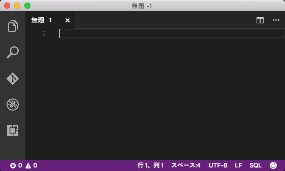
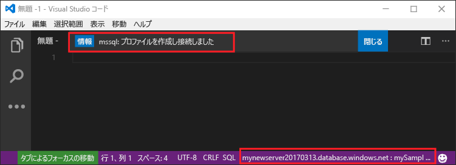
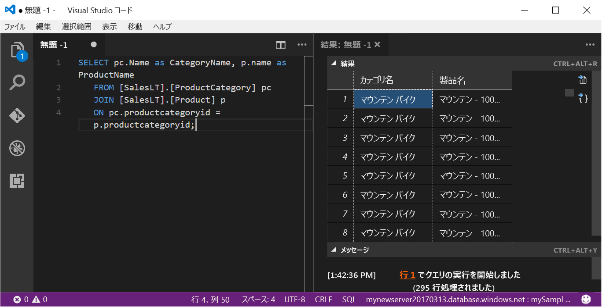

# <a name="azure-sql-database-use-visual-studio-code-to-connect-and-query-data"></a>Azure SQL Database: Visual Studio Code を使って接続とデータの照会を行う

[Visual Studio Code](https://code.visualstudio.com/docs) は、Linux、macOS、Windows で使用できるグラフィカル コード エディターです。Microsoft SQL Server、Azure SQL Database、SQL Data Warehouse のデータを照会するために、[mssql 拡張機能](https://aka.ms/mssql-marketplace)など、各種の拡張機能をサポートしています。 このクイック スタートでは、Visual Studio Code を使って Azure SQL データベースに接続し、Transact-SQL ステートメントを使ってデータベース内のデータを照会、挿入、更新、削除する方法について説明します。

## <a name="prerequisites"></a>前提条件

このクイック スタートでは、次のクイック スタートで作成されたリソースが出発点として使用されます。

[!INCLUDE [prerequisites-create-db](../../includes/sql-database-connect-query-prerequisites-create-db-includes.md)]

#### <a name="install-vs-code"></a>VS コードをインストールします。

開始する前に、必ず最新バージョンの [Visual Studio Code](https://code.visualstudio.com/Download) をインストールして [mssql 拡張機能](https://aka.ms/mssql-marketplace)を読み込んでおいてください。 mssql 拡張機能のインストール ガイダンスについては、「[Install VS Code (VS コードのインストール)](https://docs.microsoft.com/sql/linux/sql-server-linux-develop-use-vscode#install-vs-code)」と「[mssql for Visual Studio Code (Visual Studio Code 用 mssql)](https://marketplace.visualstudio.com/items?itemName=ms-mssql.mssql)」を参照してください。 

## <a name="configure-vs-code"></a>VS Code の構成 

### <a name="mac-os"></a>**Mac OS**
macOS では、mssql 拡張機能で使用される .Net Core の前提条件として、OpenSSL をインストールする必要があります。 使用するターミナルを開き、次のコマンドを入力して、**brew** と **OpenSSL** をインストールします。 

```bash
ruby -e "$(curl -fsSL https://raw.githubusercontent.com/Homebrew/install/master/install)"
brew update
brew install openssl
mkdir -p /usr/local/lib
ln -s /usr/local/opt/openssl/lib/libcrypto.1.0.0.dylib /usr/local/lib/
ln -s /usr/local/opt/openssl/lib/libssl.1.0.0.dylib /usr/local/lib/
```

### <a name="linux-ubuntu"></a>**Linux (Ubuntu)**

特別な構成は必要ありません。

### <a name="windows"></a>**Windows**

特別な構成は必要ありません。

## <a name="sql-server-connection-information"></a>SQL Server の接続情報

Azure SQL データベースに接続するために必要な接続情報を取得します。 後の手順で、完全修飾サーバー名、データベース名、ログイン情報が必要になります。

[!INCLUDE [prerequisites-server-connection-info](../../includes/sql-database-connect-query-prerequisites-server-connection-info-includes.md)]

## <a name="set-language-mode-to-sql"></a>言語モードを SQL に設定

Visual Studio Code で言語モードを **[SQL]** に設定し、mssql コマンドと T-SQL IntelliSense を有効にします。

1. 新しい Visual Studio Code ウィンドウを開きます。 

2. ステータス バーの右下隅の **[プレーン テキスト]** をクリックします。
3. 表示された **[言語モードの選択]** ドロップダウン メニューで「**SQL**」と入力し、**Enter** キーを押して、言語モードを SQL に設定します。 

   

## <a name="connect-to-your-database"></a>データベースに接続する

Visual Studio Code を使用して、Azure SQL Database サーバーに対する接続を確立します。

> [!IMPORTANT]
> 続行する前に、サーバー、データベース、およびログイン情報が準備できていることを確認します。 接続プロファイル情報の入力を開始した後は、Visual Studio Code からフォーカスを移動すると、接続プロファイルの作成をやり直さなければならなくなります。
>

1. VS Code で、**Ctrl + Shift + P** キー (または **F1** キー) を押してコマンド パレットを開きます。

2. 「**sqlcon**」と入力して **Enter** キーを押します。

3. **Enter** キーを押して **[接続プロファイルの作成]** を選択します。 これで、SQL Server インスタンスの接続プロファイルが作成されます。

4. プロンプトに従って、新しい接続プロファイルの接続プロパティを指定します。 それぞれの値を指定したら、**Enter** キーを押して続行します。 

   | Setting       | 推奨値 | 説明 |
   | ------------ | ------------------ | ------------------------------------------------- | 
   | **[サーバー名] | 完全修飾サーバー名 | 名前は **mynewserver20170313.database.windows.net** のような形式で指定する必要があります。 |
   | **[データベース名]** | mySampleDatabase | 接続先のデータベースの名前です。 |
   | **認証** | SQL ログイン| このチュートリアルで構成した認証の種類は "SQL 認証" のみです。 |
   | **ユーザー名** | サーバー管理者アカウント | これは、サーバーの作成時に指定したアカウントです。 |
   | **[パスワード (SQL ログイン)]** | サーバー管理者アカウントのパスワード | これは、サーバーの作成時に指定したパスワードです。 |
   | **[パスワードを保存しますか?]** | はい/いいえ | パスワードを毎回入力する手間を省くには、[はい] を選択します。 |
   | **[このプロファイルの名前を入力してください]** | プロファイル名 (**mySampleDatabase** など) | 保存されたプロファイル名によって、以降のログインで、より速く接続できるようになります。 | 

5. **Esc** キーを押して、プロファイルが作成され、接続が確立されたことを示す情報メッセージを閉じます。

6. ステータス バーで接続を確認します。

   

## <a name="query-data"></a>データのクエリを実行する

次のコードを使用して、カテゴリ別で上位 20 の製品を照会します。ここでは [SELECT](https://msdn.microsoft.com/library/ms189499.aspx) Transact-SQL ステートメントを使用します。

1. **エディター** ウィンドウで、空のクエリ ウィンドウに次のクエリを入力します。

   ```sql
   SELECT pc.Name as CategoryName, p.name as ProductName
   FROM [SalesLT].[ProductCategory] pc
   JOIN [SalesLT].[Product] p
   ON pc.productcategoryid = p.productcategoryid;
   ```

2. **Ctrl + Shift + E** キーを押して、Product と ProductCategory のテーブルからデータを取得します。

    

## <a name="insert-data"></a>データを挿入する

次のコードを使用して、SalesLT.Product テーブルに新しい製品を挿入します。ここでは [INSERT](https://msdn.microsoft.com/library/ms174335.aspx) Transact-SQL ステートメントを使用します。

1. **エディター** ウィンドウで、前のクエリを削除して次のクエリを入力します。

   ```sql
   INSERT INTO [SalesLT].[Product]
           ( [Name]
           , [ProductNumber]
           , [Color]
           , [ProductCategoryID]
           , [StandardCost]
           , [ListPrice]
           , [SellStartDate]
           )
     VALUES
           ('myNewProduct'
           ,123456789
           ,'NewColor'
           ,1
           ,100
           ,100
           ,GETDATE() );
   ```

2. **Ctrl + Shift + E** キーを押して、新しい行を Product テーブルに挿入します。

## <a name="update-data"></a>データの更新

次のコードを使用して、先ほど追加した新しい製品を更新します。ここでは [UPDATE](https://msdn.microsoft.com/library/ms177523.aspx) Transact-SQL ステートメントを使用します。

1.  **エディター** ウィンドウで、前のクエリを削除して次のクエリを入力します。

   ```sql
   UPDATE [SalesLT].[Product]
   SET [ListPrice] = 125
   WHERE Name = 'myNewProduct';
   ```

2. **Ctrl + Shift + E** キーを押して、Product テーブルの指定した行を更新します。

## <a name="delete-data"></a>データの削除

次のコードを使用して、先ほど追加した新しい製品を削除します。ここでは [DELETE](https://docs.microsoft.com/sql/t-sql/statements/delete-transact-sql) Transact-SQL ステートメントを使用します。

1. **エディター** ウィンドウで、前のクエリを削除して次のクエリを入力します。

   ```sql
   DELETE FROM [SalesLT].[Product]
   WHERE Name = 'myNewProduct';
   ```

2. **Ctrl + Shift + E** キーを押して、Product テーブルの指定した行を削除します。

## <a name="next-steps"></a>次の手順

- SQL Server Management Studio を使用して接続とクエリを実行するには、[SSMS を使用した接続とクエリ](sql-database-connect-query-ssms.md)に関するページを参照してください。
- Azure Portal を使用して接続とクエリを実行するには、[Azure Portal の SQL クエリ エディターを使用した接続とクエリ実行](sql-database-connect-query-portal.md)に関するページをご覧ください。
- Visual Studio Code の使用に関するMSDN マガジンの記事については、[MSSQL 拡張機能によるデータベース IDE の作成に関するブログの投稿](https://msdn.microsoft.com/magazine/mt809115)を参照してください。
