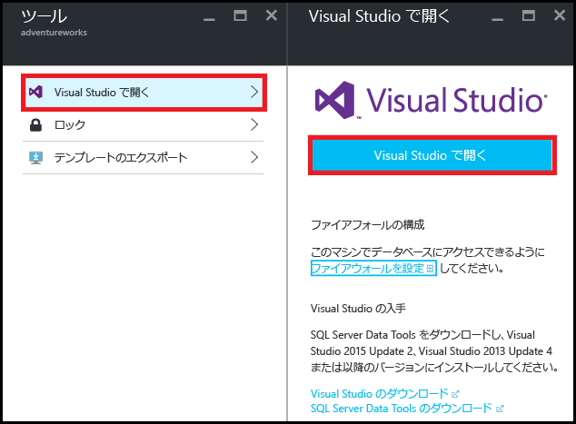
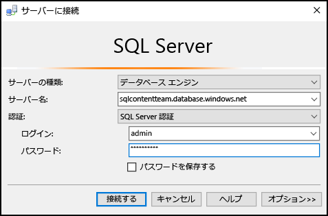
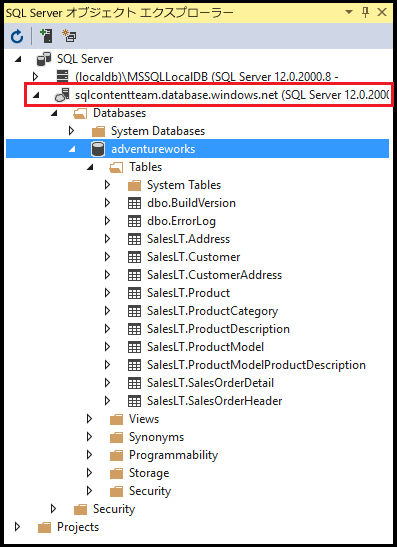
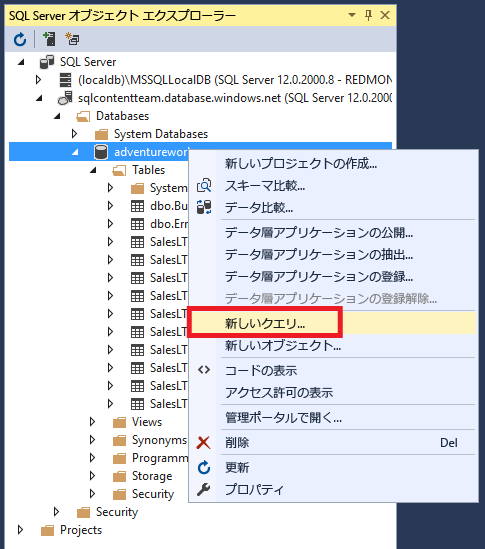
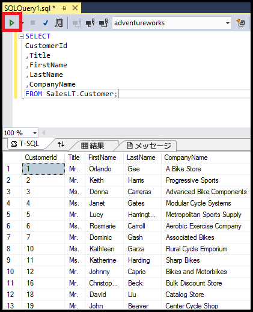

# Visual Studio で SQL Database に接続する
> [!div class="op_single_selector"]
> * [Visual Studio](sql-database-connect-query.md)
> * [SSMS](sql-database-connect-query-ssms.md)
> * [Excel](sql-database-connect-excel.md)
> 
> 

Visual Studio で Azure SQL データベースに接続する方法について説明します。 

## 前提条件
Visual Studio を使用して SQL データベースに接続するには、以下のものが必要です。 

* 接続先の SQL データベース。 この記事では、 **AdventureWorks** サンプル データベースを使用します。 AdventureWorks サンプル データベースを入手するには、 [デモ データベースの作成](sql-database-get-started.md)に関するページを参照してください。
* Visual Studio 2013 Update 4 以降。 現在 Microsoft では、Visual Studio Community を *無料*で提供しています。
  
  * [Visual Studio Community のダウンロード](http://www.visualstudio.com/products/visual-studio-community-vs)
  * [その他の無料版 Visual Studio の選択肢](http://www.visualstudio.com/products/free-developer-offers-vs.aspx)

## Azure ポータルから Visual Studio を開く
1. [Azure ポータル](https://portal.azure.com/)にログインします。
2. **[More Services (その他のサービス)]** > **[SQL データベース]** の順にクリックします。
3. **AdventureWorks** データベースを見つけてクリックして、 *AdventureWorks* データベース ブレードを開きます。
4. データベース ブレードの上部にある **[ツール]** ボタンをクリックします。
   
    
5. **[Visual Studio で開く]** をクリックします (Visual Studio が必要な場合は、ダウンロード リンクをクリックしてください)。
   
    
6. Visual Studio が開かれます。**[サーバーに接続]** ウィンドウは既に、ポータルで選択したサーバーとデータベースに接続するように設定されています  (**[オプション]** をクリックし、接続が正しいデータベースに設定されていることを確認します)。サーバー管理者パスワードを入力し、**[接続]** をクリックします。

    

1. 自分のコンピューターの IP アドレス用にファイアウォール規則をセットアップしていない場合は、ここで " *接続できません* " というメッセージが表示されます。 ファイアウォール規則を作成するには、「 [Azure ポータルを使用して Azure SQL Database のサーバー レベルのファイアウォール規則を作成する](sql-database-configure-firewall-settings.md)」を参照してください。
2. 正常に接続すると、データベースに接続した状態で、 **[SQL Server オブジェクト エクスプローラー]** ウィンドウが開かれます。
   
    

## サンプル クエリの実行
これでデータベースに接続できたので、次の手順では単純なクエリを実行する方法を示します。

1. データベースを右クリックし、 **[新しいクエリ]**を選択します。
   
    
2. クエリ ウィンドウに、次のコードをコピーして貼り付けます。
   
        SELECT
        CustomerId
        ,Title
        ,FirstName
        ,LastName
        ,CompanyName
        FROM SalesLT.Customer;
3. クエリを実行するには、 **[実行]** ボタンをクリックします。
   
    

## 次のステップ
* Visual Studio で SQL データベースを開くには、SQL Server Data Tools を使用します。 詳細については、「 [SQL Server Data Tools](https://msdn.microsoft.com/library/hh272686.aspx)」を参照してください。
* コードを使用して SQL データベースに接続するには、「 [.NET (C#) を使用して SQL Database に接続する](sql-database-develop-dotnet-simple.md)」を参照してください。

<!--HONumber=Dec16_HO2-->

