# <a name="azure-ad-authentication-access-and-database-level-firewall-rules"></a>Azure AD 認証、アクセス、データベースレベルのファイアウォール規則
このチュートリアルでは、SQL Server Management Studio を使用して、Azure Active Directory 認証、ログイン、ユーザー、データベース ロールを操作し、Azure SQL Database サーバーとデータベースへのアクセス権とアクセス許可を付与する方法を学習します。 学習内容は、次のとおりです。

- master データベースとユーザー データベースのユーザー アクセス許可を表示する
- Azure Active Directory 認証に基づいたログインとユーザーを作成する
- サーバー全体およびデータベース固有のアクセス許可をユーザーに付与する
- 管理者以外のユーザーとしてユーザー データベースにログインする
- データベース ユーザー用のデータベースレベルのファイアウォール規則を作成する
- サーバー管理者用のサーバーレベルのファイアウォール規則を作成する

**推定所要時間**: このチュートリアルの完了には約 45 分かかります (既に前提条件を満たしていることが前提です)。

## <a name="prerequisites"></a>前提条件

* **Azure アカウント**。 Azure アカウントが必要です。 [無料の Azure アカウントを作成する](https://azure.microsoft.com/free/)か、[Visual Studio サブスクライバーの特典を有効にする](https://azure.microsoft.com/pricing/member-offers/msdn-benefits/)ことができます。 

* **Azure の作成のアクセス許可**。 サブスクリプションの所有者または共同作成者ロールのメンバーであるアカウントを使用して Azure Portal に接続できることが必要です。 ロールベースのアクセス制御 (RBAC) の詳細については、「[Azure Portal でのアクセス管理の概要](../active-directory/role-based-access-control-what-is.md)」を参照してください。

* **SQL Server Management Studio**。 最新バージョンの SQL Server Management Studio (SSMS) は、「[SQL Server Management Studio (SSMS) のダウンロード](https://msdn.microsoft.com/library/mt238290.aspx)」からダウンロードしてインストールすることができます。 新機能が継続的にリリースされているため、Azure SQL Database に接続する場合は、常に最新バージョンの SSMS を使用してください。

* **基本サーバーおよびデータベース**。このチュートリアルで使用するサーバーと&2; つのデータベースをインストールして構成するには、**[Deploy to Azure (Azure へのデプロイ)]** ボタンをクリックします。 ボタンをクリックすると **[Deploy from a template (テンプレートからのデプロイ)]** ブレードが開くので、新しいリソース グループを作成し、作成予定の新しいサーバーの **[管理者ログイン パスワード]** を指定します。

   [](https://portal.azure.com/#create/Microsoft.Template/uri/https%3A%2F%2Fsqldbtutorial.blob.core.windows.net%2Ftemplates%2Fsqldbgetstarted.json)

   > [!NOTE]
   > SQL Server 認証用の関連チュートリアル、「[SQL 認証、ログインとユーザー アカウント、データベース ロール、アクセス許可、サーバーレベルのファイアウォール規則、データベースレベルのファイアウォール規則](sql-database-control-access-sql-authentication-get-started.md)」の完了は任意ですが、そのチュートリアルで説明されている概念については、ここでは繰り返し説明していません。 サーバーレベルとデータベースレベルのファイアウォールに関連した、このチュートリアルの手順は、この関連チュートリアルを同じコンピューター (同じ IP アドレスを使用) 上で完了済みの場合は不要です。そのため、オプションとしてマークしてあります。 また、このチュートリアルのスクリーンショットは、この関連チュートリアルが完了していることを前提としています。 
   >

* Azure Active Directory を作成、設定済みである。 詳細については、「[オンプレミス ID と Azure Active Directory の統合](../active-directory/active-directory-aadconnect.md)」、[Azure AD への独自のドメイン名の追加](../active-directory/active-directory-add-domain.md)に関するページ、「[Microsoft Azure now supports federation with Windows Server Active Directory](https://azure.microsoft.com/blog/2012/11/28/windows-azure-now-supports-federation-with-windows-server-active-directory/)」(Microsoft Azure が Windows Server Active Directory とのフェデレーションに対応)、「[Azure AD ディレクトリの管理](https://msdn.microsoft.com/library/azure/hh967611.aspx)」、[Windows PowerShell を使用した Azure AD の管理](https://msdn.microsoft.com/library/azure/jj151815.aspx)に関するページ、および「[Hybrid Identity Required Ports and Protocols](../active-directory/active-directory-aadconnect-ports.md)」(ハイブリッド ID の必須ポートとプロトコル) を参照してください。

> [!NOTE]
> このチュートリアルは、[SQL Database のアクセスと制御](sql-database-control-access.md)、[ログイン、ユーザー、データベース ロール](sql-database-manage-logins.md)、[プリンシパル](https://msdn.microsoft.com/library/ms181127.aspx)、[データベース ロール](https://msdn.microsoft.com/library/ms189121.aspx)、[SQL Database ファイアウォール規則](sql-database-firewall-configure.md)、[Azure Active Directory 認証](sql-database-aad-authentication.md) という学習トピックの内容を理解する際に役立ちます。 
>  

## <a name="sign-in-to-the-azure-portal-using-your-azure-account"></a>Azure アカウントを使用して Azure Portal にサインインする
[既存のサブスクリプション](https://account.windowsazure.com/Home/Index)を使用して、次の手順に従って Azure Portal に接続します。

1. 任意のブラウザーを開き、 [Azure ポータル](https://portal.azure.com/)に接続します。
2. [Azure ポータル](https://portal.azure.com/)にサインインします。
3. **[サインイン]** ページが表示されたら、サブスクリプションの資格情報を入力します。
   
   ![[サインイン]](./media/sql-database-get-started/login.png)


<a name="create-logical-server-bk"></a>

## <a name="provision-an-azure-active-directory-admin-for-your-sql-logical-server"></a>SQL 論理サーバーの Azure Active Directory 管理者をプロビジョニングする

チュートリアルのこのセクションでは、Azure Portal で論理サーバーのセキュリティ構成に関する情報を確認します。

1. 論理サーバーの **[SQL Server]** ブレードを開き、**[概要]** ページの情報を確認します。 Azure Active Directory 管理者が構成されていないことに注意してください。

   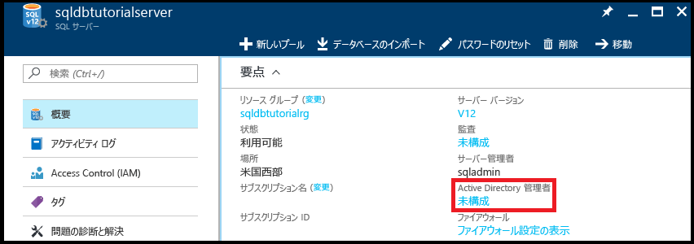

2. **[要点]** ウィンドウの **[未構成]** をクリックし、**[Active Directory 管理者]** ブレードを開きます。

   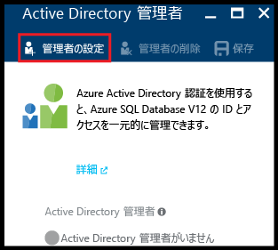

3. **[管理者の設定]** をクリックして **[管理者の追加]** ブレードを開き、サーバーの Active Directory 管理者として Active Directory ユーザー アカウントまたはグループ アカウントを選択します。

   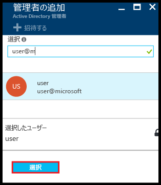

4. **[選択]** をクリックし、**[保存]** をクリックします。

   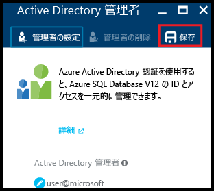

> [!NOTE]
> このサーバーの接続情報を確認するには、[サーバーの管理](sql-database-manage-servers-portal.md)に関するページを参照してください。 このチュートリアル シリーズでは、完全修飾サーバー名は 'sqldbtutorialserver.database.windows.net' です。
>

## <a name="connect-to-sql-server-using-sql-server-management-studio-ssms"></a>SQL Server Management Studio (SSMS) を使用して SQL Server に接続する

1. 最新バージョンの SSMS をまだインストールしていない場合は、[SQL Server Management Studio のダウンロード](https://msdn.microsoft.com/library/mt238290.aspx)に関するページで最新バージョンの SSMS をダウンロードしてインストールしてください。 SSMS は、最新の状態を保つために、新しいバージョンのダウンロードが可能になると、更新を求めるメッセージを表示します。

2. インストール後に、Windows 検索ボックスに「**Microsoft SQL Server Management Studio**」と入力し、**Enter** キーを押して SSMS を開きます。

   

3. **[サーバーへの接続]** ダイアログ ボックスで、Active Directory の認証方法のいずれかを選択し、適切な認証情報を入力します。 方法の選択については、[Azure Active Directory 認証](sql-database-aad-authentication.md)に関する記事と [Azure AD MFA のための SSMS のサポート](sql-database-ssms-mfa-authentication.md)に関する記事を参照してください。

   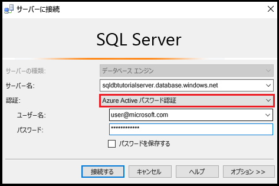

4. SQL Server 認証とサーバー管理者アカウントを使用して、SQL サーバーに接続するために必要な情報を入力します。

5. **[接続]**をクリックします。

   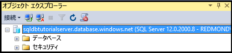

## <a name="view-the-server-admin-account-and-its-permissions"></a>サーバー管理者アカウントとそのアクセス許可を表示する 
チュートリアルのこのセクションでは、master データベースとユーザー データベースのサーバー管理者アカウントとそのアクセス許可に関する情報を表示します。

1. オブジェクト エクスプローラーで、**[データベース]**、**[システム データベース]**、**[master]**、**[セキュリティ]**、**[ユーザー]** の順に展開します。 master データベースに Active Directory 管理者のユーザー アカウントが作成されていることがわかります。 また、Active Directory 管理者ユーザー アカウントのログインは作成されなかったこともわかります。

   

   > [!NOTE]
   > 表示される他のユーザー アカウントについては、「[プリンシパル](https://msdn.microsoft.com/library/ms181127.aspx)」を参照してください。
   >

2. オブジェクト エクスプローラーで **[master]** を右クリックし、**[新しいクエリ]** をクリックして、master データベースに接続されているクエリ ウィンドウを開きます。
3. クエリ ウィンドウで、次のクエリを実行すると、そのクエリを実行しているユーザーに関する情報が返されます。 このクエリを実行しているユーザー アカウントについて user@microsoft.com が返されることがわかります (この手順の後半でユーザー データベースに対してクエリを実行すると、異なる結果が表示されます)。

   ```
   SELECT USER;
   ```

   

4. クエリ ウィンドウで、次のクエリを実行すると、Active Directory 管理者ユーザーのアクセス許可に関する情報が返されます。 Active Directory 管理者ユーザーには、master データベースへの接続、ログインとユーザーの作成、sys.sql_logins テーブルの情報の選択、dbmanager および dbcreator データベース ロールへのユーザーの追加を行うためのアクセス許可があることがわかります。 これらのアクセス許可は、すべてのユーザーのアクセス許可の継承元である public ロールに付与されているアクセス許可 (特定のテーブルの情報を選択するアクセス許可など) に加わります。 詳細については、「[権限](https://msdn.microsoft.com/library/ms191291.aspx)」を参照してください。

   ```
   SELECT prm.permission_name
      , prm.class_desc
      , prm.state_desc
      , p2.name as 'Database role'
      , p3.name as 'Additional database role' 
   FROM sys.database_principals p
   JOIN sys.database_permissions prm
      ON p.principal_id = prm.grantee_principal_id
      LEFT JOIN sys.database_principals p2
      ON prm.major_id = p2.principal_id
      LEFT JOIN sys.database_role_members r
      ON p.principal_id = r.member_principal_id
      LEFT JOIN sys.database_principals p3
      ON r.role_principal_id = p3.principal_id
   WHERE p.name = 'user@microsoft.com';
   ```

   

6. オブジェクト エクスプローラーで、**[blankdb]**、**[セキュリティ]**、**[ユーザー]** の順に展開します。 このデータベースには、user@microsoft.com というユーザー アカウントが存在しないことがわかります。

   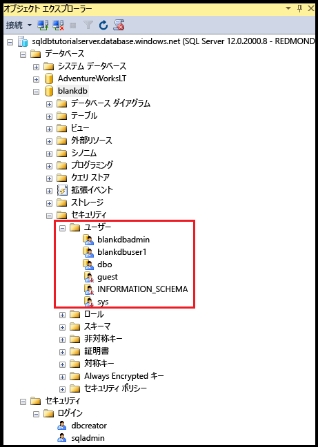

7. オブジェクト エクスプローラーで、**[blankdb]** を右クリックし、**[新しいクエリ]** をクリックします。

8. クエリ ウィンドウで、次のクエリを実行すると、そのクエリを実行しているユーザーに関する情報が返されます。 このクエリを実行しているユーザー アカウントについて dbo が返されることがわかります (既定では、サーバー管理者ログインは各ユーザー データベースの dbo ユーザー アカウントにマップされています)。

   ```
   SELECT USER;
   ```

   

9. クエリ ウィンドウで、次のクエリを実行すると、dbo ユーザーのアクセス許可に関する情報が返されます。 dbo が public ロールのメンバーであり、db_owner 固定データベース ロールのメンバーでもあることがわかります。 詳細については、「[データベース レベルのロール](https://msdn.microsoft.com/library/ms189121.aspx)」を参照してください。

   ```
   SELECT prm.permission_name
      , prm.class_desc
      , prm.state_desc
      , p2.name as 'Database role'
      , p3.name as 'Additional database role' 
   FROM sys.database_principals AS p
   JOIN sys.database_permissions AS prm
      ON p.principal_id = prm.grantee_principal_id
      LEFT JOIN sys.database_principals AS p2
      ON prm.major_id = p2.principal_id
      LEFT JOIN sys.database_role_members r
      ON p.principal_id = r.member_principal_id
      LEFT JOIN sys.database_principals AS p3
      ON r.role_principal_id = p3.principal_id
   WHERE p.name = 'dbo';
   ```

   

10. 必要に応じて、AdventureWorksLT ユーザー データベースに対して前の&3; つの手順を繰り返します。

## <a name="create-a-new-user-in-the-adventureworkslt-database-with-select-permissions"></a>AdventureWorksLT データベースで SELECT アクセス許可を持つ新しいユーザーを作成する

チュートリアルのこのセクションでは、ユーザーの Azure AD ユーザーのプリンシパル名または Azure AD グループの表示名に基づいて AdventureWorksLT データベースにユーザー アカウントを作成し、このユーザーのアクセス許可を public ロールのメンバーとしてテストします。その後、このユーザーに SELECT アクセス許可を付与し、このユーザーのアクセス許可をもう一度テストします。

> [!NOTE]
> データベースレベルのユーザー ([包含ユーザー](https://msdn.microsoft.com/library/ff929188.aspx)) の場合は、データベースの移植性 (以降のチュートリアルで説明する機能) が向上します。
>

1. オブジェクト エクスプローラーで **[AdventureWorksLT]** を右クリックし、**[新しいクエリ]** をクリックして、AdventureWorksLT データベースに接続されているクエリ ウィンドウを開きます。
2. 次のステートメントを実行して、AdventureWorksLT データベースに Microsoft ドメインの aaduser1 というユーザーのユーザー アカウントを作成します。

   ```
   CREATE USER [aaduser1@microsoft.com]
   FROM EXTERNAL PROVIDER;
   ```
   

3. クエリ ウィンドウで、次のクエリを実行すると、user1 のアクセス許可に関する情報が返されます。 user1 が持っているアクセス許可は public ロールから継承したアクセス許可のみであることがわかります。

   ```
   SELECT prm.permission_name
      , prm.class_desc
      , prm.state_desc
      , p2.name as 'Database role'
      , p3.name as 'Additional database role' 
   FROM sys.database_principals AS p
   JOIN sys.database_permissions AS prm
      ON p.principal_id = prm.grantee_principal_id
      LEFT JOIN sys.database_principals AS p2
      ON prm.major_id = p2.principal_id
      LEFT JOIN sys.database_role_members r
      ON p.principal_id = r.member_principal_id
      LEFT JOIN sys.database_principals AS p3
      ON r.role_principal_id = p3.principal_id
   WHERE p.name = 'aaduser1@microsoft.com';
   ```

   

4. 次のクエリを実行して、user1 として AdventureWorksLT データベース内のテーブルを照会してみます。

   ```
   EXECUTE AS USER = 'aaduser1@microsoft.com';  
   SELECT * FROM [SalesLT].[ProductCategory];
   REVERT;
   ```

   

5. 次のステートメントを実行して、SalesLT スキーマの ProductCategory テーブルに対する SELECT アクセス許可を user1 に付与します。

   ```
   GRANT SELECT ON OBJECT::[SalesLT].[ProductCategory] to [aaduser1@microsoft.com];
   ```

   

6. 次のクエリを実行して、user1 として AdventureWorksLT データベース内のテーブルを照会してみます。

   ```
   EXECUTE AS USER = 'aaduser1@microsoft.com';  
   SELECT * FROM [SalesLT].[ProductCategory];
   REVERT;
   ```

   

## <a name="create-a-database-level-firewall-rule-for-adventureworkslt-database-users"></a>AdventureWorksLT データベース ユーザー用のデータベースレベルのファイアウォール規則を作成する

> [!NOTE]
> SQL Server 認証の関連チュートリアル「[SQL の認証と承認](sql-database-control-access-sql-authentication-get-started.md)」で同様の手順を完了していて、同じ IP アドレスを使用する同じコンピューターを使用して学習を進めている場合は、この手順を完了する必要はありません。
>

チュートリアルのこのセクションでは、別の IP アドレスを使用するコンピューターから新しいユーザー アカウントを使用してログインを試みた後、サーバー管理者としてデータベースレベルのファイアウォール規則を作成し、この新しいデータベースレベルのファイアウォール規則を使用して正常にログインします。 

> [!NOTE]
> [データベースレベルのファイアウォール規則](sql-database-firewall-configure.md)を使用すると、データベースの移植性 (以降のチュートリアルで説明する機能) が向上します。
>

1. まだサーバーレベルのファイアウォール規則を作成していない別のコンピューターで、SQL Server Management Studio を開きます。

   > [!IMPORTANT]
   > 常に最新バージョンの SSMS を使用してください ([SQL Server Management Studio のダウンロード](https://msdn.microsoft.com/library/mt238290.aspx) ページで入手できます)。 
   >

2. **[サーバーへの接続]** ウィンドウで、サーバー名と認証情報を入力し、SQL Server 認証と aaduser1@microsoft.com アカウントを使用して接続します。 
    
   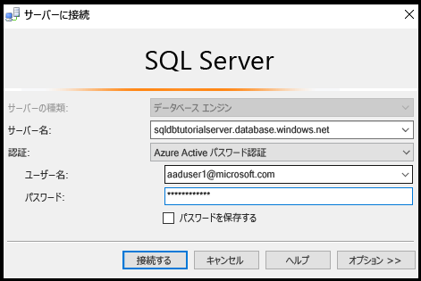

3. **[オプション]** をクリックして接続先のデータベースを指定し、**[接続のプロパティ]** タブの **[データベースへの接続]** ボックスの一覧で「**AdventureWorksLT**」と入力します。
   
   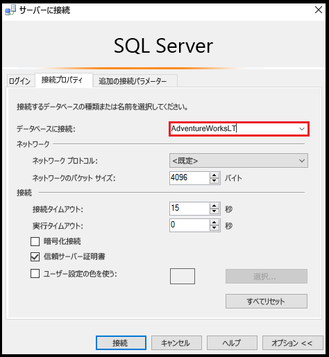

4. **[接続]**をクリックします。 SQL Database への接続元のコンピューターにデータベースへのアクセスを有効にするファイアウォール規則がないことを示すダイアログ ボックスが表示されます。 表示されるダイアログ ボックスには、ファイアウォールに対して前に実行した手順に応じて&2; つの種類がありますが、通常は最初のダイアログ ボックスが表示されます。

   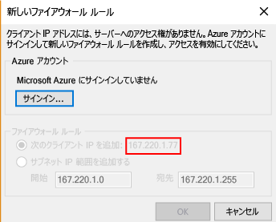

   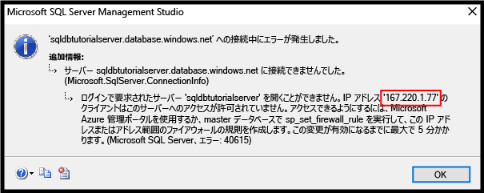

   > [!NOTE]
   > SSMS の最新バージョンには、サブスクリプション所有者と共同作成者が Microsoft Azure にサインインしてサーバーレベルのファイアウォール規則を作成できるようにする機能が含まれています。
   > 

4. 手順 7. で使用するために、このダイアログ ボックスのクライアント IP アドレスをコピーします。
5. **[キャンセル]** をクリックしますが、**[サーバーへの接続]** ダイアログ ボックスは閉じません。
6. 既にサーバーレベルのファイアウォール規則を作成してあるコンピューターに戻り、サーバー管理者アカウントを使用してサーバーに接続します。
7. AdventureWorksLT データベースにサーバー管理者として接続している新しいクエリ ウィンドウで、次のステートメントを実行します。手順 4. の IP アドレスを使用して [sp_set_database_firewall_rule](https://msdn.microsoft.com/library/dn270010.aspx) を実行することで、データベースレベルのファイアウォールを作成します。

   ```
   EXEC sp_set_database_firewall_rule @name = N'AdventureWorksLTFirewallRule', 
     @start_ip_address = 'x.x.x.x', @end_ip_address = 'x.x.x.x';
   ```

   

8. コンピューターを再度切り替えて、**[サーバーへの接続]** ダイアログ ボックスの **[接続]** をクリックし、aaduser1 として AdventureWorksLT に接続します。 

9. オブジェクト エクスプローラーで、**[データベース]**、**[AdventureWorksLT]**、**[テーブル]** の順に展開します。 user1 には、**SalesLT.ProductCategory** テーブルという&1; つのテーブルを表示するアクセス許可しかないことがわかります。 

10. オブジェクト エクスプローラーで、**[SalesLT.ProductCategory]** を右クリックし、**[上位 1000 行の選択]** をクリックします。   

## <a name="next-steps"></a>次のステップ
- SQL Database でのアクセスおよび制御の概要については、[SQL Database のアクセスと制御](sql-database-control-access.md)に関するページを参照してください。
- SQL Database のログイン、ユーザー、データベース ロールの概要については、[ログイン、ユーザー、およびデータベース ロール](sql-database-manage-logins.md)に関するページを参照してください。
- データベース プリンシパルの詳細については、「[プリンシパル](https://msdn.microsoft.com/library/ms181127.aspx)」を参照してください。
- データベース ロールの詳細については、[データベース ロール](https://msdn.microsoft.com/library/ms189121.aspx)に関するページを参照してください。
- SQL Database のファイアウォール規則の詳細については、[SQL Database のファイアウォール規則](sql-database-firewall-configure.md)に関するページを参照してください。


