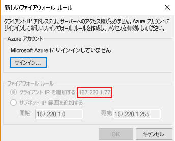
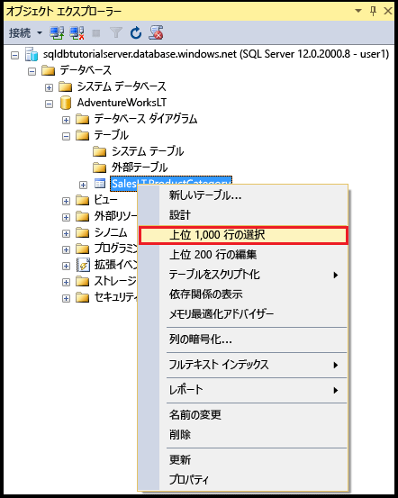
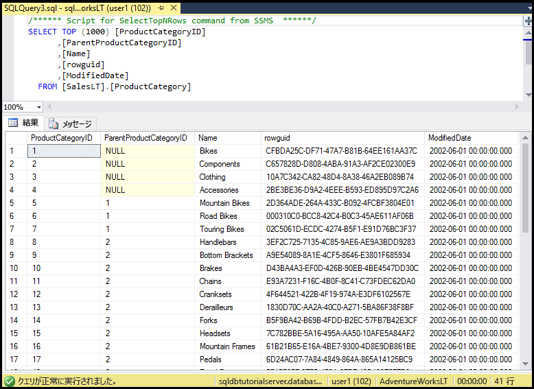

# <a name="sql-database-tutorial-sql-server-authentication-logins-and-user-accounts-database-roles-permissions-server-level-firewall-rules-and-database-level-firewall-rules"></a>SQL Database チュートリアル: SQL Server 認証、ログインとユーザー アカウント、データベース ロール、アクセス許可、サーバーレベルのファイアウォール規則、データベースレベルのファイアウォール規則
この入門用チュートリアルでは、SQL Server Management Studio を使用して、SQL Server 認証、ログイン、ユーザー、データベース ロールを操作し、Azure SQL Database サーバーとデータベースへのアクセス権とアクセス許可を付与する方法を学習します。 学習内容は、次のとおりです。

- master データベースとユーザー データベースのユーザー アクセス許可を表示する
- SQL Server 認証に基づいたログインとユーザーを作成する
- サーバー全体およびデータベース固有のアクセス許可をユーザーに付与する
- 管理者以外のユーザーとしてユーザー データベースにログインする
- データベース ユーザー用のデータベースレベルのファイアウォール規則を作成する
- サーバー管理者用のサーバーレベルのファイアウォール規則を作成する

**推定所要時間**: このチュートリアルの完了には約 45 分かかります (既に前提条件を満たしていることが前提です)。

## <a name="prerequisites"></a>前提条件

* Azure アカウントが必要です。 [無料の Azure アカウントを作成する](/pricing/free-trial/?WT.mc_id=A261C142F)か、[Visual Studio サブスクライバーの特典を有効にする](/pricing/member-offers/msdn-benefits-details/?WT.mc_id=A261C142F)ことができます。 

* サブスクリプションの所有者または共同作成者ロールのメンバーであるアカウントを使用して Azure Portal に接続できることが必要です。 ロールベースのアクセス制御 (RBAC) の詳細については、「[Azure Portal でのアクセス管理の概要](../active-directory/role-based-access-control-what-is.md)」を参照してください。

* 「[Azure Portal と SQL Server Management Studio を使用して Azure SQL Database のサーバー、データベース、ファイアウォール規則を使ってみる](sql-database-get-started.md)」またはこのチュートリアルの [PowerShell バージョン](sql-database-get-started-powershell.md)を完了している。 完了していない場合は、次に進む前に、この前提条件のチュートリアルを完了するか、このチュートリアルの [PowerShell バージョン](sql-database-get-started-powershell.md)の最後にある PowerShell スクリプトを実行してください。

> [!NOTE]
> このチュートリアルは、他の学習トピックの内容を理解するために役立ちます。そのようなトピックは、"[SQL Database のアクセスと制御](sql-database-control-access.md)"、"[ログイン、ユーザー、およびデータベース ロール](sql-database-manage-logins.md)"、"[プリンシパル](https://msdn.microsoft.com/library/ms181127.aspx)"、"[データベース ロール](https://msdn.microsoft.com/library/ms189121.aspx)"、および "[SQL Database ファイアウォール規則](sql-database-firewall-configure.md)" です。
>  

## <a name="sign-in-to-the-azure-portal-using-your-azure-account"></a>Azure アカウントを使用して Azure Portal にサインインする
[既存のサブスクリプション](https://account.windowsazure.com/Home/Index)を使用して、次の手順に従って Azure Portal に接続します。

1. 任意のブラウザーを開き、 [Azure ポータル](https://portal.azure.com/)に接続します。
2. [Azure ポータル](https://portal.azure.com/)にサインインします。
3. **[サインイン]** ページが表示されたら、サブスクリプションの資格情報を入力します。
   
   ![[サインイン]](./media/sql-database-get-started/login.png)


<a name="create-logical-server-bk"></a>

## <a name="view-information-about-the-security-configuration-for-your-logical-server"></a>論理サーバーのセキュリティ構成に関する情報を表示する

チュートリアルのこのセクションでは、Azure Portal で論理サーバーのセキュリティ構成に関する情報を確認します。

1. 論理サーバーの **[SQL Server]** ブレードを開き、**[概要]** ページの情報を確認します。

   

2. 論理サーバーのサーバー管理者アカウントの名前を書き留めておきます。 パスワードを忘れた場合は、**[パスワードのリセット]** をクリックして新しいパスワードを設定します。

> [!NOTE]
> このサーバーの接続情報を確認するには、[サーバー設定の表示または更新](sql-database-view-update-server-settings.md)に関するページを参照してください。 このチュートリアル シリーズでは、完全修飾サーバー名は 'sqldbtutorialserver.database.windows.net' です。
>

## <a name="connect-to-sql-server-using-sql-server-management-studio-ssms"></a>SQL Server Management Studio (SSMS) を使用して SQL Server に接続する

1. 最新バージョンの SSMS をまだインストールしていない場合は、[SQL Server Management Studio のダウンロード](https://msdn.microsoft.com/library/mt238290.aspx)に関するページで最新バージョンの SSMS をダウンロードしてインストールしてください。 SSMS は、最新の状態を保つために、新しいバージョンのダウンロードが可能になると、更新を求めるメッセージを表示します。

2. インストール後に、Windows 検索ボックスに「**Microsoft SQL Server Management Studio**」と入力し、**Enter** キーを押して SSMS を開きます。

   

3. **[サーバーへの接続]** ダイアログ ボックスで、SQL Server 認証とサーバー管理者アカウントを使用して SQL Server に接続するために必要な情報を入力します。

   ![[サーバーへの接続]](./media/sql-database-get-started/connect-to-server.png)

4. **[接続]**をクリックします。

   

## <a name="view-the-server-admin-account-and-its-permissions"></a>サーバー管理者アカウントとそのアクセス許可を表示する 
チュートリアルのこのセクションでは、master データベースとユーザー データベースのサーバー管理者アカウントとそのアクセス許可に関する情報を表示します。

1. オブジェクト エクスプローラーで、**[セキュリティ]**、**[ログイン]** の順に展開し、Azure SQL Database サーバーの既存のログインを表示します。 プロビジョニング中に指定したサーバー管理者アカウントのログイン (このチュートリアル シリーズでは sqladmin ログイン) が表示されることがわかります。

   

2. オブジェクト エクスプローラーで、**[データベース]**、**[システム データベース]**、**[master]**、**[セキュリティ]**、**[ユーザー]** の順に展開します。 master データベースに、サーバー管理者ログインのユーザー アカウントが、ログインと同じ名前でユーザー アカウント用に作成されていることがわかります (名前が一致する必要はありませんが、混乱を避けるためのベスト プラクティスです)。

   

   > [!NOTE]
   > 表示される他のユーザー アカウントについては、「[プリンシパル](https://msdn.microsoft.com/library/ms181127.aspx)」を参照してください。
   >

3. オブジェクト エクスプローラーで **[master]** を右クリックし、**[新しいクエリ]** をクリックして、master データベースに接続されているクエリ ウィンドウを開きます。
4. クエリ ウィンドウで、次のクエリを実行すると、そのクエリを実行しているユーザーに関する情報が返されます。 このクエリを実行しているユーザー アカウントについて sqladmin が返されることがわかります (この手順の後半でユーザー データベースに対してクエリを実行すると、異なる結果が表示されます)。

   ```
   SELECT USER;
   ```

   

5. クエリ ウィンドウで、次のクエリを実行すると、sqladmin ユーザーのアクセス許可に関する情報が返されます。 sqladmin には、master データベースへの接続、ログインとユーザーの作成、sys.sql_logins テーブルの情報の選択、dbmanager および dbcreator データベース ロールへのユーザーの追加を行うためのアクセス許可があることがわかります。 これらのアクセス許可は、すべてのユーザーのアクセス許可の継承元である public ロールに付与されているアクセス許可 (特定のテーブルの情報を選択するアクセス許可など) に加わります。 詳細については、「[権限](https://msdn.microsoft.com/library/ms191291.aspx)」を参照してください。

   ```
   SELECT prm.permission_name
      , prm.class_desc
      , prm.state_desc
      , p2.name as 'Database role'
      , p3.name as 'Additional database role' 
   FROM sys.database_principals p
   JOIN sys.database_permissions prm
      ON p.principal_id = prm.grantee_principal_id
      LEFT JOIN sys.database_principals p2
      ON prm.major_id = p2.principal_id
      LEFT JOIN sys.database_role_members r
      ON p.principal_id = r.member_principal_id
      LEFT JOIN sys.database_principals p3
      ON r.role_principal_id = p3.principal_id
   WHERE p.name = 'sqladmin';
   ```

   

6. オブジェクト エクスプローラーで、**[blankdb]**、**[セキュリティ]**、**[ユーザー]** の順に展開します。 このデータベースには、sqladmin というユーザー アカウントが存在しないことがわかります。

   

7. オブジェクト エクスプローラーで、**[blankdb]** を右クリックし、**[新しいクエリ]** をクリックします。

8. クエリ ウィンドウで、次のクエリを実行すると、そのクエリを実行しているユーザーに関する情報が返されます。 このクエリを実行しているユーザー アカウントについて dbo が返されることがわかります (既定では、サーバー管理者ログインは各ユーザー データベースの dbo ユーザー アカウントにマップされています)。

   ```
   SELECT USER;
   ```

   

9. クエリ ウィンドウで、次のクエリを実行すると、dbo ユーザーのアクセス許可に関する情報が返されます。 dbo が public ロールのメンバーであり、db_owner 固定データベース ロールのメンバーでもあることがわかります。 詳細については、「[データベース レベルのロール](https://msdn.microsoft.com/library/ms189121.aspx)」を参照してください。

   ```
   SELECT prm.permission_name
      , prm.class_desc
      , prm.state_desc
      , p2.name as 'Database role'
      , p3.name as 'Additional database role' 
   FROM sys.database_principals AS p
   JOIN sys.database_permissions AS prm
      ON p.principal_id = prm.grantee_principal_id
      LEFT JOIN sys.database_principals AS p2
      ON prm.major_id = p2.principal_id
      LEFT JOIN sys.database_role_members r
      ON p.principal_id = r.member_principal_id
      LEFT JOIN sys.database_principals AS p3
      ON r.role_principal_id = p3.principal_id
   WHERE p.name = 'dbo';
   ```

   

10. 必要に応じて、AdventureWorksLT ユーザー データベースに対して前の 3 つの手順を繰り返します。

## <a name="create-a-new-user-in-the-adventureworkslt-database-with-select-permissions"></a>AdventureWorksLT データベースで SELECT アクセス許可を持つ新しいユーザーを作成する

チュートリアルのこのセクションでは、AdventureWorksLT データベースにユーザー アカウントを作成し、このユーザーのアクセス許可を public ロールのメンバーとしてテストします。その後、このユーザーに SELECT アクセス許可を付与し、このユーザーのアクセス許可をもう一度テストします。

> [!NOTE]
> データベースレベルのユーザー ([包含ユーザー](https://msdn.microsoft.com/library/ff929188.aspx)) の場合は、データベースの移植性 (以降のチュートリアルで説明する機能) が向上します。
>

1. オブジェクト エクスプローラーで **[AdventureWorksLT]** を右クリックし、**[新しいクエリ]** をクリックして、AdventureWorksLT データベースに接続されているクエリ ウィンドウを開きます。
2. 次のステートメントを実行して、AdventureWorksLT データベースに user1 というユーザーを作成します。

   ```
   CREATE USER user1
   WITH PASSWORD = 'p@ssw0rd';
   ```
   

3. クエリ ウィンドウで、次のクエリを実行すると、user1 のアクセス許可に関する情報が返されます。 user1 が持っているアクセス許可は public ロールから継承したアクセス許可のみであることがわかります。

   ```
   SELECT prm.permission_name
      , prm.class_desc
      , prm.state_desc
      , p2.name as 'Database role'
      , p3.name as 'Additional database role' 
   FROM sys.database_principals AS p
   JOIN sys.database_permissions AS prm
      ON p.principal_id = prm.grantee_principal_id
      LEFT JOIN sys.database_principals AS p2
      ON prm.major_id = p2.principal_id
      LEFT JOIN sys.database_role_members r
      ON p.principal_id = r.member_principal_id
      LEFT JOIN sys.database_principals AS p3
      ON r.role_principal_id = p3.principal_id
   WHERE p.name = 'user1';
   ```

   

4. 次のクエリを実行して、user1 として AdventureWorksLT データベース内のテーブルを照会してみます。

   ```
   EXECUTE AS USER = 'user1';  
   SELECT * FROM [SalesLT].[ProductCategory];
   REVERT;
   ```

   

5. 次のステートメントを実行して、SalesLT スキーマの ProductCategory テーブルに対する SELECT アクセス許可を user1 に付与します。

   ```
   GRANT SELECT ON OBJECT::[SalesLT].[ProductCategory] to user1;
   ```

   

6. 次のクエリを実行して、user1 として AdventureWorksLT データベース内のテーブルを照会してみます。

   ```
   EXECUTE AS USER = 'user1';  
   SELECT * FROM [SalesLT].[ProductCategory];
   REVERT;
   ```

   

## <a name="create-a-database-level-firewall-rule-for-an-adventureworkslt-database-user"></a>AdventureWorksLT データベース ユーザー用のデータベースレベルのファイアウォール規則を作成する

チュートリアルのこのセクションでは、別の IP アドレスを使用するコンピューターからログインを試みた後、サーバー管理者としてデータベースレベルのファイアウォール規則を作成し、この新しいデータベースレベルのファイアウォール規則を使用してログインします。 

> [!NOTE]
> [データベースレベルのファイアウォール規則](sql-database-firewall-configure.md)を使用すると、データベースの移植性 (以降のチュートリアルで説明する機能) が向上します。
>

1. まだサーバーレベルのファイアウォール規則を作成していない別のコンピューターで、SQL Server Management Studio を開きます。

   > [!IMPORTANT]
   > 常に最新バージョンの SSMS を使用してください ([SQL Server Management Studio のダウンロード](https://msdn.microsoft.com/library/mt238290.aspx) ページで入手できます)。 
   >

2. **[サーバーへの接続]** ウィンドウで、サーバー名と認証情報を入力し、SQL Server 認証と user1 アカウントを使用して接続します。 
    
   

3. **[オプション]** をクリックして接続先のデータベースを指定し、**[接続のプロパティ]** タブの **[データベースへの接続]** ボックスの一覧で「**AdventureWorksLT**」と入力します。
   
   

4. **[接続]**をクリックします。 SQL Database への接続元のコンピューターにデータベースへのアクセスを有効にするファイアウォール規則がないことを示すダイアログ ボックスが表示されます。 表示されるダイアログ ボックスには、ファイアウォールに対して前に実行した手順に応じて 2 つの種類がありますが、通常は最初のダイアログ ボックスが表示されます。

   

   

   > [!NOTE]
   > SSMS の最新バージョンには、サブスクリプション所有者と共同作成者が Microsoft Azure にサインインしてサーバーレベルのファイアウォール規則を作成できるようにする機能が含まれています。
   > 

4. 手順 7. で使用するために、このダイアログ ボックスのクライアント IP アドレスをコピーします。
5. **[キャンセル]** をクリックしますが、**[サーバーへの接続]** ダイアログ ボックスは閉じません。
6. 既にサーバーレベルのファイアウォール規則を作成してあるコンピューターに戻り、サーバー管理者アカウントを使用してサーバーに接続します。
7. AdventureWorksLT データベースにサーバー管理者として接続している新しいクエリ ウィンドウで、次のステートメントを実行します。手順 4. の IP アドレスを使用して [sp_set_database_firewall_rule](https://msdn.microsoft.com/library/dn270010.aspx) を実行することで、データベースレベルのファイアウォールを作成します。

   ```
   EXEC sp_set_database_firewall_rule @name = N'AdventureWorksLTFirewallRule', 
     @start_ip_address = 'x.x.x.x', @end_ip_address = 'x.x.x.x';
   ```

   ![[ファイアウォール規則の追加]](./media/sql-database-control-access-sql-authentication-get-started/user1_add_rule_aw.png)

8. コンピューターを再度切り替えて、**[サーバーへの接続]** ダイアログ ボックスの **[接続]** をクリックし、user1 として AdventureWorksLT に接続します。 

   

9. オブジェクト エクスプローラーで、**[データベース]**、**[AdventureWorksLT]**、**[テーブル]** の順に展開します。 user1 には、**SalesLT.ProductCategory** テーブルという 1 つのテーブルを表示するアクセス許可しかないことがわかります。 

   

10. オブジェクト エクスプローラーで、**[SalesLT.ProductCategory]** を右クリックし、**[上位 1000 行の選択]** をクリックします。   

   

   

## <a name="create-a-new-user-in-the-blankdb-database-with-dbowner-database-role-permissions-and-a-database-level-firewall-rule"></a>db_owner データベース ロール アクセス許可とデータベースレベルのファイアウォール規則を持つ新しいユーザーを blankdb データベースに作成する

このチュートリアルのこのセクションでは、blankdb データベースに db_owner データベース ロール アクセス許可を持つユーザーを作成し、サーバー管理者アカウントを使用してこのデータベース用のデータベースレベルのファイアウォールを作成します。 

1. サーバー管理者アカウントを使用して、SQL Database への接続を持つコンピューターに切り替えます。
2. blankdb データベースに接続しているクエリ ウィンドウを開き、次のステートメントを実行して、blankdb データベースに blankdbadmin というユーザーを作成します。

   ```
   CREATE USER blankdbadmin
   WITH PASSWORD = 'p@ssw0rd';
   ```

3. 同じクエリ ウィンドウで、次のステートメントを実行して、blankdbadmin ユーザーを db_owner データベース ロールに追加します。 これで、このユーザーは、blankdb データベースを管理するために必要なすべての操作を実行できるようになりました。

   ```
   ALTER ROLE db_owner ADD MEMBER blankdbadmin; 
   ```

4. 同じクエリ ウィンドウで、次のステートメントを実行します。前の手順 4. の IP アドレス (または、このデータベースのユーザー用の IP アドレス範囲) を使用して [sp_set_database_firewall_rule](https://msdn.microsoft.com/library/dn270010.aspx) を実行することで、データベースレベルのファイアウォールを作成します。

   ```
   EXEC sp_set_database_firewall_rule @name = N'blankdbFirewallRule', 
     @start_ip_address = 'x.x.x.x', @end_ip_address = 'x.x.x.x';
   ```

5. コンピューターを (作成したデータベースレベルのファイアウォール規則の適用先のコンピューターに) 切り替え、blankdbadmin ユーザー アカウントを使用して blankdb データベースに接続します。
6. blankdb データベースに接続しているクエリ ウィンドウを開き、次のステートメントを実行して、blankdb データベースに blankdbuser1 というユーザーを作成します。

   ```
   CREATE USER blankdbuser1
   WITH PASSWORD = 'p@ssw0rd';
   ```
 
7. 学習環境での必要に応じて、このユーザー用に追加のデータベースレベルのファイアウォール規則を作成します。 

## <a name="create-a-new-login-and-user-in-the-master-database-with-dbmanager-permissions-and-create-a-server-level-firewall-rule"></a>dbmanager のアクセス許可を持つ新しいログインとユーザーを master データベースに作成し、サーバーレベルのファイアウォール規則を作成する

チュートリアルのこのセクションでは、master データベースに、新しいユーザー データベースを作成および管理するためのアクセス許可を持つログインとユーザーを作成します。 さらに、Transact-SQL で [sp_set_firewall_rule](https://msdn.microsoft.com/library/dn270017.aspx) を使用して、追加のサーバーレベルのファイアウォール規則を作成します。

> [!NOTE]
> サーバー管理者アカウントの保有者がデータベース作成のアクセス許可を別のユーザーに委任するには、master データベースにログインを作成し、ログインからユーザー アカウントを作成する必要があります。 ただし、ログインを作成し、ログインからユーザーを作成すると、環境の移植性が低下します。その結果 (障害復旧の計画の一環として予測して処理する方法を含む) については、以降のチュートリアルで説明します。
>

1. サーバー管理者アカウントを使用して、SQL Database への接続を持つコンピューターに切り替えます。
2. master データベースに接続しているクエリ ウィンドウを開き、次のステートメントを実行して、master データベースに dbcreator というログインを作成します。

   ```
   CREATE LOGIN dbcreator
   WITH PASSWORD = 'p@ssw0rd';
   ```

3. 同じクエリ ウィンドウで、次のクエリを実行します。 

   ```
   CREATE USER dbcreator
   FROM LOGIN dbcreator;
   ```

3. 同じクエリ ウィンドウで、次のクエリを実行して、dbmanager データベース ロールに dbcreator ユーザーを追加します。 これで、このユーザーは、データベースを作成し、自分が作成したデータベースを管理できるようになりました。

   ```
   ALTER ROLE dbmanager ADD MEMBER dbcreator; 
   ```

4. 同じクエリ ウィンドウで、次のクエリを実行して、サーバーレベルのファイアウォールを作成します。ここでは、環境に適した IP アドレスを使用して [sp_set_database_firewall_rule](https://msdn.microsoft.com/library/dn270010.aspx) を実行します。

   ```
   EXEC sp_set_firewall_rule @name = N'dbcreatorFirewallRule', 
     @start_ip_address = 'x.x.x.x', @end_ip_address = 'x.x.x.x';
   ```

5. コンピューターを (作成したサーバーレベルのファイアウォール規則の適用先のコンピューターに) 切り替え、dbcreator ユーザー アカウントを使用して master データベースに接続します。
6. master データベースに接続しているクエリ ウィンドウを開き、次のクエリを実行して、foo というデータベースを作成します。

   ```
   CREATE DATABASE FOO (EDITION = 'basic');
   ```
 7. 必要に応じて、次のステートメントを使用して、このデータベースを削除してコストを削減します。

   ```
   DROP DATABASE FOO;
   ```

## <a name="complete-script"></a>完全なスクリプト

ログインとユーザーを作成するには、それらをロールに追加し、アクセス許可を付与して、データベースレベルのファイアウォール規則とサーバーレベルのファイアウォール規則を作成し、サーバー上の適切なデータベースで以下のステートメントを実行します。

### <a name="master-database"></a>master データベース
サーバー管理者アカウントを使用して master データベースで次のステートメントを実行します。その際、適切な IP アドレスまたは範囲を追加します。

```
CREATE LOGIN dbcreator WITH PASSWORD = 'p@ssw0rd';
CREATE USER dbcreator FROM LOGIN dbcreator;
ALTER ROLE dbmanager ADD MEMBER dbcreator;
EXEC sp_set_firewall_rule @name = N'dbcreatorFirewallRule', 
     @start_ip_address = 'x.x.x.x', @end_ip_address = 'x.x.x.x';
```

### <a name="adventureworkslt-database"></a>AdventureWorksLT データベース
サーバー管理者アカウントを使用して AdventureWorksLT データベースで次のステートメントを実行します。その際、適切な IP アドレスまたは範囲を追加します。

```
CREATE USER user1 WITH PASSWORD = 'p@ssw0rd';
GRANT SELECT ON OBJECT::[SalesLT].[ProductCategory] to user1;
EXEC sp_set_database_firewall_rule @name = N'AdventureWorksLTFirewallRule', 
     @start_ip_address = 'x.x.x.x', @end_ip_address = 'x.x.x.x';
```

### <a name="blankdb-database"></a>blankdb データベース
サーバー管理者アカウントを使用して blankdb データベースで次のステートメントを実行します。その際、適切な IP アドレスまたは範囲を追加します。

```
CREATE USER blankdbadmin
   WITH PASSWORD = 'p@ssw0rd';
ALTER ROLE db_owner ADD MEMBER blankdbadmin;
EXEC sp_set_database_firewall_rule @name = N'blankdbFirewallRule', 
     @start_ip_address = 'x.x.x.x', @end_ip_address = 'x.x.x.x';
CREATE USER blankdbuser1
   WITH PASSWORD = 'p@ssw0rd';
```

## <a name="next-steps"></a>次のステップ
- SQL Database でのアクセスおよび制御の概要については、[SQL Database のアクセスと制御](sql-database-control-access.md)に関するページを参照してください。
- SQL Database のログイン、ユーザー、データベース ロールの概要については、[ログイン、ユーザー、およびデータベース ロール](sql-database-manage-logins.md)に関するページを参照してください。
- データベース プリンシパルの詳細については、「[プリンシパル](https://msdn.microsoft.com/library/ms181127.aspx)」を参照してください。
- データベース ロールの詳細については、[データベース ロール](https://msdn.microsoft.com/library/ms189121.aspx)に関するページを参照してください。
- SQL Database のファイアウォール規則の詳細については、[SQL Database のファイアウォール規則](sql-database-firewall-configure.md)に関するページを参照してください。
- Azure Active Directory 認証を使用するチュートリアルについては、「[SQL Database チュートリアル: AAD 認証、ログインとユーザー アカウント、データベース ロール、アクセス許可、サーバーレベルのファイアウォール規則、データベースレベルのファイアウォール規則](sql-database-control-access-sql-authentication-get-started.md)」を参照してください。


<!--HONumber=Jan17_HO3-->


