# <a name="sql-server-authentication-access-and-database-level-firewall-rules"></a>SQL Server 認証、アクセス、データベースレベルのファイアウォール規則

このチュートリアルでは、SQL Server Management Studio を使用して、SQL Server 認証、ログイン、ユーザー、および Azure SQL Database サーバーとデータベースへのアクセスとアクセス許可を付与するデータベース ロールを操作する方法を学習します。 このチュートリアルを行うと、次のことができるようになります。

- SQL Server 認証に基づいたログインとユーザーを作成する
- ロールにユーザーを追加し、ロールにアクセス許可を付与する
- T-SQL を使用して、データベースレベルとサーバーレベルのファイアウォール規則を作成する 
- SSMS を使用して、特定のデータベースにユーザーとして接続する
- master データベースとユーザー データベースのユーザー アクセス許可を表示する

**推定所要時間**: このチュートリアルの完了には約 45 分かかります (既に前提条件を満たしていることが前提です)。

> [!NOTE]
> このチュートリアルは、他のトピックの内容を理解するために役立ちます。そのようなトピックは、"[SQL Database のアクセスと制御](sql-database-control-access.md)"、"[ログイン、ユーザー、およびデータベース ロール](sql-database-manage-logins.md)"、"[プリンシパル](https://msdn.microsoft.com/library/ms181127.aspx)"、"[データベース ロール](https://msdn.microsoft.com/library/ms189121.aspx)"、"[SQL Database ファイアウォール規則](sql-database-firewall-configure.md)" です。 Azure Active Directory 認証のチュートリアルについては、[Azure AD 認証の概要](sql-database-control-access-aad-authentication-get-started.md)に関するページを参照してください。
>  

## <a name="prerequisites"></a>前提条件

* **Azure アカウント**。 Azure アカウントが必要です。 [無料の Azure アカウントを作成する](https://azure.microsoft.com/free/)か、[Visual Studio サブスクライバーの特典を有効にする](https://azure.microsoft.com/pricing/member-offers/msdn-benefits/)ことができます。 

* **Azure の作成のアクセス許可**。 サブスクリプションの所有者または共同作成者ロールのメンバーであるアカウントを使用して Azure Portal に接続できることが必要です。 ロールベースのアクセス制御 (RBAC) の詳細については、「[Azure Portal でのアクセス管理の概要](../active-directory/role-based-access-control-what-is.md)」を参照してください。

* **SQL Server Management Studio**。 最新バージョンの SQL Server Management Studio (SSMS) は、「[SQL Server Management Studio (SSMS) のダウンロード](https://msdn.microsoft.com/library/mt238290.aspx)」からダウンロードしてインストールすることができます。 新機能が継続的にリリースされているため、Azure SQL Database に接続する場合は、常に最新バージョンの SSMS を使用してください。

* **基本サーバーおよびデータベース**。このチュートリアルで使用するサーバーと&2; つのデータベースをインストールして構成するには、**[Deploy to Azure (Azure へのデプロイ)]** ボタンをクリックします。 ボタンをクリックすると **[Deploy from a template (テンプレートからのデプロイ)]** ブレードが開くので、新しいリソース グループを作成し、作成予定の新しいサーバーの **[管理者ログイン パスワード]** を指定します。

   [](https://portal.azure.com/#create/Microsoft.Template/uri/https%3A%2F%2Fsqldbtutorial.blob.core.windows.net%2Ftemplates%2Fsqldbgetstarted.json)


## <a name="sign-in-to-the-azure-portal-using-your-azure-account"></a>Azure アカウントを使用して Azure Portal にサインインする
この手順では、Azure アカウント (https://account.windowsazure.com/Home/Index) を使用して、Azure Portal に接続する方法を示します。

1. 任意のブラウザーを開き、 [Azure ポータル](https://portal.azure.com/)に接続します。
2. [Azure ポータル](https://portal.azure.com/)にサインインします。
3. **[サインイン]** ページが表示されたら、サブスクリプションの資格情報を入力します。
   
   ![[サインイン]](./media/sql-database-get-started/login.png)


<a name="create-logical-server-bk"></a>

## <a name="view-logical-server-security-information-in-the-azure-portal"></a>Azure Portal で論理サーバーのセキュリティ情報を確認する

この手順では、論理サーバーのセキュリティ構成に関する情報を Azure Portal で確認する方法を示します。

1. サーバーの **[SQL Server]** ブレードを開き、**[概要]** ページの情報を確認します。

   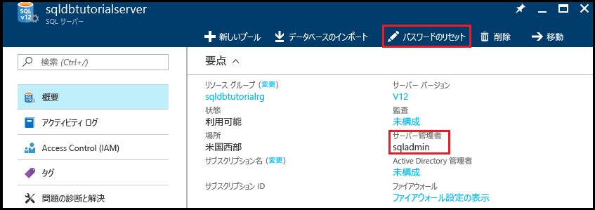

2. 論理サーバーのサーバー管理者の名前を書き留めます。 

3. パスワードを忘れた場合は、**[パスワードのリセット]** をクリックして新しいパスワードを設定します。

4. このサーバーの接続情報を取得する必要がある場合は、**[プロパティ]** をクリックします。

## <a name="view-server-admin-permissions-using-ssms"></a>SSMS を使用してサーバー管理者のアクセス許可を確認する

この手順では、master データベースとユーザー データベースのサーバー管理者アカウントとそのアクセス許可に関する情報を確認する方法を示します。

1. SQL Server Management Studio を開き、SQL Server 認証とサーバー管理者アカウントを使用して、サーバー管理者としてサーバーに接続します。

   ![[サーバーへの接続]](./media/sql-database-get-started/connect-to-server.png)

2. **[接続]**をクリックします。

   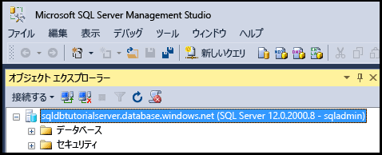

3. オブジェクト エクスプローラーで **[セキュリティ]**、**[ログイン]** の順に展開し、サーバーの既存のログインを表示します。新しいサーバーの唯一のログインは、サーバー管理者アカウントのログインです。

   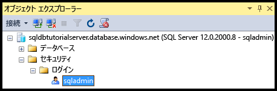

4. オブジェクト エクスプローラーで **[データベース]**、**[システム データベース]**、**[master]**、**[セキュリティ]**、**[ユーザー]** の順に展開し、このデータベースのサーバー管理者ログイン用に作成されたユーザー アカウントを表示します。

   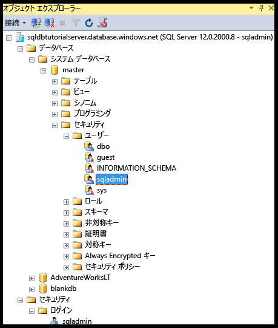

   > [!NOTE]
   > [ユーザー] ノードに表示される他のユーザー アカウントについては、[プリンシパル](https://msdn.microsoft.com/library/ms181127.aspx)に関するページを参照してください。
   >

5. オブジェクト エクスプローラーで **[master]** を右クリックし、**[新しいクエリ]** をクリックして、master データベースに接続されているクエリ ウィンドウを開きます。
6. クエリ ウィンドウで、次のクエリを実行すると、そのクエリを実行しているユーザーに関する情報が返されます。 

   ```
   SELECT USER;
   ```

   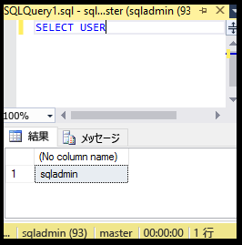

7. クエリ ウィンドウで次のクエリを実行すると、**master** データベースの sqladmin ユーザーのアクセス許可に関する情報が返されます。 

   ```
   SELECT prm.permission_name
      , prm.class_desc
      , prm.state_desc
      , p2.name as 'Database role'
      , p3.name as 'Additional database role' 
   FROM sys.database_principals p
   JOIN sys.database_permissions prm
      ON p.principal_id = prm.grantee_principal_id
      LEFT JOIN sys.database_principals p2
      ON prm.major_id = p2.principal_id
      LEFT JOIN sys.database_role_members r
      ON p.principal_id = r.member_principal_id
      LEFT JOIN sys.database_principals p3
      ON r.role_principal_id = p3.principal_id
   WHERE p.name = 'sqladmin';
   ```

   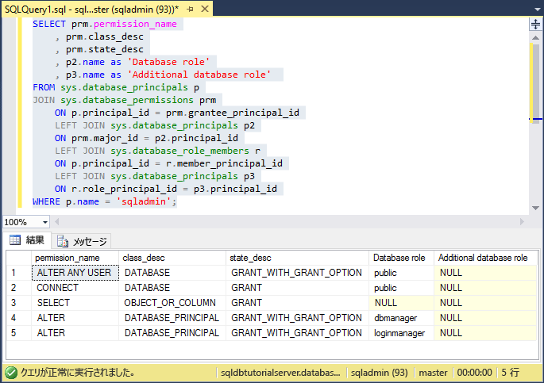

   >[!NOTE]
   > サーバー管理者には、master データベースへの接続、ログインとユーザーの作成、sys.sql_logins テーブルの情報の選択、dbmanager と dbcreator データベース ロールへのユーザーの追加を行うためのアクセス許可があります。 これらのアクセス許可は、すべてのユーザーのアクセス許可の継承元である public ロールに付与されているアクセス許可 (特定のテーブルの情報を選択するアクセス許可など) に加わります。 詳細については、「[権限](https://msdn.microsoft.com/library/ms191291.aspx)」を参照してください。
   >

8. オブジェクト エクスプローラーで **[blankdb]**、**[セキュリティ]**、**[ユーザー]** の順に展開し、このデータベース (と各ユーザー データベース) のサーバー管理者ログイン用に作成されたユーザー アカウントを表示します。

   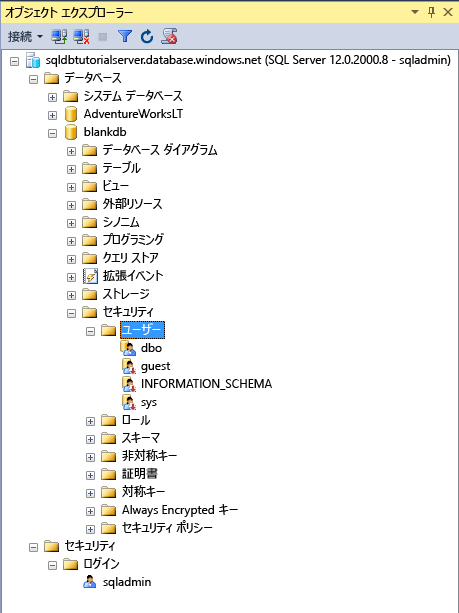

9. オブジェクト エクスプローラーで、**[blankdb]** を右クリックし、**[新しいクエリ]** をクリックします。

10. クエリ ウィンドウで、次のクエリを実行すると、そのクエリを実行しているユーザーに関する情報が返されます。

   ```
   SELECT USER;
   ```

   

11. クエリ ウィンドウで、次のクエリを実行すると、dbo ユーザーのアクセス許可に関する情報が返されます。 

   ```
   SELECT prm.permission_name
      , prm.class_desc
      , prm.state_desc
      , p2.name as 'Database role'
      , p3.name as 'Additional database role' 
   FROM sys.database_principals AS p
   JOIN sys.database_permissions AS prm
      ON p.principal_id = prm.grantee_principal_id
      LEFT JOIN sys.database_principals AS p2
      ON prm.major_id = p2.principal_id
      LEFT JOIN sys.database_role_members r
      ON p.principal_id = r.member_principal_id
      LEFT JOIN sys.database_principals AS p3
      ON r.role_principal_id = p3.principal_id
   WHERE p.name = 'dbo';
   ```

   

   > [!NOTE]
   > dbo ユーザーは public ロールのメンバーであり、db_owner 固定データベース ロールのメンバーでもあります。 詳細については、「[データベース レベルのロール](https://msdn.microsoft.com/library/ms189121.aspx)」を参照してください。
   >

## <a name="create-a-new-user-with-select-permissions"></a>SELECT アクセス許可を持つ新しいユーザーを作成する

この手順では、データベースレベルのユーザーの作成、新しいユーザーの既定のアクセス許可 (public ロールによる) のテスト、ユーザーへの **SELECT** アクセス許可の付与、変更されたこれらのアクセス許可の確認を行う方法を示します。

> [!NOTE]
> データベースレベルのユーザーは、[包含ユーザー](https://msdn.microsoft.com/library/ff929188.aspx)とも呼ばれます。これによって、データベースの移植性が向上します。 移植性の利点については、[Azure SQL Database のセキュリティを geo リストアまたはセカンダリ サーバーへのフェールオーバー用に構成して管理する](sql-database-geo-replication-security-config.md)方法に関するページを参照してください。
>

1. オブジェクト エクスプローラーで **[sqldbtutorialdb]** を右クリックし、**[新しいクエリ]** をクリックします。
2. このクエリ ウィンドウで次のステートメントを実行して、sqldbtutorialdb データベースに **user1** というユーザーを作成します。

   ```
   CREATE USER user1
   WITH PASSWORD = 'p@ssw0rd';
   ```
   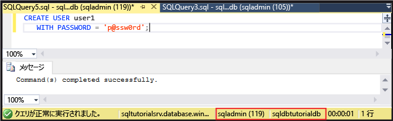

3. クエリ ウィンドウで、次のクエリを実行すると、user1 のアクセス許可に関する情報が返されます。

   ```
   SELECT prm.permission_name
      , prm.class_desc
      , prm.state_desc
      , p2.name as 'Database role'
      , p3.name as 'Additional database role' 
   FROM sys.database_principals AS p
   JOIN sys.database_permissions AS prm
      ON p.principal_id = prm.grantee_principal_id
      LEFT JOIN sys.database_principals AS p2
      ON prm.major_id = p2.principal_id
      LEFT JOIN sys.database_role_members r
      ON p.principal_id = r.member_principal_id
      LEFT JOIN sys.database_principals AS p3
      ON r.role_principal_id = p3.principal_id
   WHERE p.name = 'user1';
   ```

   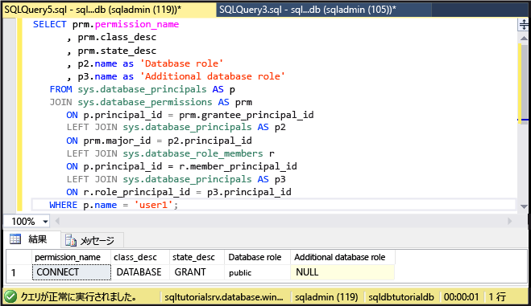

   > [!NOTE]
   > データベースの新しいユーザーには、public ロールから継承されたアクセス許可のみが付与されています。
   >

4. **EXECUTE AS USER** ステートメントを使用して次のクエリを実行し、public ロールから継承したアクセス許可のみを持つ **user1** として、sqldbtutorialdb データベースの SalesLT.ProductCategory テーブルへの照会を試みます。

   ```
   EXECUTE AS USER = 'user1';  
   SELECT * FROM [SalesLT].[ProductCategory];
   REVERT;
   ```

   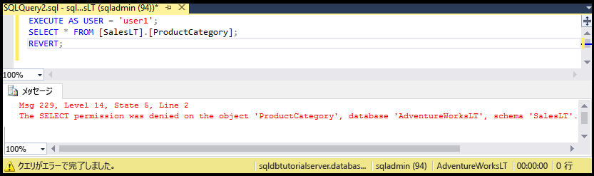

   > [!NOTE]
   > 既定では、public ロールはユーザー オブジェクトに対する **SELECT** アクセス許可を付与されていません。
   >

5. 次のステートメントを実行して、SalesLT.ProductCategory テーブルに対する **SELECT** アクセス許可を **user1** に付与します。

   ```
   GRANT SELECT ON OBJECT::[SalesLT].[ProductCategory] to user1;
   ```

   

6. 次のクエリを実行すると、sqldbtutorialdb データベースの SalesLT.ProductCategory テーブルを **user1** として正常に照会できます。

   ```
   EXECUTE AS USER = 'user1';  
   SELECT * FROM [SalesLT].[ProductCategory];
   REVERT;
   ```

   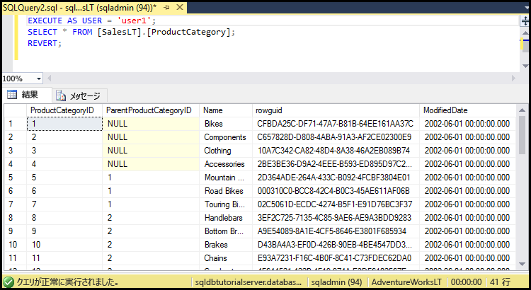

## <a name="create-a-database-level-firewall-rule-using-t-sql"></a>T-SQL を使用してデータベースレベルのファイアウォール規則を作成する

この手順では、[sp_set_database_firewall_rule](https://msdn.microsoft.com/library/dn270010.aspx) システム ストアド プロシージャを使用してデータベースレベルのファイアウォール規則を作成する方法を示します。 データベースレベルのファイアウォール規則を使用すると、サーバー管理者はユーザーが特定のデータベースに対してのみ Azure SQL Database ファイアウォールを通過できるようにすることができます。

> [!NOTE]
> [データベースレベルのファイアウォール規則](sql-database-firewall-configure.md)は、データベースの移植性を高めます。 移植性の利点については、[Azure SQL Database のセキュリティを geo リストアまたはセカンダリ サーバーへのフェールオーバー用に構成して管理する](sql-database-geo-replication-security-config.md)方法に関するページを参照してください。
>

> [!IMPORTANT]
> データベースレベルのファイアウォール規則をテストするには、別のコンピューターから接続します (または Azure Portal でサーバーレベルのファイアウォール規則を削除します)。
>

1. サーバーレベルのファイアウォール規則がないコンピューターで、SQL Server Management Studio を開きます。

2. **[サーバーへの接続]** ウィンドウで、サーバー名と認証情報を入力し、SQL Server 認証と **user1** アカウントを使用して接続します。 
    
   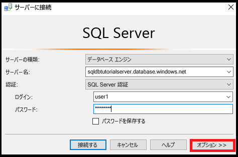

3. **[オプション]** をクリックして接続先のデータベースを指定し、**[接続のプロパティ]** タブの **[データベースへの接続]** ボックスの一覧で「**sqldbtutorialdb**」と入力します。
   
   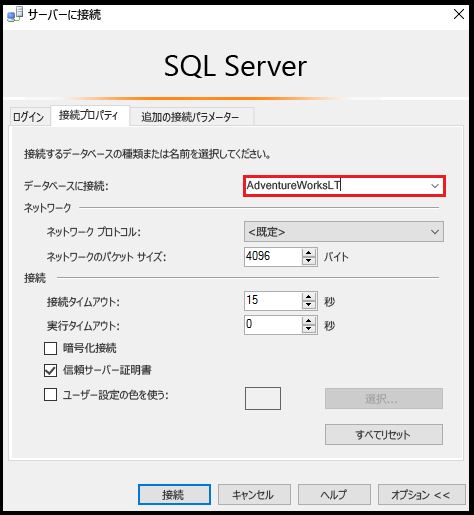

4. **[接続]**をクリックします。 

   SQL Database への接続元のコンピューターにデータベースへのアクセスを有効にするファイアウォール規則がないことを示すダイアログ ボックスが表示されます。 

   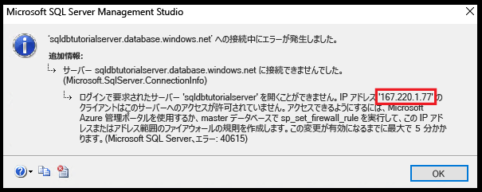


5. 手順 8. で使用するために、このダイアログ ボックスのクライアント IP アドレスをコピーします。
6. **[OK]** をクリックしてエラー ダイアログ ボックスを閉じますが、**[サーバーに接続]** ダイアログ ボックスは閉じません。
7. 既にサーバーレベルのファイアウォール規則を作成してあるコンピューターに戻ります。 
8. SSMS でサーバー管理者として sqldbtutorialdb データベースに接続し、手順 5. の IP アドレス (またはアドレス範囲) を使用して次のステートメントを実行して、データベースレベルのファイアウォールを作成します。  

   ```
   EXEC sp_set_database_firewall_rule @name = N'sqldbtutorialdbFirewallRule', 
     @start_ip_address = 'x.x.x.x', @end_ip_address = 'x.x.x.x';
   ```

   ![[ファイアウォール規則の追加]](./media/sql-database-control-access-sql-authentication-get-started/user1_add_rule_aw.png)

9. コンピューターを再度切り替えて、**[サーバーへの接続]** ダイアログ ボックスの **[接続]** をクリックし、user1 として sqldbtutorialdb に接続します。 

   > [!NOTE]
   > データベースレベルのファイアウォール規則は、作成後アクティブになるまでに、最大で 5 分かかる場合があります。
   >

10. 正常に接続した後、オブジェクト エクスプローラーで **[データベース]** を展開します。 **user1** は **sqldbtutorialdb** データベースの表示のみが可能であることに注意してください。

   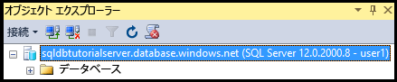

11. **[sqldbtutorialdb]**、**[テーブル]** の順に展開します。 user1 には、**SalesLT.ProductCategory** テーブルという&1; つのテーブルを表示するアクセス許可しかないことがわかります。 

   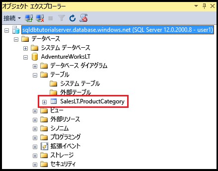

## <a name="create-a-new-user-as-dbowner-and-a-database-level-firewall-rule"></a>db_owner としての新しいユーザーとデータベースレベルのファイアウォール規則を作成する

この手順では、db_owner データベース ロール アクセス許可があるユーザーを別のデータベースに作成し、この別のデータベースにデータベースレベルのファイアウォールを作成する方法を示します。 **db_owner** ロールのメンバーシップが付与されたこの新しいユーザーは、この&1; つのデータベースに対する接続と管理のみが可能です。

1. サーバー管理者アカウントを使用して、SQL Database への接続を備えたコンピューターに切り替えます。
2. **blankdb** データベースに接続しているクエリ ウィンドウを開き、次のステートメントを実行して、blankdb データベースに blankdbadmin というユーザーを作成します。

   ```
   CREATE USER blankdbadmin
   WITH PASSWORD = 'p@ssw0rd';
   ```

3. 同じクエリ ウィンドウで、次のステートメントを実行して、blankdbadmin ユーザーを db_owner データベース ロールに追加します。 これで、このユーザーは、blankdb データベースを管理するために必要なすべての操作を実行できるようになりました。

   ```
   ALTER ROLE db_owner ADD MEMBER blankdbadmin; 
   ```

4. 同じクエリ ウィンドウで、次のステートメントを実行します。前の手順 4. の IP アドレス (または、このデータベースのユーザー用の IP アドレス範囲) を使用して [sp_set_database_firewall_rule](https://msdn.microsoft.com/library/dn270010.aspx) を実行することで、データベースレベルのファイアウォールを作成します。

   ```
   EXEC sp_set_database_firewall_rule @name = N'blankdbFirewallRule', 
     @start_ip_address = 'x.x.x.x', @end_ip_address = 'x.x.x.x';
   ```

5. コンピューターを (作成したデータベースレベルのファイアウォール規則の適用先のコンピューターに) 切り替え、blankdbadmin ユーザー アカウントを使用して blankdb データベースに接続します。
6. blankdb データベースに接続しているクエリ ウィンドウを開き、次のステートメントを実行して、blankdb データベースに blankdbuser1 というユーザーを作成します。

   ```
   CREATE USER blankdbuser1
   WITH PASSWORD = 'p@ssw0rd';
   ```
 
7. 学習環境での必要に応じて、このユーザー用に追加のデータベースレベルのファイアウォール規則を作成します。 ただし、IP アドレス範囲を使用してデータベースレベルのファイアウォール規則を作成した場合、これは必要ないことがあります。

## <a name="grant-dbmanager-permissions-and-create-a-server-level-firewall-rule"></a>dbmanager アクセス許可を付与し、サーバーレベルのファイアウォール規則を作成する

この手順では、新しいユーザー データベースを作成して管理するためのアクセス許可が付与されたログインとユーザーを master データベースに作成する方法を示します。 また、Transact-SQL で [sp_set_firewall_rule](https://msdn.microsoft.com/library/dn270017.aspx) を使用して、追加のサーバーレベルのファイアウォール規則を作成する方法も示します。 

> [!IMPORTANT]
>最初のサーバーレベルのファイアウォール規則は、常に Azure で作成する必要があります (Azure Portal、PowerShell、または REST API を使用)。
>

> [!IMPORTANT]
> サーバー管理者がデータベース作成のアクセス許可を別のユーザーに委任するには、master データベースにログインを作成し、ログインからユーザー アカウントを作成する必要があります。 ただし、ログインを作成し、ログインからユーザーを作成した場合、環境の移植性は低下します。
>

1. サーバー管理者アカウントを使用して、SQL Database への接続を備えたコンピューターに切り替えます。
2. master データベースに接続しているクエリ ウィンドウを開き、次のステートメントを実行して、master データベースに dbcreator というログインを作成します。

   ```
   CREATE LOGIN dbcreator
   WITH PASSWORD = 'p@ssw0rd';
   ```

3. 同じクエリ ウィンドウで、次のクエリを実行します。 

   ```
   CREATE USER dbcreator
   FROM LOGIN dbcreator;
   ```

3. 同じクエリ ウィンドウで、次のクエリを実行して、dbmanager データベース ロールに dbcreator ユーザーを追加します。 これで、このユーザーは、データベースを作成し、自分が作成したデータベースを管理できるようになりました。

   ```
   ALTER ROLE dbmanager ADD MEMBER dbcreator; 
   ```

4. 同じクエリ ウィンドウで、次のクエリを実行して、サーバーレベルのファイアウォールを作成します。ここでは、環境に適した IP アドレスを使用して [sp_set_firewall_rule](https://msdn.microsoft.com/library/dn270017.aspx) を実行します。

   ```
   EXEC sp_set_firewall_rule @name = N'dbcreatorFirewallRule', 
     @start_ip_address = 'x.x.x.x', @end_ip_address = 'x.x.x.x';
   ```

5. コンピューターを (作成したサーバーレベルのファイアウォール規則の適用先のコンピューターに) 切り替え、dbcreator ユーザー アカウントを使用して master データベースに接続します。
6. master データベースに接続しているクエリ ウィンドウを開き、次のクエリを実行して、foo というデータベースを作成します。

   ```
   CREATE DATABASE FOO (EDITION = 'basic');
   ```
 7. 必要に応じて、次のステートメントを使用して、このデータベースを削除してコストを削減します。

   ```
   DROP DATABASE FOO;
   ```

## <a name="complete-script"></a>完全なスクリプト

ログインとユーザーを作成するには、それらをロールに追加し、アクセス許可を付与して、データベースレベルのファイアウォール規則とサーバーレベルのファイアウォール規則を作成し、サーバー上の適切なデータベースで以下のステートメントを実行します。

### <a name="master-database"></a>master データベース
サーバー管理者アカウントを使用して master データベースで次のステートメントを実行します。その際、適切な IP アドレスまたは範囲を追加します。

```
CREATE LOGIN dbcreator WITH PASSWORD = 'p@ssw0rd';
CREATE USER dbcreator FROM LOGIN dbcreator;
ALTER ROLE dbmanager ADD MEMBER dbcreator;
EXEC sp_set_firewall_rule @name = N'dbcreatorFirewallRule', 
     @start_ip_address = 'x.x.x.x', @end_ip_address = 'x.x.x.x';
```

### <a name="sqldbtutorialdb-database"></a>sqldbtutorialdb データベース
サーバー管理者アカウントを使用して sqldbtutorialdb データベースで次のステートメントを実行します。その際、適切な IP アドレスまたは範囲を追加します。

```
CREATE USER user1 WITH PASSWORD = 'p@ssw0rd';
GRANT SELECT ON OBJECT::[SalesLT].[ProductCategory] to user1;
EXEC sp_set_database_firewall_rule @name = N'sqldbtutorialdbFirewallRule', 
     @start_ip_address = 'x.x.x.x', @end_ip_address = 'x.x.x.x';
```

### <a name="blankdb-database"></a>blankdb データベース
サーバー管理者アカウントを使用して blankdb データベースで次のステートメントを実行します。その際、適切な IP アドレスまたは範囲を追加します。

```
CREATE USER blankdbadmin
   WITH PASSWORD = 'p@ssw0rd';
ALTER ROLE db_owner ADD MEMBER blankdbadmin;
EXEC sp_set_database_firewall_rule @name = N'blankdbFirewallRule', 
     @start_ip_address = 'x.x.x.x', @end_ip_address = 'x.x.x.x';
CREATE USER blankdbuser1
   WITH PASSWORD = 'p@ssw0rd';
```

## <a name="next-steps"></a>次のステップ
- SQL Database でのアクセスおよび制御の概要については、[SQL Database のアクセスと制御](sql-database-control-access.md)に関するページを参照してください。
- SQL Database のログイン、ユーザー、データベース ロールの概要については、[ログイン、ユーザー、およびデータベース ロール](sql-database-manage-logins.md)に関するページを参照してください。
- データベース プリンシパルの詳細については、「[プリンシパル](https://msdn.microsoft.com/library/ms181127.aspx)」を参照してください。
- データベース ロールの詳細については、[データベース ロール](https://msdn.microsoft.com/library/ms189121.aspx)に関するページを参照してください。
- SQL Database のファイアウォール規則の詳細については、[SQL Database のファイアウォール規則](sql-database-firewall-configure.md)に関するページを参照してください。
- Azure Active Directory 認証の使用に関するチュートリアルについては、[Azure AD の認証と許可](sql-database-control-access-aad-authentication-get-started.md)に関するページを参照してください。


