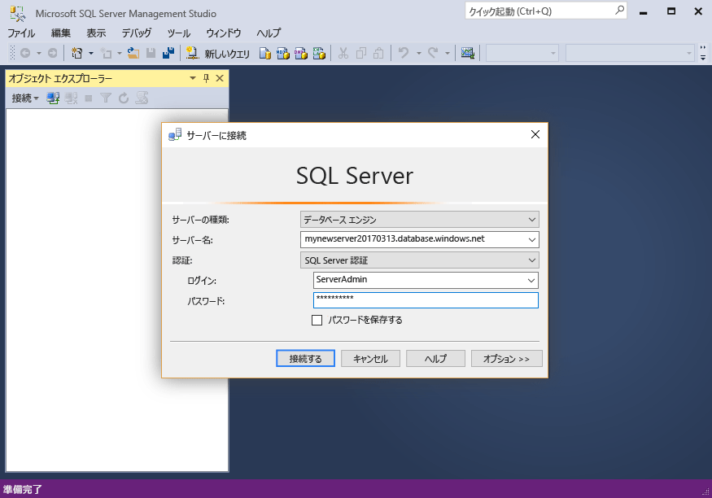

# <a name="design-your-first-azure-sql-database"></a>最初の Azure SQL Database の設計

このチュートリアルでは、Azure Portal を使用して、サーバー レベルのファイアウォールが設定された新しいサーバーにデータベースを作成します。 次に、SQL Server Management Studio を使用してテーブルを作成し、そのテーブルにデータを読み込んで、テーブルを照会します。さらに、テーブルにインデックスを追加します。 最後に、SQL Database サービスの自動バックアップを使用して、この新しいテーブルを追加する前の状態にデータベースを復元します。

このチュートリアルを実行するには、最新バージョンの [SQL Server Management Studio](https://msdn.microsoft.com/library/ms174173.aspx) (SSMS) をインストールしておく必要があります。 

## <a name="step-1---log-in-to-the-azure-portal"></a>手順 1 - Azure Portal にログインする

[Azure ポータル](https://portal.azure.com/)にログインします。

## <a name="step-2---create-a-sql-database"></a>手順 2 - SQL Database を作成する

Azure SQL データベースは、定義済みの一連の[コンピューティング リソースとストレージ リソース](sql-database-service-tiers.md)を使って作成されます。 データベースは、[Azure リソース グループ](../azure-resource-manager/resource-group-overview.md)内と [Azure SQL Database 論理サーバー](sql-database-features.md)内に作成されます。 

以下の手順に従い、Adventure Works LT サンプル データを含む SQL データベースを作成します。 

1. Azure Portal の左上にある **[新規]** ボタンをクリックします。

2. **[新規]** ページで **[データベース]** を選択し、**[データベース]** ページで **[SQL Database]** を選択します。

3. SQL Database フォームに必要な情報を入力します。 
   - [データベース名]: データベース名を指定します
   - [サブスクリプション]: サブスクリプションを選択します
   - [リソース グループ]: 新規または既存を選択します
   - [ソース]: **[Sample (AdventureWorksLT) (サンプル (AdventureWorksLT))]** を選択します
   - [サーバー]: 新しいサーバーを作成します (**サーバー**名はグローバルに一意であること)
   - [エラスティック プール]: このクイック スタートでは **[後で]** を選択します
   - [価格レベル]: **20 DTU** および **250** GB のストレージを選択します
   - [照合順序]: サンプル データベースをインポートする場合、この値は変更できません 
   - [ダッシュボードにピン留めする]: このチェック ボックスはオンにします

      

4. 入力が完了したら **[作成]** をクリックします。 プロビジョニングには数分かかります。
5. SQL データベースのデプロイが完了したら、ダッシュボードの **[SQL データベース]** を選択するか、左側のメニューから **[SQL データベース]** を選択し、**[SQL データベース]** ページで新しいデータベースをクリックします。 データベースの概要ページが開き、完全修飾サーバー名 (**mynewserver20170313.database.windows.net** など) や追加の構成オプションが表示されます。

       

## <a name="step-3---create-a-server-level-firewall-rule"></a>手順 3 - サーバーレベルのファイアウォール規則を作成する

SQL Database サービスにより、外部のアプリケーションやツールからのサーバーとデータベースへの接続を防止するファイアウォールが作成されます。 以下の手順に従い、[SQL Database サーバーレベルのファイアウォール規則](sql-database-firewall-configure.md)を作成して、自分の IP アドレスから SQL Database ファイアウォールを介して外部に接続できるようにします。 

1. データベースのツールバーで **[Set server firewall (サーバー ファイアウォールの設定)]** をクリックします。 SQL Database サーバーの **[ファイアウォール設定]** ページが開きます。 

       

2. ツールバーの **[クライアント IP の追加]** をクリックし、**[保存]** をクリックします。 現在の IP アドレスに対してサーバーレベルのファイアウォール規則が作成されます。

3. **[OK]** をクリックしてから、**[X]** をクリックして [ファイアウォール設定] ページを閉じます。

これで、SQL Server Management Studio やその他の任意のツールを使用してデータベースとそのサーバーに接続できるようになりました。

## <a name="step-4---get-connection-information"></a>手順 4 - 接続情報を取得する

Azure Portal で、Azure SQL Database サーバーの完全修飾サーバー名を取得します。 その完全修飾サーバー名は、SQL Server Management Studio でのサーバーへの接続に使用します。

1. [Azure ポータル](https://portal.azure.com/)にログインします。
2. 左側のメニューから **[SQL データベース]** を選択し、**[SQL データベース]** ページで目的のデータベースをクリックします。 
3. そのデータベースの Azure Portal ページの **[要点]** ウィンドウで、**サーバー名**を見つけてコピーします。

    

## <a name="step-5---connect-to-the-server-using-ssms"></a>手順 5 - SSMS を使用してサーバーに接続する

SQL Server Management Studio を使用して、Azure SQL Database サーバーに対する接続を確立します。

1. Windows 検索ボックスに「**SSMS**」と入力し、**Enter** キーを押して SSMS を開きます。

2. **[サーバーへの接続]** ダイアログ ボックスで、次の情報を入力します。
   - **[サーバーの種類]**: データベース エンジンを指定します
   - **[サーバー名]**: 完全修飾サーバー名を入力します (**mynewserver20170313.database.windows.net** など)
   - **[認証]**: SQL Server 認証を指定します
   - **[ログイン]**: サーバー管理者アカウントを入力します
   - **[パスワード]**: サーバー管理者アカウントのパスワードを入力します
 
    

3. **[接続]**をクリックします。 SSMS でオブジェクト エクスプローラー ウィンドウが開きます。 

    

4. オブジェクト エクスプローラーで、**Databases** フォルダー、**mySampleDatabase** フォルダーの順に展開して、サンプル データベース内のオブジェクトを表示します。

## <a name="step-6---create-and-query-a-table"></a>手順 6 - クエリを作成してテーブルを照会する 
1. オブジェクト エクスプローラーで **mySampleDatabase** を右クリックし、**[新しいクエリ]** をクリックします。 データベースに接続された空のクエリ ウィンドウが開きます。
2. クエリ ウィンドウで次のクエリを実行します。

   ```sql 
   CREATE TABLE [dbo].[Students]
   (
     [student_id] int, 
     [name] varchar(100),
     [age] int,
     [email] varchar(100),
     [AddressID] int REFERENCES [SalesLT].[Address] (AddressID)
   );
   ```

   クエリが完了すると、データベースに Students という空のテーブルが作成されます。

3. SSMS クエリ ウィンドウで、次のクエリを実行します。 

   ```sql
   SELECT name, age, email 
   FROM [dbo].[Students]
   ```

   Students テーブルからデータは返されません。

## <a name="step-7---load-data-into-the-table"></a>手順 7 - テーブルにデータを読み込む 
1. コマンド プロンプト ウィンドウを開きます。

2. 次の PowerShell コマンドを実行して、現在のディレクトリにサンプル テキスト ファイルをダウンロードします。

   ```powershell
   powershell -command "& { (New-Object Net.WebClient).DownloadFile('https://sqldbtutorial.blob.core.windows.net/tutorials/SampleStudentData.txt', 'SampleStudentData.txt'); echo 'Download complete' }" 
   ``` 

3. ダウンロードが完了したら、次のコマンドを実行して Student テーブルに 1000 行挿入します。**ServerName**、**DatabaseName**、**UserName**、**Password** は実際の環境の値に置き換えます。

   ```bcp
   bcp Students in SampleStudentData.txt -S <ServerName> -d <DatabaseName> -U <Username> -P <password> -q -c -t ","
   ```

これで、先ほど作成したテーブルにサンプル データが読み込まれました。

## <a name="step-8---add-an-index-to-a-table"></a>手順 8 - テーブルにインデックスを追加する
テーブルの特定の値をより効率的に検索するために、Students テーブルにインデックスを作成します。 インデックスにより、特定の値を見つけるためにすべてのデータを調べる必要がある方法でデータが整理されます。

1. SSMS クエリ ウィンドウで、次のクエリを実行します。

   ```sql 
   CREATE NONCLUSTERED INDEX IX_Age ON Students (age);
   ```

2. SSMS クエリ ウィンドウで、次のクエリを実行します。

   ```sql
   SELECT name, age, email 
   FROM [dbo].[Students]
   WHERE age > 20
   ```

   このクエリは、年齢が 20 歳より上の学生の名前、年齢、電子メールを返します。

## <a name="step-9---restore-a-database-to-a-point-in-time"></a>手順 9 - データベースを特定の時点に復元する 
Azure のデータベースでは、5 ～ 10 分ごとに[継続的バックアップ](sql-database-automated-backups.md)が自動的に作成されます。 これらのバックアップを使用すると、データベースを以前の状態に復元できます。 異なる時点にデータベースを復元すると、元のデータベースと同じサーバーに、(現在のサービス レベルのリテンション期間内で) 指定した特定の時点におけるデータベースの複製が作成されます。 次の手順を実行して、**Students** テーブルを追加する前の状態にサンプル データベースを復元します。 

1. データベースの SQL Database ページで、ツール バーの **[復元]** をクリックします。 **[復元]** ページが開きます。

    

2. **[復元]** フォームに必要な情報を入力します。
    * [データベース名]: データベース名を指定します 
    * 特定の時点: [復元] フォームの **[特定の時点]** タブを選択します。 
    * 復元ポイント: データベースを変更する前の時間を選択します。
    * 対象サーバー: データベースを復元するときは、この値を変更することはできません。 
    * エラスティック データベース プール: **[なし]** を選択します。  
    * 価格レベル: **20 DTU** および **250** GB のストレージを選択します。

    

3. **[OK]** をクリックして、*Students* テーブルを追加する前の状態にデータベースを復元します。

## <a name="next-steps"></a>次のステップ 
一般的なタスクの PowerShell サンプルについては、[SQL Database の PowerShell サンプル](sql-database-powershell-samples.md)に関するページをご覧ください。

