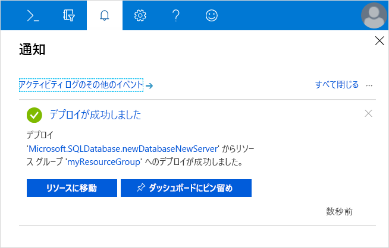
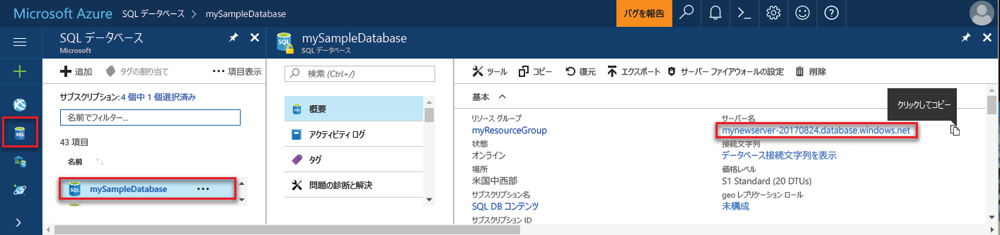
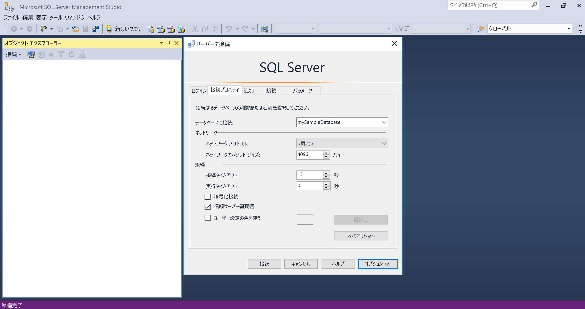
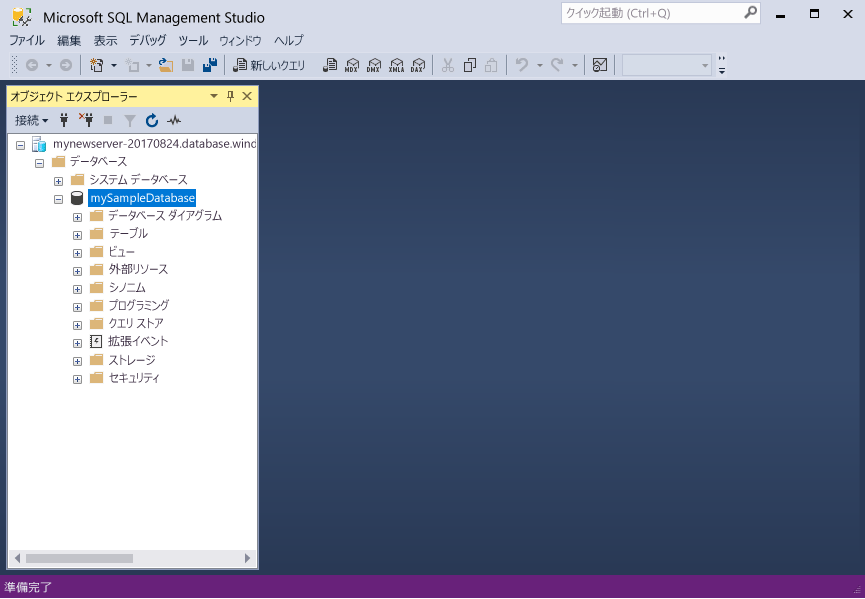

# <a name="tutorial-design-your-first-azure-sql-database-using-ssms"></a>チュートリアル: SSMS を使用して最初の Azure SQL データベースを設計する

Azure SQL Database は、Microsoft Cloud (Azure) のリレーショナルなサービスとしてのデータベース (DBaaS) です。 このチュートリアルでは、Azure Portal および [SQL Server Management Studio](https://msdn.microsoft.com/library/ms174173.aspx) (SSMS) を使用して以下の操作を行う方法を学習します。 

> [!div class="checklist"]
> * Azure Portal でデータベースを作成する*
> * Azure Portal でサーバーレベルのファイアウォール規則を設定する
> * SSMS を使用してデータベースに接続する
> * SSMS のテーブルを作成する
> * BCP を使用してデータを一括で読み込む
> * SSMS を使用してデータのクエリ実行を行う

Azure サブスクリプションをお持ちでない場合は、開始する前に[無料アカウントを作成](https://azure.microsoft.com/free/)してください。

   >[!NOTE]
   > このチュートリアルでは、[DTU ベースの購入モデル](sql-database-service-tiers-dtu.md)を使用していますが、[仮想コアベースの購入モデル](sql-database-service-tiers-vcore.md)を選択することもできます。 

## <a name="prerequisites"></a>前提条件

このチュートリアルを完了するには、以下がインストールされていることを確認してください。
- 最新バージョンの [SQL Server Management Studio](https://msdn.microsoft.com/library/ms174173.aspx) (SSMS)。
- 最新バージョンの [BCP と SQLCMD](https://www.microsoft.com/download/details.aspx?id=36433)。

## <a name="log-in-to-the-azure-portal"></a>Azure Portal にログインする

[Azure Portal](https://portal.azure.com/) にログインします。

## <a name="create-a-blank-sql-database"></a>空の SQL データベースを作成する

Azure SQL データベースは、定義済みの一連の[コンピューティング リソースとストレージ リソース](sql-database-service-tiers-dtu.md)を使って作成されます。 データベースは、[Azure リソース グループ](../azure-resource-manager/resource-group-overview.md)内と [Azure SQL Database 論理サーバー](sql-database-features.md)内に作成されます。 

空の SQL Database を作成するには、次の手順に従います。 

1. Azure Portal の左上隅にある **[リソースの作成]** をクリックします。

2. **[新規]** ページで、[Azure Marketplace] セクションで **[データベース]** を、**[おすすめ]** セクションで **[SQL Database]** をクリックします。

   

3. 前の画像で示されているように、[SQL Database] のフォームに次の情報を入力します。   

   | Setting       | 推奨値 | 説明 | 
   | ------------ | ------------------ | ------------------------------------------------- | 
   | **[データベース名]** | mySampleDatabase | 有効なデータベース名については、「[Database Identifiers (データベース識別子)](https://docs.microsoft.com/sql/relational-databases/databases/database-identifiers)」を参照してください。 | 
   | **サブスクリプション** | 該当するサブスクリプション  | サブスクリプションの詳細については、[サブスクリプション](https://account.windowsazure.com/Subscriptions)に関するページを参照してください。 |
   | **[リソース グループ]** | myResourceGroup | 有効なリソース グループ名については、[名前付け規則と制限](https://docs.microsoft.com/azure/architecture/best-practices/naming-conventions)に関するページを参照してください。 |
   | **[ソースの選択]** | 空のデータベース | 空のデータベースを作成するように指定します。 |

4. **[サーバー]** をクリックして、新しいデータベース用の新しいサーバーを作成して構成します。 **[新しいサーバー]** フォームには次の情報を入力してください。 

   | Setting       | 推奨値 | 説明 | 
   | ------------ | ------------------ | ------------------------------------------------- | 
   | **[サーバー名]** | グローバルに一意の名前 | 有効なサーバー名については、[名前付け規則と制限](https://docs.microsoft.com/azure/architecture/best-practices/naming-conventions)に関するページを参照してください。 | 
   | **[サーバー管理者ログイン]** | 有効な名前 | 有効なログイン名については、「[Database Identifiers (データベース識別子)](https://docs.microsoft.com/sql/relational-databases/databases/database-identifiers)」を参照してください。|
   | **パスワード** | 有効なパスワード | パスワードには 8 文字以上が使用され、大文字、小文字、数字、英数字以外の文字のうち、3 つのカテゴリの文字が含まれている必要があります。 |
   | **場所** | 有効な場所 | リージョンについては、「[Azure リージョン](https://azure.microsoft.com/regions/)」を参照してください。 |

   

5. **[選択]** をクリックします。

6. **[価格レベル]** をクリックして、サービス レベル、DTU または仮想コア数、およびストレージの容量を指定します。 DTU または仮想コア数とストレージに関して、サービス レベルごとに利用できるオプションを調べます。 このチュートリアルでは、[DTU ベースの購入モデル](sql-database-service-tiers-dtu.md)を使用していますが、[仮想コアベースの購入モデル](sql-database-service-tiers-vcore.md)を選択することもできます。 

7. このチュートリアルでは、**Standard** サービス レベルを選択したうえで、スライダーを使用して **100 DTU (S3)** と **400** GB のストレージを選択します。

   

8. プレビューの使用条件に同意して、**[Add-on Storage]\(アドオン ストレージ\)** オプションを使用します。 

   > [!IMPORTANT]
   > 現在、英国北部、米国中西部、英国南部 2、中国東部、US DoD 中部、ドイツ中部、US DoD 東部、US Gov 南西部、US Gov 中南部、ドイツ北東部、中国北部、US Gov 東部を除くすべてのリージョンでは、Premium レベルで 1 TB を超えるストレージを使用できます。 それ以外のリージョンでは、Premium レベルのストレージの最大容量は 1 TB です。 [P11 ～ P15 の現時点での制限]( sql-database-dtu-resource-limits-single-databases.md#single-database-limitations-of-p11-and-p15-when-the-maximum-size-greater-than-1-tb)に関するページを参照してください。

9. サーバーのレベル、DTU 数、ストレージの容量を選択したら、**[適用]** をクリックします。  

10. 空のデータベースの**照合順序**を選択します (このチュートリアルでは既定値を使用)。 照合順序の詳細については、「[Collations (照合順序)](https://docs.microsoft.com/sql/t-sql/statements/collations)」を参照してください。

11. これで SQL Database フォームの入力が完了したので、**[作成]** をクリックして、データベースをプロビジョニングします。 プロビジョニングには数分かかります。 

12. ツール バーの **[通知]** をクリックして、デプロイ プロセスを監視します。
    
     

## <a name="create-a-server-level-firewall-rule"></a>サーバーレベルのファイアウォール規則を作成する

SQL Database サービスは、外部のアプリケーションやツールに、サーバーまたはサーバー上のすべてのデータベースへの接続を禁止するファイアウォールをサーバーレベルで作成します。それらに接続するためには、特定の IP アドレスに対してファイアウォールを開放するファイアウォール規則が作成されている必要があります。 以下の手順に従い、クライアントの IP アドレスに対して [SQL Database サーバーレベルのファイアウォール規則](sql-database-firewall-configure.md)を作成し、その IP アドレスのみに SQL Database ファイアウォールを介して外部接続できるようにします。 

> [!NOTE]
> SQL Database の通信は、ポート 1433 上で行われます。 企業ネットワーク内から接続しようとしても、ポート 1433 での送信トラフィックがネットワークのファイアウォールで禁止されている場合があります。 その場合、会社の IT 部門によってポート 1433 が開放されない限り、Azure SQL Database サーバーに接続することはできません。
>

1. デプロイが完了したら、左側のメニューから **[SQL データベース]** をクリックし、**SQL データベース** ページで、**mySampleDatabase** をクリックします。 このデータベースの概要ページが開くと、完全修飾サーバー名 (**mynewserver-20170824.database.windows.net** など) や追加の構成オプションが表示されます。 

2. この完全修飾サーバー名をコピーします。以降のチュートリアルとクイックスタートでサーバーとそのデータベースに接続する際に必要となります。 

    

3. ツール バーで **[Set server firewall]\(サーバー ファイアウォールの設定\)** をクリックします。 SQL Database サーバーの **[ファイアウォール設定]** ページが開きます。 

    

4. ツール バーの **[クライアント IP の追加]** をクリックし、現在の IP アドレスをファイアウォール規則に追加します。 ファイアウォール規則は、単一の IP アドレスまたは IP アドレスの範囲に対して、ポート 1433 を開くことができます。

5. **[Save]** をクリックします。 論理サーバーでポート 1433 を開いている現在の IP アドレスに対して、サーバーレベルのファイアウォール規則が作成されます。

6. **[OK]** をクリックし、**[ファイアウォール設定]** ページを閉じます。

これで、SQL Server Management Studio やその他のツールを使用して、SQL Database サーバーとそのデータベースに、前に作成したサーバー管理者アカウントでこの IP アドレスから接続できるようになりました。

> [!IMPORTANT]
> 既定では、すべての Azure サービスで、SQL Database ファイアウォール経由のアクセスが有効になります。 すべての Azure サービスに対して無効にするには、このページの **[オフ]** をクリックします。

## <a name="sql-server-connection-information"></a>SQL Server の接続情報

Azure Portal で、Azure SQL Database サーバーの完全修飾サーバー名を取得します。 その完全修飾サーバー名は、SQL Server Management Studio でのサーバーへの接続に使用します。

1. [Azure Portal](https://portal.azure.com/) にログインします。
2. 左側のメニューの **[SQL データベース]** を選択し、**[SQL データベース]** ページで目的のデータベースをクリックします。 
3. そのデータベースの Azure Portal ページの **[要点]** ウィンドウで、**サーバー名**を見つけてコピーします。

   

## <a name="connect-to-the-database-with-ssms"></a>SSMS を使用してデータベースに接続する

[SQL Server Management Studio](https://docs.microsoft.com/sql/ssms/sql-server-management-studio-ssms) を使用して、Azure SQL Database サーバーに対する接続を確立します。

1. SQL Server Management Studio を開きます。

2. **[サーバーへの接続]** ダイアログ ボックスで、次の情報を入力します。

   | Setting       | 推奨値 | 説明 | 
   | ------------ | ------------------ | ------------------------------------------------- | 
   | サーバーの種類 | データベース エンジン | この値は必須です |
   | サーバー名 | 完全修飾サーバー名 | 名前は **mynewserver20170824.database.windows.net** のような形式で指定する必要があります。 |
   | Authentication | パブリック | このチュートリアルで構成した認証の種類は "SQL 認証" のみです。 |
   | ログイン | サーバー管理者アカウント | これは、サーバーの作成時に指定したアカウントです。 |
   | パスワード | サーバー管理者アカウントのパスワード | これは、サーバーの作成時に指定したパスワードです。 |

   ![[サーバーへの接続]](./media/sql-database-connect-query-ssms/connect.png)

3. **[サーバーへの接続]** ダイアログ ボックスの **[オプション]** をクリックします。 **[データベースへの接続]** セクションに「**mySampleDatabase**」と入力して、このデータベースに接続します。

     

4. **[接続]** をクリックします。 SSMS でオブジェクト エクスプローラー ウィンドウが開きます。 

5. オブジェクト エクスプローラーで、**Databases** フォルダー、**mySampleDatabase** フォルダーの順に展開して、サンプル データベース内のオブジェクトを表示します。

     

## <a name="create-tables-in-the-database"></a>データベースのテーブルを作成する 

[Transact-SQL](https://docs.microsoft.com/sql/t-sql/language-reference) を用いた大学の生徒管理システムを構成する、4 つのテーブルのデータベース スキーマを作成します。

- Person
- コース
- 生徒
- 大学の生徒管理システムを構成するクレジット

次の図は、これらのテーブルの相互関係を示しています。 テーブルの一部は、他のテーブル内の列を参照します。 たとえば Student テーブルは、**Person** テーブルの **PersonId** 列を参照します。 このチュートリアルのテーブルの相互関係を把握するため、図を詳しく確認します。 効果的なデータベース テーブル作成方法の詳細は、[効果的なデータベース テーブルの作成](https://msdn.microsoft.com/library/cc505842.aspx)を参照してください。 データ型の選択については、[データ型](https://docs.microsoft.com/sql/t-sql/data-types/data-types-transact-sql)を参照してください。

> [!NOTE]
> [SQL Server Management Studio のテーブル デザイナー](https://docs.microsoft.com/sql/ssms/visual-db-tools/design-database-diagrams-visual-database-tools)を使用して、テーブルを作成および設計することも可能です。 


1. オブジェクト エクスプローラーで **mySampleDatabase** を右クリックし、**[新しいクエリ]** をクリックします。 データベースに接続された空のクエリ ウィンドウが開きます。

2. クエリ ウィンドウで次のクエリを実行し、データベース内の 4 つのテーブルを作成します。 

   ```sql 
   -- Create Person table

   CREATE TABLE Person
   (
   PersonId   INT IDENTITY PRIMARY KEY,
   FirstName   NVARCHAR(128) NOT NULL,
   MiddelInitial NVARCHAR(10),
   LastName   NVARCHAR(128) NOT NULL,
   DateOfBirth   DATE NOT NULL
   )
   
   -- Create Student table
 
   CREATE TABLE Student
   (
   StudentId INT IDENTITY PRIMARY KEY,
   PersonId  INT REFERENCES Person (PersonId),
   Email   NVARCHAR(256)
   )
   
   -- Create Course table
 
   CREATE TABLE Course
   (
   CourseId  INT IDENTITY PRIMARY KEY,
   Name   NVARCHAR(50) NOT NULL,
   Teacher   NVARCHAR(256) NOT NULL
   ) 

   -- Create Credit table
 
   CREATE TABLE Credit
   (
   StudentId   INT REFERENCES Student (StudentId),
   CourseId   INT REFERENCES Course (CourseId),
   Grade   DECIMAL(5,2) CHECK (Grade <= 100.00),
   Attempt   TINYINT,
   CONSTRAINT  [UQ_studentgrades] UNIQUE CLUSTERED
   (
   StudentId, CourseId, Grade, Attempt
   )
   )
   ```

   

3. SQL Server Management Studio オブジェクト エクスプローラーで 'テーブル' ノードを展開し、作成したテーブルを表示します。

   

## <a name="load-data-into-the-tables"></a>テーブルにデータを読み込む

1. Downloads フォルダーに **SampleTableData** という名前のフォルダーを作成し 、データベースのサンプル データを格納します。 

2. 次のリンクを右クリックし、データを **SampleTableData** フォルダーに保存します。 

   - [SampleCourseData](https://sqldbtutorial.blob.core.windows.net/tutorials/SampleCourseData)
   - [SamplePersonData](https://sqldbtutorial.blob.core.windows.net/tutorials/SamplePersonData)
   - [SampleStudentData](https://sqldbtutorial.blob.core.windows.net/tutorials/SampleStudentData)
   - [SampleCreditData](https://sqldbtutorial.blob.core.windows.net/tutorials/SampleCreditData)

3. コマンド プロンプト ウィンドウを開き、SampleTableData フォルダーに移動します。

4. 次のコマンドを実行し、テーブルにサンプル データを挿入することで、**ServerName**、**DatabaseName**、**UserName**、**Password** の値を環境値に置き換えます。
  
   ```bcp
   bcp Course in SampleCourseData -S <ServerName>.database.windows.net -d <DatabaseName> -U <Username> -P <password> -q -c -t ","
   bcp Person in SamplePersonData -S <ServerName>.database.windows.net -d <DatabaseName> -U <Username> -P <password> -q -c -t ","
   bcp Student in SampleStudentData -S <ServerName>.database.windows.net -d <DatabaseName> -U <Username> -P <password> -q -c -t ","
   bcp Credit in SampleCreditData -S <ServerName>.database.windows.net -d <DatabaseName> -U <Username> -P <password> -q -c -t ","
   ```

これで、先ほど作成したテーブルにサンプル データが読み込まれました。

## <a name="query-data"></a>データのクエリを実行する

データベース テーブルから情報を取得するには、次のクエリを実行します。 SQL クエリの記述に関する詳細は、[SQL クエリの記述](https://technet.microsoft.com/library/bb264565.aspx)を参照してください。 最初のクエリでは 4 つのテーブルをすべて結合し、'Dominick Pope' のクラスで 75% 以上の成績の生徒をすべて検索し ます。 次のクエリでは 4 つのテーブルをすべて結合し、'Noe Coleman' がこれまでに登録したコースをすべて検索します。

1. SQL Server Management Studio のクエリ ウィンドウで、次のクエリを実行します。

   ```sql 
   -- Find the students taught by Dominick Pope who have a grade higher than 75%

   SELECT  person.FirstName,
   person.LastName,
   course.Name,
   credit.Grade
   FROM  Person AS person
   INNER JOIN Student AS student ON person.PersonId = student.PersonId
   INNER JOIN Credit AS credit ON student.StudentId = credit.StudentId
   INNER JOIN Course AS course ON credit.CourseId = course.courseId
   WHERE course.Teacher = 'Dominick Pope' 
   AND Grade > 75
   ```

2. SQL Server Management Studio のクエリ ウィンドウで、次のクエリを実行します。

   ```sql
   -- Find all the courses in which Noe Coleman has ever enrolled

   SELECT  course.Name,
   course.Teacher,
   credit.Grade
   FROM  Course AS course
   INNER JOIN Credit AS credit ON credit.CourseId = course.CourseId
   INNER JOIN Student AS student ON student.StudentId = credit.StudentId
   INNER JOIN Person AS person ON person.PersonId = student.PersonId
   WHERE person.FirstName = 'Noe'
   AND person.LastName = 'Coleman'
   ```

## <a name="next-steps"></a>次の手順 
このチュートリアルでは、データベースとテーブルの作成、データの読み込みとクエリ実行、以前の特定の時点へのデータベースの復元などの基本的なデータベース タスクについて学習しました。 以下の方法について学習しました。
> [!div class="checklist"]
> * データベースを作成する
> * ファイアウォール規則の設定
> * [SQL Server Management Studio](https://msdn.microsoft.com/library/ms174173.aspx) (SSMS) を使用した、データベースへの接続
> * テーブルの作成
> * データの一括読み込み
> * データのクエリ実行

次のチュートリアルでは、Visual Studio と C# を使用したデータベースの設計について学びます。

> [!div class="nextstepaction"]
>[C# と ADO.NET で Azure SQL データベースを設計し、接続する](sql-database-design-first-database-csharp.md)
