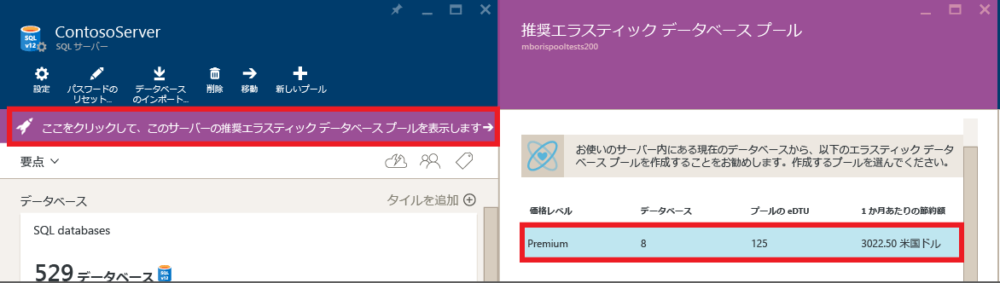
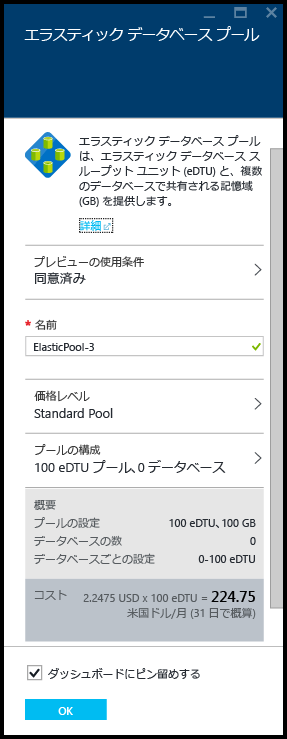
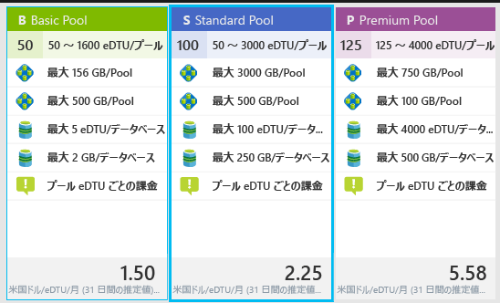
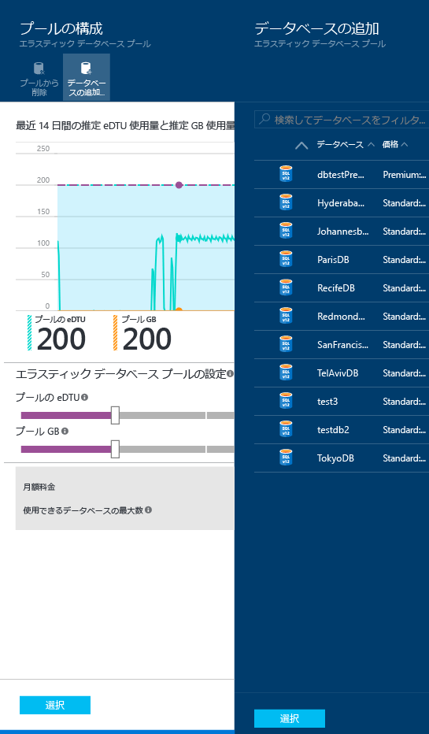
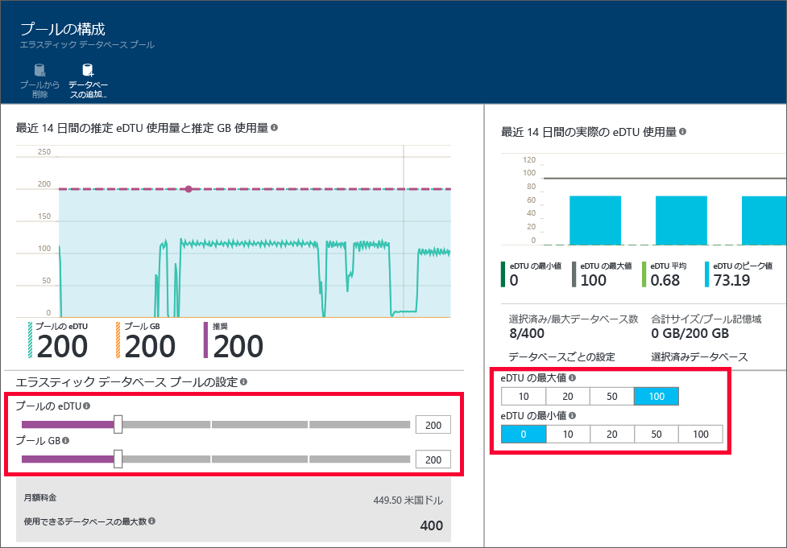

<properties
	pageTitle="Azure ポータルによる新しいエラスティック プールの作成 | Microsoft Azure"
	description="SQL Database 構成にスケーラブルなエラスティック データベース プールを追加して、多数のデータベースの管理とリソース共有を簡単にする方法について説明します。"
	keywords="スケーラブルなデータベース、データベースの構成"
	services="sql-database"
	documentationCenter=""
	authors="ninarn"
	manager="jhubbard"
	editor=""/>

<tags
	ms.service="sql-database"
	ms.devlang="NA"
	ms.date="07/20/2016"
	ms.author="ninarn"
	ms.workload="data-management"
	ms.topic="get-started-article"
	ms.tgt_pltfrm="NA"/>

# Azure ポータルによる新しい Elastic Database プールの作成

> [AZURE.SELECTOR]
- [Azure ポータル](sql-database-elastic-pool-create-portal.md)
- [PowerShell](sql-database-elastic-pool-create-powershell.md)
- [C#](sql-database-elastic-pool-create-csharp.md)

この記事では、[Azure ポータル](https://portal.azure.com/)でスケーラブルな[エラスティック データベース プール](sql-database-elastic-pool.md)を作成する方法について説明します。プールを作成する方法は 2 つあります。目的のプール設定がわかっている場合は、一から作成できます。また、サービスによる推奨設定から始めることもできます。SQL Database には、データベースの過去の使用状況テレメトリに基づいてコスト効率が高いプール設定を推奨するインテリジェンスが組み込まれています。

サーバーに複数のプールを追加することはできますが、同じプールに異なるサーバーからデータベースを追加することはできません。プールを作成するには、V12 サーバーに 1 つ以上のデータベースが必要です。データベースがない場合は、「[SQL Database チュートリアル: サンプル データと Azure ポータルを使用して分単位で SQL Database を作成する](sql-database-get-started.md)」を参照してください。データベースが 1 つだけのプールを作成できますが、プールのコスト効率が高いのは、データベースが複数ある場合のみです。「[エラスティック データベース プールの価格およびパフォーマンスに関する考慮事項](sql-database-elastic-pool-guidance.md)」を参照してください。

> [AZURE.NOTE] エラスティック プールは、現在プレビュー段階にあるインド西部を除くすべての Azure リージョンで一般公開 (GA) されています。プレビュー段階のリージョンでも、できるだけ早く一般公開される予定です。

## 手順 1. 新しいプールを作成する

この記事では、ポータルの既存の **[サーバー]** ブレードから新しいプールを作成する方法について説明します。これは、既存のデータベースをプールに移動する最も簡単な方法です。

> [AZURE.NOTE] 既にサーバーを所有しているかどうかにかかわらず、**[SQL 可変プール]** ブレードから新しいプールを作成することもできます (ポータルの左側の一覧の下で、**[参照]** **、** **[SQL 可変プール]** の順にクリックします)。**[SQL 可変プール]** ブレードで **[+ 追加]** をクリックすると、プールのプロビジョニングのワークフロー中に、新しいサーバーを作成する手順が示されます。

1. [Azure Portal](http://portal.azure.com/) の左側の一覧の下で、**[参照]** **、** **[SQL サーバー]** の順にクリックし、プールに追加するデータベースが含まれているサーバーをクリックします。
2. **[新しいプール]** をクリックします。

    

    **- または -**

    そのサーバーに推奨されるエラスティック データベース プールがあることを示すメッセージが表示される場合があります (V12 のみ)。メッセージをクリックして、データベースの過去の使用状況テレメトリに基づいた推奨のプールを表示します。次に、レベルをクリックして詳細を確認し、プールをカスタマイズします。推奨のしくみについては、このトピックで後述する「[プールの推奨事項について](#understand-pool-recommendations)」を参照してください。

    

    **[エラスティック データベース プール]** ブレードが表示されます。ここで、プールを設定します。前の手順で **[新しいプール]** をクリックした場合は、**[価格レベル]** の **[Standard pool (Standard プール)]**、プールの一意の**名前**、プールの既定の構成が選択されます。推奨されるプールを選択した場合は、推奨されるレベルとプールの構成が既に選択されていますが、それらは変更することができます。

    

3. エラスティック プールの名前を指定するか、既定値を使用します。

## 手順 2. 価格レベルを選択する

プールの価格レベルによってプールのエラスティック データベースで使用できる機能が決まり、eDTU の最大数 (eDTU MAX) や各データベースで使用できるストレージ容量 (GB) が決まります。詳細については、「サービス プラン」を参照してください。

プールの価格レベルを変更するには、**[価格レベル]**、目的の価格レベル、**[選択]** の順にクリックします。

> [AZURE.IMPORTANT] 価格レベルを選択し、最後の手順で **[OK]** をクリックして変更を確定すると、プールの価格レベルを変更できなくなります。既存のエラスティック プールの価格レベルを変更するには、任意の価格レベルで新しいエラスティック プールを作成し、その新しいプールにエラスティック データベースを移行します。

## 手順 3. プールを構成する

価格レベルを設定した後は、データベースを追加するプールで [プールの構成] をクリックし、プールの eDTU とストレージ (プールの GB 値) を設定して、さらにプール内のエラスティック データベースの最小および最大 eDTU を設定します。

1. **[プールの構成]** をクリックします。
2. プールに追加するデータベースを選択します。プールを作成する場合、この手順は省略できます。プールが作成されたら、データベースを追加できます。データベースを追加するには、**[データベースの追加]**、追加するデータベース、**[選択]** の順にクリックします。

    

    使用するデータベースに過去の使用状況テレメトリが十分にある場合、構成の決定に役立つ **[Estimated eDTU and GB usage (推定される eDTU と GB の使用状況)]** グラフと **[Actual eDTU usage (実際の eDTU 使用量)]** 横棒グラフが更新されます。また、プールの適切なサイズ設定に役立つ推奨事項に関するメッセージが表示される場合もあります。詳細については、「[動的な推奨事項](#dynamic-recommendations)」を参照してください。

3. **[プールの構成]** ページにあるコントロールを使用して設定を確認し、プールを構成します。各サービス レベルの上限の詳細については、[エラスティック プールの上限](sql-database-elastic-pool.md#edtu-and-storage-limits-for-elastic-pools-and-elastic-databases)に関するトピックを参照してください。プールの適切なサイズ設定に関する詳細なガイダンスについては、[エラスティック データベース プールの価格とパフォーマンスに関する考慮事項](sql-database-elastic-pool-guidance.md)についての記事を参照してください。プールの設定の詳細については、[エラスティック データベース プールのプロパティ](sql-database-elastic-pool.md#elastic-database-pool-properties)に関するページを参照してください。

	

4. 設定を変更したら、**[プールの構成]** ブレードで **[選択]** をクリックします。
5. **[OK]** をクリックすると、プールが作成されます。

## プールの推奨事項について

SQL Database サービスでは使用状況の履歴を評価し、単一のデータベースを使用するよりコスト効率が高い場合は、1 つ以上のプールを推奨します。それぞれの推奨事項は、サーバーのデータベースでプールに最適なデータベースを一意の小集合にしたもので構成されます。

プールの推奨事項は、以下で構成されます。

- プールの価格レベル (Basic、Standard、Premium)
- 適切な**プールの eDTU** (プールあたりの最大 eDTU とも呼ばれます)
- データベースあたりの **eDTU の最大値**と **eDTU の最小値**
- プールの推奨データベースの一覧

プールを推奨するとき、このサービスでは過去 30 日間のテレメトリが考慮されます。あるデータベースをエラスティック データベース プールの候補と見なすとき、それは 7 日間以上存在している必要があります。エラスティック データベース プールに既に存在するデータベースはエラスティック データベース プール推奨の候補として考慮されません。

このサービスでは、各サービス レベルの単一のデータベースを同じレベルのプールに移動することの必要性と対費用効果が評価されます。たとえば、サーバーのすべての Standard データベースの Standard エラスティック プールに対する適合性が評価されます。つまり、このサービスでは、Standard データベースを Premium プールに移動することなど、レベル間の推奨は行われません。

### 動的な推奨事項

データベースをプールに追加した後は、選択したデータベースの使用状況の履歴に基づき、推奨事項が動的に生成されます。これらの推奨事項は、**[プールの構成]** ブレード上部の推奨事項バナーに加え、eDTU と GB の使用状況グラフにも表示されます。このような推奨事項は、特定のデータベース用に最適化されたプールの作成をサポートすることを目的としています。

## その他のリソース

- [Azure ポータルを使用したエラスティック データベース プールの監視、管理、サイズ設定](sql-database-elastic-pool-manage-portal.md)
- [エラスティック データベース プールの監視と管理 (PowerShell)](sql-database-elastic-pool-manage-powershell.md)
- [C# で SQL Database を作成し、管理する](sql-database-elastic-pool-manage-csharp.md)
- [Azure SQL Database によるスケールアウト](sql-database-elastic-scale-introduction.md)

<!---HONumber=AcomDC_0928_2016-->