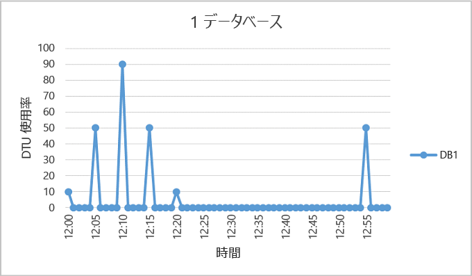
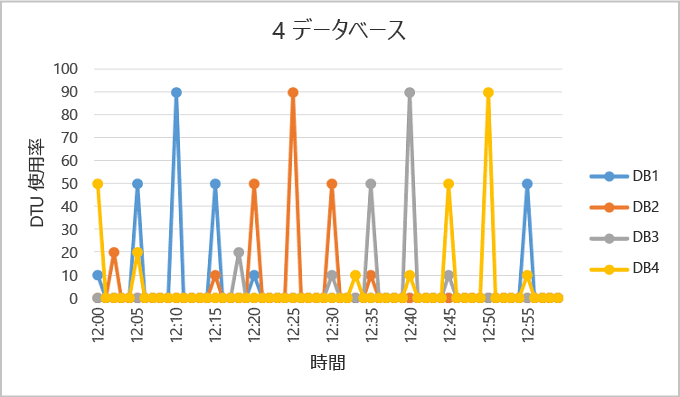
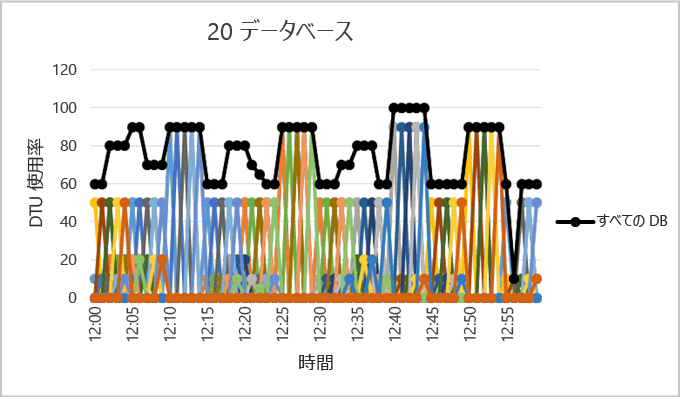

<properties
	pageTitle="エラスティック データベース プールの使用に適した状況"
	description="弾力性データベース プールは、弾力性データベースのグループで共有される使用可能なリソースのコレクションです。このドキュメントは、データベースのグループに対して、エラスティック データベース プールを使用することが適切であるか評価するガイダンスです。"
	services="sql-database"
	documentationCenter=""
	authors="stevestein"
	manager="jhubbard"
	editor=""/>

<tags
	ms.service="sql-database"
	ms.devlang="NA"
	ms.date="08/08/2016"
	ms.author="sstein"
	ms.workload="data-management"
	ms.topic="article"
	ms.tgt_pltfrm="NA"/>

# エラスティック データベース プールの使用に適した状況
エラスティック データベース プールを使用することにより、それに見合うコスト効率が得られるかどうかについて、データベースの使用パターン、およびエラスティック データベース プールと Single Database 間の価格差に基づいて評価します。既存の SQL データベースのセットに必要な現在のプール サイズを決定するためのガイダンスも含まれています。

- プールの概要については、「[リソースを共有するエラスティック データベース プールを使用して SQL データベースの爆発的な成長に対処する](sql-database-elastic-pool.md)」を参照してください。

> [AZURE.NOTE] エラスティック プールは、現在プレビュー段階にある米国中北部とインド西部を除くすべての Azure リージョンで一般公開 (GA) されています。プレビュー段階のリージョンでも、できるだけ早く一般公開される予定です。

## エラスティック データベース プール

SaaS 開発者は、複数のデータベースで構成される大規模なデータ層の上にアプリケーションを構築します。アプリケーションの一般的なパターンでは、顧客ごとに Single Database をプロビジョニングします。しかし、各顧客の使用パターンは変動して予測不可能な場合が多く、各データベース ユーザーのそれぞれについてリソース要件を予測することも困難です。したがって、開発者は、すべてのデータベースのスループットと応答時間を改善するために、かなりのコストを費やしてリソースを過剰にプロビジョニングする場合があります。一方で、開発者があまりコストをかけず、顧客がパフォーマンスの低下に見舞われる場合もあります。エラスティック プールを使用する SaaS アプリケーションの設計パターンの詳細については、「[Azure SQL Database を使用するマルチテナント SaaS アプリケーションの設計パターン](sql-database-design-patterns-multi-tenancy-saas-applications.md)」を参照してください。

Azure SQL Database のエラスティック プールを使用すると、SaaS 開発者は、各データベースのパフォーマンスに弾力性を提供しながら、データベース グループの価格に対するパフォーマンスを所定の予算内で最適化できます。また、開発者は、複数のデータベースで共有されるプールのエラスティック データベース トランザクション ユニット (eDTU) を購入することで、個々のデータベースの使用期間が予測しづらい場合にも対応できます。プールの eDTU 要件は、そのデータベースの使用量の合計によって決まります。プールで使用可能な eDTU の量は、開発者の予算に応じて決められます。プールを利用すれば、開発者は、使用するプールに関して予算がパフォーマンスに与える影響、またはパフォーマンスが予算に与える影響を検討しやすくなります。開発者は、単純にプールにデータベースを追加し、データベースに対する最小および最大の eDTU を設定し、予算に基づいてプールの eDTU を設定します。開発者はプールを使用することで、リーン スタートアップの段階から成熟企業の段階に至るまで、サービスをシームレスに拡大し続けることができます。
## プールを検討すべき状況

プールは、多数のデータベースが特定の使用パターンで使用されている場合に適しています。あるデータベースは、使用が急増することはあまりなく、平均使用量が低いパターンの特徴を持っています。

プールに追加できるデータベースが多ければ多いほど、節約量も多くなります。アプリケーションの使用パターンにもよりますが、S3 データベースが 2 つあれば節約を実現できます。

以下のセクションでは、特定のデータベースのコレクションをプールに追加した場合にメリットがあるかどうかを評価する方法を確認できます。この例では Standard プールを使用していますが、同じ原則は Basic プールと Premium プールにも当てはまります。

### データベースの使用パターンの評価

次の図では、アイドル時間は長いが、定期的にアクティビティが急増するデータベースを示しています。このような使用パターンは、プールに適しています。

   

上に示した DB1 の 5 分間のピークは 90 DTU ですが、全体的な平均使用量は 5 DTU 未満です。Single Database でこのワークロードを実行するためには S3 パフォーマンス レベルが必要ですが、このパフォーマンスを確保すると、アクティビティの少ない時間帯にほとんどのリソースが使用されなくなります。

プールを利用すれば、これらの未使用の DTU を複数のデータベースで共有できるので、必要な DTU の総量と全体的なコストを削減できます。

DB1 と類似する使用パターンを持つデータベースが他にもあると仮定し、前の例に追加しています。次に示す 2 つの図では、時間が経過しても使用量のパターンが重ならないことを示すために、4 つのデータベースと 20 個のデータベースの使用量が同じグラフに重ねられています。

   

   

全 20 のデータベースの DTU 使用量合計は、上図では黒線で示されています。これは、DTU の合計使用量が 100 DTU を超えることはなく、20 のデータベースでこの期間にわたって 100 eDTU を共有することが可能であることを示しています。これは、Single Database のそれぞれのパフォーマンス レベルが S3 であるときと比較した場合、DTU を 20 倍削減し価格を 13 倍下げます。

次の理由からこの例は理想的です。

- 各データベースのピーク時の使用量と、平均使用量に大きな差があります。
- 各データベースのピーク使用時間が異なります。
- eDTU が多数のデータベースで共有されています。

プールの価格は、プール eDTU の機能を表します。プールの eDTU 単価は Single Database の DTU 単価の 1.5 倍ですが、**プール eDTU は、多数のデータベースで共有できるので、多くの場合合計 eDTU は少なくて済みます**。これらの価格と eDTU 共有の特徴が、プールで節約を可能にするベースとなります。

データベース数とデータベースの使用量に関連する次の経験則から、Single Database でのパフォーマンス レベルを使用した場合と比べて、プールがコスト削減に繋がることがわかります。

### 最小数のデータベース

Single Database のパフォーマンス レベルの DTU 合計が、プールに必要な eDTU の 1.5 倍を超える場合、エラスティック プールのコスト効率の方が高くなります。可能なサイズの詳細については、「[エラスティック データベース プールとエラスティック データベースの eDTU と記憶域の上限](sql-database-elastic-pool.md#edtu-and-storage-limits-for-elastic-pools-and-elastic-databases)」を参照してください。

***例***  Single Database のパフォーマンス レベルを使用した場合と比較して、100 eDTU のプールのコスト効果の方が高くなるようにするには、最低 2 個の S3 データベースまたは最低 15 個の S0 データベースが必要です。

### 同時にピークとなるデータベースの最大数

eDTU を共有する場合は、プール内のすべてのデータベースが、単一のデータベースのパフォーマンス レベルを使用している場合の eDTU を上限まで同時に使用できるわけではありません。同時にピークになるデータベース数が少ないほど、プール eDTU を低く設定してよりプールのコスト効果を高めることができます。一般的に、その eDTU の上限まで同時にピークとなることができるのは、プールの 2/3 (67%) 以下のデータベースです。

***例***  200 eDTU のプール内の 3 つの S3 データベースのコストを削減する場合、同時にピークになることが許容されるのは、これらのデータベースのうちの 2 つまでです。これら 4 つの S3 データベースの 3 つ以上が同時にピークとなる場合、プール サイズを 200 eDTU よりも大きくする必要があります。プール サイズを 200 eDTU よりも大きく変更した場合、Single Database のパフォーマンス レベルを使用した場合よりもコストを低く抑えるには、プールの S3 データベース数を増やす必要があります。

この例では、プール内の他のデータベースの使用は考慮されていないことに注意してください。すべてのデータベースがある特定の時間にいくらか使用されている場合、同時にピークとなることができるのは、2/3 (67%) 未満のデータベースです。

### 各データベースの DTU の使用量

データベースのピーク時と平均使用時の差が大きいということは、使用量が低い時間が長く、使用量が高い時間が短いことを示します。使用量がこのようなパターンになっている場合、リソースを複数のデータベースで共有するのが適しています。データベースのピーク時の使用量が平均使用量よりも約 1.5 倍多い場合、プールを使用することを検討した方がよいでしょう。

***例***  S3 データベースが、ピーク時には 100 DTU を使用し、平均では 67 DTU 以下を使用する場合、eDTU をプールで共有するのが適しています。または、S1 データベースがピーク時には 20 DTU を使用し、平均では 13 DTU 以下を使用する場合、プールが適しています。

## エラスティック プールのサイズ設定

プールに最適なサイズは、eDTU の合計とプール内のすべてのデータベースに必要なストレージ リソースに左右されます。これには、次の値のうちの大きい方を特定する必要があります。

* プール内のすべてのデータベースに使用される DTU の最大値。
* プール内のすべてのデータベースに使用される記憶域の最大バイト数。

可能なサイズの詳細については、「[エラスティック データベース プールとエラスティック データベースの eDTU と記憶域の上限](sql-database-elastic-pool.md#edtu-and-storage-limits-for-elastic-pools-and-elastic-databases)」を参照してください。

SQL Database は、既存の SQL Database サーバー内にあるデータベースのリソース使用量の履歴を自動的に評価し、Azure ポータルでのプールの適切な構成を推奨します。構成を推奨するだけでなく、サーバー上にあるデータベースのカスタム グループの eDTU 使用量の見積もりが、組み込み済みの機能によって実施されます。対話形式でのプールへのデータベースの追加やデータベースの削除を行い、変更をコミットする前にリソース使用状況分析やサイズ設定のアドバイスを入手できるため、"what-if" 分析が可能です。その方法については、[エラスティック プールの監視、管理、およびサイズ設定に関する記事](sql-database-elastic-pool-manage-portal.md)を参照してください。

柔軟性の高いリソース使用状況評価によって、V12 より前のサーバーに対するアドホックなサイズの見積もりと、さまざまなサーバーのデータベース サイズの見積もりを可能にする方法については、「[エラスティック データベース プールに適したデータベースを識別する PowerShell スクリプト](sql-database-elastic-pool-database-assessment-powershell.md)」を参照してください。

| 機能 | ポータルでの操作|	PowerShell スクリプト|
|:---------------|:----------|:----------|
| 粒度 | 15 秒 | 15 秒
| プールの場合と Single Database のパフォーマンス レベルの場合の価格差を検討| はい| いいえ
| 分析対象のデータベースの一覧をカスタマイズ可能| はい| はい
| 分析で使用される期間をカスタマイズ可能| いいえ| はい
| サーバーをまたいで、分析対象のデータベースの一覧をカスタマイズ可能| いいえ| はい
| v11 サーバーにある分析対象のデータベースの一覧をカスタマイズ可能| いいえ| はい

ツールを使用できない場合、プールのコスト効果が Single Database よりも高いかどうかを確認するには、次の手順が役立ちます。

1.	プールに必要な eDTU は、次のように評価します。

    MAX(<*DB の合計数* X *DB ごとの平均 DTU 使用量*>   <*同時にピークとなる DB 数* X *DB ごとの DTU 使用量のピーク*)

2.	プール内のすべてのデータベースに必要なバイト数を追加することで、プールに必要なストレージ領域を見積もります。次に、このストレージの容量を提供する eDTU プール サイズを決定します。eDTU プール サイズに基づくプール ストレージの制限については、「[エラスティック データベース プールとエラスティック データベースの eDTU と記憶域の上限](sql-database-elastic-pool.md#edtu-and-storage-limits-for-elastic-pools-and-elastic-databases)」を参照してください。
3.	手順 1. と手順 2. の eDTU の見積もりのうち、大きい方を使用します。
4.	「[SQL Database の価格](https://azure.microsoft.com/pricing/details/sql-database/)」を参照し、手順 3. の見積もりを超える最小の eDTU プール サイズを探します。
5.	手順 5. のプールの価格と、Single Database の適切なパフォーマンス レベルを使用した場合の価格を比較します。

## まとめ

すべての Single Database がプールに適するとは限りません。平均使用量が少なく、使用率の急上昇が比較的少ないデータベースが、候補として適しています。アプリケーションの使用パターンは動的であるため、この記事で説明した情報とツールを使用して初期評価を行い、使用しているデータベースの一部または全部にプールが適しているかどうかを確認してください。この記事は、エラスティック プールが適しているかどうかを判断するための開始点にすぎません。リソースの使用状況の履歴は継続的に監視し、すべてのデータベースのパフォーマンス レベルを常に再評価する必要があることに注意してください。データベースは簡単にエラスティック プールから出し入れできます。また、データベースが大量にある場合、データベースを割り振ることのできるさまざまなサイズのプールを複数持つことが可能であることを念頭に置いてください。

## 次のステップ

- [エラスティック データベース プールを作成します](sql-database-elastic-pool-create-portal.md)
- [エラスティック データベース プールの監視、管理、およびサイズ設定](sql-database-elastic-pool-manage-portal.md)
- [SQL Database のオプションとパフォーマンス: 各サービス階層で使用できる内容について理解します](sql-database-service-tiers.md)
- [エラスティック データベース プールに適したデータベースを識別する Powershell スクリプト](sql-database-elastic-pool-database-assessment-powershell.md)

<!---HONumber=AcomDC_0921_2016-->