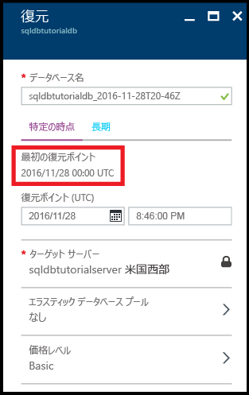
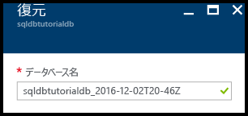
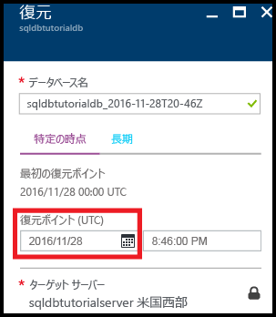
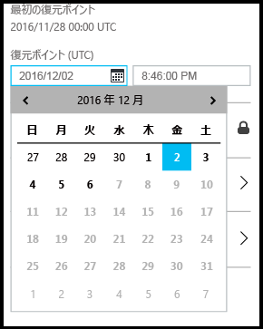
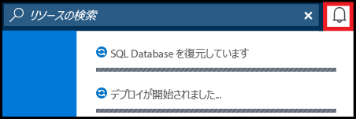
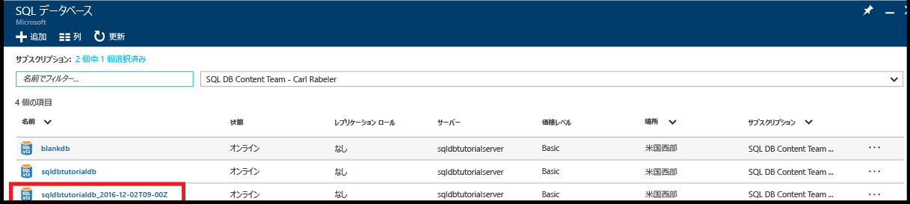
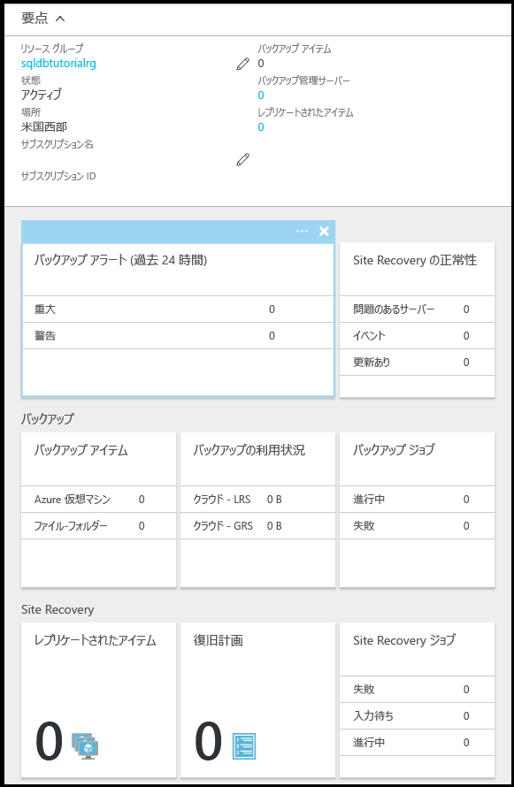

# チュートリアル: Azure Portal を使用した Azure SQL データベースのバックアップと復元
このチュートリアルでは、Azure ポータルを使用して次のことを行う方法を説明します。

- データベースの既存のバックアップを表示する
- データベースを以前の状態に復元する
- Azure Recovery Services コンテナーのデータベース バックアップ ファイルの長期的な保有期間を構成する
- Azure Recovery Services コンテナーからバックアップを復元する

**推定所要時間**: このチュートリアルの完了には約 30 分かかります (既に前提条件を満たしていることが前提です)。

> [!TIP]
> これらのタスクは、概要チュートリアルで [PowerShell](sql-database-get-started-backup-recovery-powershell.md) を使用して実行することができます。
>

## 前提条件

* **Azure アカウント**。 Azure アカウントが必要です。 [無料の Azure アカウントを作成する](https://azure.microsoft.com/free/)か、[Visual Studio サブスクライバーの特典を有効にする](https://azure.microsoft.com/pricing/member-offers/msdn-benefits/)ことができます。 

* **Azure の作成のアクセス許可**。 サブスクリプションの所有者または共同作成者ロールのメンバーであるアカウントを使用して Azure Portal に接続できることが必要です。 ロールベースのアクセス制御 (RBAC) の詳細については、「[Azure Portal でのアクセス管理の概要](../active-directory/role-based-access-control-what-is.md)」を参照してください。

* **SQL Server Management Studio**。 最新バージョンの SQL Server Management Studio (SSMS) は、「[SQL Server Management Studio (SSMS) のダウンロード](https://msdn.microsoft.com/library/mt238290.aspx)」からダウンロードしてインストールすることができます。 新機能が継続的にリリースされているため、Azure SQL Database に接続する場合は、常に最新バージョンの SSMS を使用してください。

* **基本サーバーおよびデータベース**。このチュートリアルで使用するサーバーと&2; つのデータベースをインストールして構成するには、**[Deploy to Azure (Azure へのデプロイ)]** ボタンをクリックします。 ボタンをクリックすると **[Deploy from a template (テンプレートからのデプロイ)]** ブレードが開くので、新しいリソース グループを作成し、作成予定の新しいサーバーの **[管理者ログイン パスワード]** を指定します。

   

> [!NOTE]
> このチュートリアルでは、[SQL Database のバックアップ](sql-database-automated-backups.md)、[長期的なバックアップ保有期間](sql-database-long-term-retention.md)、および[自動データベース バックアップを使用した Azure SQL データベースの回復](sql-database-recovery-using-backups.md)という学習トピックの内容を理解する際に役立ちます。
>  

## Azure アカウントを使用して Azure Portal にサインインする
[既存のサブスクリプション](https://account.windowsazure.com/Home/Index)を使用して、次の手順に従って Azure Portal に接続します。

1. 任意のブラウザーを開き、 [Azure ポータル](https://portal.azure.com/)に接続します。
2. [Azure ポータル](https://portal.azure.com/)にサインインします。
3. **[サインイン]** ページが表示されたら、サブスクリプションの資格情報を入力します。
   
   ![[サインイン]](./media/sql-database-get-started/login.png)

## サービスによって生成されたデータベース バックアップから最も古い復元ポイントを確認する

チュートリアルのこのセクションでは、データベースの[サービスによって生成された自動バックアップ](sql-database-automated-backups.md)から最も古い復元ポイントに関する情報を確認します。 

1. データベース **sqldbtutorialdb** の **[SQL データベース]** ブレードを開きます。

   

2. ツール バーの **[復元]** をクリックします。

   ![ツール バーの [復元]](./media/sql-database-get-started-backup-recovery/restore-toolbar.png)

3. [復元] ブレードで、最も古い復元ポイントを確認します。

   

## データベースを以前の状態に復元する

チュートリアルのこのセクションでは、特定の時点のデータベースを新しいデータベースに復元します。

1. データベースの **[復元]** ブレードで、新しいデータベースの既定の名前を確認します (この名前は、既存のデータベース名にタイムスタンプが追加されたものです)。この新しいデータベースに対して、データベースが以前の状態に復元されます。 この名前は、この後のいくつかの手順で指定する時刻を反映するように変更されます。

   

2. **[復元ポイント (UTC)]** 入力ボックスの**カレンダー** アイコンをクリックします。

   

2. カレンダーで、保有期間内の日付を選択します。

   

3. **[復元ポイント (UTC)]** 入力ボックスで、選択した日付の時刻を指定します。データベースのデータは、自動データベース バックアップから指定した時刻の状態に復元されます。

   

   >[!NOTE]
   >データベース名が、選択した日時を示すように変更されていることに注意してください。 また、特定の時点への復元の対象となるサーバーを変更できないことにも注意してください。 別のサーバーに復元するには、[geo リストア](sql-database-disaster-recovery.md#recover-using-geo-restore)を使用します。 最後に、[エラスティック プール](sql-database-elastic-jobs-overview.md)または別の価格レベルに復元できることに注意してください。 
   >

4. **[OK]** をクリックして、データベースを新しいデータベースで以前の特定の時点に復元します。

5. ツール バーの通知アイコンをクリックして、復元ジョブの状態を確認します。

   

6. 復元ジョブが完了したら、**[SQL データベース]** ブレードを開き、新しく復元されたデータベースを確認します。

   

> [!NOTE]
> ここから、SQL Server Management Studio を使用して、復元されたデータベースに接続し、必要なタスクを実行できます。たとえば、[復元されたデータベースからデータを少し抽出して既存のデータベースにコピーしたり、既存のデータベースを削除し、復元されたデータベースの名前を既存のデータベース名に変更したり](sql-database-recovery-using-backups.md#point-in-time-restore)できます。
>

## Azure Recovery Services コンテナーの自動バックアップの長期的な保有期間を構成する 

チュートリアルのこのセクションでは、ご利用のサービス レベルの保有期間より長い間、[自動バックアップを保持するよう Azure Recovery Services コンテナーを構成](sql-database-long-term-retention.md)します。 

> [!TIP]
> 長期的なバックアップ リテンション期間のバックアップを削除する方法については、[PowerShell を使った長期的なバックアップ リテンション期間の管理](sql-database-manage-long-term-backup-retention-powershell.md)に関する記事をご覧ください。
>

1. サーバー **sqldbtutorialserver** の **[SQL Server]** ブレードを開きます。

   ![[SQL Server] ブレード](./media/sql-database-get-started/sql-server-blade.png)

2. **[Long-term backup retention (長期的なバックアップ保有期間)]** をクリックします。

   

3. **[sqldbtutorial - Long-term backup retention (sqldbtutorial - 長期的なバックアップ保有期間)]** ブレードで、プレビューの使用条件を確認して同意します (既に同意している場合またはこの機能がプレビュー段階ではなくなった場合を除く)。

   

4. sqldbtutorialdb データベースの長期的なバックアップ保有期間を構成するには、グリッドでそのデータベースを選択し、ツール バーの **[構成]** をクリックします。

   

5. **[構成]** ブレードの **[Recovery service vault (Recovery Services コンテナー)]** で **[必要な設定の構成]** をクリックします。

   

6. **[Recovery Services コンテナー]** ブレードで、既存のコンテナーを選択します (ある場合)。 また、サブスクリプションに Recovery Services コンテナーが見つからなかった場合は、フローをクリックして終了し、Recovery Services コンテナーを作成します。

   

7. **[Recovery Services コンテナー]** ブレードの **[追加]** をクリックします。

   
   
8. **[Recovery Services コンテナー]** ブレードで、新しい Recovery Services コンテナーに有効な名前を指定します。

   

9. サブスクリプションとリソース グループを選択し、コンテナーの場所を選択します。 完了したら、**[作成]** をクリックします。

   

   > [!IMPORTANT]
   > コンテナーは、Azure SQL 論理サーバーと同じリージョンに配置する必要があります。また、論理サーバーと同じリソース グループを使用する必要があります。
   >

10. 新しいコンテナーが作成されたら、必要な手順を実行して **[Recovery Services コンテナー]** ブレードに戻ります。

11. **[Recovery Services コンテナー]** ブレードで、コンテナーをクリックし、**[選択]** をクリックします。

   

12. **[構成]** ブレードで、新しい保持ポリシーに有効な名前を指定し、必要に応じて既定の保持ポリシーを変更して、**[OK]** をクリックします。

   

13. **[sqldbtutorial - Long-term backup retention (sqldbtutorial - 長期的なバックアップ保有期間)]** ブレードで、**[保存]** をクリックし、**[OK]** をクリックして、選択したすべてのデータベースに長期的なバックアップ保持ポリシーを適用します。

   

14. **[保存]** をクリックして、構成した Azure Recovery Services コンテナーに対して、この新しいポリシーを使用して長期的なバックアップ保有期間を有効にします。

   

15. 長期的なバックアップ保有期間が有効になったら、**[sqldbtutorialvault]** ブレードを開きます (**[すべてのリソース]** に移動し、サブスクリプションのリソースの一覧から選択します)。

   

> [!IMPORTANT]
> 構成が完了すると、その後&7; 日以内に、コンテナーにバックアップが表示されます。 バックアップがコンテナーに表示されるまで、このチュートリアルを先に進めないでください。
>

## 長期的な保有期間内のバックアップを確認する

チュートリアルのこのセクションでは、[長期的なバックアップ保有期間](sql-database-long-term-retention.md)内のデータベース バックアップに関する情報を確認します。 

1. **[sqldbtutorialvault]** ブレードを開き (**[すべてのリソース]** に移動し、サブスクリプションのリソースの一覧から選択します)、コンテナー内のデータベース バックアップで使用されているストレージの容量を確認します。

   

2. データベース **sqldbtutorialdb** の **[SQL データベース]** ブレードを開きます。

   

3. ツール バーの **[復元]** をクリックします。

   ![ツール バーの [復元]](./media/sql-database-get-started-backup-recovery/restore-toolbar.png)

4. [復元] ブレードの **[長期]** をクリックします。

5. [Azure vault backups (Azure コンテナーのバックアップ)] の **[バックアップの選択]** をクリックして、長期的なバックアップ保有期間内の使用可能なデータベース バックアップを表示します。

   

## 長期的なバックアップ保有期間内のバックアップからデータベースを復元する

チュートリアルのこのセクションでは、データベースを Azure Recovery Services コンテナーにあるバックアップから新しいデータベースに復元します。

1. **[Azure vault backups (Azure コンテナーのバックアップ)]** ブレードで、復元するバックアップをクリックし、**[選択]** をクリックします。

   

2. **[データベース名]** ボックスに、復元されるデータベースの名前を指定します。

   

3. **[OK]** をクリックして、コンテナー内にあるバックアップから新しいデータベースにデータベースを復元します。

4. ツール バーの通知アイコンをクリックして、復元ジョブの状態を確認します。

   

5. 復元ジョブが完了したら、**[SQL データベース]** ブレードを開き、新しく復元されたデータベースを確認します。

   

> [!NOTE]
> ここから、SQL Server Management Studio を使用して、復元されたデータベースに接続し、必要なタスクを実行できます。たとえば、[復元されたデータベースからデータを少し抽出して既存のデータベースにコピーしたり、既存のデータベースを削除し、復元されたデータベースの名前を既存のデータベース名に変更したり](sql-database-recovery-using-backups.md#point-in-time-restore)できます。
>

## 次のステップ

- サービスによって生成された自動バックアップについては、[自動バックアップ](sql-database-automated-backups.md)に関する記事を参照してください。
- バックアップの長期保存については、[バックアップの長期保存](sql-database-long-term-retention.md)に関する記事を参照してください。
- バックアップからの復元については、[バックアップからの復元](sql-database-recovery-using-backups.md)に関する記事を参照してください。

