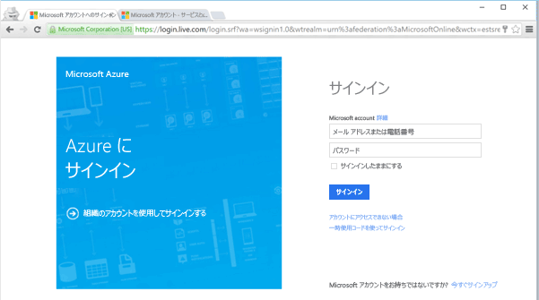
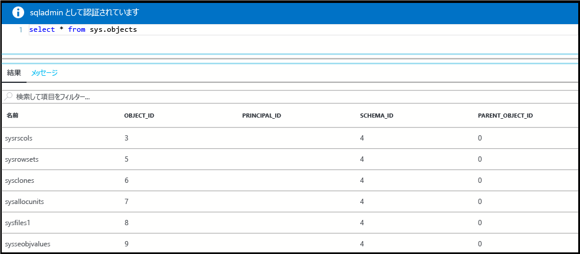

# <a name="create-an-azure-sql-database-in-the-azure-portal"></a>Azure Portal で Azure SQL データベースを作成する

このクイック スタート チュートリアルでは、Azure で SQL データベースを作成する方法について説明します。  Azure SQL Database は、"サービスとしてのデータベース" を提供するサービスで、これを使用すると、クラウド内で可用性の高い SQL Server データベースの実行とスケーリングが可能になります。  このクイック スタートでは、Azure Portal で新しい SQL データベースを作成して作業を開始する方法を紹介します。

## <a name="log-in-to-the-azure-portal"></a>Azure ポータルにログインする

[Azure ポータル](https://portal.azure.com/)にログインします。

## <a name="create-a-sql-database"></a>SQL Database の作成

Azure SQL データベースは、定義済みの一連の[コンピューティング リソースとストレージ リソース](sql-database-service-tiers.md)を使って作成されます。 データベースは、[Azure リソース グループ](../azure-resource-manager/resource-group-overview.md)内と [Azure SQL Database 論理サーバー](sql-database-features.md)内に作成されます。 

以下の手順に従い、Adventure Works LT サンプル データを含む SQL データベースを作成します。 

1. Azure Portal の左上にある **[新規]** ボタンをクリックします。

2. **[新規]** ページで **[データベース]** を選択し、**[データベース]** ページで **[SQL Database]** を選択します。

    

3. 前の画像で示されているように、[SQL Database] のフォームに次の情報を入力します。 
   - [データベース名]: 「**mySampleDatabase**」を使用します
   - [リソース グループ]: 「**myResourceGroup**」を使用します
   - [ソース]: **[Sample (AdventureWorksLT) (サンプル (AdventureWorksLT))]** を選択します

4. **[サーバー]** をクリックして、新しいデータベース用の新しいサーバーを作成して構成します。 **[新しいサーバー]** のフォームに、グローバルに一意なサーバー名を指定し、サーバー管理者ログインの名前を指定して、任意のパスワードを指定します。 

    
5. **[選択]**をクリックします。

6. **[価格レベル]** をクリックして、新しいデータベースのサービス レベルとパフォーマンス レベルを指定します。 このクイック スタートでは、**20 DTU** と **250** GB のストレージを選択します。

    

7. **[適用]**をクリックします。  

8. **[作成]** をクリックしてデータベースをプロビジョニングします。 プロビジョニングには数分かかります。 

9. ツール バーの **[通知]** をクリックして、デプロイ プロセスを監視します。

    


## <a name="create-a-server-level-firewall-rule"></a>サーバーレベルのファイアウォール規則を作成する

SQL Database サービスは、サーバーレベルのファイアウォールを作成することで、特定の IP アドレスに対してファイアウォールを開くためのファイアウォール規則が作成されている場合を除き、外部のアプリケーションやツールは、サーバーまたはサーバー上のすべてのデータベースに接続できなくなります。 以下の手順に従い、クライアントの IP アドレスに対して [SQL Database サーバーレベルのファイアウォール規則](sql-database-firewall-configure.md)を作成し、その IP アドレスのみに SQL Database ファイアウォールを介して外部接続できるようにします。 

1. デプロイが完了したら、左側のメニューから **[SQL データベース]** をクリックし、**[SQL データベース]** ページで、新しいデータベース **mySampleDatabase** をクリックします。 このデータベースの概要ページが開き、完全修飾サーバー名 (**mynewserver20170327.database.windows.net** など) や追加の構成オプションが表示されます。

       

2. 前の画像に示されているように、ツール バーの **[サーバー ファイアウォールの設定]** をクリックします。 SQL Database サーバーの **[ファイアウォール設定]** ページが開きます。 

3. ツールバーの **[クライアント IP の追加]** をクリックし、**[保存]** をクリックします。 現在の IP アドレスに対してサーバーレベルのファイアウォール規則が作成されます。

       

4. **[OK]** をクリックしてから、**[X]** をクリックして **[ファイアウォール設定]** ページを閉じます。

これで、SQL Server Management Studio やその他の任意のツールを使用してデータベースとそのサーバーに接続できるようになりました。

## <a name="query-the-sql-database"></a>SQL データベースに対するクエリ

SQL データベースを作成したときに、そのデータベースに **AdventureWorksLT** サンプル データベースを設定しました (これは、このクイック スタートで先ほど作成 UI で選択したオプションの 1 つです)。 ここでは、Azure Portal 内の組み込みのクエリ ツールを使用して、データに対してクエリを実行します。 

1. データベースの SQL Database ページで、ツール バーの **[ツール]** をクリックします。 **[ツール]** ページが表示されます。

     ![[ツール] メニュー](./media/sql-database-get-started/tools-menu.png) 

2. **[クエリ エディター (プレビュー)]** をクリックし、**[プレビューの使用条件]** チェック ボックスをオンにしてから **[OK]** をクリックします。 [クエリ エディター] ページが開きます。

3. **[ログイン]** をクリックし、メッセージが表示されたら **[SQL Server 認証]** を選択して、先ほど作成したサーバー管理者ログインとパスワードを入力します。

     

4. **[OK]** をクリックしてログインします。

5. 認証されたら、[クエリ エディター] ウィンドウに次のクエリを入力します。

   ```
   SELECT pc.Name as CategoryName, p.name as ProductName
   FROM SalesLT.ProductCategory pc
   JOIN SalesLT.Product p
   ON pc.productcategoryid = p.productcategoryid;
   ```

6. **[実行]** をクリックし、**[結果]** ウィンドウでクエリの結果を確認します。

    

7. **[X]** をクリックして **[クエリ エディター]** ページを閉じ、もう一度 **[X]** をクリックして **[ツール]** ページを閉じます。

## <a name="clean-up-resources"></a>リソースのクリーンアップ

このコレクションの他のクイック スタートは、このクイック スタートに基づいています。 引き続きクイック スタートまたはチュートリアルの作業を行う場合は、このクイック スタートで作成したリソースをクリーンアップしないでください。 これ以上作業を行わない場合は、以下の手順に従い、このクイック スタートで作成したすべてのリソースを Azure Portal で削除してください。

1. Azure Portal の左側のメニューから、**[リソース グループ]**、**[myResourceGroup]** の順にクリックします。 
2. リソース グループのページで **[削除]** をクリックし、テキスト ボックスに「**myResourceGroup**」と入力してから **[削除]** をクリックします。

## <a name="next-steps"></a>次のステップ

- SQL Server Management Studio を使用して接続とクエリを実行するには、[SSMS を使用した接続とクエリ](sql-database-connect-query-ssms.md)に関するページを参照してください。
- Visual Studio を使用して接続を行うには、[Visual Studio を使用した接続とクエリ](sql-database-connect-query.md)に関するページを参照してください。
- SQL Database の技術的な概要については、[SQL Database サービスの説明](sql-database-technical-overview.md)に関するページを参照してください。

