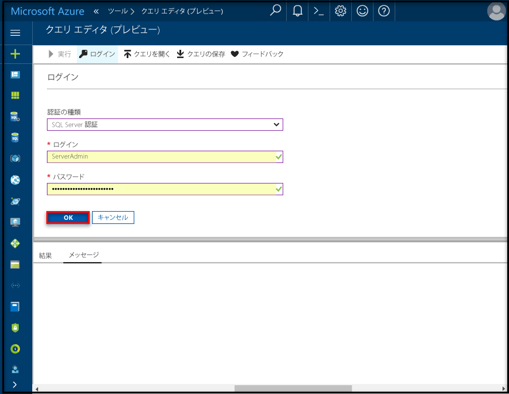

# <a name="create-an-azure-sql-database-in-the-azure-portal"></a>Azure Portal で Azure SQL データベースを作成する

このクイック スタート チュートリアルでは、Azure で SQL データベースを作成する方法について説明します。 Azure SQL Database は、"サービスとしてのデータベース" を提供するサービスで、これを使用すると、クラウド内で可用性の高い SQL Server データベースの実行とスケーリングが可能になります。 このクイック スタートでは、Azure Portal で SQL データベースを作成して作業を開始する方法を紹介します。

Azure サブスクリプションをお持ちでない場合は、開始する前に[無料](https://azure.microsoft.com/free/)アカウントを作成してください。

## <a name="log-in-to-the-azure-portal"></a>Azure Portal にログインする

[Azure Portal](https://portal.azure.com/) にログインします。

## <a name="create-a-sql-database"></a>SQL Database の作成

Azure SQL データベースは、定義済みの一連の[コンピューティング リソースとストレージ リソース](sql-database-service-tiers.md)を使って作成されます。 データベースは、[Azure リソース グループ](../azure-resource-manager/resource-group-overview.md)内と [Azure SQL Database 論理サーバー](sql-database-features.md)内に作成されます。 

以下の手順に従い、Adventure Works LT サンプル データを含む SQL データベースを作成します。 

1. Azure Portal の左上にある **[新規]** ボタンをクリックします。

2. **[新規]** ページで **[データベース]** を選択し、**[データベース]** ページで **[SQL Database]** を選択します。

    

3. 前の画像で示されているように、[SQL Database] のフォームに次の情報を入力します。     
   - [データベース名]: **mySampleDatabase**
   - [リソース グループ]: **myResourceGroup**
   - [ソースの選択]: **Sample (AdventureWorksLT)**

   > [!IMPORTANT]
   > このクイック スタートの残りの部分で使用するため、このフォームでサンプル データベースを選択する必要があります。
   > 

4. **[サーバー]** をクリックし、**[新しいサーバー]** フォームでグローバルに一意なサーバー名を入力し、サーバー管理者ログインの名前を指定して、任意のパスワードを指定します。 

   > [!IMPORTANT]
   > ここで指定するサーバー管理者ログインとパスワードは、このクイック スタートの後の方でサーバーとそのデータベースにログインするために必要です。 後で使用するために、この情報を覚えておくか、記録しておきます。 
   >  

    
5. フォームの入力が完了したら、**[選択]** をクリックします。

6. **[価格レベル]** をクリックして、新しいデータベースのサービス レベルとパフォーマンス レベルを指定します。 スライダーを使用して **20 DTU** を選択し、ストレージには **250** GB を選択します。 DTU の詳細については、「[DTU とは](sql-database-what-is-a-dtu.md)」を参照してください。

    

7. DTU の量を選択した後で、**[適用]** をクリックします。  

8. これで SQL Database フォームの入力が完了したので、**[作成]** をクリックして、データベースをプロビジョニングします。 プロビジョニングには数分かかります。 

9. ツール バーの **[通知]** をクリックして、デプロイ プロセスを監視します。

    


## <a name="create-a-server-level-firewall-rule"></a>サーバーレベルのファイアウォール規則を作成する

SQL Database サービスは、外部のアプリケーションやツールに、サーバーまたはサーバー上のすべてのデータベースへの接続を禁止するファイアウォールをサーバーレベルで作成します。それらに接続するためには、特定の IP アドレスに対してファイアウォールを開放するファイアウォール規則が作成されている必要があります。 以下の手順に従い、クライアントの IP アドレスに対して [SQL Database サーバーレベルのファイアウォール規則](sql-database-firewall-configure.md)を作成し、その IP アドレスのみに SQL Database ファイアウォールを介して外部接続できるようにします。 

> [!NOTE]
> SQL Database の通信は、ポート 1433 上で行われます。 企業ネットワーク内から接続しようとしても、ポート 1433 での送信トラフィックがネットワークのファイアウォールで禁止されている場合があります。 その場合、会社の IT 部門によってポート 1433 が開放されない限り、Azure SQL Database サーバーに接続することはできません。
>

1. デプロイが完了したら、左側のメニューから **[SQL データベース]** をクリックし、SQL データベース ページで、**mySampleDatabase** をクリックします。 このデータベースの概要ページが開き、完全修飾サーバー名 (**mynewserver20170411.database.windows.net** など) や追加の構成オプションが表示されます。

   > [!IMPORTANT]
   > 以降のクイック スタートでサーバーとそのデータベースに接続するには、この完全修飾サーバー名が必要になります。
   > 

       

2. 前の画像に示されているように、ツール バーの **[サーバー ファイアウォールの設定]** をクリックします。 SQL Database サーバーの **[ファイアウォール設定]** ページが開きます。 

       


3. ツール バーの **[クライアント IP の追加]** をクリックし、現在の IP アドレスをファイアウォール規則に追加します。 ファイアウォール規則は、単一の IP アドレスまたは IP アドレスの範囲に対して、ポート 1433 を開くことができます。

4. [ **Save**] をクリックします。 論理サーバーでポート 1433 を開いている現在の IP アドレスに対して、サーバーレベルのファイアウォール規則が作成されます。

       

4. **[OK]** をクリックし、**[ファイアウォール設定]** ページを閉じます。

これで、SQL Server Management Studio やその他のツールを使用して、SQL Database サーバーとそのデータベースに、前に作成したサーバー管理者アカウントでこの IP アドレスから接続できるようになりました。

> [!IMPORTANT]
> 既定では、すべての Azure サービスで、SQL Database ファイアウォール経由のアクセスが有効になります。 すべての Azure サービスに対して無効にするには、このページの **[オフ]** をクリックします。

## <a name="query-the-sql-database"></a>SQL データベースに対するクエリ

Azure でサンプル データベースを作成できたので、Azure Portal の組み込みのクエリ ツールを使用して、データベースへの接続とデータへのクエリを実行できることを確認してみましょう。 

1. データベースの SQL Database ページで、ツール バーの **[ツール]** をクリックします。 **[ツール]** ページが表示されます。

     ![[ツール] メニュー](./media/sql-database-get-started-portal/tools-menu.png) 

2. **[クエリ エディター (プレビュー)]** をクリックし、**[プレビューの使用条件]** チェック ボックスをオンにしてから **[OK]** をクリックします。 [クエリ エディター] ページが開きます。

3. **[ログイン]** をクリックし、メッセージが表示されたら **[SQL Server 認証]** を選択して、先ほど作成したサーバー管理者ログインとパスワードを入力します。

     

4. **[OK]** をクリックしてログインします。

5. 認証されたら、[クエリ エディター] ウィンドウに次のクエリを入力します。

   ```
   SELECT TOP 20 pc.Name as CategoryName, p.name as ProductName
   FROM SalesLT.ProductCategory pc
   JOIN SalesLT.Product p
   ON pc.productcategoryid = p.productcategoryid;
   ```

6. **[実行]** をクリックし、**[結果]** ウィンドウでクエリの結果を確認します。

    

7. **[クエリ エディター]** ページと **[ツール]** ページを閉じます。

## <a name="clean-up-resources"></a>リソースのクリーンアップ

これらのリソースが別のクイック スタート/チュートリアルで不要である場合 (「[次のステップ](#next-steps)」を参照)、次のようにして削除することができます。


1. Azure Portal の左側のメニューから、**[リソース グループ]**、**[myResourceGroup]** の順にクリックします。 
2. リソース グループのページで **[削除]** をクリックし、テキスト ボックスに「**myResourceGroup**」と入力してから **[削除]** をクリックします。

## <a name="next-steps"></a>次のステップ

これで、データベースが作成されたので、任意のツールを使用して接続し、クエリを実行できます。 詳細については、以下のツールを選択してください。

- [SQL Server Management Studio](sql-database-connect-query-ssms.md)
- [Visual Studio Code](sql-database-connect-query-vscode.md)
- [.NET](sql-database-connect-query-dotnet.md)
- [PHP](sql-database-connect-query-php.md)
- [Node.JS](sql-database-connect-query-nodejs.md)
- [Java](sql-database-connect-query-java.md)
- [Python](sql-database-connect-query-python.md)
- [Ruby](sql-database-connect-query-ruby.md)

