<properties
	pageTitle="SQL Database チュートリアル: SQL データベースの作成 | Microsoft Azure"
	description="SQL Database 論理サーバー、サーバー ファイアウォール規則、SQL データベース、サンプル データを設定する方法について説明します。また、クライアント ツールによる接続方法、ユーザーの構成方法、データベース ファイアウォール規則の設定方法について説明します。"
	keywords="SQL データベース チュートリアル, SQL データベースの作成"
	services="sql-database"
	documentationCenter=""
	authors="CarlRabeler"
	manager="jhubbard"
	editor=""/>

<tags
	ms.service="sql-database"
	ms.workload="data-management"
	ms.tgt_pltfrm="na"
	ms.devlang="na"
	ms.topic="hero-article"
	ms.date="09/07/2016"
	ms.author="carlrab"/>

# SQL Database チュートリアル: Azure Portal を使用して数分で SQL データベースを作成する

> [AZURE.SELECTOR]
- [Azure ポータル](sql-database-get-started.md)
- [C#](sql-database-get-started-csharp.md)
- [PowerShell](sql-database-get-started-powershell.md)

このチュートリアルでは、Azure ポータルを使用して次のことを行う方法を説明します。

- サンプル データを使用して Azure SQL Database を作成します。
- 単一の IP アドレスまたは IP アドレスの範囲に対してサービスレベルのファイアウォール規則を作成します。

これらのタスクは、[C#](sql-database-get-started-csharp.md) または [PowerShell](sql-database-get-started-powershell.md) を使用して実行することができます。

[AZURE.INCLUDE [ログイン](../../includes/azure-getting-started-portal-login.md)]

## 最初の Azure SQL データベースを作成する 

1. [Azure Portal](http://portal.azure.com) に接続していない場合は接続します。
2. **[新規]**、**[データ + ストレージ]** の順にクリックし、**[SQL Database]** を見つけます。

    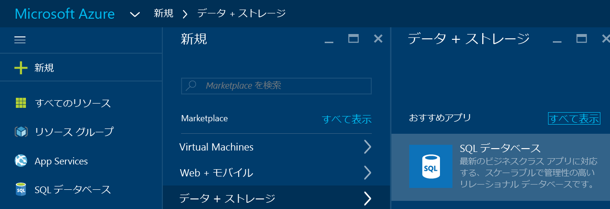

3. **[SQL Database]** をクリックして、[SQL Database] ブレードを開きます。このブレードの内容は、サブスクリプションと既存のオブジェクト (既存のサーバーなど) の数によって異なります。

    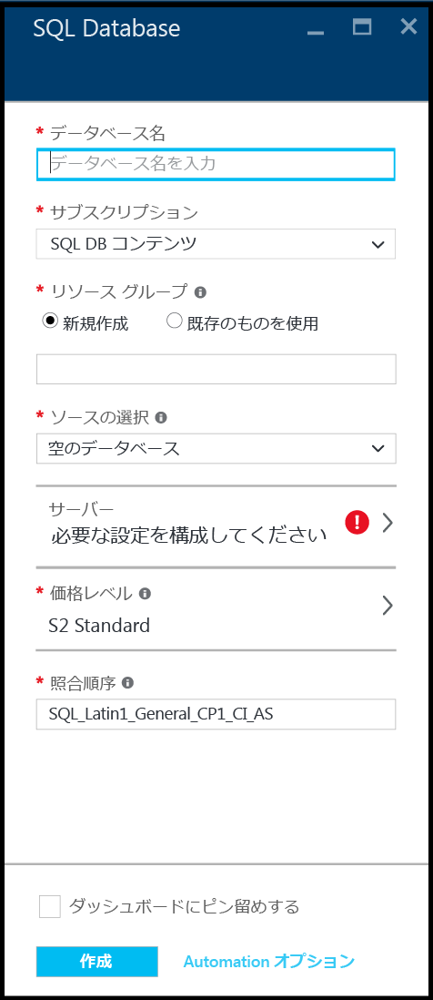

4. **[データベース名]** ボックスに、最初のデータベースの名前 ("my database" など) を入力します。緑色のチェック マークは、入力した名前が有効であることを示しています。

    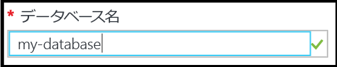

5. 複数のサブスクリプションがある場合は、サブスクリプションを選択します。
6. **[リソース グループ]** で **[新規作成]** をクリックし、最初のリソース グループの名前 ("my-resource-group" など) を入力します。緑色のチェック マークは、入力した名前が有効であることを示しています。

    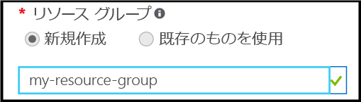

7. **[ソースの選択]** で **[サンプル]** をクリックし、**[サンプルの選択]** で **[AdventureWorksLT [V12]]** をクリックします。

    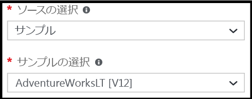

8. **[サーバー]** で **[必要な設定の構成]** をクリックします。

    

9. [サーバー] ブレードで、**[新しいサーバーの作成]** をクリックします。Azure SQL Database はサーバー オブジェクト内に作成されます。新しいサーバーまたは既存のサーバーのいずれかを指定できます。

    

10. **[新しいサーバー]** ブレードを確認して、指定する必要がある新しいサーバーの情報を把握します。

    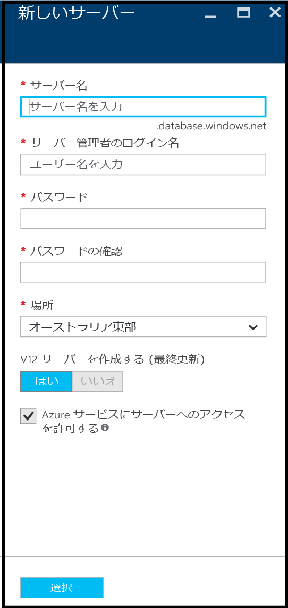

11. **[サーバー名]** ボックスに、最初のサーバーの名前 ("my-new-server-object" など) を入力します。緑色のチェック マークは、入力した名前が有効であることを示しています。

    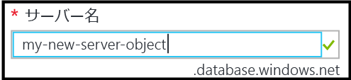
 
12. **[サーバー管理者ログイン]** で、このサーバーの管理者ログインのユーザー名 ("my-admin-account" など) を指定します。このログインは、サーバー プリンシパル ログインとも呼ばれます。緑色のチェック マークは、入力した名前が有効であることを示しています。

    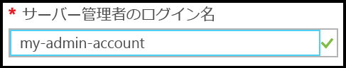

13. **[パスワード]** と **[パスワードの確認]** で、サーバー プリンシパル ログイン アカウントのパスワード ("p@ssw0rd1" など) を指定します。緑色のチェック マークは、入力したパスワードが有効であることを示しています。

    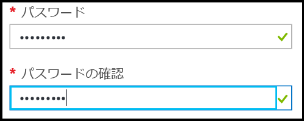
 
14. **[場所]** では、現在の場所に適したデータ センター ("オーストラリア東部" など) を選択します。

    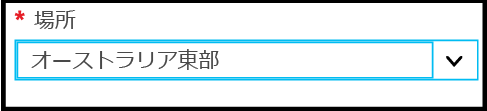

15. **[V12 サーバーの作成 (最新の更新)] では、現在のバージョンの Azure SQL サーバーを作成するオプションしかないことに注意してください。

    

16. 既定では、**[Azure サービスにサーバーへのアクセスを許可する]** チェック ボックスがオンになっており、ここで変更することはできません。これは高度なオプションです。この設定は、このサーバー オブジェクトのサーバー ファイアウォール設定で変更できますが、ほとんどのシナリオではその必要はありません。

    

17. [新しいサーバー] ブレードで、選択内容を確認し、**[選択]** をクリックして、新しいデータベース用にこの新しいサーバーを選択します。

    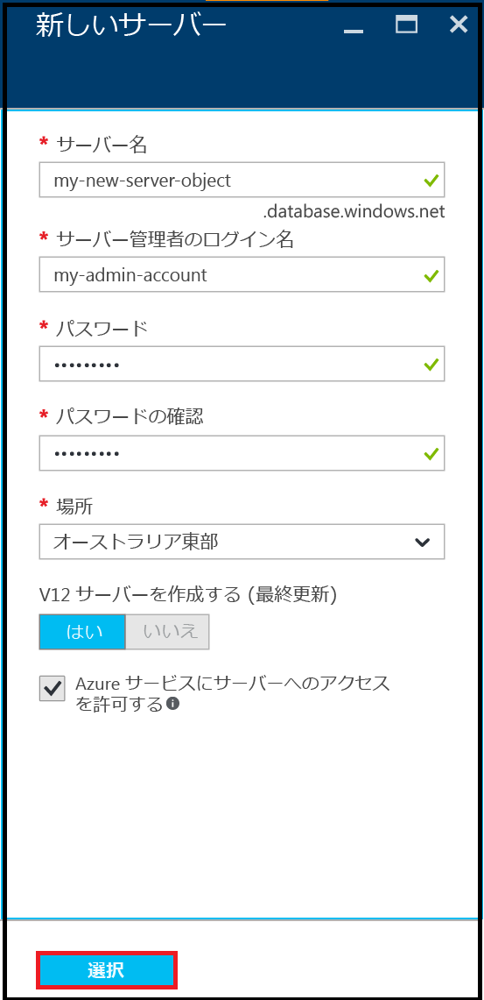

18. [SQL Database] ブレードで、**[価格レベル]** の **[S2 Standard]** をクリックし、**[Basic]** をクリックして、最初のデータベース用に最も低価格の価格レベルを選択します。価格レベルは後でいつでも変更できます。

    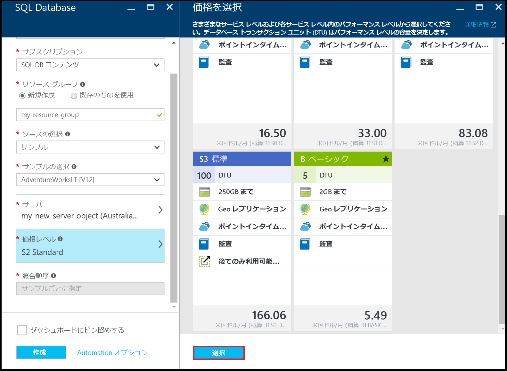

19. [SQL Database] ブレードで選択内容を確認し、**[作成]** をクリックして、最初のサーバーとデータベースを作成します。指定した値が検証され、デプロイが開始されます。

    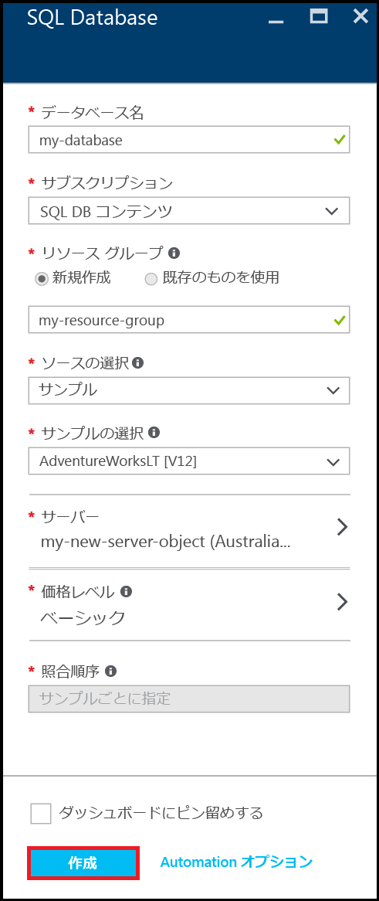

20. ポータル ツールバーで、**[通知]** 項目をクリックして、デプロイの状態を確認します。

    

>[AZURE.IMPORTANT]デプロイが完了すると、Azure に新しい Azure SQL サーバーとデータベースが作成されます。サーバーのファイアウォール規則を作成して、Azure の外部からの接続に対して SQL Database のファイアウォールを開くまで、SQL Server ツールを使用して新しいサーバーまたはデータベースに接続することはできません。

[AZURE.INCLUDE [サーバーのファイアウォール規則の作成](../../includes/sql-database-create-new-server-firewall-portal.md)]

## 次のステップ
ここでは、この SQL Database チュートリアルを完了し、いくつかのサンプル データを使用してデータベースを作成しました。次はお気に入りのツールを使用して探索します。

- Transact-SQL と SQL Server Management Studio (SSMS) に慣れている場合は、[SSMS を使用した SQL データベースの接続とクエリ](sql-database-connect-query-ssms.md)の方法に関するページを参照してください。

- Excel に詳しい場合は、[Excel を使用した Azure SQL データベースへの接続](sql-database-connect-excel.md)方法を参照してください。

- コーディングを開始する準備ができている場合、「[SQL Database と SQL Server の接続ライブラリ](sql-database-libraries.md)」でプログラミング言語を選択します。

- オンプレミスの SQL Server データベースを Azure に移動する場合の詳細については、[SQL Database へのデータベースの移行](sql-database-cloud-migrate.md)に関するページを参照してください。

- BCP コマンド ライン ツールを使用して CSV ファイルから新しいテーブルにデータを読み込む場合は、[BCP を使用した CSV ファイルから SQL Database へのデータの読み込み](sql-database-load-from-csv-with-bcp.md)に関するページを参照してください。

- Azure SQL Database のセキュリティについて調べる場合は、[セキュリティの概要](sql-database-get-started-security.md)に関する記事をご覧ください。

## その他のリソース

[SQL Database とは](sql-database-technical-overview.md)

<!---HONumber=AcomDC_0914_2016-->