# <a name="quick-start-tutorial-your-first-azure-sql-database"></a>クイック スタート チュートリアル: 初めての Azure SQL Database

このクイック スタート チュートリアルでは、次のことについて説明します。

* [新しい論理サーバーを作成する](sql-database-get-started.md#create-a-new-logical-sql-server) 
* [論理サーバーのプロパティを表示する](sql-database-get-started.md#view-the-logical-server-properties) 
* [サーバーレベルのファイアウォール規則を作成する](sql-database-get-started.md#create-a-server-level-firewall-rule) 
* [SSMS を使用してサーバーに接続する](sql-database-get-started.md#connect-to-the-server-with-ssms) 
* [サンプル データを使用してデータベースを作成する](sql-database-get-started.md#create-a-database-with-sample-data) 
* [データベースのプロパティを表示する](sql-database-get-started.md#view-the-database-properties) 
* [Azure Portal でデータベースに対してクエリを実行する](sql-database-get-started.md#query-the-database-in-the-azure-portal) 
* [SSMS を使用してデータベースに接続し、クエリを実行する](sql-database-get-started.md#connect-and-query-the-database-with-ssms) 
* [SSMS を使用して空のデータベースを作成する](sql-database-get-started.md#create-a-blank-database-with-ssms) 
* [接続のトラブルシューティング](sql-database-get-started.md#troubleshoot-connectivity) 
* [データベースの削除](sql-database-get-started.md#delete-a-single-database) 


このクイック スタート チュートリアルでは、Azure リソース グループで実行され、論理サーバーに接続された状態のサンプル データベースと空のデータベースを作成します。 また、2 つのサーバーレベルのファイアウォール規則を作成して、サーバーレベルのプリンシパルが指定の&2; つの IP アドレスからサーバーにログインできるようにします。 最後に、Azure Portal でデータベースをクエリし、SQL Server Management Studio を使用して接続、クエリする方法を学習します。 

**推定所要時間**: このチュートリアルには約 30 分かかります (既に前提条件を満たしていることが前提です)。

> [!TIP]
> これらのタスクは、[C#](sql-database-get-started-csharp.md) または [PowerShell](sql-database-get-started-powershell.md) を使用して実行することができます。
>

## <a name="prerequisites"></a>前提条件

* Azure アカウントが必要です。 [無料の Azure アカウントを作成する](/pricing/free-trial/?WT.mc_id=A261C142F)か、[Visual Studio サブスクライバーの特典を有効にする](/pricing/member-offers/msdn-benefits-details/?WT.mc_id=A261C142F)ことができます。 

* サブスクリプションの所有者または共同作成者ロールのメンバーであるアカウントを使用して Azure Portal に接続できることが必要です。 ロールベースのアクセス制御 (RBAC) の詳細については、「[Azure Portal でのアクセス管理の概要](../active-directory/role-based-access-control-what-is.md)」を参照してください。

> [!NOTE]
> このクイック スタート チュートリアルは、[SQL Database サーバーの概要](sql-database-server-overview.md)、[SQL Database の概要](sql-database-overview.md)、[Azure SQL Database ファイアウォール規則の概要](sql-database-firewall-configure.md)に関する学習トピックの内容を理解する際に役立ちます。
>  


### <a name="sign-in-to-the-azure-portal-with-your-azure-account"></a>Azure アカウントで Azure Portal にサインインする
[Azure アカウント](https://account.windowsazure.com/Home/Index)を使用し、次の手順に従って Azure Portal に接続します。

1. 任意のブラウザーを開き、 [Azure ポータル](https://portal.azure.com/)に接続します。
2. [Azure ポータル](https://portal.azure.com/)にサインインします。
3. **[サインイン]** ページが表示されたら、サブスクリプションの資格情報を入力します。
   
   ![[サインイン]](./media/sql-database-get-started/login.png)


<a name="create-logical-server-bk"></a>

## <a name="create-a-new-logical-sql-server"></a>新しい論理 SQL サーバーを作成する

次の手順に従って、Azure Portal を使用して任意のリージョンに新しい論理サーバーを作成します。

1. **[新規]** をクリックし、「**SQL サーバー**」と入力して、**Enter** キーを押します。

    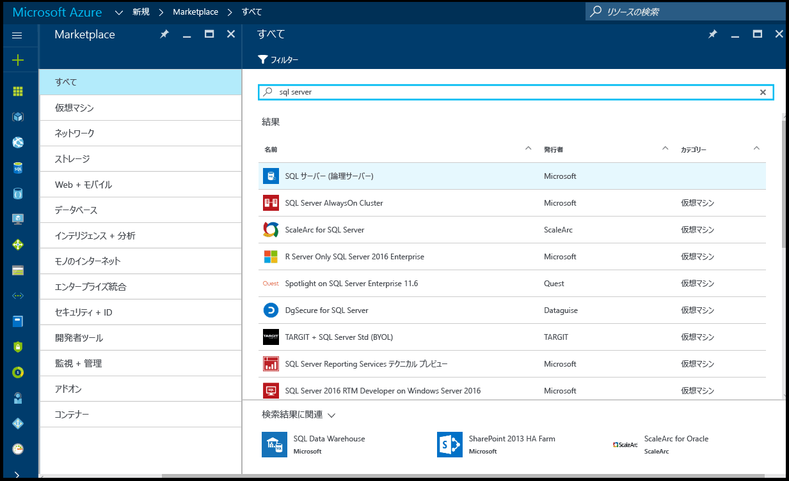
2. **[SQL サーバー (論理サーバー)]** をクリックします。
   
    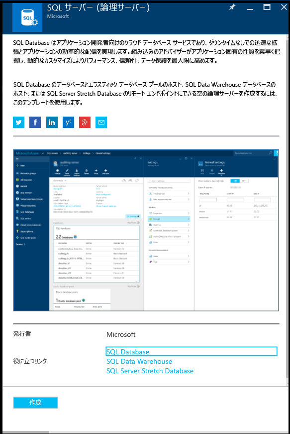
3. **[作成]** をクリックして、新しい [SQL サーバー (論理サーバー)] ブレードを開きます。

    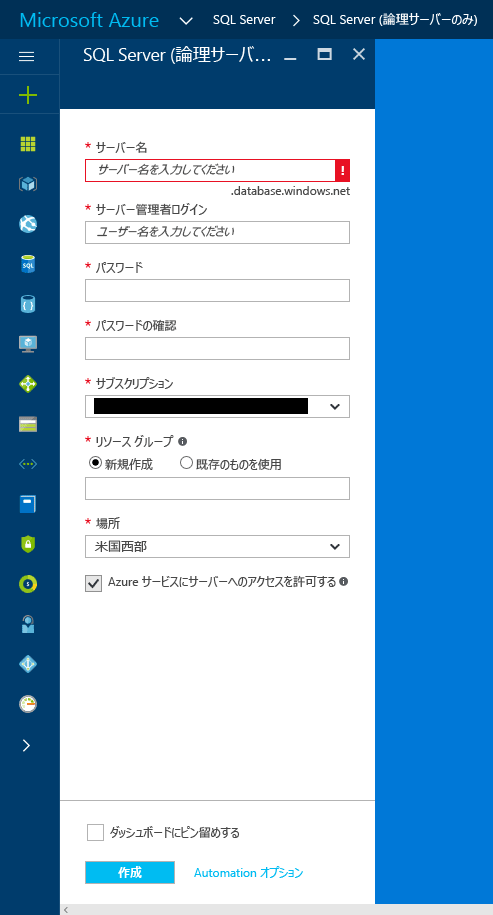
3. [サーバー名] ボックスに、新しい論理サーバーの有効な名前を指定します。 緑色のチェック マークは、入力した名前が有効であることを示しています。
    
    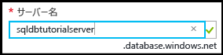

    > [!IMPORTANT]
    > 新しいサーバーの完全修飾名は、<サーバー名>.database.windows.net の形式になります。
    >
    
4. [サーバー管理者ログイン] ボックスに、このサーバーの SQL 認証ログイン用のユーザー名を指定します。 このログインは、サーバー プリンシパル ログインとも呼ばれます。 緑色のチェック マークは、入力した名前が有効であることを示しています。
    
    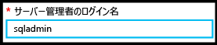
5. **[パスワード]** ボックスと **[パスワードの確認]** ボックスに、サーバー プリンシパル ログイン アカウントのパスワードを指定します。 緑色のチェック マークは、入力したパスワードが有効であることを示しています。
    
    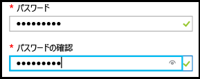
6. オブジェクトを作成するアクセス許可があるサブスクリプションを選択します。

    
7. [リソース グループ] ボックスの **[新規作成]** を選択した後、[リソース グループ] ボックスに、新しいリソース グループに有効な名前を指定します (既にリソース グループを作成済みの場合は、既存のリソース グループを使用することもできます)。 緑色のチェック マークは、入力した名前が有効であることを示しています。

    

8. **[場所]** ボックスで、現在の場所に適したデータ センター ("オーストラリア東部" など) を選択します。
    
    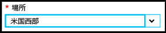
    
    > [!TIP]
    > このブレードの **[Azure サービスにサーバーへのアクセスを許可する]** チェック ボックスは変更できません。 この設定は、サーバー ファイアウォールのブレードで変更できます。 詳細については、[セキュリティの概要](sql-database-control-access-sql-authentication-get-started.md)に関する記事を参照してください。
    >
    
9. **[作成]**をクリックします。

    ![[作成] ボタン](./media/sql-database-get-started/create.png)

## <a name="view-the-logical-server-properties"></a>論理サーバーのプロパティを表示する

次の手順に従って、Azure Portal でサーバーのプロパティを表示します。 以降の手順でこのサーバーに接続するには、完全修飾サーバー名が必要です。 

1. Azure Portal で **[その他のサービス]** をクリックします。

    
2. [フィルター] ボックスに「**SQL**」と入力し、[SQL Server] の星をクリックして、Azure 内でのお気に入りとして SQL Server を指定します。 

    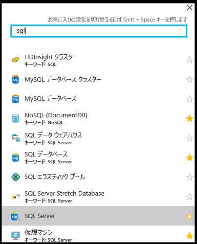
3. 既定のブレードで、**[SQL Server]** をクリックして、Azure サブスクリプション内の SQL Server の一覧を開きます。 

    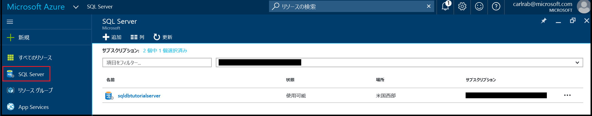

4. Azure Portal で、新しい SQL Server をクリックしてそのプロパティを表示します。 以降のチュートリアルは、このブレードで使用できるオプションをよく知るのに役立ちます。

    ![[SQL Server] ブレード](./media/sql-database-get-started/sql-server-blade.png)
5. [設定] の下にある **[プロパティ]** をクリックして論理 SQL サーバーのさまざまなプロパティを表示します。

    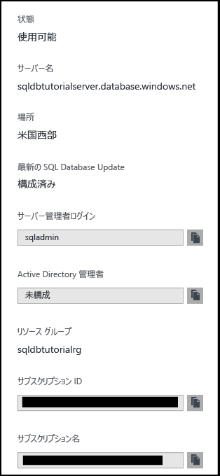
6. 完全修飾サーバー名を、このチュートリアルで後から使用するためにクリップボードにコピーします。

    

## <a name="create-a-server-level-firewall-rule"></a>サーバーレベルのファイアウォール規則を作成する

以下の手順に従って、Azure Portal で新しいサーバーレベルのファイアウォール規則を作成し、その次の手順で SQL Server Management Studio を使用してサーバーに接続できるようにします。

1. [SQL Server] ブレードで、[設定] の下にある **[ファイアウォール]** をクリックして、SQL Server のファイアウォール ブレードを開きます。

    

2. ツール バーの **[クライアント IP の追加]** をクリックします。

    

    > [!NOTE]
    > サーバー上の SQL Database ファイアウォールは、1 つの IP アドレスに対して開くことも、範囲全体のアドレスに対して開くこともできます。 ファイアウォールを開くと、SQL の管理者とユーザーは、有効な資格情報を持っているサーバー上の任意のデータベースにログインできます。
    >

4. ツール バーの **[保存]** をクリックしてこのサーバーレベルのファイアウォール規則を保存し、**[OK]** をクリックします。

    

## <a name="connect-to-the-server-with-ssms"></a>SSMS を使用してサーバーに接続する

次の手順に従って、SQL Server Management Studio を使用して SQL 論理サーバーに接続します。

1. 最新バージョンの SSMS をまだインストールしていない場合は、[SQL Server Management Studio のダウンロード](https://msdn.microsoft.com/library/mt238290.aspx)に関するページで最新バージョンの SSMS をダウンロードしてインストールしてください。 SSMS は、最新の状態を保つために、新しいバージョンのダウンロードが可能になると、更新を求めるメッセージを表示します。

2. インストールしたら、Windows 検索ボックスに「**Microsoft SQL Server Management Studio**」と入力し、**Enter** キーを押して SSMS を開きます。

    
3. [サーバーへの接続] ダイアログ ボックスで、SQL Server 認証を使用して SQL Server に接続するために必要な情報を入力します。

    ![[サーバーへの接続]](./media/sql-database-get-started/connect-to-server.png)
4. **[接続]**をクリックします。

    
5. オブジェクト エクスプローラーで、**[データベース]**、**[システム データベース]**、**[master]** の順に展開して、master データベース内のオブジェクトを表示します。

    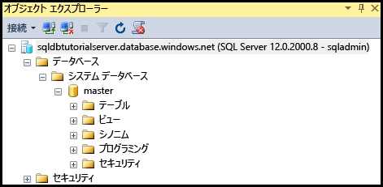
6. **[master]** を右クリックし、**[新しいクエリ]** をクリックします。

    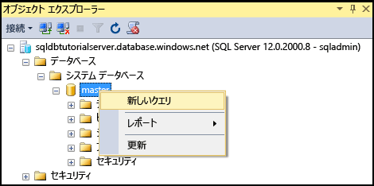

8. クエリ ウィンドウで、次のクエリを入力します。

   ```select * from sys.objects```

9.  ツール バーの **[実行]** をクリックすると、master データベース内のすべてのシステム オブジェクトの一覧が返されます。

    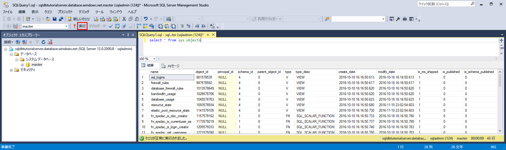

    > [!NOTE]
    > SQL セキュリティについて調べるには、[SQL セキュリティの概要](sql-database-control-access-sql-authentication-get-started.md)に関するページを参照してください。
    >

## <a name="create-a-database-with-sample-data"></a>サンプル データを使用してデータベースを作成する

次の手順に従って、Azure Portal でサンプル データを使用してデータベースを作成します。 前の手順で作成した論理サーバーに接続してこのデータベースを作成します。 サーバーを作成したリージョンで Basic サービス レベルを使用できない場合は、サーバーを削除して、別のリージョンにサーバーを再作成します。 削除の手順については、このチュートリアルの最後の手順を参照してください。

1. Azure Portal の既定のブレードで、**[SQL データベース]** をクリックします。

    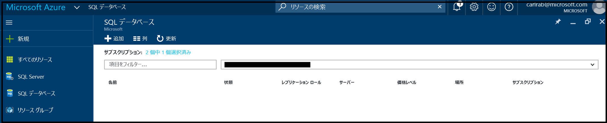
2. [SQL データベース] ブレードで、**[追加]** をクリックします。

    
3. [SQL データベース] ブレードで、自動入力された情報を確認します。

    ![[SQL データベース] ブレード](./media/sql-database-get-started/sql-database-blade.png)
4. 有効なデータベース名を指定します。

    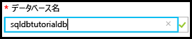
5. [ソースの選択] で **[サンプル]** をクリックし、[サンプルの選択] で **[AdventureWorksLT [V12]]** をクリックします。
   
    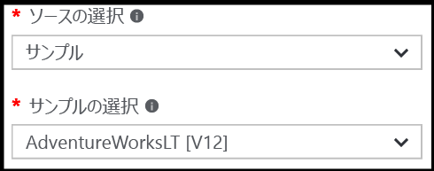
6. [サーバー] で、サーバー管理者ログインのユーザー名とパスワードを指定します。

    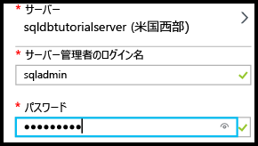

    > [!NOTE]
    > データベースは、サーバーに追加するときに、単一データベースとして追加すること (既定) も、エラスティック プールに追加することもできます。 エラスティック プールの詳細については、[エラスティック プール](sql-database-elastic-pool.md)に関する記事を参照してください。
    >

7. [価格レベル] で、価格レベルを **Basic** に変更します (価格レベルは、必要に応じて後から引き上げ可能ですが、学習目的の場合は、最もコストの低いレベルを使用することをお勧めします)。

    ![[価格レベル]](./media/sql-database-get-started/pricing-tier.png)
8. **[作成]**をクリックします。

    ![[作成] ボタン](./media/sql-database-get-started/create.png)

## <a name="view-the-database-properties"></a>データベースのプロパティを表示する

次の手順に従って、Azure Portal でデータベースに対してクエリを実行します。

1. [SQL データベース] ブレードで、新しいデータベースをクリックすると、そのプロパティが Azure Portal に表示されます。 以降のチュートリアルは、このブレードで使用できるオプションをよく知るのに役立ちます。 

    
2. **[プロパティ]** をクリックして、データベースに関する追加情報を表示します。

    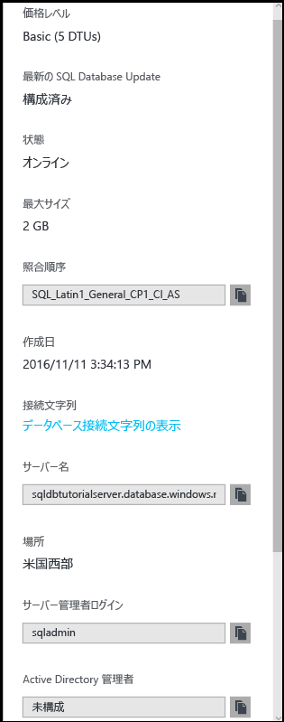

3. **[データベース接続文字列の表示]** をクリックします。

    
4. **[概要]** をクリックし、[要点] ウィンドウでサーバー名をクリックします。
    
    ![新しいサンプル データベースの [要点] ウィンドウ](./media/sql-database-get-started/new-sample-db-essentials-pane.png)
5. サーバーの [要点] ウィンドウで、新しく追加されたデータベースを確認します。

    ![サーバーの [要点] ウィンドウの新しいサンプル データベース](./media/sql-database-get-started/new-sample-db-server-essentials-pane.png)

## <a name="query-the-database-in-the-azure-portal"></a>Azure Portal でデータベースに対してクエリを実行する

次の手順に従って、Azure Portal でクエリ エディターを使用してデータベースに対してクエリを実行します。 このクエリにより、データベース内のオブジェクトが表示されます。

1. [SQL データベース] ブレードで、ツール バーの **[ツール]** をクリックします。

    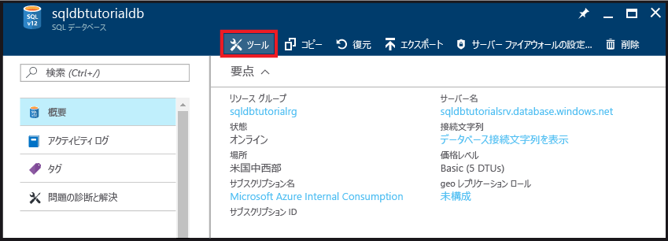
2. [ツール] ブレードで、**[クエリ エディター (プレビュー)]** をクリックします。

    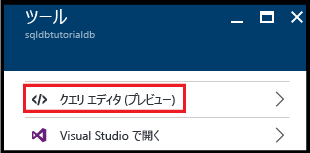
3. クエリ エディターがプレビュー機能であることを示すチェック ボックスをクリックし、**[OK]** をクリックします。
4. **クエリ エディター** ブレードで、**[ログイン]** をクリックします。

    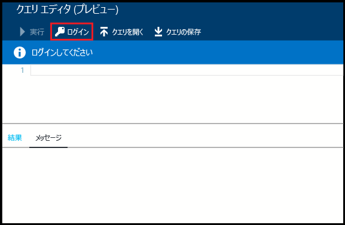
5. [承認の種類] と [ログイン] を確認し、このログインのパスワードを指定します。 

    ![クエリ エディターの [ログイン]](./media/sql-database-get-started/query-editor-login.png)
6. **[OK]** をクリックして、ログインを試みます。
7. クライアントの IP アドレスに対するファイアウォール規則がないためログインが許可されないというログイン エラーが表示される場合は、クライアントの IP アドレスをエラー ウィンドウにコピーし、このデータベースの [SQL Server] ブレードでサーバーレベルのファイアウォール規則を作成します。

    
8. 手順 1. ～ 6. を繰り返してデータベースにログインします。
9. 認証されたら、クエリ ウィンドウで次のクエリを入力します。

   ```select * from sys.objects```

    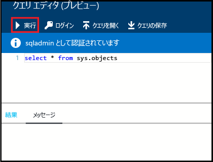
10.  **[実行]**をクリックします。
11. **[結果]** ウィンドウでクエリの結果を確認します。

    

## <a name="connect-and-query-the-database-with-ssms"></a>SSMS を使用してデータベースに接続し、クエリを実行する

次の手順に従って、SQL Server Management Studio を使用してデータベースに接続し、サンプル データに対してクエリを実行してデータベース内のオブジェクトを表示します。

1. SQL Server Management Studio に切り替え、オブジェクト エクスプローラーで、**[データベース]** をクリックし、ツール バーの **[更新]** をクリックしてサンプル データベースを表示します。

    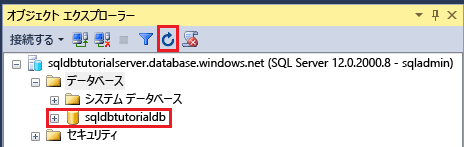
2. オブジェクト エクスプローラーで、新しいデータベースを展開してそのオブジェクトを表示します。

    
3. サンプル データベースを右クリックし、**[新しいクエリ]** をクリックします。

    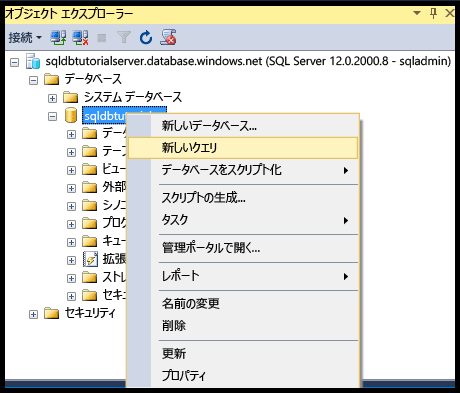
4. クエリ ウィンドウで、次のクエリを入力します。

   ```select * from sys.objects```
   
9.  ツール バーの **[実行]** をクリックすると、サンプル データベース内のすべてのシステム オブジェクトの一覧が返されます。

    

## <a name="create-a-blank-database-with-ssms"></a>SSMS を使用して空のデータベースを作成する

次の手順に従って、SQL Server Management Studio を使用して論理サーバーに新しいデータベースを作成します。

1. オブジェクト エクスプローラーで、**[データベース]** を右クリックし、**[新しいデータベース]** をクリックします。

    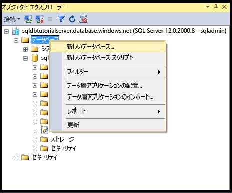

    > [!NOTE]
    > SSMS では、Transact-SQL を使用して新しいデータベースを作成するためにデータベース作成スクリプトを作成することもできます。
    >

2. [新しいデータベース] ダイアログ ボックスの [データベース名] ボックスにデータベース名を指定します。 

    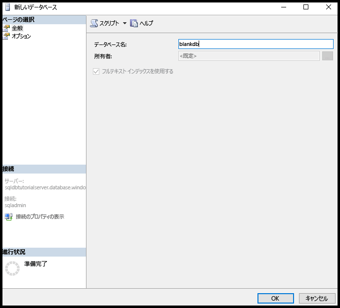

3. [新しいデータベース] ダイアログ ボックスで、**[オプション]** をクリックし、[エディション] を **[Basic]** に変更します。

    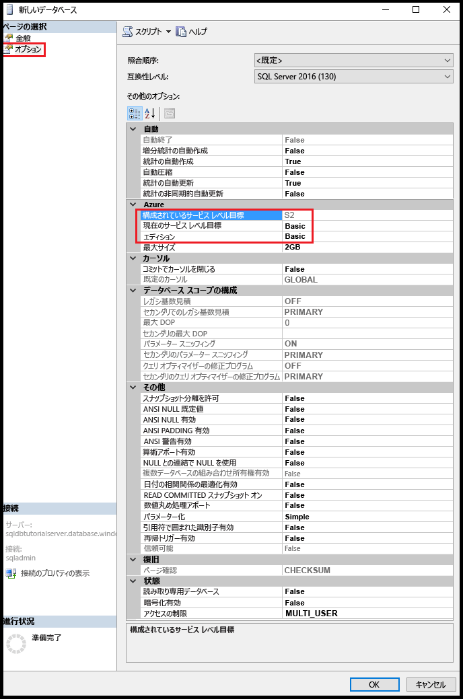

    > [!TIP]
    > このダイアログ ボックスで、Azure SQL データベース用に変更できるその他のオプションを確認してください。 このようなオプションの詳細については、[データベースの作成](https://msdn.microsoft.com/library/dn268335.aspx)に関するページを参照してください。
    >

4. **[OK]** をクリックして空のデータベースを作成します。
5. 完了したら、オブジェクト エクスプローラーの [データベース] ノードを最新の情報に更新して、新しく作成された空のデータベースを表示します。 

    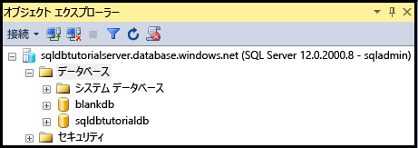

## <a name="troubleshoot-connectivity"></a>接続のトラブルシューティング

> [!IMPORTANT]
> 接続に問題がある場合は、[接続に関する問題](sql-database-troubleshoot-common-connection-issues.md)のページを参照してください。
> 

## <a name="delete-a-single-database"></a>1 つのデータベースを削除する

次の手順に従って、Azure Portal で&1; つのデータベースを削除します。

1. Azure Portal の SQL Database のブレードで、**[削除]** をクリックします。

    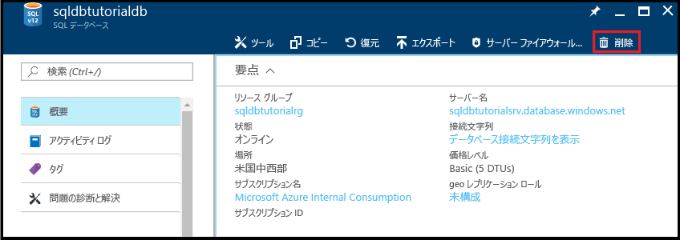
2. 確認画面で **[はい]** をクリックして、このデータベースを削除します。

    ![データベースの削除 - [はい]](./media/sql-database-get-started/delete-database-yes.png)

> [!TIP]
> データベースのリテンション期間中は、サービス主導の自動バックアップからデータベースを復元することができます。 Basic エディションのデータベースの場合、7 日以内であればデータベースを復元できます。 ただし、サーバーを削除しないでください。 サーバーを削除した場合、サーバーも、そのサーバーの削除されたデータベースすべても復旧できません。 データベースのバックアップの詳細については、「[SQL Database バックアップについての詳細情報](sql-database-automated-backups.md)」を参照してください。バックアップからデータベースを復元する方法の詳細については、[データベースの復元](sql-database-recovery-using-backups.md)に関するページを参照してください。 削除されたデータベースを復元する方法については、[Azure Portal を使用した、削除済み Azure SQL Database の復元](sql-database-restore-deleted-database-portal.md)に関するページをご覧ください。
>


## <a name="next-steps"></a>次のステップ
これで、このチュートリアルは完了です。このチュートリアルで学習した内容に基づいたチュートリアルが多数あるため、探してみてください。 

- SQL Server 認証のチュートリアルを開始するには、[SQL の認証と承認](sql-database-control-access-sql-authentication-get-started.md)に関するページを参照してください。
- Azure Active Directory 認証のチュートリアルを開始するには、[AAD の認証と承認](sql-database-control-access-aad-authentication-get-started.md)に関するページを参照してください。
* Azure Portal でサンプル データベースに対してクエリを実行する場合は、「[Public preview: Interactive query experience for SQL databases (パブリック プレビュー: SQL データベース用の対話型クエリ機能)](https://azure.microsoft.com/en-us/updates/azure-sql-database-public-preview-t-sql-editor/)」を参照してください。
* Excel に詳しい場合は、 [Excel を使用した Azure SQL データベースへの接続](sql-database-connect-excel.md)方法を参照してください。
* コーディングを開始する準備ができている場合、「 [SQL Database と SQL Server の接続ライブラリ](sql-database-libraries.md)」でプログラミング言語を選択します。
* オンプレミスの SQL Server データベースを Azure に移行する場合は、[SQL Database へのデータベースの移行](sql-database-cloud-migrate.md)に関する記事を参照してください。
* BCP コマンド ライン ツールを使用して CSV ファイルから新しいテーブルにデータを読み込む場合は、[BCP を使用した CSV ファイルから SQL Database へのデータの読み込み](sql-database-load-from-csv-with-bcp.md)に関するページを参照してください。
* テーブルやその他のオブジェクトの作成を開始する場合は、「[テーブルの作成](https://msdn.microsoft.com/library/ms365315.aspx)」の「テーブルを作成するには」を参照してください。

## <a name="additional-resources"></a>その他のリソース

- 技術の概要については、[SQL Database の概要](sql-database-technical-overview.md)に関するページをご覧ください。
- 料金情報については、[Azure SQL Database の料金](https://azure.microsoft.com/pricing/details/sql-database/)に関するページを参照してください。


<!--HONumber=Feb17_HO2-->


