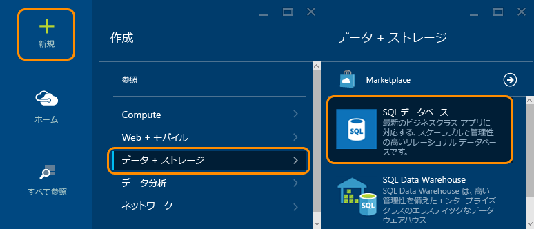
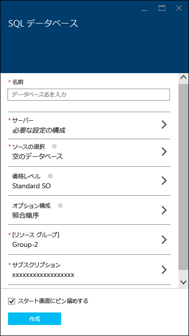
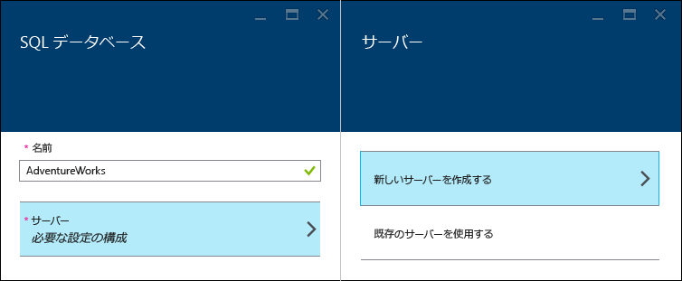
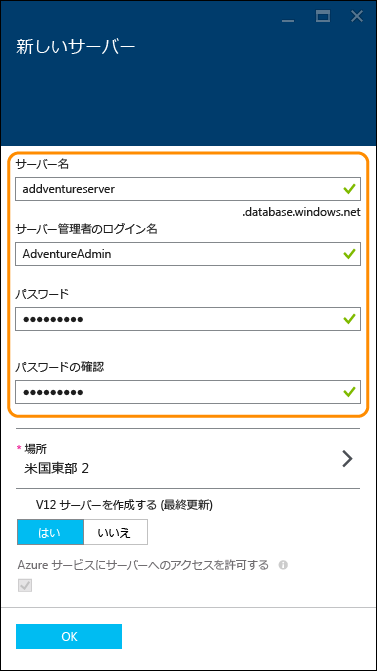
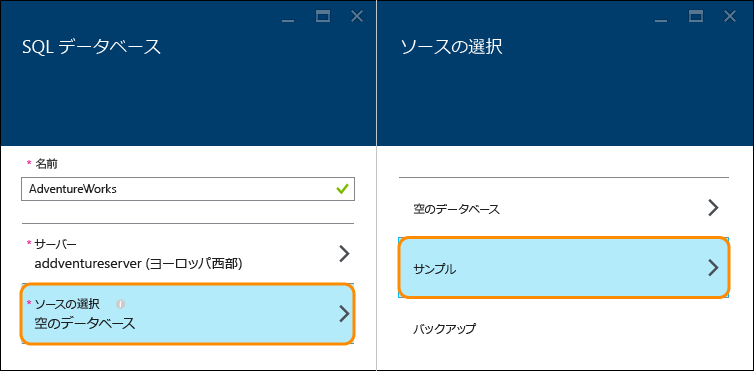
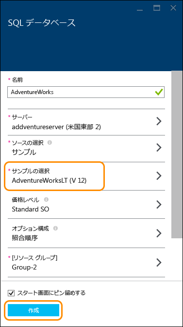
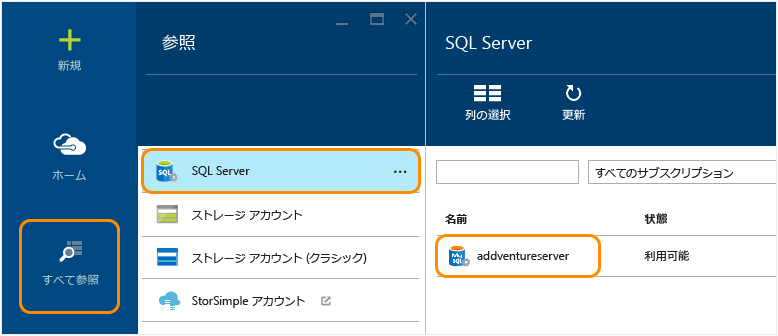
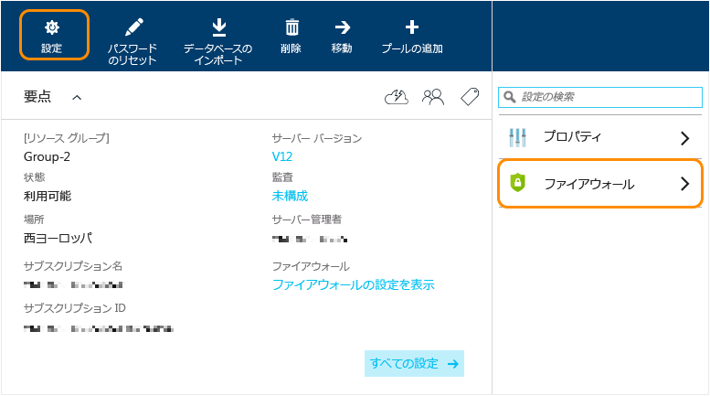
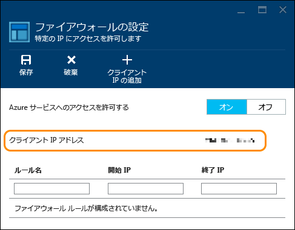
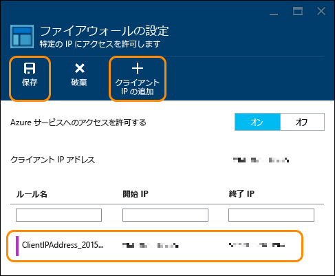

<properties
	pageTitle="SQL Database の使用 | Microsoft Azure"
	description="クラウドで提供される Microsoft のリレーショナル データベース管理サービス (RDBMS) である Azure SQL Database を利用し、Azure ポータルと AdventureWorks サンプル データベースを使って初めてのクラウド データベースを数分で作成します。"
	services="sql-database"
	documentationCenter=""
	authors="jeffgoll"
	manager="jeffreyg"
	editor=""/>

<tags
	ms.service="sql-database"
	ms.workload="data-management"
	ms.tgt_pltfrm="na"
	ms.devlang="na"
	ms.topic="hero-article"
	ms.date="10/09/2015"
	ms.author="jeffreyg"/>

# 最初の Azure SQL データベースを作成する

**1 つのデータベース**

> [AZURE.SELECTOR]
- [Azure portal](sql-database-get-started.md)
- [C#](sql-database-get-started-csharp.md)
- [PowerShell](sql-database-get-started-powershell.md)

この記事では、Azure プレビュー ポータルを使用してサンプルの SQL データベースを数分で作成する方法を示します。学習内容は次のとおりです。

- 作成するデータベースをホストするサーバーを作成し、そのサーバーのファイアウォール規則を設定する
- 操作可能なデータが格納された AdventureWorks サンプルからデータベースを作成する

開始する前に、Azure アカウントとサブスクリプションが必要です。お持ちでない場合は、[無料試用版](http://azure.microsoft.com/pricing/free-trial/)にサインアップしてください。

> [AZURE.NOTE]ここでは、マイクロソフトのリレーショナル データベース サービスである Azure SQL Database を使用して、クラウドでデータベースをセットアップする方法について説明します。別のオプションとして、Azure Virtual Machine で SQL Server を実行することもできます。これらの簡単な比較については、「[Azure SQL Database と Azure VM 内の SQL Server について](data-management-azure-sql-database-and-sql-server-iaas.md)」を参照してください。また、仮想マシンについては、「[SQL Server 仮想マシンのプロビジョニング](virtual-machines-provision-sql-server.md)」を参照してください。

## 手順 1. サインインして SQL データベースのセットアップを開始する
1. [Azure プレビュー ポータル](http://portal.azure.com/)にサインインします。
2. **[新規]**、**[データ + ストレージ]**、**[SQL データベース]** の順にクリックします。

	
	
	**[SQL Database]** 設定ブレードが表示されます。ここで、サーバーとデータベースの詳細を設定します。

	

## 手順 2. サーバーの設定を選択する
Azure の SQL データベースは、データベース サーバーに存在します。1 つのサーバーで複数のデータベースをホストできます。データベースをセットアップするときに、そのデータベースをホストするサーバーを作成してセットアップすることもできます。また、以前に作成されたサーバーを使用することもできます。ここでは、新しいサーバーをセットアップします。

1. データベースの**名前**を入力します (ここでは「**AdventureWorks**」を使用します)。他のデータベース設定については、後でもう一度説明します。
2. **[サーバー]** で **[必要な設定の構成]**、**[新しいサーバーを作成する]** の順にクリックします。

	

3. **[新しいサーバー]** ブレードで、**[サーバー名]** に、Azure 全体で一意の覚えやすい名前を入力します。この名前は、後でデータベースに接続して操作するときに必要になります。
4. **[サーバー管理者ログイン]** に覚えやすいログインを入力します (ここでは「**AdventureAdmin**」を使用します)。次に、**[パスワード]** にセキュリティで保護されたパスワードを入力し、**[パスワードの確認]** にもう一度パスワードを入力します。

	

	 最新の機能を使用するために、**[V12 サーバー (最新の更新プログラム) の作成]** は **[はい]** に設定したままにします。**[場所]** では、サーバーが作成されるデータ センターのリージョンが示されます。

	>[AZURE.TIP]データベース サーバーは、データベースを使用するアプリケーションに近い場所に作成してください。場所を変更する場合は、**[場所]** をクリックし、別の名前を選択して、**[OK]** をクリックするだけです。

5. **[OK]** をクリックして、**[SQL Database]** ブレードに戻ります。

データベースとサーバーはまだ作成されていません。これらは次の手順で作成されます。次の手順では、AdventureWorks サンプルからデータベースを作成して設定を確認します。

## 手順 3. データベースを設定して作成する
1. **[SQL Database]** ブレードで **[ソースの選択]**、**[サンプル]** の順にクリックします。 

	

2. **[SQL Database]** ブレードに戻ると、**[サンプルの選択]** に **"AdventureWorks LT [V12]"** が表示されます。**[作成]** をクリックし、サーバーとデータベースの作成を開始します。

	

	>[AZURE.NOTE]この簡易な方法では、**[価格レベル]**、**[照合順序]**、**[リソース グループ]** の設定は変更していません。データベースの価格レベルの変更およびスケールアップとスケールダウンは、いつでもダウンタイムなしで実行できます。詳細については、「[SQL Database の価格](http://azure.microsoft.com/pricing/details/sql-database/)」と [SQL Database の価格レベル](sql-database-service-tiers.md)に関するページを参照してください。データベースの照合順序は、ここで設定すると変更できません。照合順序の詳細については、「[照合順序と Unicode のサポート](https://msdn.microsoft.com/library/ms143726.aspx)」を参照してください。Azure リソース グループの詳細については、「[Azure リソース マネージャーの概要](resource-group-overview.md)」を参照してください。

Azure のスタート画面に戻ると、データベースが作成されてオンラインになるまでの進行状況がタイルに表示されます。また、**[すべて参照]**、**[SQL Database]** の順にクリックして、データベースがオンラインであることを確認することもできます。
	
ご利用ありがとうございます。 これでデータベースはクラウドで稼働されるようになりました。あともう少しで終了ですが、重要な手順が 1 つ残っています。データベースに接続できるように、データベース サーバーで規則を作成する必要があります。

## 手順 4. ファイアウォールを構成する

データベースを操作できるように、クライアント コンピューターの IP アドレスからの接続を許可するファイアウォール規則をサーバーで設定する必要があります。この規則は、接続を確立するのに役立つだけでなく、Azure の SQL サーバーに関するその他の詳細情報を入手できる領域を表示する優れた方法でもあります。

1. **[すべて参照]** をクリックし、下へスクロールして **[SQL Server]** をクリックし、**[SQL Server]** の一覧で、先ほど作成したサーバーの名前をクリックします。

	

	
3. 右側に表示されるデータベース プロパティのブレードで、**[設定]** をクリックし、一覧から **[ファイアウォール]** をクリックします。

	

	**[ファイアウォールの設定]** に、現在の**クライアント IP アドレス**が表示されます。

	

4. **[クライアント IP の追加]** をクリックすると、Azure でその IP アドレスの規則が作成されます。次に **[保存]** をクリックします。

	

	>[AZURE.IMPORTANT]クライアント IP アドレスは不定期で変更される可能性があるため、新しいファイアウォール規則を作成するまでサーバーにアクセスできなくなる場合があります。[Bing](http://www.bing.com/search?q=my%20ip%20address) を使用して IP アドレスを確認し、1 つの IP アドレスまたは特定の範囲の IP アドレスを追加できます。詳細については、[ファイアウォール設定の構成方法](sql-database-configure-firewall-settings.md)に関するページを参照してください。

## 次のステップ
これで、サンプル データを含むデータベースが作成され、お気に入りのツールを使用してデータベースを探索する準備が整いました。

- Transact-SQL と SQL Server Management Studio に慣れている場合は、[SSMS を使用した SQL データベースの接続とクエリ](sql-database-connect-query-ssms.md)の方法に関するページを参照してください。

- Excel に詳しい場合は、[Excel を使用した SQL Database への接続](sql-database-connect-excel.md)の方法に関するページを参照してください。

- コーディングを開始する準備ができたら、[C# を使用した SQL データベースへの接続とクエリ](sql-database-connect-query.md)に関するページと [.NET (c#) からの SQL Database の使用](sql-database-develop-dotnet-simple.md)に関するページを参照してください。C# に加えて Node.js、Python、Ruby、Java、PHP、C++ のサンプルと方法については、[SQL Database のクイック スタート コード サンプル](sql-database-develop-quick-start-client-code-samples.md)に関するページを参照してください。

- オンプレミスの SQL Server データベースを Azure に移動する場合の詳細については、[Azure SQL Database へのデータベースの移行](sql-database-cloud-migrate.md)に関するページを参照してください。

<!---HONumber=Oct15_HO3-->