# <a name="configure-and-restore-from-azure-sql-database-long-term-backup-retention-using-azure-recovery-services-vault"></a>Azure Recovery Services コンテナーを使用して Azure SQL Database から長期的なバックアップ保有期間を構成して復元する

Azure SQL データベースのバックアップを保存し、Azure Portal または PowerShell を使用してコンテナー内のバックアップからデータベースを復元するように Azure Recovery Services コンテナーを構成できます。

> [!NOTE]
> 2016 年 10 月の長期的なバックアップ保有期間のプレビューの初期リリースの一環として、バックアップは Azure Services Recovery Service コンテナーに保存されていました。 この更新プログラムではこの依存関係は削除されていますが、下位互換性のために元の API は 2018 年 5 月 31 日までサポートされます。 Azure Services Recovery コンテナーのバックアップと操作する必要がある場合は、[Azure Services Recovery Service コンテナーを使用した長期的なバックアップ保有期間](sql-database-long-term-backup-retention-configure-vault.md)に関するページを参照してください。 


## <a name="azure-portal"></a>Azure ポータル

次のセクションでは、Azure Portal で Azure Recovery Services コンテナーを構成する方法、コンテナー内のバックアップを確認する方法、およびそのコンテナーから復元する方法について説明します。

### <a name="configure-the-vault-register-the-server-and-select-databases"></a>コンテナーを構成する、サーバーを登録する、データベースを選択する

ご利用のサービス レベルの保有期間より長い間、[自動バックアップを保持するよう Azure Recovery Services コンテナーを構成](sql-database-long-term-retention.md)します。 

1. 指定のサーバーの **[SQL Server]** ページを開きます。

   ![[SQL Server] ページ](./media/sql-database-get-started-portal/sql-server-blade.png)

2. **[Long-term backup retention (長期的なバックアップ保有期間)]** をクリックします。

   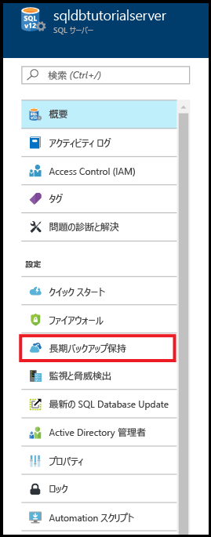

3. お使いのサーバーの **[長期的なバックアップ保有期間]** ページで、プレビューの使用条件を確認して同意します (既に同意している場合またはこの機能がプレビュー段階ではなくなった場合を除く)。

   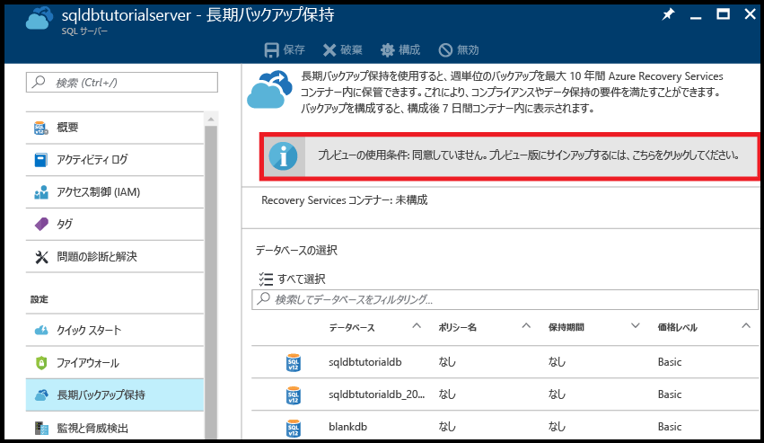

4. 長期的なバックアップ保有期間を構成するには、グリッドでそのデータベースを選択し、ツール バーの **[構成]** をクリックします。

   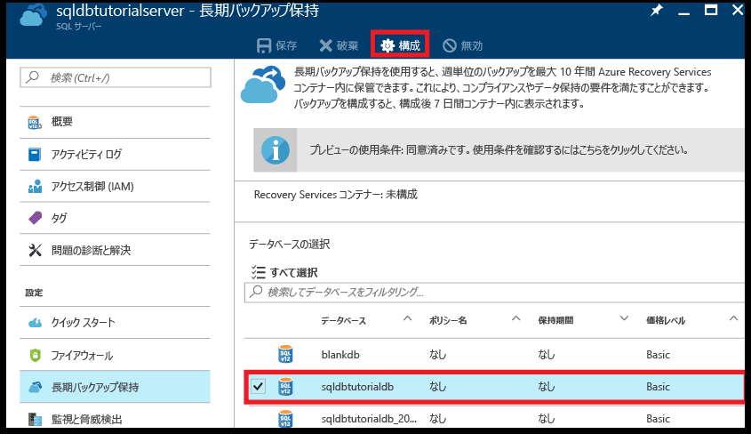

5. **[構成]** ページの **[Recovery Services コンテナー]** で **[必要な設定の構成]** をクリックします。

   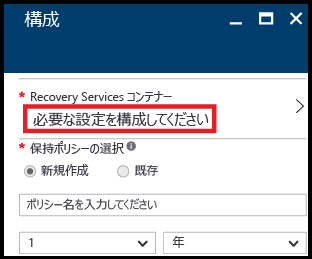

6. **[Recovery Services コンテナー]** ページで、既存のコンテナーを選択します (ある場合)。 また、サブスクリプションに Recovery Services コンテナーが見つからなかった場合は、フローをクリックして終了し、Recovery Services コンテナーを作成します。

   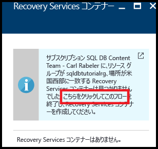

7. **[Recovery Services コンテナー]** ページの **[追加]** をクリックします。

   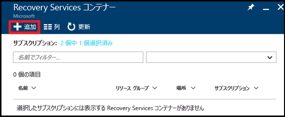
   
8. **[Recovery Services コンテナー]** ページで、新しい Recovery Services コンテナーに有効な名前を指定します。

   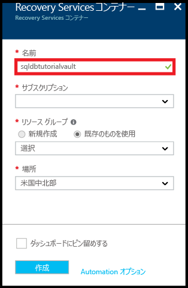

9. サブスクリプションとリソース グループを選択し、コンテナーの場所を選択します。 完了したら、**[作成]** をクリックします。

   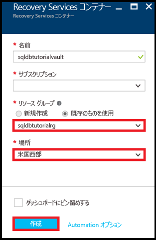

   > [!IMPORTANT]
   > コンテナーは、Azure SQL 論理サーバーと同じリージョンに配置する必要があります。また、論理サーバーと同じリソース グループを使用する必要があります。
   >

10. 新しいコンテナーが作成されたら、必要な手順を実行して **[Recovery Services コンテナー]** ページに戻ります。

11. **[Recovery Services コンテナー]** ページで、コンテナーをクリックし、**[選択]** をクリックします。

   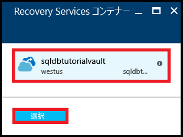

12. **[構成]** ページで、新しい保持ポリシーに有効な名前を指定し、必要に応じて既定の保持ポリシーを変更して、**[OK]** をクリックします。

   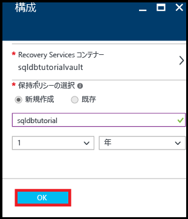
   
   >[!NOTE]
   >保持ポリシーの名前には、一部の文字 (スペースなど) を使用できません。

13. 指定のデータベースの **[長期的なバックアップ保有期間]** ページで、**[保存]** をクリックし、**[OK]** をクリックして、選択したすべてのデータベースに長期的なバックアップ保持ポリシーを適用します。

   

14. **[保存]** をクリックして、構成した Azure Recovery Services コンテナーに対して、この新しいポリシーを使用して長期的なバックアップ保有期間を有効にします。

   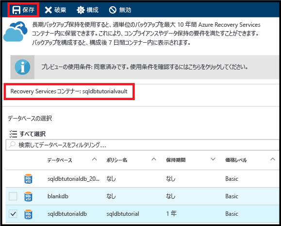

> [!IMPORTANT]
> 構成が完了すると、その後 7 日以内に、コンテナーにバックアップが表示されます。 バックアップがコンテナーに表示されるまで、このチュートリアルを先に進めないでください。
>

### <a name="view-backups-in-long-term-retention-using-azure-portal"></a>Azure Portal で長期的な保有期間内のバックアップを確認する

[長期的なバックアップ保有期間](sql-database-long-term-retention.md)内のデータベース バックアップに関する情報を確認します。 

1. Azure Portal で、指定のデータベース バックアップの Azure Recovery Services コンテナーを開き (**[すべてのリソース]** に移動し、サブスクリプションのリソースの一覧から選びます)、コンテナー内のデータベース バックアップで使用されているストレージの容量を確認します。

   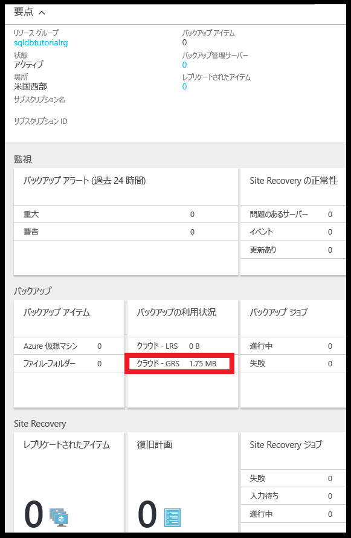

2. 指定のデータベースの **[SQL database]** ページを開きます。

   

3. ツール バーの **[復元]** をクリックします。

   ![ツール バーの [復元]](./media/sql-database-get-started-backup-recovery/restore-toolbar.png)

4. [復元] ページの **[長期]** をクリックします。

5. [Azure vault backups (Azure コンテナーのバックアップ)] の **[バックアップの選択]** をクリックして、長期的なバックアップ保有期間内の使用可能なデータベース バックアップを表示します。

   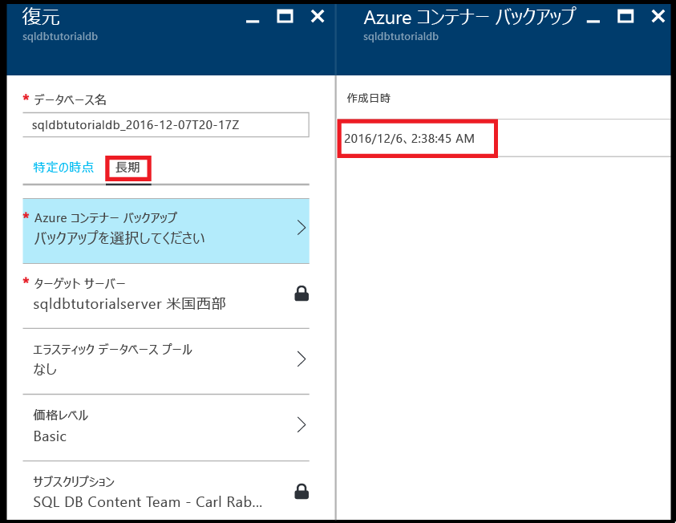

### <a name="restore-a-database-from-a-backup-in-long-term-backup-retention-using-the-azure-portal"></a>Azure Portal で長期的なバックアップ保有期間内のバックアップからデータベースを復元する

データベースを Azure Recovery Services コンテナーにあるバックアップから新しいデータベースに復元します。

1. **[Azure 資格情報コンテナーのバックアップ]** ページで、復元するバックアップをクリックし、**[選択]** をクリックします。

   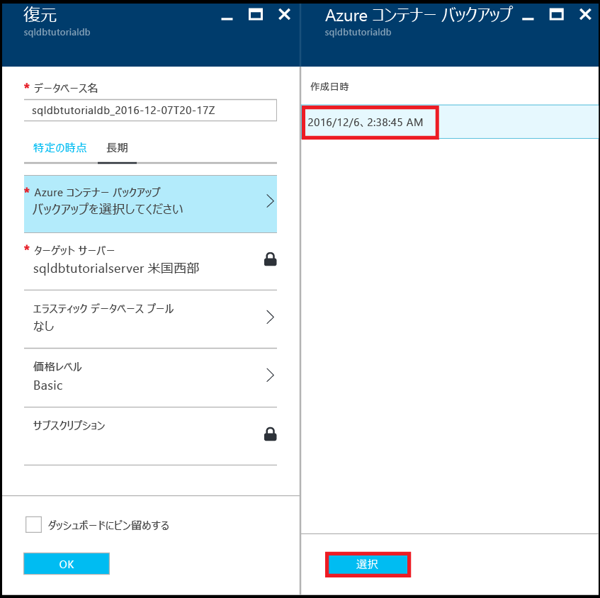

2. **[データベース名]** ボックスに、復元されるデータベースの名前を指定します。

   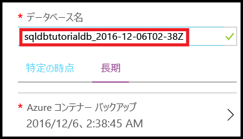

3. **[OK]** をクリックして、コンテナー内にあるバックアップから新しいデータベースにデータベースを復元します。

4. ツール バーの通知アイコンをクリックして、復元ジョブの状態を確認します。

   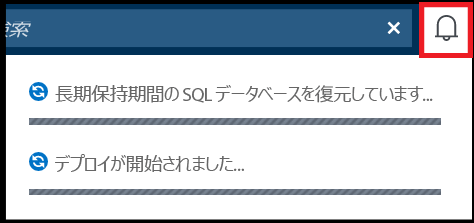

5. 復元ジョブが完了したら、**[SQL データベース]** ページを開き、新しく復元されたデータベースを確認します。

   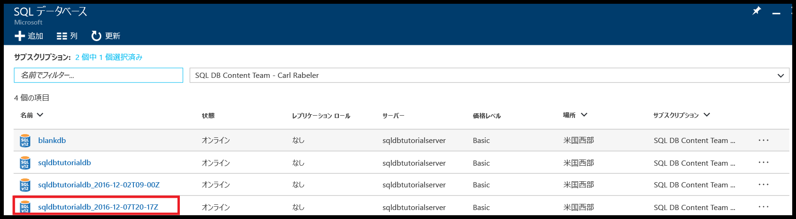

> [!NOTE]
> ここから、SQL Server Management Studio を使用して、復元されたデータベースに接続し、必要なタスクを実行できます。たとえば、[復元されたデータベースからデータを少し抽出して既存のデータベースにコピーしたり、既存のデータベースを削除し、復元されたデータベースの名前を既存のデータベース名に変更したり](sql-database-recovery-using-backups.md#point-in-time-restore)できます。
>

## <a name="powershell"></a>PowerShell

次のセクションでは、PowerShell で Azure Recovery Services コンテナーを構成する方法、コンテナー内のバックアップを確認する方法、およびそのコンテナーから復元する方法について説明します。

### <a name="create-a-recovery-services-vault"></a>Recovery Services コンテナーの作成

[New-AzureRmRecoveryServicesVault](/powershell/module/azurerm.recoveryservices/new-azurermrecoveryservicesvault) を使用して Recovery Services コンテナーを作成します。

> [!IMPORTANT]
> コンテナーは、Azure SQL 論理サーバーと同じリージョンに配置する必要があります。また、論理サーバーと同じリソース グループを使用する必要があります。

```PowerShell
# Create a recovery services vault

#$resourceGroupName = "{resource-group-name}"
#$serverName = "{server-name}"
$serverLocation = (Get-AzureRmSqlServer -ServerName $serverName -ResourceGroupName $resourceGroupName).Location
$recoveryServiceVaultName = "{new-vault-name}"

$vault = New-AzureRmRecoveryServicesVault -Name $recoveryServiceVaultName -ResourceGroupName $ResourceGroupName -Location $serverLocation 
Set-AzureRmRecoveryServicesBackupProperties -BackupStorageRedundancy LocallyRedundant -Vault $vault
```

### <a name="set-your-server-to-use-the-recovery-vault-for-its-long-term-retention-backups"></a>長期保存のバックアップ向けに作成した Recovery コンテナーを使用するようサーバーを設定する

[Set-AzureRmSqlServerBackupLongTermRetentionVault](/powershell/module/azurerm.sql/set-azurermsqlserverbackuplongtermretentionvault) コマンドレットを使用して、以前に作成された Recovery Services コンテナーを特定の Azure SQL サーバーに関連付けます。

```PowerShell
# Set your server to use the vault to for long-term backup retention 

Set-AzureRmSqlServerBackupLongTermRetentionVault -ResourceGroupName $resourceGroupName -ServerName $serverName -ResourceId $vault.Id
```

### <a name="create-a-retention-policy"></a>保持ポリシーを作成する

保持ポリシーで、データベースのバックアップの保存期間を設定できます。 [Get-AzureRmRecoveryServicesBackupRetentionPolicyObject](https://docs.microsoft.com/powershell/resourcemanager/azurerm.recoveryservices.backup/v2.3.0/get-azurermrecoveryservicesbackupretentionpolicyobject) コマンドレットを使用して、新しいポリシーを作成するためのテンプレートとして使用する既定の保持ポリシーを取得します。 このテンプレートでは、保有期間は 2 年間に設定されています。 次に、[New-AzureRmRecoveryServicesBackupProtectionPolicy](/powershell/module/azurerm.recoveryservices.backup/new-azurermrecoveryservicesbackupprotectionpolicy) を実行して最終的にポリシーを作成します。 

> [!NOTE]
> 一部のコマンドレットは実行する前にコンテナーのコンテキストを設定する必要があるため ([Set-AzureRmRecoveryServicesVaultContext](/powershell/module/azurerm.recoveryservices/set-azurermrecoveryservicesvaultcontext))、このコマンドレットは関連するいくつかのスニペットに見られます。 ポリシーはコンテナーに含まれるため、コンテキストを設定します。 コンテナーごとに複数の保持ポリシーを作成した後に、目的のポリシーを特定のデータベースに適用することができます。 


```PowerShell
# Retrieve the default retention policy for the AzureSQLDatabase workload type
$retentionPolicy = Get-AzureRmRecoveryServicesBackupRetentionPolicyObject -WorkloadType AzureSQLDatabase

# Set the retention value to two years (you can set to any time between 1 week and 10 years)
$retentionPolicy.RetentionDurationType = "Years"
$retentionPolicy.RetentionCount = 2
$retentionPolicyName = "my2YearRetentionPolicy"

# Set the vault context to the vault you are creating the policy for
Set-AzureRmRecoveryServicesVaultContext -Vault $vault

# Create the new policy
$policy = New-AzureRmRecoveryServicesBackupProtectionPolicy -name $retentionPolicyName -WorkloadType AzureSQLDatabase -retentionPolicy $retentionPolicy
$policy
```

### <a name="configure-a-database-to-use-the-previously-defined-retention-policy"></a>以前に定義した保持ポリシーを使用するデータベースを構成する

[Set-AzureRmSqlDatabaseBackupLongTermRetentionPolicy](/powershell/module/azurerm.sql/set-azurermsqldatabasebackuplongtermretentionpolicy) コマンドレットを使用して、新しいポリシーを特定のデータベースに適用します。

```PowerShell
# Enable long-term retention for a specific SQL database
$policyState = "enabled"
Set-AzureRmSqlDatabaseBackupLongTermRetentionPolicy -ResourceGroupName $resourceGroupName -ServerName $serverName -DatabaseName $databaseName -State $policyState -ResourceId $policy.Id
```

### <a name="view-backup-info-and-backups-in-long-term-retention"></a>バックアップ情報と、長期的な保有期間内のバックアップを確認する

[長期的なバックアップ保有期間](sql-database-long-term-retention.md)内のデータベース バックアップに関する情報を確認します。 

次のコマンドレットを使用してバックアップに関する情報を確認します。

- [Get-AzureRmRecoveryServicesBackupContainer](/powershell/module/azurerm.recoveryservices.backup/get-azurermrecoveryservicesbackupcontainer)
- [Get-AzureRmRecoveryServicesBackupItem](/powershell/module/azurerm.recoveryservices.backup/get-azurermrecoveryservicesbackupitem)
- [Get-AzureRmRecoveryServicesBackupRecoveryPoint](/powershell/module/azurerm.recoveryservices.backup/get-azurermrecoveryservicesbackuprecoverypoint)

```PowerShell
#$resourceGroupName = "{resource-group-name}"
#$serverName = "{server-name}"
$databaseNeedingRestore = $databaseName

# Set the vault context to the vault we want to restore from
#$vault = Get-AzureRmRecoveryServicesVault -ResourceGroupName $resourceGroupName
Set-AzureRmRecoveryServicesVaultContext -Vault $vault

# the following commands find the container associated with the server 'myserver' under resource group 'myresourcegroup'
$container = Get-AzureRmRecoveryServicesBackupContainer -ContainerType AzureSQL -FriendlyName $vault.Name

# Get the long-term retention metadata associated with a specific database
$item = Get-AzureRmRecoveryServicesBackupItem -Container $container -WorkloadType AzureSQLDatabase -Name $databaseNeedingRestore

# Get all available backups for the previously indicated database
# Optionally, set the -StartDate and -EndDate parameters to return backups within a specific time period
$availableBackups = Get-AzureRmRecoveryServicesBackupRecoveryPoint -Item $item
$availableBackups
```

### <a name="restore-a-database-from-a-backup-in-long-term-backup-retention"></a>長期的なバックアップ保有期間内のバックアップからデータベースを復元する

長期的なバックアップ保有期間から復元するには、[Restore-AzureRmSqlDatabase](/powershell/module/azurerm.sql/restore-azurermsqldatabase) コマンドレットを使用します。

```PowerShell
# Restore the most recent backup: $availableBackups[0]
#$resourceGroupName = "{resource-group-name}"
#$serverName = "{server-name}"
$restoredDatabaseName = "{new-database-name}"
$edition = "Basic"
$performanceLevel = "Basic"

$restoredDb = Restore-AzureRmSqlDatabase -FromLongTermRetentionBackup -ResourceId $availableBackups[0].Id -ResourceGroupName $resourceGroupName `
 -ServerName $serverName -TargetDatabaseName $restoredDatabaseName -Edition $edition -ServiceObjectiveName $performanceLevel
$restoredDb
```


> [!NOTE]
> ここから、SQL Server Management Studio を使用して、復元されたデータベースに接続し、必要なタスクを実行できます。たとえば、復元されたデータベースからデータを少し抽出して既存のデータベースにコピーしたり、既存のデータベースを削除し、復元されたデータベースの名前を既存のデータベース名に変更したりできます。 [ポイントインタイム リストア](sql-database-recovery-using-backups.md#point-in-time-restore)をご覧ください。

## <a name="how-to-cleanup-backups-in-recovery-services-vault"></a>Recovery Services コンテナー内のバックアップをクリーンアップする方法

2018 年 7 月 1 日付けで LTR V1 API は非推奨となり、Recovery Service コンテナー内のすべての既存のバックアップは、SQL Database によって管理される LTR ストレージ コンテナーに移行されました。 元のバックアップに対して課金されないようにするために、バックアップは移行後にコンテナーから削除されています。 ただし、コンテナーがロックされていた場合、バックアップはコンテナー内に保存されたままになります。 不必要な課金を避けるには、次のスクリプトを使用して Recovery Service コンテナーから古いバックアップを手動で削除できます。 

```PowerShell
<#
.EXAMPLE
    .\Drop-LtrV1Backup.ps1 -SubscriptionId “{vault_sub_id}” -ResourceGroup “{vault_resource_group}” -VaultName “{vault_name}” 
#>
[CmdletBinding()]
Param (
    [Parameter(Mandatory = $true, HelpMessage="The vault subscription ID")]
    $SubscriptionId,

    [Parameter(Mandatory = $true, HelpMessage="The vault resource group name")]
    $ResourceGroup,

    [Parameter(Mandatory = $true, HelpMessage="The vault name")]
    $VaultName
)

Login-AzureRmAccount

Select-AzureRmSubscription -SubscriptionId $SubscriptionId

$vaults = Get-AzureRmRecoveryServicesVault
$vault = $vaults | where { $_.Name -eq $VaultName }

Set-AzureRmRecoveryServicesVaultContext -Vault $vault

$containers = Get-AzureRmRecoveryServicesBackupContainer -ContainerType AzureSQL

ForEach ($container in $containers)
{
   $canDeleteContainer = $true  
   $ItemCount = 0
   Write-Host "Working on container" $container.Name
   $items = Get-AzureRmRecoveryServicesBackupItem -container $container -WorkloadType AzureSQLDatabase
   ForEach ($item in $items)
   {
          write-host "Deleting item" $item.name
          Disable-AzureRmRecoveryServicesBackupProtection -RemoveRecoveryPoints -item $item -Force
   }

   Write-Host "Deleting container" $container.Name
   Unregister-AzureRmRecoveryServicesBackupContainer -Container $container
}
```

## <a name="next-steps"></a>次の手順

- サービスによって生成された自動バックアップについては、[自動バックアップ](sql-database-automated-backups.md)に関する記事を参照してください。
- バックアップの長期保存については、[バックアップの長期保存](sql-database-long-term-retention.md)に関する記事を参照してください。
- バックアップからの復元については、[バックアップからの復元](sql-database-recovery-using-backups.md)に関する記事を参照してください。
