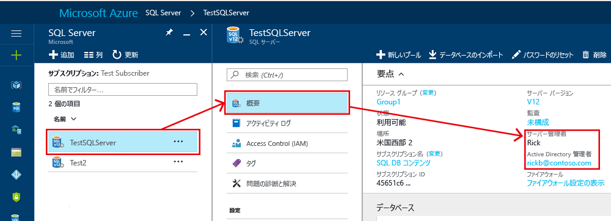
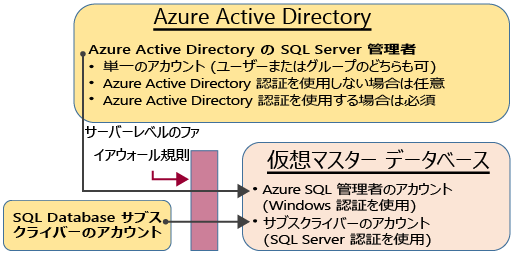
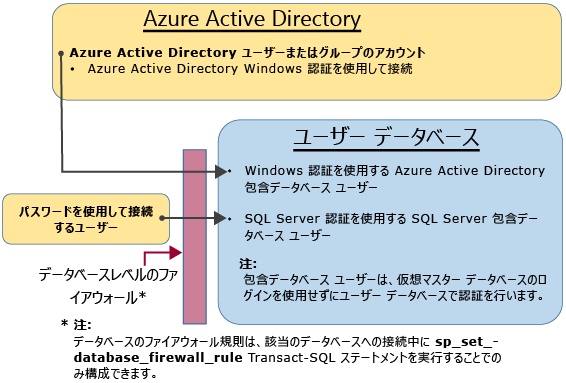

# <a name="controlling-and-granting-database-access-to-sql-database-and-sql-data-warehouse"></a>SQL Database と SQL Data Warehouse へのデータベース アクセスの制御と許可

ファイアウォール規則の構成後、管理者アカウント、データベース所有者、またはデータベースのデータベース ユーザーとして、Azure [SQL Database](sql-database-technical-overview.md) と [SQL Data Warehouse](../sql-data-warehouse/sql-data-warehouse-overview-what-is.md) に接続できます。  

> [!NOTE]  
> このトピックは、Azure SQL サーバーと、その Azure SQL サーバー上に作成される SQL Database と SQL Data Warehouse に適用されます。 わかりやすいように、SQL Database という言葉で SQL Database と SQL Data Warehouse の両方を言い表します。 
> [!TIP]
> チュートリアルについては、「[Azure SQL データベースのセキュリティ保護](sql-database-security-tutorial.md)」を参照してください。 このチュートリアルは、**Azure SQL Database Managed Instance** には適用されません。

## <a name="unrestricted-administrative-accounts"></a>制限なしの管理者アカウント

管理者の機能を果たす 2 つの管理者アカウント (**サーバー管理者**と **Active Directory 管理者**) があります。 お使いの SQL サーバーに対するこれらの管理者アカウントを確認するには、Azure portal を開き、お使いの SQL サーバーまたは SQL データベースの [プロパティ] タブに移動します。



- **サーバー管理者**

  Azure SQL サーバーを作成する際に、**サーバー管理者ログイン**を指定する必要があります。 このアカウントは SQL サーバーによって master データベースへのログインとして作成されます。 このアカウントは、SQL Server 認証 (ユーザー名とパスワード) を使用して接続します。 これらのアカウントのうち、存在できるのは 1 つだけです。

  > [!NOTE]
  > サーバー管理者のパスワードをリセットするには、[Azure portal](https://portal.azure.com) にアクセスし、 **[SQL Server]** をクリックし、一覧からサーバーを選択して、 **[パスワードのリセット]** をクリックします。

- **Azure Active Directory の管理者**

  1 つの Azure Active Directory アカウント (個人またはセキュリティ グループ アカウント) も、管理者として構成できます。 Azure AD 管理者の構成は任意ですが、SQL Database への接続に Azure AD アカウントを使用する場合は、Azure AD 管理者を構成する**必要があります**。 Azure Active Directory アクセスの構成の詳細については、「[Azure Active Directory 認証を使用して SQL Database または SQL Data Warehouse に接続する](sql-database-aad-authentication.md)」と「[SSMS support for Azure AD MFA with SQL Database and SQL Data Warehouse](sql-database-ssms-mfa-authentication.md)」 (SQL Database と SQL Data Warehouse での Azure AD MFA のための SSMS のサポート) をご覧ください。

**サーバー管理者**アカウントと **Azure AD 管理者**アカウントには次の特性があります。

- サーバー上の任意の SQL Database に自動的に接続できる唯一のアカウントです (それ以外のアカウントでユーザー データベースに接続するには、そのデータベースの所有者であるか、そのユーザー データベースのユーザー アカウントを持っている必要があります)。
- これらのアカウントは、`dbo` ユーザーとしてユーザー データベースにアクセスし、ユーザー データベースに対するすべてのアクセス許可を持ちます (ユーザー データベースの所有者も、`dbo` ユーザーとしてデータベースにアクセスします)。 
- `master` データベースを `dbo` ユーザーとして入力しないでください。master にはアクセス許可の制限があります。 
- 標準 SQL Server `sysadmin` 固定サーバー ロールのメンバーでは**ありません**。このロールは SQL Database では使用できません。  
- データベース、ログイン、master のユーザー、およびサーバー レベルの IP ファイアウォール規則を作成、変更、削除できます。
- `dbmanager` ロールと `loginmanager` ロールに対して、メンバーの追加と削除を実行できます。
- `sys.sql_logins` システム テーブルを表示できます。

### <a name="configuring-the-firewall"></a>ファイアウォールの構成

個々の IP アドレスまたは範囲に対してサーバーレベルのファイアウォールを構成すると、**SQL サーバー管理者**と **Azure Active Directory 管理者**は、master データベースとすべてのユーザー データベースに接続できます。 初期状態のサーバー レベルのファイアウォールは、[PowerShell](sql-database-powershell-samples.md) または [REST API](https://msdn.microsoft.com/library/azure/dn505712.aspx) を使用して、[Azure Portal](sql-database-single-database-get-started.md) で構成できます。 接続が確立されると、[Transact-SQL](sql-database-configure-firewall-settings.md) を使用して、サーバー レベルの IP ファイアウォール規則を追加で構成することもできます。

### <a name="administrator-access-path"></a>Administrator access path

サーバーレベルのファイアウォールが正しく構成されている場合、**SQL サーバー管理者**と **Azure Active Directory 管理者**は、SQL Server Management Studio や SQL Server Data Tools などのクライアント ツールを使用して接続できます。 すべての機能を提供しているのは、最新のツールだけです。 次の図は、2 つの管理者アカウントの標準的な構成を示しています。



サーバー レベルのファイアウォールで開かれているポートを使用する場合、管理者はどの SQL データベースにも接続できます。

### <a name="connecting-to-a-database-by-using-sql-server-management-studio"></a>SQL Server Management Studio を使用したデータベースへの接続

サーバー、データベース、サーバー レベルの IP ファイアウォール規則の作成や、SQL Server Management Studio を使用したデータベースの照会に関するチュートリアルについては、「[Azure portal と SQL Server Management Studio を使用して Azure SQL Database のサーバー、データベース、ファイアウォール規則を使ってみる](sql-database-single-database-get-started.md)」をご覧ください。

> [!IMPORTANT]
> 常に最新バージョンの Management Studio を使用して、Microsoft Azure と SQL Database の更新プログラムとの同期を維持することをお勧めします。 [SQL Server Management Studio を更新します](https://msdn.microsoft.com/library/mt238290.aspx)。

## <a name="additional-server-level-administrative-roles"></a>追加のサーバー レベルの管理者ロール

>[!IMPORTANT]
>これらのロールは **Azure SQL Database** に固有のものなので、このセクションは **Azure SQL Database Managed Instance** には適用されません。

前に説明したサーバーレベルの管理者ロールのほかに、SQL Database には master データベースに 2 つの制限付き管理者ロールが用意されています。それにユーザー アカウントを追加して、データベースの作成またはログインの管理のためのアクセス許可を付与することができます。

### <a name="database-creators"></a>データベース作成者

これらの管理者ロールの 1 つは、**dbmanager** ロールです。 このロールのメンバーは、新しいデータベースを作成できます。 このロールを使用するには、`master` データベースにユーザーを作成し、そのユーザーを **dbmanager** データベース ロールに追加します。 データベースを作成するユーザーは、`master` データベースの SQL Server ログインに基づくユーザーであるか、Azure Active Directory ユーザーに基づく包含データベース ユーザーである必要があります。

1. 管理者アカウントを使用して、`master` データベースに接続します。
2. [CREATE LOGIN](https://msdn.microsoft.com/library/ms189751.aspx) ステートメントを使用して、SQL Server 認証ログインを作成します。 サンプル ステートメントは、次のとおりです。

   ```sql
   CREATE LOGIN Mary WITH PASSWORD = '<strong_password>';
   ```

   > [!NOTE]
   > ログイン ユーザーまたは包含データベース ユーザーを作成するときは、強力なパスワードを使用します。 詳細については、「 [強力なパスワード](https://msdn.microsoft.com/library/ms161962.aspx)」を参照してください。

   パフォーマンスを向上させるため、ログイン (サーバー レベルのプリンシパル) はデータベース レベルで一時的にキャッシュされます。 認証キャッシュを更新する方法については、「 [DBCC FLUSHAUTHCACHE](https://msdn.microsoft.com/library/mt627793.aspx)」をご覧ください。

3. `master` データベースで、[CREATE USER](https://msdn.microsoft.com/library/ms173463.aspx) ステートメントを使用してユーザーを作成します。 このユーザーは、Azure Active Directory 認証の包含データベース ユーザー (Azure AD 認証用の環境を構成した場合)、SQL Server 認証の包含データベース ユーザー、または SQL Server 認証ログインに基づく SQL Server 認証ユーザー (前の手順で作成したもの) にすることができます。サンプル ステートメントは、次のとおりです。

   ```sql
   CREATE USER [mike@contoso.com] FROM EXTERNAL PROVIDER; -- To create a user with Azure Active Directory
   CREATE USER Ann WITH PASSWORD = '<strong_password>'; -- To create a SQL Database contained database user
   CREATE USER Mary FROM LOGIN Mary;  -- To create a SQL Server user based on a SQL Server authentication login
   ```

4. [ALTER ROLE](https://msdn.microsoft.com/library/ms189775.aspx) ステートメントを使用して、新しいユーザーを `master` の **dbmanager** データベース ロールに追加します。 サンプル ステートメントは、次のとおりです。

   ```sql
   ALTER ROLE dbmanager ADD MEMBER Mary; 
   ALTER ROLE dbmanager ADD MEMBER [mike@contoso.com];
   ```

   > [!NOTE]
   > dbmanager は master データベースのデータベース ロールであるため、dbmanager ロールにはデータベース ユーザーのみを追加できます。 データベース レベルのロールにサーバー レベルのログインを追加することはできません。

5. 必要に応じて、新しいユーザーに接続を許可するようにファイアウォール規則を構成します (新しいユーザーは、既存のファイアウォール規則でカバーされる可能性があります)。

これで、ユーザーは `master` データベースに接続し、新しいデータベースを作成できるようになりました。 データベースを作成したアカウントは、そのデータベースの所有者になります。

### <a name="login-managers"></a>ログイン マネージャー

もう 1 つの管理者ロールは、ログイン マネージャー ロールです。 このロールのメンバーは、master データベースに新しいログインを作成することができます。 必要であれば、同じ手順を実行して (ログインとユーザーを作成し、ユーザーを **loginmanager** ロールに追加して)、ユーザーが master に新しいログインを作成できるようにすることができます。 通常、ログインは必要ありません。Microsoft は、ログインに基づくユーザーを使用する代わりに、データベース レベルで認証される包含データベース ユーザーを使用することを推奨しているからです。 詳細については、「 [包含データベース ユーザー - データベースの可搬性を確保する](https://msdn.microsoft.com/library/ff929188.aspx)」を参照してください。

## <a name="non-administrator-users"></a>管理者以外のユーザー

一般に、管理者以外のアカウントは、master データベースへのアクセスを必要としません。 [CREATE USER (Transact-SQL)](https://msdn.microsoft.com/library/ms173463.aspx) ステートメントを使用して、データベース レベルの包含データベース ユーザーを作成してください。 このユーザーは、Azure Active Directory 認証の包含データベース ユーザー (Azure AD 認証用の環境を構成した場合)、SQL Server 認証の包含データベース ユーザー、または SQL Server 認証ログインに基づく SQL Server 認証ユーザー (前の手順で作成したもの) にすることができます。詳細については、「 [包含データベース ユーザー - データベースの可搬性を確保する](https://msdn.microsoft.com/library/ff929188.aspx)」を参照してください。 

ユーザーを作成するには、データベースに接続し、次の例のようなステートメントを実行します。

```sql
CREATE USER Mary FROM LOGIN Mary; 
CREATE USER [mike@contoso.com] FROM EXTERNAL PROVIDER;
```

最初、ユーザーを作成できるのは、データベースの管理者の 1 人か所有者だけです。 新しいユーザーの作成を他のユーザーに許可するには、次のようなステートメントを使用して、選択したユーザーに `ALTER ANY USER` アクセス許可を付与します。

```sql
GRANT ALTER ANY USER TO Mary;
```

データベースのフル コントロールを他のユーザーに与えるには、そのユーザーを **db_owner** 固定データベース ロールのメンバーにします。

Azure SQL Database で `ALTER ROLE` ステートメントを使用します。

```sql
ALTER ROLE db_owner ADD MEMBER Mary;
```

Azure SQL Data Warehouse で [EXEC sp_addrolemember](/sql/relational-databases/system-stored-procedures/sp-addrolemember-transact-sql) を使用します。
```sql
EXEC sp_addrolemember 'db_owner', 'Mary';
```


> [!NOTE]
> SQL Database サーバー ログインに基づくデータベース ユーザーを作成する 1 つの一般的な理由は、複数のデータベースへのアクセスを必要とするユーザーのためです。 包含データベース ユーザーは個別のエンティティであるため、各データベースは、それぞれが独自のユーザーとパスワードを保持します。 ユーザーは各データベースのパスワードをすべて記憶する必要があるため、オーバーヘッドが発生する可能性があり、多数のデータベースのパスワードを変更する必要が生じたときに対応できない可能性があります。 ただし、SQL Server ログインと高可用性 (アクティブ geo レプリケーションとフェールオーバー グループ) を使用するときは、各サーバーで SQL Server ログインを手動で設定する必要があります。 そうしないと、フェールオーバーの発生後にデータベース ユーザーはサーバー ログインにマップされなくなり、フェールオーバー後のデータベースにアクセスできなくなります。 Geo レプリケーション用のログインの構成の詳細については、「[Azure SQL Database のセキュリティを geo リストアやフェールオーバー用に構成し、管理する](sql-database-geo-replication-security-config.md)」を参照してください。

### <a name="configuring-the-database-level-firewall"></a>データベース レベルのファイアウォールの構成

ベスト プラクティスとして、管理者以外のユーザーは、使用するデータベースにファイアウォール経由でのみアクセスできるようにすることをお勧めします。 サーバー レベルのファイアウォール経由で IP アドレスを承認し、すべてのデータベースへのアクセスを許可するのではなく、[sp_set_database_firewall_rule](https://msdn.microsoft.com/library/dn270010.aspx) ステートメントを使用して、データベース レベルのファイアウォールを構成してください。 データベース レベルのファイアウォールは、ポータルを使用して構成することはできません。

### <a name="non-administrator-access-path"></a>Non-administrator access path

データベース レベルのファイアウォールが正しく構成されると、データベース ユーザーは SQL Server Management Studio や SQL Server Data Tools などのクライアント ツールを使用して接続できます。 すべての機能を提供しているのは、最新のツールだけです。 次の図は、管理者以外の標準的なアクセス パスを示しています。



## <a name="groups-and-roles"></a>グループとロール

効率的なアクセス管理では、個々のユーザーではなく、グループとロールに割り当てられたアクセス許可を使用します。 

- Azure Active Directory 認証を使用する場合は、Azure Active Directory ユーザーを Azure Active Directory グループに入れます。 そのグループ用に包含データベース ユーザーを作成します。 1 人または複数のデータベース ユーザーを[データベース ロール](https://msdn.microsoft.com/library/ms189121)に追加し、データベース ロールに[アクセス許可](https://msdn.microsoft.com/library/ms191291.aspx)を割り当てます。

- SQL Server 認証を使用する場合は、データベースに包含データベース ユーザーを作成します。 1 人または複数のデータベース ユーザーを[データベース ロール](https://msdn.microsoft.com/library/ms189121)に追加し、データベース ロールに[アクセス許可](https://msdn.microsoft.com/library/ms191291.aspx)を割り当てます。

データベース ロールは、**db_owner**、**db_ddladmin**、**db_datawriter**、**db_datareader**、**db_denydatawriter**、**db_denydatareader** などの組み込みロールを指定できます。 **db_owner** は、少数のユーザーのみに完全なアクセス許可を付与する際によく使用されます。 他の固定データベース ロールは、開発段階の単純なデータベースをすばやく取得するには便利ですが、運用段階のほとんどのデータベースには推奨されません。 たとえば、**db_datareader** 固定データベース ロールは、データベース内のすべてのテーブルへの読み取りアクセスを許可しますが、これは、通常、必要以上のことです。 [CREATE ROLE](https://msdn.microsoft.com/library/ms187936.aspx) ステートメントを使用して独自のユーザー定義データベース ロールを作成し、各ロールに対してビジネスのニーズに応じて必要な最小限のアクセス許可を慎重に付与することをお勧めします。 ユーザーが複数のロールのメンバーである場合は、それらのアクセス許可すべてが集約されます。

## <a name="permissions"></a>アクセス許可

SQL Database では、個別に許可または拒否できるアクセス許可が 100 個を超えています。 これらのアクセス許可の多くは、入れ子になっています。 たとえば、スキーマに対する `UPDATE` アクセス許可には、そのスキーマ内の各テーブルに対する `UPDATE` アクセス許可が含まれています。 ほとんどのアクセス許可システムと同様に、アクセス許可の拒否は許可をオーバーライドします。 入れ子になっている性質と、アクセス許可の数により、データベースを正しく保護するのに適切なアクセス許可システムを設計するには、慎重な調査を行う場合があります。 まず「[権限 (データベース エンジン)](https://docs.microsoft.com/sql/relational-databases/security/permissions-database-engine)」でアクセス許可の一覧を確認してから、アクセス許可の[ポスター サイズの図](https://docs.microsoft.com/sql/relational-databases/security/media/database-engine-permissions.png)も確認してください。


### <a name="considerations-and-restrictions"></a>考慮事項と制限

SQL Database のログインとユーザーの管理では、以下の点を考慮してください。

- `CREATE/ALTER/DROP DATABASE` ステートメントを実行する場合は、**master** データベースに接続する必要があります。   
- **サーバー管理者**ログインに対応するデータベース ユーザーは、変更または削除できません。 
- **サーバー管理者**ログインの既定の言語は英語 (米国) です。
- 管理者 (**サーバー管理者**ログインまたは Azure AD 管理者) と、**master** データベースの **dbmanager** データベース ロールのメンバーにのみ、`CREATE DATABASE` および `DROP DATABASE` ステートメントを実行するアクセス許可があります。
- `CREATE/ALTER/DROP LOGIN` ステートメントを実行する場合は、master データベースに接続する必要があります。 ただし、ログインの使用はお勧めできません。 代わりに、包含データベース ユーザーを使用してください。
- ユーザー データベースに接続するには、接続文字列にそのデータベースの名前を指定する必要があります。
- サーバーレベル プリンシパル ログインと、**master** データベースの **loginmanager** データベース ロールのメンバーにのみ、`CREATE LOGIN`、`ALTER LOGIN`、`DROP LOGIN` ステートメントを実行する権限があります。
- ADO.NET アプリケーションで `CREATE/ALTER/DROP LOGIN` と `CREATE/ALTER/DROP DATABASE` ステートメントを実行する場合、パラメーター化コマンドは使用できません。 詳細については、「 [コマンドとパラメーター](https://msdn.microsoft.com/library/ms254953.aspx)」をご覧ください。
- `CREATE/ALTER/DROP DATABASE` と `CREATE/ALTER/DROP LOGIN` ステートメントを実行する場合、これらの各ステートメントは、Transact-SQL バッチ内の唯一のステートメントである必要があります。 一致しないと、エラーが発生します。 たとえば、以下の Transact-SQL は、データベースが存在するかどうかを確認します。 存在する場合は、 `DROP DATABASE` ステートメントが呼び出され、データベースが削除されます。 `DROP DATABASE` ステートメントはバッチ内の唯一のステートメントではないので、これを実行すると Transact-SQL はエラーになります。

  ```sql
  IF EXISTS (SELECT [name]
           FROM   [sys].[databases]
           WHERE  [name] = N'database_name')
  DROP DATABASE [database_name];
  GO
  ```
  
  代わりに、次の Transact-SQL ステートメントを使用します。
  
  ```sql
  DROP DATABASE IF EXISTS [database_name]
  ```

- `CREATE USER` ステートメントを `FOR/FROM LOGIN` オプションと共に実行する場合、これが Transact-SQL バッチ内の唯一のステートメントである必要があります。
- `ALTER USER` ステートメントを `WITH LOGIN` オプションと共に実行する場合、これが Transact-SQL バッチ内の唯一のステートメントである必要があります。
- ユーザーに対して `CREATE/ALTER/DROP` を実行するには、データベースに対する `ALTER ANY USER` 権限が必要です。
- データベース ロールの所有者が、そのデータベース ロールに対して他のデータベース ユーザーの追加または削除を行おうとすると、次のエラーが発生する場合があります:「**User or role 'Name' does not exist in this database.** 」。 このエラーは、所有者からはユーザーが見えないために発生します。 この問題を解決するには、そのユーザーに対する `VIEW DEFINITION` 権限をロールの所有者に許可します。 


## <a name="next-steps"></a>次の手順

- ファイアウォール規則の詳細については、[Azure SQL Database ファイアウォール](sql-database-firewall-configure.md)に関するページを参照してください。
- SQL Database のすべてのセキュリティ機能の概要については、[SQL のセキュリティの概要](sql-database-security-overview.md)に関するページを参照してください。
- チュートリアルについては、「[Azure SQL データベースのセキュリティ保護](sql-database-security-tutorial.md)」を参照してください。
- ビューとストアド プロシージャについては、「[ビューとストアド プロシージャの作成](https://msdn.microsoft.com/library/ms365311.aspx)」を参照してください。
- データベース オブジェクトへのアクセス権の付与については、「[データベース オブジェクトへのアクセス権の付与](https://msdn.microsoft.com/library/ms365327.aspx)」を参照してください。
