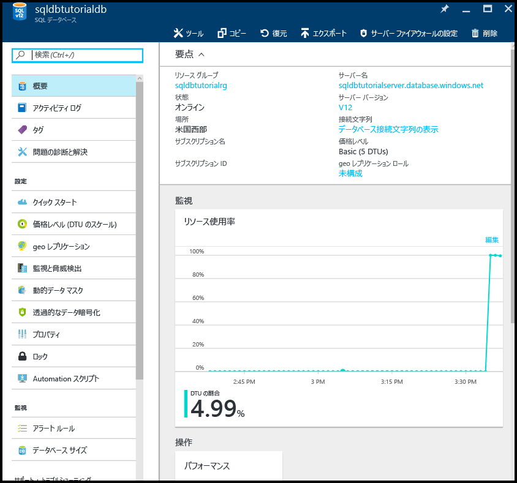

# Azure Portal を使って、Azure Recovery Services コンテナー内のデータベース バックアップの長期的な保有期間を構成、管理、および復元する

このトピックでは、Azure Portal を使って Azure Recovery Services コンテナー内の自動バックアップの長期的な保有期間を構成、管理、および復元する方法について説明します。 このタスクは、[PowerShell](sql-database-manage-long-term-backup-retention-powershell.md) を使って実行することもできます。

長期的なバックアップ保有期間について詳しくは、「[長期のバックアップ リテンション期間](sql-database-long-term-retention.md)」をご覧ください。

> [!TIP]
> チュートリアルについては、[Azure Portal を使ったデータの保護と回復のためのバックアップと復元の概要に関する記事](sql-database-get-started-backup-recovery-portal.md)をご覧ください。
>

## Azure Portal を使用して長期的な保有期間を構成する

1. お使いのサーバーの **[SQL Server]** ブレードを開きます。

    ![[SQL Server] ブレード](./media/sql-database-get-started/sql-server-blade.png)

2. **[Long-term backup retention (長期的なバックアップ保有期間)]** をクリックします。

   

3. **[Long-term backup retention (長期的なバックアップ保有期間)]** ブレードで、プレビューの使用条件を確認して同意します (既に同意している場合またはこの機能がプレビュー段階ではなくなった場合を除く)。

   

4. データベースの長期的なバックアップ保有期間を構成するには、グリッドでそのデータベースを選択し、ツール バーの **[構成]** をクリックします。

   

5. **[構成]** ブレードの **[Recovery service vault (Recovery Services コンテナー)]** で **[必要な設定の構成]** をクリックします。

   

6. **[Recovery Services コンテナー]** ブレードで、既存のコンテナーを選択します (ある場合)。 また、サブスクリプションに Recovery Services コンテナーが見つからなかった場合は、フローをクリックして終了し、Recovery Services コンテナーを作成します。

   

7. **[Recovery Services コンテナー]** ブレードの **[追加]** をクリックします。

   
   
8. **[Recovery Services コンテナー]** ブレードで、新しい Recovery Services コンテナーに有効な名前を指定します。

   

9. サブスクリプションとリソース グループを選択し、コンテナーの場所を選択します。 完了したら、**[作成]** をクリックします。

   

   > [!IMPORTANT]
   > コンテナーは、Azure SQL 論理サーバーと同じリージョンに配置する必要があります。また、論理サーバーと同じリソース グループを使用する必要があります。
   >

10. 新しいコンテナーが作成されたら、必要な手順を実行して **[Recovery Services コンテナー]** ブレードに戻ります。

11. **[Recovery Services コンテナー]** ブレードで、コンテナーをクリックし、**[選択]** をクリックします。

   

12. **[構成]** ブレードで、新しい保持ポリシーに有効な名前を指定し、必要に応じて既定の保持ポリシーを変更して、**[OK]** をクリックします。

   

13. **[Long-term backup retention (長期的なバックアップ保有期間)]** ブレードで、**[保存]** をクリックし、**[OK]** をクリックして、選択したすべてのデータベースに長期的なバックアップ保持ポリシーを適用します。

   

14. **[保存]** をクリックして、構成した Azure Recovery Services コンテナーに対して、この新しいポリシーを使用して長期的なバックアップ保有期間を有効にします。

   

## Azure Portal を使用して長期のバックアップ リテンション期間から復元する

1. **[Azure vault backups (Azure コンテナーのバックアップ)]** ブレードで、復元するバックアップをクリックし、**[選択]** をクリックします。

    

2. **[データベース名]** ボックスに、復元されるデータベースの名前を指定します。

    

3. **[OK]** をクリックして、コンテナー内にあるバックアップから新しいデータベースにデータベースを復元します。

4. ツール バーの通知アイコンをクリックして、復元ジョブの状態を確認します。

    

5. 復元ジョブが完了したら、**[SQL データベース]** ブレードを開き、新しく復元されたデータベースを確認します。

    

## Azure Portal を使用して長期のバックアップ リテンション期間の情報を確認する 

1. Azure Recovery Services コンテナーのブレードを開き (**[すべてのリソース]** に移動し、サブスクリプションのリソースの一覧から選びます)、コンテナー内のデータベース バックアップで使用されているストレージの容量を確認します。

   

2. データベースの **[SQL database]** ブレードを開きます。

    

3. ツール バーの **[復元]** をクリックします。

    ![ツール バーの [復元]](./media/sql-database-get-started-backup-recovery/restore-toolbar.png)

4. [復元] ブレードの **[長期]** をクリックします。

5. [Azure vault backups (Azure コンテナーのバックアップ)] の **[バックアップの選択]** をクリックして、長期的なバックアップ保有期間内の使用可能なデータベース バックアップを表示します。

    

> [!TIP]
> チュートリアルについては、「[データの保護と回復のためのバックアップと復元の概要](sql-database-get-started-backup-recovery-portal.md)」をご覧ください。

## 次のステップ

- PowerShell を使って長期的なバックアップ保有期間のバックアップを管理する方法については、[PowerShell を使った長期的なバックアップ保有期間の管理に関する記事](sql-database-manage-long-term-backup-retention-powershell.md)をご覧ください
- サービスによって生成された自動バックアップについては、[自動バックアップ](sql-database-automated-backups.md)に関する記事を参照してください。
- バックアップの長期保存については、[バックアップの長期保存](sql-database-long-term-retention.md)に関する記事を参照してください。
- バックアップからの復元については、[バックアップからの復元](sql-database-recovery-using-backups.md)に関する記事を参照してください。
