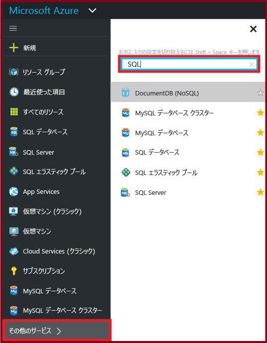
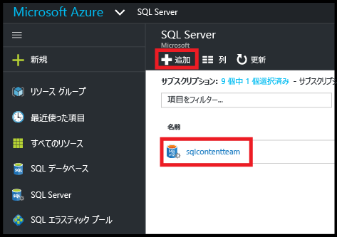
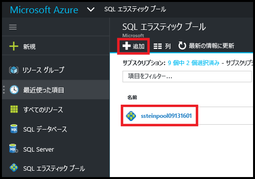
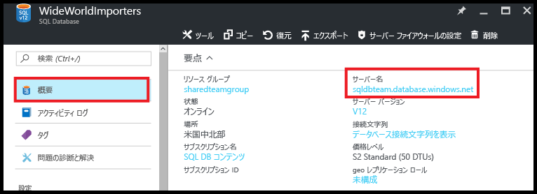
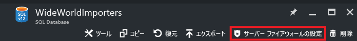
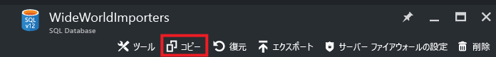
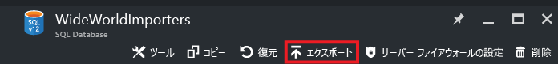
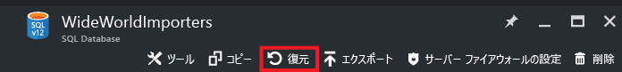
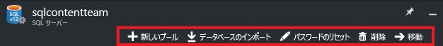
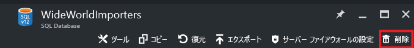

<properties
	pageTitle="Azure Portal を使用した Azure SQL Database の管理 | Microsoft Azure"
	description="Azure ポータルを使用して、クラウド内のリレーショナル データベースを管理する方法について説明します。"
	services="sql-database"
	documentationCenter=""
	authors="stevestein"
	manager="jhubbard"
	editor=""/>

<tags
	ms.service="sql-database"
	ms.devlang="NA"
	ms.workload="data-management"
	ms.topic="article"
	ms.tgt_pltfrm="NA"
	ms.date="09/19/2016"
	ms.author="sstein"/>

# Azure ポータルを使用した Azure SQL データベースの管理

> [AZURE.SELECTOR]
- [Azure ポータル](sql-database-manage-portal.md)
- [SSMS](sql-database-manage-azure-ssms.md)
- [PowerShell](sql-database-command-line-tools.md)

[Azure Portal](https://portal.azure.com/) では、Azure SQL データベースと Azure SQL サーバーを作成、監視、管理できます。この記事では、一般的なタスクを紹介し、より詳しい情報へのリンクを示します。

## Azure SQL データベース、サーバー、プールの表示

使用可能な SQL Database サービスを表示するには、**[More services (その他のサービス)]** をクリックし、検索ボックスに「**SQL**」と入力します。

## Azure SQL データベースを作成または表示する方法

**[SQL データベース]** ブレードを開くには、**[SQL データベース]** をクリックし、対象のデータベースをクリックします。または、**[+追加]** をクリックして SQL データベースを作成します。詳細については、「[Azure Portal を使用して数分で SQL データベースを作成する](sql-database-get-started.md)」を参照してください。

## Azure SQL サーバーを作成または表示する方法

**[SQL Server]** ブレードを開くには、**[SQL Server]** をクリックし、対象のサーバーをクリックします。または、**[+追加]** をクリックして SQL サーバーを作成します。詳細については、「[Azure Portal を使用して数分で SQL データベースを作成する](sql-database-get-started.md)」を参照してください。

## SQL エラスティック プールを作成または表示する方法

**[SQL 可変プール]** ブレードを開くには、**[SQL 可変プール]** をクリックし、対象のプールをクリックします。または、**[+追加]** をクリックしてプールを作成します。詳細については、[Azure Portal を使用したエラスティック データベース プールの作成](sql-database-elastic-pool-create-portal.md)に関するページを参照してください。

## SQL データベースの設定を更新または表示する方法

データベースの設定を更新または表示するには、[SQL データベース] ブレードで目的の設定をクリックします。

## SQL データベースの完全修飾サーバー名を確認する方法

データベース サーバー名を表示するには、**[SQL データベース]** ブレードで **[概要]** をクリックして、サーバー名を書き留めます。

## ファイアウォール規則を管理して SQL サーバーと SQL データベースへのアクセスを制御する方法

ファイアウォール規則を表示、作成、または更新するには、**[SQL データベース]** ブレードで **[Set server firewall (サーバー ファイアウォールの設定)]** をクリックします。詳細については、「[Azure Portal を使用して Azure SQL Database のサーバー レベルのファイアウォール規則を作成する](sql-database-configure-firewall-settings.md)」を参照してください。

## SQL データベースのサービス レベルまたはパフォーマンス レベルを変更する方法

SQL データベースのサービス レベルまたはパフォーマンス レベルを更新するには、**[SQL データベース]** ブレードで **[価格レベル (DTU のスケール)]** をクリックします。詳細については、「[SQL Database のサービス レベルとパフォーマンス レベル (価格レベル) を変更する](sql-database-scale-up.md)」を参照してください。

## SQL データベースの監査と脅威の検出を構成する方法

SQL データベースの監査と脅威の検出を構成するには、**[SQL データベース]** ブレードで **[Auditing and Threat detection (監査と脅威の検出)]** をクリックします。詳細については、「[SQL Database 監査の使用](sql-database-auditing-get-started.md)」と「[SQL Database 脅威の検出の概要](sql-database-threat-detection-get-started.md)」を参照してください。

## SQL データベースの動的データ マスクを構成する方法

SQL データベースの動的データ マスクを構成するには、**[SQL データベース]** ブレードで **[動的データ マスク]** をクリックします。詳細については、[SQL Database 動的データ マスクの使用](sql-database-dynamic-data-masking-get-started.md)に関するページを参照してください。

## SQL データベースの Transparent Data Encryption (TDE) を構成する方法

SQL データベースの Transparent Data Encryption を構成するには、**[SQL データベース]** ブレードで **[透過的なデータ暗号化]** をクリックします。詳細については、「[ポータルを使用してデータベースで TDE を有効にする](https://msdn.microsoft.com/library/dn948096#Anchor_1)」を参照してください。

## SQL データベースの最大サイズを表示または変更する方法

SQL データベースのサイズを表示または変更するには、**[SQL データベース]** ブレードで **[データベース サイズ]** をクリックします。サービス レベルまたはパフォーマンス レベルを変更して、データベースの最大サイズを更新します。詳細については、「[SQL Database のサービス レベルとパフォーマンス レベル (価格レベル) を変更する](sql-database-scale-up.md)」を参照してください。

## SQL データベースのパフォーマンスを監視および改善する方法

SQL データベースのパフォーマンス特性を監視および改善するには、**[SQL データベース]** ブレードの **[Performance overview (パフォーマンス概要)]** をクリックします。詳細については、「[SQL Database Performance Insight](sql-database-performance.md)」を参照してください。

## geo レプリケーションを構成する方法

SQL データベースの geo レプリケーションを設定するには、**[SQL データベース]** ブレードで **[geo レプリケーション]** をクリックします。詳細については、「[Azure Portal を使用して Azure SQL Database の geo レプリケーションを構成する](sql-database-geo-replication-portal.md)」を参照してください。

## geo レプリケートされた SQL データベースにフェールオーバーする方法

geo レプリケートされたセカンダリにフェールオーバーするには、**[SQL データベース]** ブレードで **[geo レプリケーション]** をクリックし、**[フェールオーバー]** をクリックします。詳細については、「[Azure Portal を使用した Azure SQL Database の計画されたフェールオーバーまたは計画されていないフェールオーバーの開始](sql-database-geo-replication-failover-portal.md)」を参照してください。

## SQL データベースをコピーする方法

SQL データベースをコピーするには、**[SQL データベース]** ブレードで **[コピー]** をクリックします。詳細については、「[Azure Portal を使用した Azure SQL Database のコピー](sql-database-copy-portal.md)」を参照してください。

## Azure SQL データベースを BACPAC ファイルにアーカイブする方法

SQL データベースの BACPAC を作成するには、**[SQL データベース]** ブレードで **[エクスポート]** をクリックします。詳細については、「[Azure Portal を使用して BACPAC ファイルに Azure SQL Database をアーカイブする](sql-database-export.md)」を参照してください。

## SQL データベースを過去のある時点に復元する方法

SQL データベースを復元するには、**[SQL データベース]** ブレードで **[復元]** をクリックします。詳細については、「[Azure Portal で以前の時点に Azure SQL Database を復元する](sql-database-point-in-time-restore-portal.md)」を参照してください。

## BACPAC ファイルから Azure SQL データベースを作成する方法

BACPAC ファイルから SQL データベースを作成するには、**[SQL Server]** ブレードで **[データベースのインポート]** をクリックします。詳細については、「[BACPAC ファイルをインポートして新しい Azure SQL Database を作成する](sql-database-import.md)」を参照してください。

## 削除した SQL データベースを復元する方法

削除した SQL データベースを復元するには、**[SQL Server]** (削除したデータベースが含まれていた SQL サーバー) ブレードで **[削除済みデータベース]** をクリックします。詳細については、「[Azure Portal を使用した、削除済み Azure SQL データベースの復元](sql-database-restore-deleted-database-portal.md)」を参照してください。

## SQL データベースを削除する方法

SQL データベースを削除するには、**[SQL データベース]** ブレードで **[削除]** をクリックします。

## その他のリソース

- [SQL Database](sql-database-technical-overview.md)
- [Azure ポータルを使用したエラスティック データベース プールの監視と管理](sql-database-elastic-pool-manage-portal.md)

<!---HONumber=AcomDC_0921_2016-->