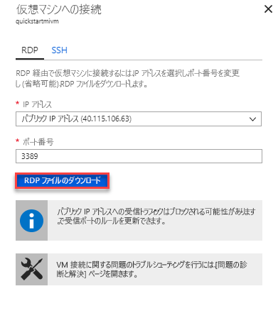

# クイック スタート: Azure SQL Database Managed Instance に接続するように Azure VM を構成する

このクイック スタートでは、SQL Server Management Studio (SSMS) を使用して、Azure SQL Database Managed Instance に接続するように Azure 仮想マシンを構成する方法を示します。 ポイント対サイト接続を使用して、オンプレミスのクライアント コンピューターから接続する方法を示すクイック スタートについては、「[ポイント対サイト接続の構成](sql-database-managed-instance-configure-p2s.md)」をご覧ください。 

## 前提条件

このクイック スタートでは、「[マネージド インスタンスを作成する](sql-database-managed-instance-get-started.md)」で作成したリソースを出発点として使用します。

## Azure ポータルにサインインします。

[Azure Portal](https://portal.azure.com/) にサインインします。

## マネージド インスタンス VNet で新しいサブネットを作成する

次の手順では、Azure 仮想マシンがマネージド インスタンスに接続できるよう、マネージド インスタンス VNet に新しいサブネットを作成します。 このマネージド インスタンス サブネットは、マネージド インスタンス専用です。 このサブネットに他のリソース (Azure 仮想マシンなど) を作成することはできません。 

1. 「[マネージド インスタンスを作成する](sql-database-managed-instance-get-started.md)」のクイック スタートで作成したマネージド インスタンスのリソース グループを開きます。 マネージド インスタンス用の仮想ネットワークを選択します。

   

2. **[サブネット]** を選択し、**[+ サブネット]** を選択して新しいサブネットを作成します。

   

3. 次の表の情報を参考にして、フォームに必要事項を入力します。

   | Setting| 推奨値 | Description |
   | ---------------- | ----------------- | ----------- | 
   | **名前** | 有効な名前|有効な名前については、[名前付け規則と制限事項](https://docs.microsoft.com/azure/architecture/best-practices/naming-conventions)に関するページを参照してください。|
   | **アドレス範囲 (CIDR ブロック)** | 有効な範囲 | このクイック スタートでは既定値で問題ありません。|
   | **ネットワーク セキュリティ グループ** | なし | このクイック スタートでは既定値で問題ありません。|
   | **ルート テーブル** | なし | このクイック スタートでは既定値で問題ありません。|
   | **サービス エンドポイント** | 0 が選択されています | このクイック スタートでは既定値で問題ありません。|
   | **サブネットの委任** | なし | このクイック スタートでは既定値で問題ありません。|
 
   

4. **[OK]** を選択して、マネージド インスタンス VNet にこの追加のサブネットを作成します。

## VNet の新しいサブネットに仮想マシンを作成する

以下の手順では、マネージド インスタンスに接続するための新しいサブネットに仮想マシンを作成する方法について説明します。 

## Azure 仮想マシンを準備する

SQL マネージド インスタンスはプライベート仮想ネットワークに配置されるため、SQL クライアント ツール (SQL Server Management Studio や Azure Data Studio など) がインストールされた Azure VM を作成する必要があります。 このツールを使用して、マネージド インスタンスに接続し、クエリを実行することができます。 このクイック スタートでは、SQL Server Management Studio を使用します。

必要なツールをすべて備えたクライアント仮想マシンを作成する最も簡単な方法は、Azure Resource Manager テンプレートを使用することです。

1. 別のブラウザー タブで Azure portal にサインインします。その後、次のボタンを選択してクライアント仮想マシンを作成し、SQL Server Management Studio をインストールします。

    

2. 次の表の情報を参考にして、フォームに必要事項を入力します。

   | Setting| 推奨値 | 説明 |
   | ---------------- | ----------------- | ----------- |
   | **サブスクリプション** | 有効なサブスクリプション | 新しいリソースを作成するアクセス許可があるサブスクリプションでなければなりません。 |
   | **リソース グループ** |「[マネージド インスタンスを作成する](sql-database-managed-instance-get-started.md)」クイック スタートで指定したリソース グループ。|VNet が存在するリソース グループでなければなりません。|
   | **場所** | リソース グループの場所 | この値は、選択したリソース グループに基づいて設定されます。 | 
   | **仮想マシン名**  | 有効な名前 | 有効な名前については、[名前付け規則と制限事項](https://docs.microsoft.com/azure/architecture/best-practices/naming-conventions)に関するページを参照してください。|
   |**管理ユーザー名**|有効なユーザー名|有効な名前については、[名前付け規則と制限事項](https://docs.microsoft.com/azure/architecture/best-practices/naming-conventions)に関するページを参照してください。 "serveradmin" は予約済みのサーバー レベルのロールであるため、使用しないでください。 [VM に接続](#connect-to-virtual-machine)するときは常に、このユーザー名を使用します。| 
   |**パスワード**|有効なパスワード|パスワードは 12 文字以上で、[定義された複雑さの要件](../virtual-machines/windows/faq.md#what-are-the-password-requirements-when-creating-a-vm)を満たす必要があります。 [VM に接続](#connect-to-virtual-machine)するときは常に、このパスワードを使用します。|
   | **仮想マシン サイズ** | 任意の有効なサイズ | このクイック スタートでは、このテンプレートの既定値 **Standard_B2s** で十分です。 |
   | **場所**|[resourceGroup().location]| この値は変更しないでください。 |
   | **仮想ネットワーク名**|マネージド インスタンスを作成した仮想ネットワーク。|
   | **サブネット名**|前の手順で作成したサブネットの名前| マネージド インスタンスを作成したサブネットは選択しないでください。|
   | **artifacts Location (成果物の場所)** | [deployment().properties.templateLink.uri] | この値は変更しないでください。 |
   | **artifacts Location Sas token (成果物の場所 SAS トークン)** | 空白のままにする | この値は変更しないでください。 |

   

   「[マネージド インスタンスを作成する](sql-database-managed-instance-get-started.md)」で推奨される VNet 名と既定のサブネットを使用した場合、最後の 2 つのパラメーターを変更する必要はありません。 それ以外の場合は、ネットワーク環境を設定するときに入力した値に、これらの値を変更する必要があります。

3. **[上記の使用条件に同意する]** チェック ボックスをオンにします。
4. **[購入]** を選択して、ネットワークに Azure VM をデプロイします。
5. **[通知]** アイコンを選択してデプロイの状態を表示します。

Azure 仮想マシンが作成されるまで続行しないでください。 

## 仮想マシンへの接続

ここでは、リモート デスクトップ接続を使用して新しく作成した仮想マシンに接続する手順について説明します。

1. デプロイが完了したら、仮想マシン リソースに移動します。

      

2. **[接続]** を選択します。 
   
   リモート デスクトップ プロトコル ファイル (.rdp ファイル) のフォームが表示され、仮想マシンのパブリック IP アドレスとポート番号が示されます。 

     

3. **[RDP ファイルのダウンロード]** を選択します。
 
   > [!NOTE]
   > SSH を使用して VM に接続することもできます。

4. **[仮想マシンに接続する]** フォームを閉じます。
5. VM に接続するには、ダウンロードした RDP ファイルを開きます。 
6. メッセージが表示されたら、**[Connect]** を選択します。 Mac では、この[リモート デスクトップ クライアント](https://itunes.apple.com/us/app/microsoft-remote-desktop/id715768417?mt=12)のような RDP クライアントを Mac App Store から入手する必要があります。

6. 仮想マシンの作成時に指定したユーザー名とパスワードを入力し、**[OK]** を選択します。

7. サインイン処理中に証明書の警告が表示される場合があります。 **[はい]** または **[続行]** を選択して接続処理を続行します。

サーバー マネージャー ダッシュボードには、仮想マシンに接続済みと表示されます。

## SSMS を使用してマネージド インスタンスに接続する

1. 仮想マシンで、SQL Server Management Studio (SSMS) を開きます。
 
   SSMS を始めて起動するので構成を完了する必要があるため、開くまでにしばらくかかります。
2. **[サーバーに接続]** ダイアログ ボックスで、**[サーバー名]** ボックスにマネージド インスタンスの完全修飾**ホスト名**を入力します。 **[SQL Server 認証]** を選択し、ユーザー名とパスワードを入力して、**[接続]** を選択します。

      

接続後は、データベース ノード内のシステム データベースとユーザー データベースを確認できます。また、セキュリティ、サーバー オブジェクト、レプリケーション、管理、SQL Server エージェント、および XEvent プロファイラー ノードのさまざまなオブジェクトを確認できます。

## 次の手順

- ポイント対サイト接続を使用して、オンプレミスのクライアント コンピューターから接続する方法を示すクイック スタートについては、[ポイント対サイト接続の構成](sql-database-managed-instance-configure-p2s.md)に関するページをご覧ください。
- アプリケーションの接続オプションの概要については、[マネージド インスタンスにアプリケーションを接続する](sql-database-managed-instance-connect-app.md)方法に関するページを参照してください。
- 既存の SQL Server データベースをオンプレミスからマネージド インスタンスに復元するには、[移行用の Azure Database Migration Service (DMS)](../dms/tutorial-sql-server-to-managed-instance.md) または [T-SQL RESTORE コマンド](sql-database-managed-instance-get-started-restore.md)を使用してデータベース バックアップ ファイルから復元します。
