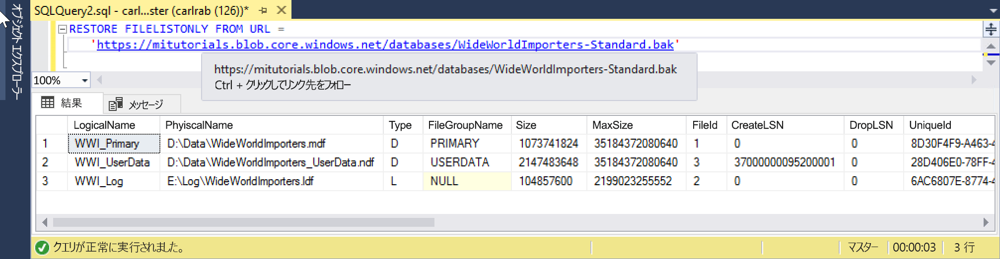

# <a name="quickstart-restore-a-database-to-a-managed-instance"></a>クイック スタート:データベースをマネージド インスタンスに復元する

このクイック スタートでは、SQL Server Management Studio (SSMS) を使用して、Azure Blob Storage から Azure SQL Database [マネージド インスタンス](sql-database-managed-instance.md)にデータベース (Wide World Importers - 標準のバックアップ ファイル) を復元します。

> [!VIDEO https://www.youtube.com/embed/RxWYojo_Y3Q]

> [!NOTE]
> Azure Database Migration Service (DMS) を使用した移行の詳細については、[DMS を使用した Managed Instance への移行](../dms/tutorial-sql-server-to-managed-instance.md)に関するページを参照してください。
> 各種の移行方法の詳細については、「[Azure SQL Database Managed Instance への SQL Server インスタンスの移行](sql-database-managed-instance-migrate.md)」を参照してください。

## <a name="prerequisites"></a>前提条件

このクイック スタート:

- [マネージド インスタンスの作成](sql-database-managed-instance-get-started.md)に関するクイック スタートのリソースを使用します。
- コンピューターに最新の [SQL Server Management Studio](https://docs.microsoft.com/sql/ssms/sql-server-management-studio-ssms) がインストールされている必要があります。
- SSMS を使用してマネージド インスタンスに接続する必要があります。 接続方法については、次のクイック スタートを参照してください。
  - [Connect to an Azure SQL Database Managed Instance from an Azure VM (Azure VM から Azure SQL Database Managed Instance に接続する)](sql-database-managed-instance-configure-vm.md)
  - [オンプレミスから Azure SQL Database Managed Instance へのポイント対サイト接続を構成する](sql-database-managed-instance-configure-p2s.md)。

> [!NOTE]
> Azure Blob Storage と [Shared Access Signature (SAS) キー](https://docs.microsoft.com/azure/storage/common/storage-dotnet-shared-access-signature-part-1)を使用した SQL Server データベースのバックアップと復元の詳細については、[SQL Server Backup to URL](sql-database-managed-instance-get-started-restore.md) に関するページを参照してください。

## <a name="restore-the-database-from-a-backup-file"></a>バックアップ ファイルからデータベースを復元する

SSMS で、次の手順に従って、Wide World Importers データベースをマネージド インスタンスに復元します。 データベース バックアップ ファイルは、事前構成済みの Azure Blob Storage アカウントに格納されています。

1. SMSS を開き、マネージド インスタンスに接続します。
2. 左側のメニューから、マネージド インスタンスを右クリックし、 **[新しいクエリ]** を選択して新しいクエリ ウィンドウを開きます。
3. 次の SQL スクリプトを実行します。このスクリプトでは、事前構成済みのストレージ アカウントと SAS キーを使用して、マネージド インスタンスに[資格情報を作成](https://docs.microsoft.com/sql/t-sql/statements/create-credential-transact-sql)します。

   ```sql
   CREATE CREDENTIAL [https://mitutorials.blob.core.windows.net/databases]
   WITH IDENTITY = 'SHARED ACCESS SIGNATURE'
   , SECRET = 'sv=2017-11-09&ss=bfqt&srt=sco&sp=rwdlacup&se=2028-09-06T02:52:55Z&st=2018-09-04T18:52:55Z&spr=https&sig=WOTiM%2FS4GVF%2FEEs9DGQR9Im0W%2BwndxW2CQ7%2B5fHd7Is%3D'
   ```

    

4. 認証情報を確認するために、次のスクリプトを実行します。このスクリプトでは、[コンテナー](https://azure.microsoft.com/services/container-instances/)の URL を使用してバックアップ ファイルの一覧を取得します。

   ```sql
   RESTORE FILELISTONLY FROM URL =
      'https://mitutorials.blob.core.windows.net/databases/WideWorldImporters-Standard.bak'
   ```

    

5. 次のスクリプトを実行して、Wide World Importers データベースを復元します。

   ```sql
   RESTORE DATABASE [Wide World Importers] FROM URL =
     'https://mitutorials.blob.core.windows.net/databases/WideWorldImporters-Standard.bak'
   ```

    

6. 次のスクリプトを実行して、復元の状態を追跡します。

   ```sql
   SELECT session_id as SPID, command, a.text AS Query, start_time, percent_complete
      , dateadd(second,estimated_completion_time/1000, getdate()) as estimated_completion_time
   FROM sys.dm_exec_requests r
   CROSS APPLY sys.dm_exec_sql_text(r.sql_handle) a
   WHERE r.command in ('BACKUP DATABASE','RESTORE DATABASE')
   ```

7. 復元が完了したら、オブジェクト エクスプローラーで確認します。

## <a name="next-steps"></a>次の手順

- URL へのバックアップのトラブルシューティングについては、「[SQL Server Backup to URL に関するベスト プラクティスとトラブルシューティング](https://docs.microsoft.com/sql/relational-databases/backup-restore/sql-server-backup-to-url-best-practices-and-troubleshooting)」を参照してください。
- アプリの接続オプションの概要については、[マネージド インスタンスにアプリケーションを接続する](sql-database-managed-instance-connect-app.md)方法に関するページを参照してください。
- 任意のツールまたは言語を使用してクエリを実行する方法については、「[クイック スタート:Azure SQL Database の接続とクエリ](sql-database-connect-query.md)」を参照してください。
