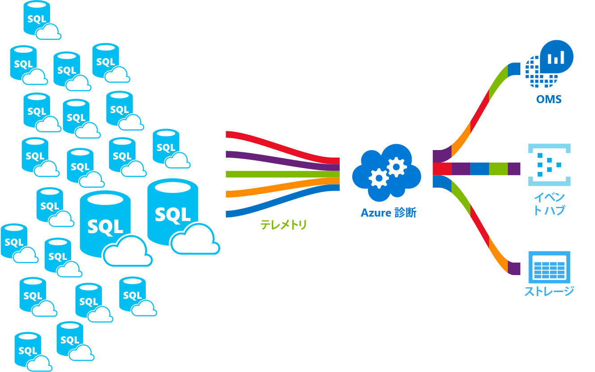

# <a name="azure-sql-database-metrics-and-diagnostics-logging"></a>Azure SQL Database のメトリックと診断のロギング 
Azure SQL Database では、監視を容易にするためのメトリックと診断ログを出力することができます。 リソース使用率、ワーカーとセッション、および接続性を次の Azure リソースのいずれかに格納するように SQL Database を構成することができます。

* **Azure Storage**: 大量のテレメトリを低価格でアーカイブします。
* **Azure Event Hubs**: SQL Database のテレメトリを、カスタム監視ソリューションまたはホット パイプラインと統合します。
* **Azure Log Analytics**: レポート機能、アラート機能、および移行機能を備えた既製の監視ソリューション用です。 これは、[Operations Management Suite (OMS)](../operations-management-suite/operations-management-suite-overview.md) の機能です

    

## <a name="enable-logging"></a>ログの有効化

メトリックや診断のロギングは既定では有効になっていません。 次のいずれかの方法を使用してメトリックと診断のロギングを有効にして管理できます。

- Azure ポータル
- PowerShell
- Azure CLI
- Azure Monitor REST API 
- Azure Resource Manager テンプレート

メトリックと診断のロギングを有効にする際に、選択したデータが収集される Azure リソースを指定する必要があります。 次のオプションを使用できます。

- Log Analytics
- Event Hubs
- Storage 

新しい Azure リソースをプロビジョニングするか、既存のリソースを選択できます。 ストレージ リソースを選択したら、収集するデータを指定する必要があります。 次のオプションを使用できます。

- [すべてのメトリック](sql-database-metrics-diag-logging.md#all-metrics): DTU の割合、DTU の上限、CPU の割合、物理データ読み取りの割合、ログ書き込みの割合、ファイアウォール接続による成功/失敗/ブロック、セッションの割合、ワーカーの割合、ストレージ、ストレージの割合、XTP ストレージの割合が含まれます。
- [QueryStoreRuntimeStatistics](sql-database-metrics-diag-logging.md#query-store-runtime-statistics): CPU 使用率、クエリ実行時間など、クエリのランタイム統計に関する情報が含まれます。
- [QueryStoreWaitStatistics](sql-database-metrics-diag-logging.md#query-store-wait-statistics): CPU、ログ、ロック状態など、クエリが何を待機したかを示すクエリ待機統計に関する情報が含まれます。
- [Errors](sql-database-metrics-diag-logging.md#errors-dataset): このデータベースで発生した SQL エラーに関する情報が含まれます。
- [DatabaseWaitStatistics](sql-database-metrics-diag-logging.md#database-wait-statistics-dataset): データベースが各種の待機に費やした時間に関する情報が含まれます。
- [Timeouts](sql-database-metrics-diag-logging.md#time-outs-dataset): データベースで発生したタイムアウトに関する情報が含まれます。
- [Blocks](sql-database-metrics-diag-logging.md#blockings-dataset): データベースで発生したブロック イベントに関する情報が含まれます。
- [SQLInsights](sql-database-metrics-diag-logging.md#intelligent-insights-dataset): Intelligent Insights が含まれます。 [Intelligent Insights](sql-database-intelligent-insights.md) の詳細。
- **Audit** / **SQLSecurityAuditEvents**: 現在利用できません。

Event Hubs またはストレージ アカウントを選択した場合は、保持ポリシーを指定できます。 このポリシーは、選択した期間よりも古いデータを削除します。 Log Analytics を指定した場合、リテンション期間ポリシーは選択した価格レベルに依存します。 詳細については、「[Log Analytics の価格](https://azure.microsoft.com/pricing/details/log-analytics/)」を参照してください。 

ログ記録を有効にする方法や、各種の Azure サービスでサポートされているメトリックとログのカテゴリについては、次の資料を参照してください。 

* [Microsoft Azure のメトリックの概要](../monitoring-and-diagnostics/monitoring-overview-metrics.md)
* [Azure 診断ログの概要](../monitoring-and-diagnostics/monitoring-overview-of-diagnostic-logs.md) 

### <a name="azure-portal"></a>Azure ポータル

1. ポータルでメトリックと診断ログ収集を有効にするには、Azure SQL Database またはエラスティック プールのページに移動して、**[診断設定]** を選択します。

   

2. ターゲットとテレメトリを選択して、診断設定を新しく作成するか、既存の診断設定を編集します。

   

### <a name="powershell"></a>PowerShell

PowerShell を使用してメトリックと診断のロギングを有効にするには、次のコマンドを使用します。

- ストレージ アカウントへの診断ログの保存を有効にするには、次のコマンドを使用します。

   ```powershell
   Set-AzureRmDiagnosticSetting -ResourceId [your resource id] -StorageAccountId [your storage account id] -Enabled $true
   ```

   ストレージ アカウント ID は、ログの送信先となるストレージ アカウントのリソース ID です。

- Event Hubs への診断ログのストリーミングを有効にするには、次のコマンドを使用します。

   ```powershell
   Set-AzureRmDiagnosticSetting -ResourceId [your resource id] -ServiceBusRuleId [your service bus rule id] -Enabled $true
   ```

   Azure Service Bus ルール ID は、次の形式の文字列です。

   ```powershell
   {service bus resource ID}/authorizationrules/{key name}
   ``` 

- Log Analytics ワークスペースへの診断ログの送信を有効にするには、次のコマンドを使用します。

   ```powershell
   Set-AzureRmDiagnosticSetting -ResourceId [your resource id] -WorkspaceId [resource id of the log analytics workspace] -Enabled $true
   ```

- 次のコマンドを使用して、Log Analytics ワークスペースのリソース ID を取得できます。

   ```powershell
   (Get-AzureRmOperationalInsightsWorkspace).ResourceId
   ```

このパラメーターを組み合わせて、複数の出力オプションを有効にできます。

### <a name="to-configure-multiple-azure-resources"></a>複数の Azure リソースの構成方法

複数のサブスクリプションをサポートするためには、「[Enable Azure resource metrics logging using PowerShell (PowerShell を使用して Azure リソース メトリックのログ記録を有効にする)](https://blogs.technet.microsoft.com/msoms/2017/01/17/enable-azure-resource-metrics-logging-using-powershell/)」の PowerShell スクリプトを使用します。

スクリプト (Enable-AzureRMDiagnostics.ps1) の実行時にパラメーターとしてワークスペース リソース ID &lt;$WSID&gt; を入力すると、複数のリソースからの診断データをワークスペースに送信できます。 診断データの送信先となるワークスペースの ID &lt;$WSID&gt; を取得するには、&lt;subID&gt; とサブスクリプション ID、&lt;RG_NAME&gt; とリソース グループ名を置き換え、&lt;WS_NAME&gt; に次のスクリプトのワークスペース名を入力します。

- 複数の Azure サブスクリプションを構成するには、次のコマンドを使用します。

    ```powershell
    PS C:\> $WSID = "/subscriptions/<subID>/resourcegroups/<RG_NAME>/providers/microsoft.operationalinsights/workspaces/<WS_NAME>"
    PS C:\> .\Enable-AzureRMDiagnostics.ps1 -WSID $WSID
    ```

### <a name="azure-cli"></a>Azure CLI

Azure CLI を使用してメトリックと診断のロギングを有効にするには、次のコマンドを使用します。

- ストレージ アカウントへの診断ログの保存を有効にするには、次のコマンドを使用します。

   ```azurecli-interactive
   azure insights diagnostic set --resourceId <resourceId> --storageId <storageAccountId> --enabled true
   ```

   ストレージ アカウント ID は、ログの送信先となるストレージ アカウントのリソース ID です。

- Event Hubs への診断ログのストリーミングを有効にするには、次のコマンドを使用します。

   ```azurecli-interactive
   azure insights diagnostic set --resourceId <resourceId> --serviceBusRuleId <serviceBusRuleId> --enabled true
   ```

   Service Bus ルール ID は、この形式の文字列です。

   ```azurecli-interactive
   {service bus resource ID}/authorizationrules/{key name}
   ```

- Log Analytics ワークスペースへの診断ログの送信を有効にするには、次のコマンドを使用します。

   ```azurecli-interactive
   azure insights diagnostic set --resourceId <resourceId> --workspaceId <resource id of the log analytics workspace> --enabled true
   ```

このパラメーターを組み合わせて、複数の出力オプションを有効にできます。

### <a name="rest-api"></a>REST API

[Azure Monitor REST API を使用して診断設定を変更する](https://docs.microsoft.com/en-us/rest/api/monitor/diagnosticsettings)方法を参照してください。 

### <a name="resource-manager-template"></a>Resource Manager テンプレート

[Resource Manager テンプレートを使用してリソースの作成時に診断設定を有効にする](../monitoring-and-diagnostics/monitoring-enable-diagnostic-logs-using-template.md)方法を参照してください。 

## <a name="stream-into-log-analytics"></a>Log Analytics にストリーミングする 
Azure SQL Database のメトリックと診断ログは、ポータルに組み込まれている [**Send to Log Analytics]\(Log Analytics に送信\)** オプションを使用して Log Analytics にストリームできます。 Log Analytics は、PowerShell コマンドレット、Azure CLI、または Azure Monitor REST API を使用して診断設定をすることでも有効にできます。

### <a name="installation-overview"></a>インストールの概要

Log Analytics を使用すると、Azure SQL Database フリートを簡単に監視できます。 次の 3 つの手順が必要です。

1. Log Analytics リソースを作成する。

2. 作成した Log Analytics リソースにメトリックと診断ログを記録するようデータベースを構成します。

3. Log Analytics のギャラリーから **Azure SQL Analytics** ソリューションをインストールします。

### <a name="create-a-log-analytics-resource"></a>Log Analytics リソースを作成する。

1. 左側のメニューで、**[リソースの作成]** を選択します。

2. **[監視 + 管理]** を選択します。

3. **[Log Analytics]** を選択します。

4. Log Analytics フォームに必要な追加情報 (ワークスペースの名前、サブスクリプション、リソース グループ、場所、価格レベル) を入力します。

   

### <a name="configure-databases-to-record-metrics-and-diagnostics-logs"></a>メトリックと診断ログを記録するようデータベースを構成する

データベースがメトリックを記録する場所を構成する最も簡単な方法は、Azure Portal を使用する方法です。 ポータルで、Azure SQL Database リソースに移動し、**[診断設定]** を選択します。 

### <a name="install-the-sql-analytics-solution-from-the-gallery"></a>ギャラリーから Azure SQL Analytics ソリューションをインストールする

1. Log Analytics リソースが作成され、データがそこに取り込まれるようになったら、Azure SQL Analytics ソリューションをインストールします。 ホーム ページのサイド メニューで、**[ソリューション ギャラリー]** を選択します。 ギャラリーで **[Azure SQL Analytics]** ソリューションを選択し、**[追加]** をクリックします。

   

2. ホーム ページで、**[Azure SQL Analytics]** タイルが表示されます。 SQL Analytics のダッシュ ボードを開くには、このタイルを選択します。

### <a name="use-the-sql-analytics-solution"></a>Azure SQL Analytics ソリューションを使用する

Azure SQL Analytics は階層型のダッシュボードで、Azure SQL Database リソースの階層を移動できます。 SQL Analytics ソリューションの使用方法については、「[Monitor SQL Database by using the SQL Analytics solution](../log-analytics/log-analytics-azure-sql.md)」(SQL Analytics ソリューションを使用して SQL データベースを監視する) を参照してください。

## <a name="stream-into-event-hubs"></a>Event Hubs へのストリーム

Azure SQL Database のメトリックと診断ログは、ポータルに組み込まれている [**Stream to an event hub]\(Event Hubs に送信\)** オプションを使用して Log Analytics にストリームできます。 Service Bus ルール ID は、PowerShell コマンドレット、Azure CLI、または Azure Monitor REST API を使用して診断設定をすることでも有効にできます。 

### <a name="what-to-do-with-metrics-and-diagnostics-logs-in-event-hubs"></a>Event Hubs におけるメトリックと診断ログの活用方法
選択したデータが Event Hubs にストリーミングされると、高度な監視シナリオを有効にできます。 Event Hubs は、イベント パイプラインの玄関口として機能します。 Event Hubs に収集されたデータは、任意のリアルタイム分析プロバイダーやバッチ処理/ストレージ アダプターを使用して、変換および保存できます。 Event Hubs は、イベントのストリームの運用と、イベントの消費を分離します。 これにより、イベントのコンシューマーは独自のスケジュールでイベントにアクセスできます。 Event Hubs の詳細については、以下を参照してください。

- [Event Hubs とは](../event-hubs/event-hubs-what-is-event-hubs.md)
- [Event Hubs の使用](../event-hubs/event-hubs-csharp-ephcs-getstarted.md)


ストリーミング機能を使用する場合、次のような方法があります。

* **サービスの正常性を表示するには、Power BI にホット パス データをストリーミングします**。 Event Hubs、Stream Analytics および Power BI を使用することで、メトリクスと診断データを Azure サービスの近リアルタイム洞察に簡単に転換できます。 Event Hubs の設定、Stream Analytics を使用したデータ処理、および Power BI を出力として使用する方法の概要については、「[Stream Analytics と Power BI](../stream-analytics/stream-analytics-power-bi-dashboard.md)」をご覧ください。

* **サード パーティ製のロギングおよびテレメトリ ストリームにログをストリームします**。 Event Hubs ストリーミングを使用することで、さまざまなサードパーティのモニタリングおよびログ解析ソリューションにマトリクスと診断ログを送信できます。 

* **カスタム テレメトリおよびロギング プラットフォームの構築**。 カスタマイズされたテレメトリ プラットフォームをすでに構築している場合、または構築を検討している場合は、高い拡張性の公開サブスクライブを特長とする Event Hubs を使用することで診断ログを柔軟に取り込むことができます。 [グローバル規模のテレメトリ プラットフォームで Event Hubs を使用する方法に関する Dan Rosanova によるガイド](https://azure.microsoft.com/documentation/videos/build-2015-designing-and-sizing-a-global-scale-telemetry-platform-on-azure-event-Hubs/)をご覧ください。

## <a name="stream-into-storage"></a>ストレージへのストリーム

Azure SQL Database のメトリックと診断ログは、ポータルに組み込まれている **[Archive to a storage account] \(ストレージ アカウントへアーカイブ\)** オプションを使用してストレージに保存できます。 ストレージは、PowerShell コマンドレット、Azure CLI、または Azure Monitor REST API の診断設定からも有効にできます。

### <a name="schema-of-metrics-and-diagnostics-logs-in-the-storage-account"></a>ストレージ アカウントにおけるメトリックおよび診断ログのスキーマ

メトリックおよび診断ログの収集を設定した後、データの先頭行が取得されたときに、選択したストレージ アカウントにストレージ コンテナーが作成されます。 これらのBLOB の構造は次のとおりです。

```powershell
insights-{metrics|logs}-{category name}/resourceId=/SUBSCRIPTIONS/{subscription ID}/ RESOURCEGROUPS/{resource group name}/PROVIDERS/Microsoft.SQL/servers/{resource_server}/ databases/{database_name}/y={four-digit numeric year}/m={two-digit numeric month}/d={two-digit numeric day}/h={two-digit 24-hour clock hour}/m=00/PT1H.json
```
    
または、次のようによりシンプルな構造になります。

```powershell
insights-{metrics|logs}-{category name}/resourceId=/{resource Id}/y={four-digit numeric year}/m={two-digit numeric month}/d={two-digit numeric day}/h={two-digit 24-hour clock hour}/m=00/PT1H.json
```

たとえば、すべてのメトリックの BLOB 名は次のようになります。

```powershell
insights-metrics-minute/resourceId=/SUBSCRIPTIONS/s1id1234-5679-0123-4567-890123456789/RESOURCEGROUPS/TESTRESOURCEGROUP/PROVIDERS/MICROSOFT.SQL/ servers/Server1/databases/database1/y=2016/m=08/d=22/h=18/m=00/PT1H.json
```

エラスティック プールからデータを記録する場合、次のように BLOB 名が少し変わります。

```powershell
insights-{metrics|logs}-{category name}/resourceId=/SUBSCRIPTIONS/{subscription ID}/ RESOURCEGROUPS/{resource group name}/PROVIDERS/Microsoft.SQL/servers/{resource_server}/ elasticPools/{elastic_pool_name}/y={four-digit numeric year}/m={two-digit numeric month}/d={two-digit numeric day}/h={two-digit 24-hour clock hour}/m=00/PT1H.json
```

### <a name="download-metrics-and-logs-from-storage"></a>Azure Storage からメトリックとログをダウンロードする

[メトリックと診断ログをストレージからダウンロードする](../storage/blobs/storage-quickstart-blobs-dotnet.md#download-the-sample-application)を参照してください。

## <a name="metrics-and-logs-available"></a>利用可能なメトリックとログ

### <a name="all-metrics"></a>すべてのメトリック

|**リソース**|**メトリック**|
|---|---|
|データベース|DTU の割合、使用中の DTU、DTU の上限、CPU の割合、物理データ読み取りの割合、ログ書き込みの割合、ファイアウォール接続による成功/失敗/ブロック、セッションの割合、ワーカーの割合、ストレージ、ストレージの割合、XTP ストレージの割合、デッドロック |
|エラスティック プール|eDTU の割合、使用中の eDTU、eDTU の上限、CPU の割合、物理データ読み取りの割合、ログ書き込みの割合、セッションの割合、ワーカーの割合、ストレージ、ストレージの割合、ストレージの上限、XTP ストレージの割合 |
|||

### <a name="query-store-runtime-statistics"></a>クエリ ストアのランタイム統計

|プロパティ|説明|
|---|---|
|TenantId|テナント ID。|
|SourceSystem|常に Azure|
|TimeGenerated [UTC]|ログが記録されたときのタイムスタンプ。|
|type|常に AzureDiagnostics|
|ResourceProvider|リソース プロバイダーの名前。 常に MICROSOFT.SQL|
|Category|カテゴリの名前。 常に QueryStoreRuntimeStatistics|
|OperationName|操作の名前。 常に QueryStoreRuntimeStatisticsEvent|
|Resource|リソースの名前。|
|ResourceType|リソースの種類の名前。 常に SERVERS/DATABASES|
|SubscriptionId|データベースが属するサブスクリプション GUID。|
|ResourceGroup|データベースが属するリソース グループの名前。|
|LogicalServerName_s|データベースが属するサーバーの名前。|
|ElasticPoolName_s|データベースが属するエラスティック プールの名前 (存在する場合)。|
|DatabaseName_s|データベースの名前。|
|ResourceId|リソース URI。|
|query_hash_s|クエリ ハッシュ。|
|query_plan_hash_s|クエリ プラン ハッシュ。|
|statement_sql_handle_s|ステートメント sql ハンドル。|
|interval_start_time_d|1900-1-1 からのティック数での間隔の開始 datetimeoffset。|
|interval_end_time_d|1900-1-1 からのティック数での間隔の終了 datetimeoffset。|
|logical_io_writes_d|論理 IO 書き込みの合計数。|
|max_logical_io_writes_d|実行ごとの論理 IO 書き込みの最大数。|
|physical_io_reads_d|物理 IO 読み取りの合計数。|
|max_physical_io_reads_d|実行ごとの論理 IO 読み取りの最大数。|
|logical_io_reads_d|論理 IO 読み取りの合計数。|
|max_logical_io_reads_d|実行ごとの論理 IO 読み取りの最大数。|
|execution_type_d|実行の種類。|
|count_executions_d|クエリの実行回数。|
|cpu_time_d|クエリで使用された合計 CPU 時間 (マイクロ秒単位)。|
|max_cpu_time_d|1 回の実行による最大 CPU 時間コンシューマー (マイクロ秒単位)。|
|dop_d|並列処理の次数の合計。|
|max_dop_d|1 回の実行で使用された並列処理の最大次数。|
|rowcount_d|返された行数の合計。|
|max_rowcount_d|1 回の実行で返された行の最大数。|
|query_max_used_memory_d|サポート技術情報で使用されたメモリの合計量 (KB 単位)。|
|max_query_max_used_memory_d|1 回の実行で使用されたメモリの最大量 (KB 単位)。|
|duration_d|合計実行時間 (マイクロ秒単位)。|
|max_duration_d|1 回の実行の最大実行時間。|
|num_physical_io_reads_d|物理読み取りの合計数。|
|max_num_physical_io_reads_d|実行ごとの物理読み取りの最大数。|
|log_bytes_used_d|使用されたログの合計量 (バイト数)。|
|max_log_bytes_used_d|実行ごとに使用されたログの最大量 (バイト数)。|
|query_id_d|クエリ ストアでのクエリの ID。|
|plan_id_d|クエリ ストアでのプランの ID。|

[クエリ ストアのランタイム統計データ](https://docs.microsoft.com/sql/relational-databases/system-catalog-views/sys-query-store-runtime-stats-transact-sql)の詳細。

### <a name="query-store-wait-statistics"></a>クエリ ストアの待機統計

|プロパティ|説明|
|---|---|
|TenantId|テナント ID。|
|SourceSystem|常に Azure|
|TimeGenerated [UTC]|ログが記録されたときのタイムスタンプ。|
|Type|常に AzureDiagnostics|
|ResourceProvider|リソース プロバイダーの名前。 常に MICROSOFT.SQL|
|Category|カテゴリの名前。 常に QueryStoreWaitStatistics|
|OperationName|操作の名前。 常に QueryStoreWaitStatisticsEvent|
|Resource|リソースの名前|
|ResourceType|リソースの種類の名前。 常に SERVERS/DATABASES|
|SubscriptionId|データベースが属するサブスクリプション GUID。|
|ResourceGroup|データベースが属するリソース グループの名前。|
|LogicalServerName_s|データベースが属するサーバーの名前。|
|ElasticPoolName_s|データベースが属するエラスティック プールの名前 (存在する場合)。|
|DatabaseName_s|データベースの名前。|
|ResourceId|リソース URI。|
|wait_category_s|待機のカテゴリ。|
|is_parameterizable_s|クエリがパラメーター化可能かどうか。|
|statement_type_s|ステートメントの種類。|
|statement_key_hash_s|ステートメント キー ハッシュ。|
|exec_type_d|実行の種類。|
|total_query_wait_time_ms_d|特定の待機カテゴリでのクエリの合計待機時間。|
|max_query_wait_time_ms_d|特定の待機カテゴリの個々の実行でのクエリの最大待機時間。|
|query_param_type_d|0|
|query_hash_s|クエリ ストア内のクエリ ハッシュ。|
|query_plan_hash_s|クエリ ストア内のクエリ プラン ハッシュ。|
|statement_sql_handle_s|クエリ ストア内のステートメント ハンドル。|
|interval_start_time_d|1900-1-1 からのティック数での間隔の開始 datetimeoffset。|
|interval_end_time_d|1900-1-1 からのティック数での間隔の終了 datetimeoffset。|
|count_executions_d|クエリの実行回数。|
|query_id_d|クエリ ストアでのクエリの ID。|
|plan_id_d|クエリ ストアでのプランの ID。|

[クエリ ストアの待機統計データ](https://docs.microsoft.com/sql/relational-databases/system-catalog-views/sys-query-store-wait-stats-transact-sql)の詳細。

### <a name="errors-dataset"></a>エラー データセット

|プロパティ|説明|
|---|---|
|TenantId|テナント ID。|
|SourceSystem|常に Azure|
|TimeGenerated [UTC]|ログが記録されたときのタイムスタンプ。|
|Type|常に AzureDiagnostics|
|ResourceProvider|リソース プロバイダーの名前。 常に MICROSOFT.SQL|
|Category|カテゴリの名前。 常に Errors|
|OperationName|操作の名前。 常に ErrorEvent|
|Resource|リソースの名前|
|ResourceType|リソースの種類の名前。 常に SERVERS/DATABASES|
|SubscriptionId|データベースが属するサブスクリプション GUID。|
|ResourceGroup|データベースが属するリソース グループの名前。|
|LogicalServerName_s|データベースが属するサーバーの名前。|
|ElasticPoolName_s|データベースが属するエラスティック プールの名前 (存在する場合)。|
|DatabaseName_s|データベースの名前。|
|ResourceId|リソース URI。|
|Message|プレーンテキストのエラー メッセージ。|
|user_defined_b|エラーがユーザー定義ビットかどうか。|
|error_number_d|エラー コード。|
|重大度|エラーの重大度。|
|state_d|エラーの状態。|
|query_hash_s|使用可能な場合は、失敗したクエリのクエリ ハッシュ。|
|query_plan_hash_s|使用可能な場合は、失敗したクエリのクエリ プラン ハッシュ。|

[Azure SQL Server エラー メッセージ](https://msdn.microsoft.com/library/cc645603.aspx)の詳細。

### <a name="database-wait-statistics-dataset"></a>データベースの待機統計データセット

|プロパティ|説明|
|---|---|
|TenantId|テナント ID。|
|SourceSystem|常に Azure|
|TimeGenerated [UTC]|ログが記録されたときのタイムスタンプ。|
|Type|常に AzureDiagnostics|
|ResourceProvider|リソース プロバイダーの名前。 常に MICROSOFT.SQL|
|Category|カテゴリの名前。 常に DatabaseWaitStatistics|
|OperationName|操作の名前。 常に DatabaseWaitStatisticsEvent|
|Resource|リソースの名前|
|ResourceType|リソースの種類の名前。 常に SERVERS/DATABASES|
|SubscriptionId|データベースが属するサブスクリプション GUID。|
|ResourceGroup|データベースが属するリソース グループの名前。|
|LogicalServerName_s|データベースが属するサーバーの名前。|
|ElasticPoolName_s|データベースが属するエラスティック プールの名前 (存在する場合)。|
|DatabaseName_s|データベースの名前。|
|ResourceId|リソース URI。|
|wait_type_s|待機の種類の名前。|
|start_utc_date_t [UTC]|測定期間の開始時刻。|
|end_utc_date_t [UTC]|測定期間の終了時刻。|
|delta_max_wait_time_ms_d|実行ごとの最大待機時間|
|delta_signal_wait_time_ms_d|シグナルの合計待機時間。|
|delta_wait_time_ms_d|期間内の合計待機時間。|
|delta_waiting_tasks_count_d|待機中のタスク数。|

[データベース待機統計](https://docs.microsoft.com/sql/relational-databases/system-dynamic-management-views/sys-dm-os-wait-stats-transact-sql)の詳細。

### <a name="time-outs-dataset"></a>タイムアウトのデータセット

|プロパティ|説明|
|---|---|
|TenantId|テナント ID。|
|SourceSystem|常に Azure|
|TimeGenerated [UTC]|ログが記録されたときのタイムスタンプ。|
|Type|常に AzureDiagnostics|
|ResourceProvider|リソース プロバイダーの名前。 常に MICROSOFT.SQL|
|Category|カテゴリの名前。 常に Timeouts|
|OperationName|操作の名前。 常に TimeoutEvent|
|Resource|リソースの名前|
|ResourceType|リソースの種類の名前。 常に SERVERS/DATABASES|
|SubscriptionId|データベースが属するサブスクリプション GUID。|
|ResourceGroup|データベースが属するリソース グループの名前。|
|LogicalServerName_s|データベースが属するサーバーの名前。|
|ElasticPoolName_s|データベースが属するエラスティック プールの名前 (存在する場合)。|
|DatabaseName_s|データベースの名前。|
|ResourceId|リソース URI。|
|error_state_d|エラー状態コード。|
|query_hash_s|クエリ ハッシュ (使用可能な場合)。|
|query_plan_hash_s|クエリ プラン ハッシュ (使用可能な場合)。|

### <a name="blockings-dataset"></a>ブロックしているデータセット

|プロパティ|説明|
|---|---|
|TenantId|テナント ID。|
|SourceSystem|常に Azure|
|TimeGenerated [UTC]|ログが記録されたときのタイムスタンプ。|
|Type|常に AzureDiagnostics|
|ResourceProvider|リソース プロバイダーの名前。 常に MICROSOFT.SQL|
|Category|カテゴリの名前。 常に Blocks|
|OperationName|操作の名前。 常に BlockEvent|
|Resource|リソースの名前|
|ResourceType|リソースの種類の名前。 常に SERVERS/DATABASES|
|SubscriptionId|データベースが属するサブスクリプション GUID。|
|ResourceGroup|データベースが属するリソース グループの名前。|
|LogicalServerName_s|データベースが属するサーバーの名前。|
|ElasticPoolName_s|データベースが属するエラスティック プールの名前 (存在する場合)。|
|DatabaseName_s|データベースの名前。|
|ResourceId|リソース URI。|
|lock_mode_s|クエリで使用されるロック モード。|
|resource_owner_type_s|ロックの所有者。|
|blocked_process_filtered_s|ブロックされているプロセスのレポート XML。|
|duration_d|ロック期間 (ミリ秒)。|

### <a name="intelligent-insights-dataset"></a>Intelligent Insights データセット
[Intelligent Insights ログ形式](sql-database-intelligent-insights-use-diagnostics-log.md)の詳細。

## <a name="next-steps"></a>次の手順

ログ記録を有効にする方法や、各種の Azure サービスでサポートされているメトリックとログのカテゴリについては、次の資料を参照してください。

 * [Microsoft Azure のメトリックの概要](../monitoring-and-diagnostics/monitoring-overview-metrics.md)
 * [Azure 診断ログの概要](../monitoring-and-diagnostics/monitoring-overview-of-diagnostic-logs.md)

Event Hubs の詳細については、次の資料を参照してください。

* [Azure Event Hubs とは](../event-hubs/event-hubs-what-is-event-hubs.md)
* [Event Hubs の使用](../event-hubs/event-hubs-csharp-ephcs-getstarted.md)

ストレージの詳細については[メトリックと診断ログをストレージからダウンロードする](../storage/blobs/storage-quickstart-blobs-dotnet.md#download-the-sample-application)を参照してください。
