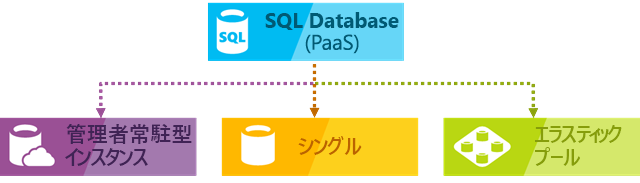
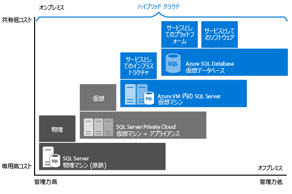

# クラウド SQL Server オプションの選択: Azure SQL (PaaS) Database または Azure VM (IaaS) の SQL Server

Azure では、ホストされるインフラストラクチャ (IaaS) で SQL Server のワークロードを実行するか、ホストされるサービス ([PaaS](https://azure.microsoft.com/overview/what-is-paas/)) として実行することができます。

- [Azure SQL Database](https://azure.microsoft.com/services/sql-database/): 最新のアプリケーション開発用に最適化された SQL Server の Enterprise Edition に基づく SQL データベース エンジン。 Azure SQL Database には、デプロイの選択肢がいくつかあります。
  - 1 つのデータベースを[論理サーバー](sql-database-logical-servers.md)にデプロイできます。
  - [論理サーバー](sql-database-logical-servers.md)の[エラスティック プール](sql-database-elastic-pool.md)にデプロイしてリソースを共有し、コストを削減することができます。 

      > [!NOTE]
      > 1 つのプールされたデータベースを含む Azure SQL Database は、SQL Server のほとんどのデータベースを範囲とする機能を提供します。

      これらのデプロイの選択肢を次の図に示します。

       
  - [Azure SQL Database マネージド インスタンス (プレビュー)](sql-database-managed-instance.md) にデプロイすることができます。 

      > [!NOTE]
      > 両方のバージョンで、Azure SQL Database は、組み込みインテリジェンスや管理など、SQL Server では使用できない追加の機能を追加します。 最初のバージョンでは、Azure SQL Database Managed Instance を使用して、Azure SQL Database は、データベース用の共有リソースおよびインスタンス スコープの追加機能を提供します。 Azure SQL Database マネージド インスタンスは、データベースの最小限の変更または変更なしでのデータベースの移行をサポートします。
- [Azure Virtual Machines 上の SQL Server](https://azure.microsoft.com/services/virtual-machines/sql-server/): Azure で実行される Windows Server または Linux 仮想マシン (VM) にインストールされてホストされているクラウド上の SQL Server で、サービスとしてのインフラストラクチャ (IaaS) とも呼ばれます。 Azure 仮想マシン上の SQL Server は、データベースの変更を行わずにオンプレミスの SQL Server データベースとアプリケーションを移行する場合に適したオプションです。 SQL Server のすべての最新バージョンとエディションは、IaaS 仮想マシンでのインストールに使用できます。 SQL Database からの最も重要な違いは、SQL Server VM が、データベース エンジンを完全に制御できることです。 メンテナンス/修正プログラムの適用を開始するタイミングを選択する、復旧モデルを単純なログまたは一括ログに変更して高速な負荷のないログを有効にする、必要に応じてエンジンを一時停止または開始する、および SQL Server データベース エンジンを完全にカスタマイズすることができます。 この追加のコントロールには、仮想マシンを管理するための追加の責任が付属します。

この記事では、展開の各選択肢がマイクロソフトのデータ プラットフォームにどのように組み込まれているかを説明します。お客様のビジネス要件に適したオプションを判断するのにお役立てください。 この記事を参照することで、コスト削減と管理の最小化のいずれを優先するかに関係なく、最大の関心事項であるビジネス要件に適したアプローチを判断できます。

## マイクロソフトの SQL データ プラットフォーム

Azure とオンプレミス SQL Server データベースの話を始める前にまず、それらがすべてが利用可能であるということを理解しておいてください。 Microsoft のデータ プラットフォームは、SQL Server テクノロジを活用し、物理的なオンプレミスマシン、プライベート クラウド環境、サード パーティにホストされているプライベート クラウド環境、パブリック クラウドのすべてでそのテクノロジを使用できるようにします。 Azure 仮想マシン上の SQL Server によって、環境全体でサーバー製品、開発ツール、専門知識を同じ組み合わせで使用しながら、オンプレミスとクラウド ホスト型のデプロイを組み合わせることで、多様な独自のビジネス ニーズを満たすことができます。

   

図に示すように、各製品は、インフラストラクチャに及ぼす管理のレベル (X 軸) と、データベース レベルの統合と自動化で実現するコスト効率の度合い (Y 軸) によって特徴付けることができます。

アプリケーションの設計時には、アプリケーションの SQL Server の部分をホストするために 4 つの基本的なオプションを使用できます。

* 仮想化されていない物理マシン上の SQL Server
* オンプレミス仮想マシン内の SQL Server (プライベート クラウド)
* Azure 仮想マシン内の SQL Server (Microsoft パブリック クラウド)
* Azure SQL Database (Microsoft パブリック クラウド)

次のセクションでは、Microsoft パブリック クラウドの SQL Server (Azure SQL Database と Azure VM 上の SQL Server) について説明します。 さらに、アプリケーションにとって最適なオプションを決定する一般的なビジネスの要因について確認します。

## Azure SQL Database と Azure VM 上の SQL Server の詳細

**Azure SQL Database** は、Azure クラウドでホストされる、サービスとしてのリレーショナル データベース (DBaaS) で、業界内のカテゴリとしては "*サービスとしてのプラットフォーム (PaaS)*" に分類されます。 [SQL Database](sql-database-technical-overview.md) は、Microsoft が所有、ホスト、保守する標準的なハードウェアおよびソフトウェアをベースにして構築されています。 SQL Database を使用すると、SQL Server での多くの構成が必要な組み込みの機能を使用できます。 SQL Database は従量課金制で利用でき、中断することなくスケールアップまたはスケールアウトして強化できるオプションもあります。 Azure SQL Database は、クラウドで新しいアプリケーションを開発するための理想的な環境です。 [Azure SQL Database マネージド インスタンス](sql-database-managed-instance.md)では、独自のラインセンスを取得できます。 さらに、このオプションはすべての Azure SQL Database の PaaS の利点を提供しますが、以前は SQL VM でのみ使用できた機能を追加します。 これには、ネイティブ仮想ネットワーク (VNet) およびオンプレミス SQL Server との 100% に近い互換性が含まれます。 [マネージド インスタンス](sql-database-managed-instance.md)は、最小限の変更が必要な Azure へのオンプレミス データベースの移行に最適です。 

**Azure Virtual Machines (VM) 上の SQL Server** は、業界内のカテゴリとしては *サービスとしてのインフラストラクチャ (IaaS)* に分類され、クラウド上の仮想マシン内で SQL Server を実行できます。 [SQL Server 仮想マシン](../virtual-machines/windows/sql/virtual-machines-windows-sql-server-iaas-overview.md)は、マイクロソフトが所有、ホスト、保守する標準的なハードウェア上でも実行されます。 VM 上の SQL Server を使用する場合、SQL Server イメージに含まれている SQL Server ライセンスを使用して従量課金で支払いを行うか、単に既存のライセンスを使用することができます。 必要に応じて、VM を停止または再開することもできます。

概して、目的別に最適化された次の 2 つの SQL オプションがあります。

* **Azure SQL Database** は、多数のデータベースをプロビジョニングするための管理コスト全体を最小限に抑えるように最適化されています。 仮想マシン、オペレーティング システム、データベース ソフトウェアを管理する必要がないため、継続的な管理コストが軽減されます。 アップグレード、高可用性、 [バックアップ](sql-database-automated-backups.md)を管理する必要はありません。 一般的には、Azure SQL Database を使用すると、単一の IT または開発リソースが管理するデータベースの数を大幅に増やすことができます。 [エラスティック プール](sql-database-elastic-pool.md)は、テナントの分離、データベース間でリソースを共有することでコストを削減するように拡大縮小する機能などの機能を備えた SaaS マルチ テナント アプリケーション アーキテクチャもサポートします。 [Azure SQL Database マネージド インスタンス](sql-database-managed-instance.md)は、既存のアプリケーションの簡単な移行およびデータベース間でのリソースの共有を可能にするインスタンス スコープの機能のサポートを提供します。
* **Azure VM 上で実行されている SQL Server** は、既存のアプリケーションを Azure に移行したり、ハイブリッド デプロイで既存のオンプレミス アプリケーションをクラウドに拡張したりできるように最適化されています。 さらに、仮想マシン上の SQL Server は従来の SQL Server アプリケーションを開発、テストするためにも使用できます。 Azure VM 上の SQL Server では、専用の SQL Server インスタンスとクラウド ベースの VM に対して完全な管理者権限があります。 仮想マシンの維持に使用できる IT リソースが組織に既にある場合は、Azure VM 内の SQL Server を選択することをお勧めします。 これらの機能を使用すると、高度にカスタマイズされたシステムを構築して、アプリケーション固有のパフォーマンスや可用性の要件に対処できます。

次の表に SQL Database と Azure VM 上の SQL Server の主な特徴をまとめます。

| | Azure SQL Database 論理サーバー、エラスティック プール、および 1 つのデータベース | Azure SQL Database マネージド インスタンス |Azure Virtual Machine SQL Server |
| --- | --- | --- |---|
| **最適な用途:** |最新の安定した SQL Server 機能を使用する必要があり、開発とマーケティングに時間の制約がある新しいクラウド デザイン アプリケーション。 | 最新の新しい SQL Server 機能を使用する必要があり、最小限の変更でクラウドに移行される新しいアプリケーションまたは既存のオンプレミス アプリケーション。  | 変更を最小限に抑えてまたは変更なしでクラウドに迅速に移行する必要がある既存のアプリケーション。 運用環境以外のオンプレミス SQL Server のハードウェアを購入しない場合の迅速な開発およびテスト シナリオ。 |
|  | 高可用性、障害復旧、アップグレードが組み込まれたデータベースを必要とするチーム。 | SQL Database と同じです。 | SQL Server の高可用性、ディザスター リカバリー、修正プログラムの適用を構成、調整、カスタマイズして管理できるチーム。 自動化された機能がいくつか用意されているため、構成と管理が劇的に簡素化されます。 | |
|  | 基盤のオペレーティング システムと構成設定の管理を回避したいチーム。 | SQL Database と同じです。 | 完全な管理者アクセス権がある、カスタマイズされた環境を必要としている。 | |
|  | 4 TB までのデータベース、またはスケールアウト パターンを使用して [水平または垂直方向にパーティション分割](sql-database-elastic-scale-introduction.md#horizontal-and-vertical-scaling) できる、より大きなデータベース。 | SQL Database と同じです。 | 記憶域が 64 TB までの SQL Server インスタンス。 インスタンスでは必要な数のデータベースがサポートされます。 |
| **互換性** | ほとんどのオンプレミス データベース レベルの機能をサポートしています。 | ほとんどすべてのオンプレミス インスタンス レベルおよびデータベース レベルの機能をサポートしています。 | すべてのオンプレミス機能をサポートしています。 |
| **リソース:** | 基盤となるインフラストラクチャの構成と管理のために IT リソースを使用するつもりがなく、アプリケーション層に的を絞りたい。 | SQL Database と同じです。 | 構成と管理のための IT リソースが存在する。 自動化された機能がいくつか用意されているため、構成と管理が劇的に簡素化されます。 |
| **総保有コスト:** | ハードウェアのコストを削減し、管理コストを削減します。 | SQL Database と同じです。 | ハードウェアのコストを削減します。 |
| **ビジネス継続性:** |Azure SQL Database は、[組み込みのフォールト トレランスのインフラストラクチャ機能](sql-database-high-availability.md)以外にも、ビジネス継続性を向上させるために、[自動バックアップ](sql-database-automated-backups.md)、[ポイントインタイム リストア](sql-database-recovery-using-backups.md#point-in-time-restore)、[geo リストア](sql-database-recovery-using-backups.md#geo-restore)、[フェールオーバー グループとアクティブ geo レプリケーション](sql-database-geo-replication-overview.md)などの機能を提供します。 詳細については、 [SQL Database のビジネス継続性の概要](sql-database-business-continuity.md)に関する記事を参照してください。 | SQL Database と同じ機能に加えて、ユーザーによって開始されるコピーのみのバックアップを使用できます。 | Azure VM 上の SQL Server では、データベース固有のニーズに合わせて、高可用性とディザスター リカバリーのソリューションを設定できます。 そのため、アプリケーション向けにシステムを大幅に最適化できます。 必要なときに自分でフェールオーバーをテストして実行できます。 詳細については、「 [Azure Virtual Machines における SQL Server の高可用性と障害復旧](../virtual-machines/windows/sql/virtual-machines-windows-sql-high-availability-dr.md)」を参照してください。 |
| **ハイブリッド クラウド:** |オンプレミス アプリケーションから Azure SQL Database 内のデータにアクセスできます。 | Azure Express Route または VPN Gateway を使った、オンプレミス環境への[ネイティブ仮想ネットの実装](https://docs.microsoft.com/en-us/azure/sql-database/sql-database-managed-instance-vnet-configuration)と接続。 | Azure VM 上の SQL Server を使用して、アプリケーションの一部をクラウド上で実行し、一部をオンプレミスで実行することができます。 たとえば、 [Azure Virtual Network](../virtual-network/virtual-networks-overview.md)を介してオンプレミス ネットワークと Active Directory ドメインをクラウドに拡張できます。 さらに、 [Azure の SQL Server データ ファイル](http://msdn.microsoft.com/library/dn385720.aspx)を使用して、Azure Storage にオンプレミスのデータ ファイルを格納することができます。 詳細については、「 [SQL Server 2014 ハイブリッド クラウドの概要](http://msdn.microsoft.com/library/dn606154.aspx)」を参照してください。 |
|  | サブスクライバーとして、データをレプリケートするための [SQL Server のトランザクション レプリケーション](https://msdn.microsoft.com/library/mt589530.aspx) がサポートされます。 | Azure SQL Database マネージド インスタンスでは、レプリケーションはサポートされていません。 | データをレプリケートするための [SQL Server のトランザクション レプリケーション](https://msdn.microsoft.com/library/mt589530.aspx)、[AlwaysOn 可用性グループ](../virtual-machines/windows/sql/virtual-machines-windows-sql-high-availability-dr.md)、Integration Services、ログ配布が完全にサポートされます。 また、従来の SQL Server バックアップも完全にサポートされます。 | |
|  | | |

## Azure SQL Database と Azure VM 上の SQL Server のいずれかを選択するときのビジネスの要因
### コスト
現金が潤沢にないスタートアップ企業や厳しい予算で経営している老舗企業では、資金調達での限界がデータベースをホストする方法を決定する主な要因になることがあります。 このセクションではまず、SQL Database と Azure VM 上の SQL Server の 2 つのリレーショナル データベース オプションに関する Azure の課金とライセンスの基礎について説明します。 また、アプリケーションの総コストの計算についても説明します。

#### 課金とライセンスの基礎

現在、**SQL Database** は、サービスとして販売され、リソースの料金が異なる複数のサービス レベルで利用でき、選択したサービス階層とパフォーマンス レベルに基づく固定率で時間単位で課金されます。 SQL Database マネージド インスタンスでは、独自のラインセンスも取得できます。 現在所有しているライセンスの移行の詳細については、「 [Azure でのソフトウェア アシュアランスによるライセンス モビリティ](https://azure.microsoft.com/pricing/license-mobility/)」を参照してください。 さらに、インターネット トラフィックの送信も通常の [データ転送料金](https://azure.microsoft.com/pricing/details/data-transfers/)で課金されます。 サービス レベルとパフォーマンス レベルを動的に調整して、アプリケーションのさまざまなスループット ニーズを満たすことができます。 現在のサポートされているサービス レベルの最新情報については、[DTU ベースの購入モデル](sql-database-service-tiers-dtu.md)と[仮想コアベースの購入モデル](sql-database-service-tiers-vcore.md)に関する記事を参照してください。 [エラスティック プール](sql-database-elastic-pool.md)を作成して、データベース インスタンス間でパフォーマンス リソースを共有し、コストを削減して、ピーク時の使用に対応することもできます。

**SQL Database**では、データベース ソフトウェアの自動的な構成、修正プログラムの適用、およびアップグレードがマイクロソフトによって行われるため、管理コストが軽減されます。 また、 [組み込みのバックアップ](sql-database-automated-backups.md) 機能は、特に、多数のデータベースがある場合の大幅なコスト削減に役立ちます。 

**Azure VM 上の SQL Server**では、プラットフォームによって提供される、いずれかの SQL Server イメージ (ライセンスが付属) を使用するか、所有している SQL Server ライセンスを移行することができます。 サポートされている SQL Server のバージョン (2008R2、2012、2014、2016) とエディション (Developer、Express、Web、Standard、Enterprise) はすべて利用できます。 さらに、ライセンス持ち込み (BYOL) バージョンのイメージも利用できます。 Azure によって提供されるイメージを使用する場合、運用コストは、VM のサイズと選択する SQL Server のエディションによって決まります。 VM のサイズや SQL Server のエディションにかかわらず、ユーザーは、SQL Server および Windows Server または Linux Server の 1 分あたりのライセンス費用と VM ディスクの Azure Storage コストを支払います。 1 分あたりの課金のオプションでは、SQL Server の追加ライセンスを購入することなく、必要なだけ SQL Server を使用することができます。 Azure に SQL Server のライセンスを移行する場合は、サーバー コストとストレージ コストのみに対して課金されます。 現在所有しているライセンスの移行の詳細については、「 [Azure でのソフトウェア アシュアランスによるライセンス モビリティ](https://azure.microsoft.com/pricing/license-mobility/)」を参照してください。 さらに、インターネット トラフィックの送信も通常の [データ転送料金](https://azure.microsoft.com/pricing/details/data-transfers/)で課金されます。

#### アプリケーションの総コストの計算
クラウド プラットフォームの使用を開始する際のアプリケーションのランニング コストには、新規開発コストと継続的管理コストのほか、パブリック クラウド プラットフォームのサービス コストが含まれます。

**Azure SQL Database を使用する場合:**

- 高度に最小化された管理コスト
- 移行されるアプリケーションの制限された開発コスト
- SQL Database サービス コスト
- ハードウェアの購入コストは含まれない

**Azure VM 上の SQL Server を使用する場合:**

- 高い管理コスト
- 移行されるアプリケーションの開発コストなしに制限される
- 仮想マシン サービス コスト
- SQL Server ライセンス コスト
- ハードウェアの購入コストは含まれない

価格の詳細については、次のリソースを参照してください。

* [SQL Database の価格](https://azure.microsoft.com/pricing/details/sql-database/)
* [SQL](https://azure.microsoft.com/pricing/details/virtual-machines/#sql) および [Windows](https://azure.microsoft.com/pricing/details/virtual-machines/#windows) 向けの [Virtual Machines の価格](https://azure.microsoft.com/pricing/details/virtual-machines/)
* [Azure 料金計算ツール](https://azure.microsoft.com/pricing/calculator/)

### 管理
多くの企業にとって、クラウド サービスに切り替えるかどうかの決定には、コストだけでなく、管理の複雑さの軽減も重要な要素です。 IaaS および PaaS では、マイクロソフトが、基盤となるインフラストラクチャを管理して、すべてのデータを自動的にレプリケートし、ディザスター リカバリーを提供し、さらにデータベース ソフトウェアの構成とアップグレード、負荷分散の管理、データ センター内のサーバーに障害が発生した場合の透過的なフェールオーバーを実行します。 

- **Azure SQL Database** を使用すると、ユーザーは引き続きデータベースを管理できますが、データベース エンジン、サーバー オペレーティング システム、ハードウェアを管理する必要はありません。  引き続き管理できるアイテムの例として、データベースとログイン、インデックスとクエリのチューニング、監査とセキュリティなどがあります。 さらに、別のデータ センターへの高可用性を構成するには、最小限の構成と管理が必要です。
- **Azure VM 上の SQL Server**では、オペレーティング システムと SQL Server インスタンスの構成を全面的に制御できます。 VM を使用する場合、オペレーティング システムとデータベース ソフトウェアの更新やアップグレードのタイミングに加えて、ウイルス対策などの追加ソフトウェアのインストールのタイミングは、ユーザーが決定します。 修正プログラムの適用、バックアップ、高可用性の実現を大幅に簡素化するために、自動化された機能がいくつか用意されています。 また、VM のサイズ、ディスクの数、ストレージの構成を制御できます。 Azure では、必要に応じて VM のサイズを変更できます。 詳細については、「 [Azure の仮想マシンおよびクラウド サービスのサイズ](../virtual-machines/windows/sizes.md)」を参照してください。 

### サービス レベル アグリーメント (SLA)
多くの IT 部門では、サービス レベル アグリーメント (SLA) の稼働時間に関する義務を遂行することは、最優先事項です。 このセクションでは、各データベースのホスト オプションに適用される SLA について説明します。

**SQL Database** の場合、マイクロソフトは、99.99% の可用性の SLA を提供しています。 最新情報については、 [サービス レベル アグリーメント](https://azure.microsoft.com/support/legal/sla/sql-database/)に関するページを参照してください。 

**Azure VM 上で実行される SQL Server**では、仮想マシンのみを対象に、可用性 99.95% の SLA が提供されます。 この SLA は VM 上で実行される (SQL Server などの) プロセスは対象としておらず、可用性セットに少なくとも 2 つの VM インスタンスをホストしている必要があります。 最新情報については、 [VM の SLA](https://azure.microsoft.com/support/legal/sla/virtual-machines/)に関するページを参照してください。 VM 内のデータベース高可用性 (HA) を実現するには、[AlwaysOn 可用性グループ](https://docs.microsoft.com/sql/database-engine/availability-groups/windows/always-on-availability-groups-sql-server)など、SQL Server でサポートされているいずれかの高可用性オプションを構成する必要があります。 サポートされている高可用性オプションを使用した場合、SLA を追加することはできないものの、ほぼ 99.99% のデータベース可用性が実現されます。

### Azure へ移行するタイミング
**SQL Database の論理サーバー、エラスティック プール、および単一のデータベース**は、開発者の生産性と新しいソリューションの製品化に要する時間の短縮が重要な、クラウド用に設計されたアプリケーションに最適なソリューションです。 プログラムによる DBA のような機能を備えることで、基になるオペレーティング システムとデータベースを管理する必要性が減少するため、クラウドの設計者と開発者に最適です。 

**SQL Database マネージド インスタンス**は、Azure SQL Database への既存のアプリケーションの移行を大幅に簡素化し、移行されたデータベース アプリケーションを Azure ですばやく市場に投入できるようにします。

**Azure VM 上で実行される SQL Server** は、既存または新規のアプリケーションに、大規模なデータベース、SQL Server または Windows/Linux の全機能へのアクセスのいずれかが必要で、新しいオンプレミス ハードウェアの取得にかかる時間とコストを回避したい場合に最適です。 また、既存のオンプレミス アプリケーションとデータベースを Azure にそのまま移行する場合で、Azure SQL Database マネージド インスタンスが適合しない場合にも適しています。 プレゼンテーション層、アプリケーション層、およびデータ層を変更する必要がないため、既存のソリューションを再設計する時間と予算が節約されます。 その一方で、すべてのソリューションを Azure に移行し、Azure プラットフォームで必要な一部のパフォーマンスの最適化に集中できます。 詳細については、 [Azure Virtual Machines 上の SQL Server のパフォーマンスに関するベスト プラクティス](../virtual-machines/windows/sql/virtual-machines-windows-sql-performance.md)に関するページを参照してください。

## まとめ
この記事では、SQL Database と Azure Virtual Machines (VM) 上の SQL Server について詳しく紹介し、意思決定に影響する可能性のある一般的なビジネス要因について説明しました。 以下は、検討に役立つ提案をまとめたものです。

次の状況に該当する場合は、 **Azure SQL Database** を選択します。

* クラウド サービスによって実現されるコスト削減やパフォーマンス最適化を活用するために、クラウドベースの新しいアプリケーションを構築しようとしている。 このアプローチでは、フル マネージドのクラウド サービスの利点を活かして、最初の市場投入までの時間を短縮し、長期的なコスト最適化を実現できます。
* マイクロソフトのサービスを利用して、データベースで一般的な管理操作を実行し、データベースの可用性の SLA を強化する場合。
* 既存のアプリケーションをそのまま Azure SQL Database マネージド インスタンスに移行し、SQL Server や高度なセキュリティとネットワークで追加のパリティを利用する場合。 マネージド インスタンスは、新規および既存のアプリケーションに最適です。

次の状況に該当する場合は、 **Azure VM 上の SQL Server** を選択します。

* クラウドに移行または拡張したい既存のオンプレミス アプリケーションがある場合、または 4 TB を超えるエンタープライズ アプリケーションを構築したい場合。 このアプローチでは、選択した SQL Server のバージョンとエディションの使用、大規模なデータベース容量、SQL Server と Windows/Linux に対する完全な制御、オンプレミスへの安全なトンネリングの利点を活かすことができます。 このアプローチを使用すると、既存のアプリケーションの開発と修正にかかるコストを最小限に抑えられます。
* 既存の IT リソースがあり、最終的には修正プログラムの適用、バックアップ、データベースの高可用性の実現を自身で行える場合。 いくつかの自動化された機能によって、これらの操作を大幅に簡素化できることにご注目ください。 

## 次の手順

* SQL Database の使用を開始するには、「[初めての Azure SQL Database](sql-database-get-started-portal.md)」を参照してください。
* 「 [SQL Database の価格](https://azure.microsoft.com/pricing/details/sql-database/)」を参照してください。
* Azure VM での SQL Server の基本的な使い方については、 [Azure での SQL Server 仮想マシンのプロビジョニング](../virtual-machines/windows/sql/virtual-machines-windows-portal-sql-server-provision.md) に関する記事を参照してください。