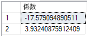

# <a name="quickstart-create-and-train-a-predictive-model-in-r-with-azure-sql-database-machine-learning-services-preview"></a>クイック スタート:R で Azure SQL Database Machine Learning Services (プレビュー) を使用して予測モデルを作成およびトレーニングする

このクイックスタートでは、R を使用して予測モデルを作成してトレーニングし、そのモデルをお使いのデータベースのテーブルに保存します。その後、そのモデルを使用し、Azure SQL Database の Machine Learning Services (と R) を使用して新しいデータから値を予測します。

[!INCLUDE[ml-preview-note](../../includes/sql-database-ml-preview-note.md)]

## <a name="prerequisites"></a>前提条件

- アクティブなサブスクリプションが含まれる Azure アカウント。 [無料でアカウントを作成できます](https://azure.microsoft.com/free/?ref=microsoft.com&utm_source=microsoft.com&utm_medium=docs&utm_campaign=visualstudio)。
- [サーバーレベルのファイアウォール規則](sql-database-server-level-firewall-rule.md)がある [Azure SQL データベース](sql-database-single-database-get-started.md)
- R が有効な [Machine Learning Services](sql-database-machine-learning-services-overview.md)。 [プレビューにサインアップしてください](sql-database-machine-learning-services-overview.md#signup)。
- [SQL Server Management Studio](/sql/ssms/sql-server-management-studio-ssms) (SSMS)

> [!NOTE]
> パブリック プレビュー期間中は、Microsoft がお客様のオンボードを行い、既存のデータベースまたは新しいデータベースに対して機械学習を有効にします。

この例では、単純な回帰モデルを使用して、R に含まれる **cars** データセットを使用して、速度に基づいて自動車の停止距離を予測します。

> [!TIP]
> R ランタイムには多くのデータセットが含まれています。インストールされているデータセットの一覧を取得するには、R コマンド プロンプトから「`library(help="datasets")`」と入力します。

## <a name="create-and-train-a-predictive-model"></a>予測モデルを作成してトレーニングする

**cars** データセットの自動車速度データには、**dist** と **speed** という 2 つの数値列が含まれます。 このデータには、さまざまな速度での停止の観測値が複数含まれています。 このデータから、自動車の速度と自動車が停止するまでに必要な距離との間の関係を表す線形回帰モデルを作成します。

線形モデルの要件は単純です。
- 従属変数 *speed* と独立変数 *distance* の間の関係を表す数式を定義します。
- モデルのトレーニングに使用する入力データを提供します。

> [!TIP]
> 線形モデルの最新の情報に更新する必要がある場合は、rxLinMod を使用したモデルの調整プロセスについて説明しているこのチュートリアルをご覧ください。「[Fitting Linear Models (線形モデルの当てはめ)](https://docs.microsoft.com/machine-learning-server/r/how-to-revoscaler-linear-model)」

以降の手順では、トレーニング データの設定、回帰モデルの作成、トレーニング データを使用したモデルのトレーニングを実行した後、SQL テーブルにそのモデルを保存します。

1. **SQL Server Management Studio** を開き、SQL データベースに接続します。

   接続についてご不明な点がある場合は、「[クイック スタート: SQL Server Management Studio を使用して Azure SQL データベースに接続しクエリを実行する](sql-database-connect-query-ssms.md)」をご覧ください。

1. トレーニング データを保存するための **CarSpeed** テーブルを作成します。

    ```sql
    CREATE TABLE dbo.CarSpeed (
        speed INT NOT NULL
        , distance INT NOT NULL
        )
    GO
    
    INSERT INTO dbo.CarSpeed (
        speed
        , distance
        )
    EXECUTE sp_execute_external_script @language = N'R'
        , @script = N'car_speed <- cars;'
        , @input_data_1 = N''
        , @output_data_1_name = N'car_speed'
    GO
    ```

1. `rxLinMod` を使用して回帰モデルを作成します。 

   モデルをビルドするには、R コード内で式を定義し、そのトレーニング データ **CarSpeed** を入力パラメーターとして渡します。

    ```sql
    DROP PROCEDURE IF EXISTS generate_linear_model;
    GO
    CREATE PROCEDURE generate_linear_model
    AS
    BEGIN
      EXECUTE sp_execute_external_script
      @language = N'R'
      , @script = N'
    lrmodel <- rxLinMod(formula = distance ~ speed, data = CarsData);
    trained_model <- data.frame(payload = as.raw(serialize(lrmodel, connection=NULL)));
    '
      , @input_data_1 = N'SELECT [speed], [distance] FROM CarSpeed'
      , @input_data_1_name = N'CarsData'
      , @output_data_1_name = N'trained_model'
      WITH RESULT SETS ((model VARBINARY(max)));
    END;
    GO
    ```

     rxLinMod の第 1 引数は *formula* パラメーターです。このパラメーターで、distance を speed の従属変数として定義します。 入力データは `CarsData` 変数に格納されます。この変数は、SQL クエリによって入力されます。

1. 後で予測に使用できるように、モデルの格納先となるテーブルを作成します。 

   モデルを作成する R パッケージの出力は通常、**バイナリ オブジェクト**になります。そのため、テーブルには **VARBINARY(max)** 型の列が必要です。

    ```sql
    CREATE TABLE dbo.stopping_distance_models (
        model_name VARCHAR(30) NOT NULL DEFAULT('default model') PRIMARY KEY
        , model VARBINARY(max) NOT NULL
        );
    ```

1. 今すぐストアド プロシージャを呼び出し、モデルを生成してテーブルに保存します。

   ```sql
   INSERT INTO dbo.stopping_distance_models (model)
   EXECUTE generate_linear_model;
   ```

   このコードを 2 度実行すると次のエラーが返されることに注意してください。

   ```text
   Violation of PRIMARY KEY constraint...Cannot insert duplicate key in object bo.stopping_distance_models
   ```

   このエラーを回避するためのオプションの 1 つとして、新しいモデルごとに名前を更新します。 たとえば、よりわかりやすい名前に変更したり、モデルの種類や作成日などを含めたりすることができます。

   ```sql
   UPDATE dbo.stopping_distance_models
   SET model_name = 'rxLinMod ' + FORMAT(GETDATE(), 'yyyy.MM.HH.mm', 'en-gb')
   WHERE model_name = 'default model'
   ```

## <a name="view-the-table-of-coefficients"></a>係数のテーブルを表示する

一般に、ストアド プロシージャ [sp_execute_external_script](https://docs.microsoft.com/sql/relational-databases/system-stored-procedures/sp-execute-external-script-transact-sql) からの R の出力は、単一のデータ フレームに限られます。 ただしデータ フレームに加えて、他の種類の出力 (スカラーなど) を返すことはできます。

たとえば、モデルをトレーニングすると同時に、そのモデルの係数のテーブルをすぐに表示したいとします。 そのためには、メインの結果セットとして係数のテーブルを作成し、トレーニング済みのモデルを SQL 変数で出力することができます。 その変数を呼び出せばモデルをすぐに再利用できます。または、次に示すように、モデルをテーブルに保存することもできます。

```sql
DECLARE @model VARBINARY(max)
    , @modelname VARCHAR(30)

EXECUTE sp_execute_external_script @language = N'R'
    , @script = N'
speedmodel <- rxLinMod(distance ~ speed, CarsData)
modelbin <- serialize(speedmodel, NULL)
OutputDataSet <- data.frame(coefficients(speedmodel));
'
    , @input_data_1 = N'SELECT [speed], [distance] FROM CarSpeed'
    , @input_data_1_name = N'CarsData'
    , @params = N'@modelbin varbinary(max) OUTPUT'
    , @modelbin = @model OUTPUT
WITH RESULT SETS(([Coefficient] FLOAT NOT NULL));

-- Save the generated model
INSERT INTO dbo.stopping_distance_models (
    model_name
    , model
    )
VALUES (
    'latest model'
    , @model
    )
```

**結果**



## <a name="score-new-data-using-the-trained-model"></a>トレーニング済みのモデルを使用して新しいデータをスコアリングする

*スコアリング*は、データ サイエンスで使用される用語で、トレーニング済みのモデルに取り込まれた新しいデータに基づいて、予測、確率、またはその他の値を生成することを意味します。 前のセクションで作成したモデルを使用して、新しいデータに対して予測のスコアリングを行います。

元のトレーニング データの速度が毎時 25 マイルまでしかないことにお気付きでしょうか。 これは、元のデータが 1920 年の実験をベースにしているためです。 1920 年代の自動車が仮に 60 mph や 100 mph もの速度で走行した場合、停止距離はどのぐらいになるのでしょうか。 この疑問に答えるために、新たにいくつかの速度値をモデルに指定できます。

1. 新しい速度データを含んだテーブルを作成します。

   ```sql
    CREATE TABLE dbo.NewCarSpeed (
        speed INT NOT NULL
        , distance INT NULL
        )
    GO
    
    INSERT dbo.NewCarSpeed (speed)
    VALUES (40)
        , (50)
        , (60)
        , (70)
        , (80)
        , (90)
        , (100)
   ```

2. これらの新しい速度値から停止距離を予測します。

   モデルの基礎になっているのは、**RevoScaleR** パッケージの一部として提供されている **rxLinMod** アルゴリズムであるため、一般的な R の `predict` 関数ではなく、[rxPredict](https://docs.microsoft.com/machine-learning-server/r-reference/revoscaler/rxpredict) 関数を呼び出すことになります。

   このサンプル スクリプトは次のとおりです。
   - SELECT ステートメントを使用してテーブルから単一のモデルを取得します。
   - それを入力パラメーターとして渡します。
   - そのモデルに対して `unserialize` 関数を呼び出します。
   - `rxPredict` 関数と適切な引数をモデルに適用します。
   - 新しい入力データを提供します。

   > [!TIP]
   > リアルタイム スコアリングについては、RevoScaleR に用意されている[シリアル化関数](https://docs.microsoft.com/machine-learning-server/r-reference/revoscaler/rxserializemodel)に関するページを参照してください。

   ```sql
    DECLARE @speedmodel VARBINARY(max) = (
            SELECT model
            FROM dbo.stopping_distance_models
            WHERE model_name = 'latest model'
            );
    
    EXECUTE sp_execute_external_script @language = N'R'
        , @script = N'
    current_model <- unserialize(as.raw(speedmodel));
    new <- data.frame(NewCarData);
    predicted.distance <- rxPredict(current_model, new);
    str(predicted.distance);
    OutputDataSet <- cbind(new, ceiling(predicted.distance));
    '
        , @input_data_1 = N'SELECT speed FROM [dbo].[NewCarSpeed]'
        , @input_data_1_name = N'NewCarData'
        , @params = N'@speedmodel varbinary(max)'
        , @speedmodel = @speedmodel
    WITH RESULT SETS((
                new_speed INT
                , predicted_distance INT
                ));
   ```

   **結果**

   

> [!NOTE]
> このサンプル スクリプトでは、テスト フェーズ中に `str` 関数を追加して、R から返されるデータのスキーマをチェックします。このステートメントは後から削除することができます。
>
> R スクリプトで使用される列名は、ストアド プロシージャの出力に必ずしも渡されるとは限りません。 ここでは、WITH RESULTS 句で、いくつかの新しい列名を定義しています。

## <a name="next-steps"></a>次のステップ

Azure SQL Database Machine Learning Services と R (プレビュー) の詳細については、次の記事を参照してください。

- [Azure SQL Database Machine Learning Services と R (プレビュー)](sql-database-machine-learning-services-overview.md)
- [Azure SQL Database Machine Learning Services (プレビュー) で簡単な R スクリプトを作成して実行する](sql-database-quickstart-r-create-script.md)
- [Machine Learning Services (プレビュー) を使用して Azure SQL Database に高度な R 関数を記述する](sql-database-machine-learning-services-functions.md)
- [Azure SQL Database Machine Learning Services (プレビュー) での R および SQL データの処理](sql-database-machine-learning-services-data-issues.md)
