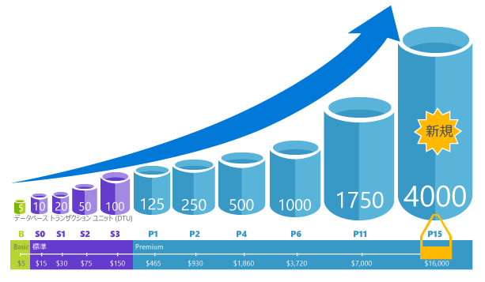
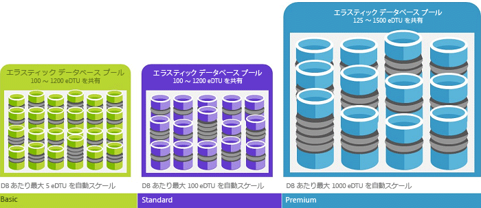

# Azure SQL Database の購入モデルとリソース 

[Azure SQL Database](sql-database-technical-overview.md) の論理サーバーには、コンピューティング、ストレージ、IO リソースに関して 2 つの購入モデルが用意されています。1 つは DTU ベースの購入モデルで、もう 1 つは仮想コアベースの購入モデルです。 

> [!NOTE]
> Azure SQL Database の[マネージド インスタンス](sql-database-managed-instance.md)に用意されている購入モデルは仮想コア ベースのみです。

次の表とグラフは、この 2 つの購入モデルを比較しています。

> [!IMPORTANT]
> 仮想コア ベースの購入モデルについては、[仮想コア ベースの購入モデル](sql-database-service-tiers-vcore.md)に関する記事を参照してください。

|**購入モデル**|**説明**|**最適な用途**|
|---|---|---|
|DTU ベースのモデル|このモデルは、コンピューティング、ストレージ、および IO リソースのバンドルされた測定値に基づいています。 パフォーマンス レベルは、単一データベースの場合はデータベース トランザクション ユニット (DTU) で、エラスティック プールの場合はエラスティック データベース トランザクション ユニット (eDTU) で表されます。 DTU と eDTU の詳細については、[DTU と eDTU の概要](sql-database-service-tiers.md#what-are-database-transaction-units-dtus)に関する記事をご覧ください。|シンプルな構成済みリソースのオプションを希望するお客様に最適です。| 
|仮想コアベースのモデル|このモデルでは、コンピューティングおよびストレージ リソースを個別にスケーリングできます。 また、SQL Server 向けの Azure ハイブリッド特典を使用して、コストを削減することもできます。|柔軟性、制御、および透明性を重視するお客様に最適です。|
||||  

## 仮想コアベースの購入モデル 

仮想コアは、ハードウェアの世代の選択が可能な論理 CPU を表します。 仮想コアベースの購入モデルでは、個々のリソース使用量において柔軟性、管理性、透明性が実現されており、オンプレミスのワークロード要件をクラウドに容易に移行できます。 このモデルでは、ワークロードの必要性に基づいて、コンピューティング、メモリ、ストレージをスケーリングできます。 仮想コアベースの購入モデルでは、[単一データベース](sql-database-single-database-scale.md)と[エラスティック プール](sql-database-elastic-pool.md)の両方について、お客様が General Purpose または Business Critical のいずれかのサービス レベルを選択できます。 

仮想コア ベースの購入モデルでは、コンピューティングおよびストレージ リソースを個別にスケーリングし、オンプレミスのパフォーマンスを一致させて、コストを最適化できます。 データベースまたはエラスティック プールが使用する DTU が 300 を超える場合は、仮想コアに変換することで、コストを抑えられる可能性があります。 任意の API または Azure Portal を使用して、ダウンタイムなしで変換できます。 しかし、変換は必須ではありません。 DTU 購入モデルがご自身のパフォーマンスおよびビジネス要件を満たしている場合は、このモデルを引き続き使用してください。 DTU モデルから仮想コア モデルに変換することを決めたら、Standard レベルでは 100 DTU ごとに General Purpose レベルの 1 つ以上の仮想コア、Premium レベルでは 125 DTU ごとに Business Critical レベルの 1 つ以上の仮想コアが必要であるという大まかな基準を目安に、パフォーマンス レベルを選択します。

仮想コアベースの購入モデルでは、お客様には次のものに対してお支払いいただきます。
- コンピューティング (サービス レベル + 仮想コア数 + ハードウェアの世代)*
- データおよびログ ストレージの種類と容量 
- IO 数**
- バックアップ ストレージ (RA-GRS)** 

\* 最初のパブリック プレビューでは、Gen 4 論理 CPU は、Intel E5-2673 v3 (Haswell) 2.4 GHz のプロセッサを基盤とします

\*\* プレビュー段階では、7 日間のバックアップと IO が無料です。

> [!IMPORTANT]
> コンピューティング、IO、データおよびログ ストレージは、データベースまたはエラスティック プールごとに課金されます。 バックアップ ストレージはデータベースごとに課金されます。 マネージド インスタンス料金の詳細については、[Azure SQL Database Managed Instance](sql-database-managed-instance.md) に関するページをご覧ください。
> **リージョンの制限:** 仮想コア ベースの購入モデルは、西ヨーロッパ、フランス中部、英国南部、英国西部、オーストラリア南東部の各リージョンでは利用できません。

## DTU ベースの購入モデル

データベース トランザクション ユニット (DTU) は、CPU、メモリ、読み取り、書き込みの測定値を組み合わせて算出されます。 DTU ベースの購入モデルは、事前構成済みコンピューティング リソースと付属ストレージのバンドル セットを提供することで、さまざまなレベルのアプリケーション パフォーマンスを実現します。 事前構成済みバンドルと毎月支払う料金が決まっているというシンプルさを好むお客様については、この DTU ベースのモデルがニーズに適している可能性があります。 DTU ベースの購入モデルでは、[単一データベース](sql-database-single-database-scale.md)と[エラスティック プール](sql-database-elastic-pool.md)の両方について、お客様が **Basic**、**Standard**、**Premium** のいずれかのサービス レベルを選択できます。 

### データベース トランザクション ユニット (DTU) とは
[サービス層](sql-database-single-database-scale.md)内の特定のパフォーマンス レベルの単一の Azure SQL Database の場合、Microsoft では、そのデータベース (Azure クラウド内の他のデータベースから独立した) に対し、特定のレベルのリソースと予測可能なレベルのパフォーマンスの提供を保証します。 リソースの量は、データベース トランザクション ユニット (DTU) の数として計算され、コンピューティング、ストレージ、および IO リソースのバンドルされたメジャーです。 これらのリソース間の比率は、最初に一般的な現実の OLTP ワークロードとして設計された [OLTP ベンチマーク ワークロード](sql-database-benchmark-overview.md)によって特定されます。 ワークロードがこれらのいずれかのリソースの量を超えると、スループットが調整され、パフォーマンスが低下し、タイムアウトが発生します。 ワークロードによって使用されるリソースは、Azure クラウド内の他の SQL Database で使用できるリソースには影響せず、他のワークロードによって使用されるリソースは、SQL Database で使用できるリソースに影響しません。

DTU は、さまざまなパフォーマンス レベルとサービス層の Azure SQL Database 間のリソースの相対量を理解するために最も役立ちます。 たとえば、データベースのパフォーマンス レベルを上げて DTU を 2 倍にすると、そのデータベースが利用できるリソースを 2 倍にしたのと同じ効果が得られます。 たとえば、DTU が 1750 である Premium P11 データベースは、DTU が 5 である Basic データベースと比べ、DTU 換算で 350 倍の計算能力を持ちます。  

ワークロードのリソース (DTU) の使用量の詳細を把握するには、[Azure SQL Database Query Performance Insight](sql-database-query-performance.md) を使用して、次の操作を実行します。

- パフォーマンス向上のためのチューニングの対象となる可能性がある CPU/期間/実行回数の上位クエリを特定します。 たとえば、IO 負荷の高いクエリは、特定のサービス層とパフォーマンス レベルで使用可能なメモリを効率的に使用するために、[メモリ内の最適化手法](sql-database-in-memory.md)を使用すると利点が得られる可能性があります。
- クエリの詳細にドリルダウンして、そのテキストやリソース使用率の履歴を表示します。
- [SQL Database Advisor](sql-database-advisor.md) によって実行されるアクションを示すアクセス パフォーマンス チューニングの推奨事項。

[DTU サービス層](sql-database-service-tiers-dtu.md)はいつでも変更することが可能で、アプリケーションのダウンタイムも最小限に留められます (通常、平均で 4 秒未満)。 特に使用パターンが比較的予測可能である場合、多くのビジネスとアプリについては、データベースを作成し、要求に応じてパフォーマンスを調整する能力は十分です。 しかし、使用パターンが予測できない場合、コストおよびビジネス モデルを管理するのが難しくなる可能性があります。 このシナリオでは、プール内の複数のデータベース間で共有される特定の数の DTU でエラスティック プールを使用します。

### エラスティック データベース トランザクション ユニット (eDTU) とは
常に使用できる SQL Database にとって常に必要とは限らない専用のリソース (DTU) セットを提供する代わりに、SQL Database サーバー上の[エラスティック プール](sql-database-elastic-pool.md)に、これらのデータベース間でリソースのプールを共有するデータベースを配置できます。 エラスティック プール内の共有リソースは、エラスティック データベース トランザクション ユニット (eDTU) によって測定されます。 エラスティック プールは、多種多様な予測できない使用パターンを持つ複数のデータベースに対するパフォーマンス目標を管理するための、簡単でコスト効率に優れたソリューションを提供します。 エラスティック プールは、プール内の 1 つのデータベースによってリソースを消費できないことを保証する一方で、プール内の各データベースが常に、最低限必要な量の利用可能なリソースを持っていることを保証します。 

プールには、設定価格に合わせて、設定された eDTU 数が与えられます。 エラスティック プール内の個々のデータベースには、構成された境界内で自動スケールを行う柔軟性が与えられます。 データベースの負荷が増加すると、eDTU の消費量を増やして需要に対応します。 データベースの負荷が減少すると、eDTU の消費が減ります。 負荷のないデータベースは eDTU を消費しません。 データベースごとではなく、プール全体のリソースをプロビジョニングすることにより、管理タスクが簡素化され、プールの予算が予測可能になります。

データベースを停止せず、プール内のデータベースに影響を及ぼさずに、既存のプールに eDTU を追加できます。 同様に、不要になった eDTU は、いつでも既存のプールから削除できます。 プールのデータベースを増減できるほか、負荷が大きいときにデータベースが使用できる eDTU の量を制限して、他のデータベース用の eDTU を確保することもできます。 データベースのリソース使用率が低いと予測できる場合は、プールから削除して、予測可能な量の必要リソースを備えた単一データベースとして構成できます。

### ワークロードで必要とされる DTU の数を判断する方法
既に存在するオンプレミスのワークロードや、SQL Server 仮想マシンのワークロードを Azure SQL Database に移行することを検討している場合には、[DTU Calculator](http://dtucalculator.azurewebsites.net/) を使用すると、必要な DTU のおおよその数がわかります。 既存の Azure SQL Database ワークロードについては、[SQL Database Query Performance Insight](sql-database-query-performance.md) を使えばデータベース リソースの消費量 (DTU) を把握でき、ワークロードを最適化するための深い洞察が得られます。 このほか、[sys.dm_db_ resource_stats](https://msdn.microsoft.com/library/dn800981.aspx) DMV を使用して、過去 1 時間のリソース消費量を確認することもできます。 また、カタログ ビュー [sys.resource_stats](http://msdn.microsoft.com/library/dn269979.aspx) は過去 14 日間のリソース消費量を表示しますが、こちらはデータの精度がやや低く、5 分間の平均となります。

### リソースのエラスティック プールを使うメリット
プールは、多数のデータベースが一定のパターンで使用されている場合に適しています。 あるデータベースは、使用が急増することはあまりなく、使用量平均が低いパターンの特徴を持っています。 SQL Database は、既存の SQL Database サーバー内にあるデータベースのリソース使用量の履歴を自動的に評価し、Azure ポータルでのプールの適切な構成を推奨します。 詳細については、「[エラスティック プールの使用に適した状況](sql-database-elastic-pool.md)」を参照してください。

### DTU が最大数に達した場合に起こること
選択したサービス層/パフォーマンス レベルで許可されている最大までデータベース ワークロードを実行するために必要なリソースを提供できるよう、パフォーマンス レベルが調整、制御されます。 ワークロードが CPU/データ IO/ログ IO いずれかの制限に達した場合でも、許可されている最大レベルのリソースを引き続き利用できますが、クエリの遅延が増加する可能性が高くなります。 上限に達してもエラーにはなりませんが、ワークロードが遅くなり、遅延が深刻になった場合はクエリのタイムアウトが発生するようになります。許可される同時ユーザー セッション/要求 (ワーカー スレッド) の上限に達した場合、明示的なエラーが発生します。 CPU、メモリ、データ IO、またはトランザクション ログ IO に関係しないリソース制限については、「[Azure SQL Database resource limits]( sql-database-resource-limits.md#what-happens-when-database-resource-limits-are-reached)」をご覧ください。

### 実際のデータベース パフォーマンスへのベンチマーク結果の関連付け
すべてのベンチマークは単なる典型値であり、指標である点を理解しておくことが重要です。 ベンチマーク アプリケーションで達成されるトランザクション率は、他のアプリケーションで達成されるトランザクション率と同じにはなりません。 ベンチマークは、さまざまなテーブルやデータの種類を含むスキーマに対して実行されるさまざまなトランザクションの種類のコレクションで構成されます。 ベンチマークはすべての OLTP ワークロードに共通する同じ基本操作を実行しますが、特定のクラスのデータベースまたはアプリケーションを表すものではありません。 このベンチマークの目的は、パフォーマンス レベルをスケール アップまたはスケール ダウンしたときに予想されるデータベースの相対的なパフォーマンスの適切なガイドを提供することです。 実際には、データベースのサイズと複雑さはさまざまであり、さまざまなワークロードが発生するため、対応方法も変わります。 たとえば、IO の利用が多いアプリケーションでは IO しきい値に達するまでの時間が短くなったり、CPU の使用量が多いアプリケーションでは CPU の上限に達するまでの時間が短くなったりすることがあります。 負荷が増えている状況で、特定のデータベースがベンチマークと同様に拡張する保証はありません。

ベンチマークとその方法について、以下でさらに詳細に説明します。

### ベンチマークの概要
ASDB は、オンライン トランザクション処理 (OLTP) ワークロードで最も頻繁に発生するさまざまな基本的データベース操作のパフォーマンスを測定します。 ベンチマークはクラウド コンピューティングを考慮して設計されていますが、データベース スキーマ、データの設定、およびトランザクションは、OLTP ワークロードでよく使用される基本的な要素を広く表すように設計されています。

### スキーマ
スキーマは、広範な操作をサポートするのに十分な多様さと複雑さを備えるように設計されています。 ベンチマークは、6 個のテーブルで構成されるデータベースに対して実行されます。 テーブルは、固定サイズ、スケーリング、拡大という 3 つのカテゴリに分類されます。 2 個の固定サイズ テーブル、3 個のスケーリング テーブル、1 個の拡大テーブルがあります。 固定サイズ テーブルには一定の数の行が含まれます。 スケーリング テーブルにはデータベースのパフォーマンスに比例するカーディナリティがありますが、ベンチマークの途中で変化することはありません。 拡大テーブルのサイズは初期状態の負荷ではスケーリング テーブルと同じように設定されますが、ベンチマークの実行中に行が挿入および削除されることによってカーディナリティが変化します。

スキーマには、整数、数値、文字、日時など、さまざまなデータ型が含まれています。 スキーマにはプライマリ キーとセカンダリ キーが含まれますが、外部キーは含まれません。つまり、テーブルの間に参照整合性制約はありません。

データ生成プログラムによって、初期データベースのデータが生成されます。 さまざまな方法で整数データと数値データが生成されます。 場合によっては、値はある範囲にランダムに分散されます。 それ以外の場合は、値のセットの順序がランダムに変更されて、一定の分散が維持されます。 テキスト フィールドは単語の重み付けされたリストから生成され、現実に近いデータが作成されます。

データベースのサイズは "スケール係数" に基づいて設定されます。 スケール係数 (SF と略記) により、スケーリング テーブルと拡大テーブルのカーディナリティが決まります。 「ユーザーとペーシング」で後述するように、データベース サイズ、ユーザー数、最大パフォーマンスはすべて、相互に比例して拡大します。

### トランザクション
ワークロードは、次の表で示すように、9 種類のトランザクションで構成されます。 各トランザクションは、データベース エンジンおよびシステム ハードウェアの特定のシステム特性セットが強調され、他のトランザクションとの違いがはっきりわかるように設計されています。 この方法では、異なるコンポーネントのパフォーマンス全体に対する影響を簡単に評価できます。 たとえば、トランザクション "読み取り (高負荷)" では、ディスクからの読み取り操作が大量に生成されます。

| トランザクションの種類 | 説明 |
| --- | --- |
| 読み取り (低負荷) |SELECT、メモリ内、読み取りのみ |
| 読み取り (中負荷) |SELECT、ほぼメモリ内、読み取りのみ |
| 読み取り (高負荷) |SELECT、ほぼメモリ外、読み取りのみ |
| 更新 (低負荷) |UPDATE、メモリ内、読み書き |
| 更新 (高負荷) |UPDATE、ほぼメモリ外、読み書き |
| 挿入 (低負荷) |INSERT、メモリ内、読み書き |
| 挿入 (高負荷) |INSERT、ほぼメモリ外、読み書き |
| 削除 |DELETE、メモリ内とメモリ外の混合、読み書き |
| CPU (高負荷) |SELECT、メモリ内、比較的大きい CPU 負荷、読み取りのみ |

### ワークロード ミックス
トランザクションは、次の表のような全体的混合比率で重み付けされた分布からランダムに選択されます。 全体として読み取り/書き込みの比率は約 2:1 になります。

| トランザクションの種類 | 混合の割合 |
| --- | --- |
| 読み取り (低負荷) |35 |
| 読み取り (中負荷) |20 |
| 読み取り (高負荷) |5 |
| 更新 (低負荷) |20 |
| 更新 (高負荷) |3 |
| 挿入 (低負荷) |3 |
| 挿入 (高負荷) |2 |
| 削除 |2 |
| CPU (高負荷) |10 |

### ユーザーとペーシング
ベンチマークのワークロードは、一連の接続に対してトランザクションを発行して一定数の同時ユーザーの動作をシミュレートするツールによってもたらされます。 すべての接続とトランザクションはコンピューターによって生成されますが、わかりやすくするため、ここではこれらの接続のことを "ユーザー" と呼びます。 各ユーザーは他のすべてのユーザーとは独立して動作しますが、すべてのユーザーは以下に示すような同じ手順のサイクルを実行します。

1. データベース接続を確立します。
2. 終了を通知されるまで繰り返します。
   * ランダムにトランザクションを選択します (重み付けされた分布から)。
   * 選択されたトランザクションを実行して応答時間を測定します。
   * ペーシング遅延だけ待機します。
3. データベース接続を閉じます。
4. 終了します。

ペーシング遅延 (手順 2c) はランダムに選択されますが、分布の平均は 1.0 秒になります。 したがって、平均すると、各ユーザーが 1 秒間に生成するトランザクションは多くても 1 つです。

### スケーリング ルール
ユーザーの数は、データベースのサイズ (スケール係数単位での) によって決まります。 5 スケール係数単位ごとに 1 人のユーザーがいます。 ペーシング遅延のため、平均すると、1 人のユーザーが 1 秒間に生成するトランザクションは多くても 1 つです。

たとえば、スケール係数が 500 (SF=500) のデータベースの場合、ユーザー数は 100 で、最高 100 TPS を実現できます。 TPS 率を高くするには、ユーザー数を増やし、データベースを大きくする必要があります。

次の表では、各サービス階層およびパフォーマンス レベルで実際に保持されるユーザーの数を示します。

| サービス階層 (パフォーマンス レベル) | ユーザー | データベース サイズ |
| --- | --- | --- |
| Basic |5 |720 MB |
| Standard (S0) |10 |1 GB |
| Standard (S1) |20 |2.1 GB |
| Standard (S2) |50 |7.1 GB |
| Premium (P1) |100 |14 GB |
| Premium (P2) |200 |28 GB |
| Premium (P6) |800 |114 GB |

### 測定期間
有効なベンチマーク実行のためには、少なくとも 1 時間は安定状態で測定を行う必要があります。

### メトリック
ベンチマークでの重要なメトリックは、スループットと応答時間です。

* スループットはベンチマークにおける基本的なパフォーマンス尺度です。 スループットは、単位時間あたりのすべてのトランザクション タイプのトランザクション数で表されます。
* 応答時間は、パフォーマンスの予測可能性の尺度です。 応答時間の制約はサービスのクラスによって異なり、次に示すように、サービス クラスが高いほど応答時間の要件は厳しくなります。

| サービスのクラス | スループットの測定 | 応答時間の要件 |
| --- | --- | --- |
| Premium |1 秒あたりのトランザクション数 |0.5 秒で第 95 百分位数 |
| 標準 |1 分あたりのトランザクション数 |1.0 秒で第 90 百分位数 |
| 基本 |1 時間あたりのトランザクション数 |2.0 秒で第 80 百分位数 |

## 次の手順

- 仮想コア ベースの購入モデルについては、[仮想コア ベースの購入モデル](sql-database-service-tiers-vcore.md)に関する記事を参照してください。
- DTU ベースの購入モデルについては、「[DTU ベースの購入モデル](sql-database-service-tiers-dtu.md)」を参照してください。
