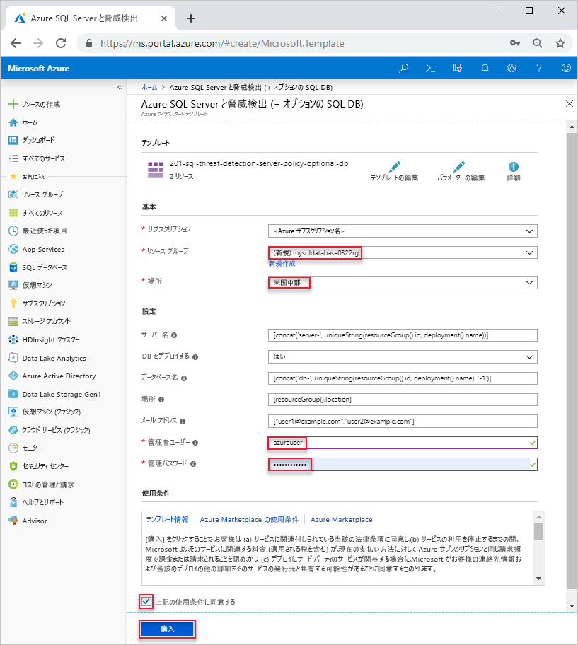

# <a name="quickstart-create-a-single-database-in-azure-sql-database-using-the-azure-resource-manager-template"></a>クイック スタート:Azure Resource Manager テンプレートを使用して Azure SQL Database に単一データベースを作成する

[単一データベース](sql-database-single-database.md)の作成は、Azure SQL Database でデータベースを作成する場合の最も迅速かつ簡単なデプロイ オプションです。 このクイック スタートでは、Azure Resource Manager テンプレートを使用して単一データベースを作成する方法について説明します。 詳細については、[Azure Resource Manager のドキュメント](/azure/azure-resource-manager/)を参照してください。

Azure サブスクリプションをお持ちでない場合は、[無料アカウントを作成](https://azure.microsoft.com/free/)してください。

## <a name="create-a-single-database"></a>単一データベースを作成する

単一データベースには、2 種類の[購入モデル](sql-database-purchase-models.md)のいずれかを使用して定義されたコンピューティング、メモリ、IO、ストレージのリソースのセットがあります。 単一データベースを作成するときは、それを管理するための [SQL Database サーバー](sql-database-servers.md)も定義し、指定したリージョンの [Azure リソース グループ](../azure-resource-manager/resource-group-overview.md)内にそれを配置します。

このクイック スタートで使用されるテンプレートは [Azure クイック スタート テンプレート](https://azure.microsoft.com/resources/templates/201-sql-threat-detection-server-policy-optional-db/)からのものです。 次の JSON ファイルが、この記事で使用するテンプレートです。 その他の Azure SQL データベース テンプレートのサンプルは[こちら](https://azure.microsoft.com/resources/templates/?resourceType=Microsoft.Sql&pageNumber=1&sort=Popular)から入手できます。

[!code-json[create-azure-sql-database](~/quickstart-templates/201-sql-threat-detection-server-policy-optional-db/azuredeploy.json)]

1. Azure にサインインし、テンプレートを開くには次のイメージを選択します。

    <a href="https://portal.azure.com/#create/Microsoft.Template/uri/https%3A%2F%2Fraw.githubusercontent.com%2FAzure%2Fazure-quickstart-templates%2Fmaster%2F201-sql-threat-detection-server-policy-optional-db%2Fazuredeploy.json"></a>

2. 次の値を選択または入力します。  

    

    指定がない場合は、既定値を使用してください。

    * **サブスクリプション**: Azure サブスクリプションを選択します。
    * **リソース グループ**: **[新規作成]** を選択し、リソース グループの一意の名前を入力し、**[OK]** をクリックします。 
    * **場所**: 場所を選択します。  たとえば **[米国中部]** です。
    * **[管理者ユーザー]**: SQL データベースのサーバー管理者のユーザー名を指定します。
    * **[管理者パスワード]**: 管理者のパスワードを指定します。 
    * **上記の使用条件に同意する**: 選択。
3. **[購入]** を選択します。

## <a name="query-the-database"></a>データベースのクエリを実行する

データベースに対してクエリを実行するには、「[データベースのクエリを実行する](./sql-database-single-database-get-started.md#query-the-database)」を参照してください。

## <a name="clean-up-resources"></a>リソースのクリーンアップ

「[次の手順](#next-steps)」に進む場合は、このリソース グループ、データベース サーバー、単一データベースをそのままにしてください。 次のステップでは、データベースに接続してクエリを実行するさまざまな方法を紹介しています。

Azure CLI または Azure PowerShell を使用してリソース グループを削除するには次を実行します。

```azurecli-interactive
echo "Enter the Resource Group name:" &&
read resourceGroupName &&
az group delete --name $resourceGroupName 
```

```azurepowershell-interactive
$resourceGroupName = Read-Host -Prompt "Enter the Resource Group name"
Remove-AzResourceGroup -Name $resourceGroupName 
```

## <a name="next-steps"></a>次の手順

- オンプレミスまたはリモート ツールから単一データベースに接続するために、サーバー レベルのファイアウォール規則を作成します。 詳細については、「[サーバーレベルのファイアウォール規則を作成する](sql-database-server-level-firewall-rule.md)」を参照してください。
- サーバーレベルのファイアウォール規則を作成した後に、いくつかの異なるツールと言語を使用して、データベースに[接続し、クエリを実行](sql-database-connect-query.md)します。
  - [SQL Server Management Studio を使用して接続およびクエリを実行する](sql-database-connect-query-ssms.md)
  - [Azure Data Studio を使用して接続およびクエリを実行する](https://docs.microsoft.com/sql/azure-data-studio/quickstart-sql-database?toc=/azure/sql-database/toc.json)
- Azure CLI を使用して単一データベースを作成するには、「[Azure CLI のサンプル](sql-database-cli-samples.md)」をご覧ください。
- Azure PowerShell を使用して単一データベースを作成するには、「[Azure PowerShell サンプル](sql-database-powershell-samples.md)」をご覧ください。
