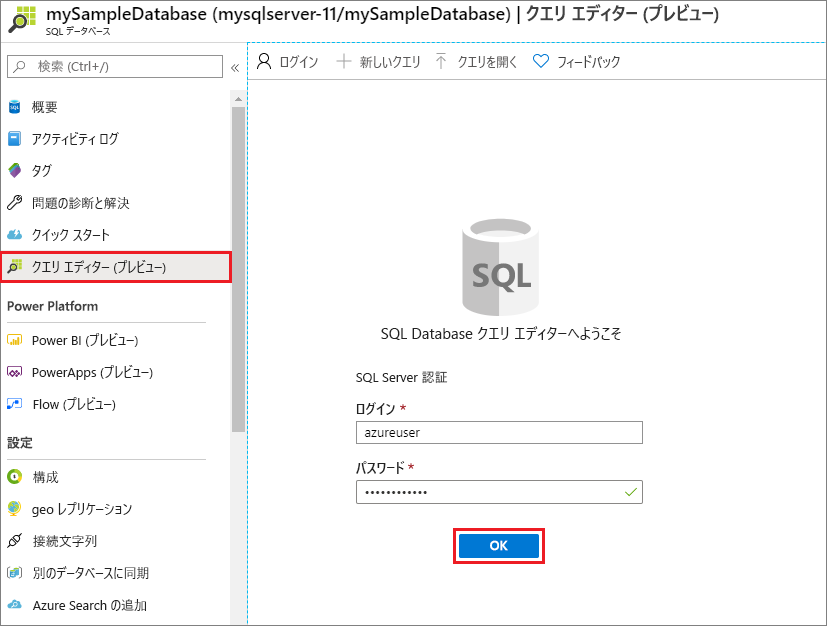
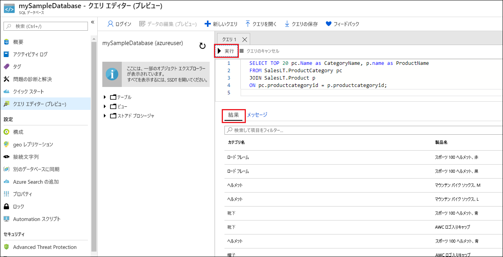

# <a name="quickstart-create-an-azure-sql-database-single-database"></a>クイック スタート:Azure SQL Database の単一データベースを作成する

このクイックスタートでは、Azure portal、PowerShell スクリプト、または Azure CLI スクリプトを使用して Azure SQL Database の単一データベースを作成します。 次に、Azure portal で**クエリ エディター**を使用して、データベースに対してクエリを実行します。 

[単一データベース](sql-database-single-database.md)は、Azure SQL Database の最も迅速かつ簡単なデプロイ オプションです。 単一データベースは、[SQL Database サーバー](sql-database-servers.md)内で管理します。このサーバーは、指定された Azure リージョンの [Azure リソース グループ](../azure-resource-manager/management/overview.md)内にあります。 このクイックスタートでは、新しいデータベース用に新しいリソース グループと SQL サーバーを作成します。

単一データベースは、"*プロビジョニング済み*" コンピューティング レベルでも "*サーバーレス*" コンピューティング レベルでも作成できます。 プロビジョニング済みデータベースには、一定量のコンピューティング リソース (CPU やメモリなど) が事前に割り当てられており、2 つの[購入モデル](sql-database-purchase-models.md)のいずれかが使用されます。 このクイックスタートでは、[仮想コアベース](sql-database-service-tiers-vcore.md)の購入モデルを使用してプロビジョニング済みデータベースを作成しますが、[DTU ベース](sql-database-service-tiers-DTU.md)のモデルを選択することもできます。 

サーバーレス コンピューティング レベルは、仮想コアベースの購入モデルでのみ使用でき、CPU やメモリなどのコンピューティング リソースの自動スケーリングされる一定範囲があります。 サーバーレス コンピューティング レベルで単一データベースを作成するには、[サーバーレス データベースの作成](sql-database-serverless.md#create-new-database-in-serverless-compute-tier)に関するページを参照してください。

## <a name="prerequisite"></a>前提条件

- 有効な Azure サブスクリプション アカウントがない場合は、[無料アカウントを作成](https://azure.microsoft.com/free/)してください。 

## <a name="create-a-single-database"></a>単一データベースを作成する

[!INCLUDE [sql-database-create-single-database](includes/sql-database-create-single-database.md)]

## <a name="query-the-database"></a>データベースのクエリを実行する

データベースを作成したら、Azure portal で組み込みの**クエリ エディター**を使用してデータベースに接続し、データに対してクエリを実行します。

1. ポータルで、**SQL データベース**を検索して選択し、リストからデータベースを選択します。
1. データベースの **[SQL Database]** ページで、左側のメニューの **[クエリ エディター (プレビュー)]** を選択します。
1. サーバー管理者のログイン情報を入力し、 **[OK]** を選択します。
   
   

1. **[クエリ エディター]** ウィンドウに次のクエリを入力します。

   ```sql
   SELECT TOP 20 pc.Name as CategoryName, p.name as ProductName
   FROM SalesLT.ProductCategory pc
   JOIN SalesLT.Product p
   ON pc.productcategoryid = p.productcategoryid;
   ```

1. **[実行]** を選択し、 **[結果]** ウィンドウでクエリの結果を確認します。

   

1. **[クエリ エディター]** ページを閉じ、未保存の編集を破棄するかどうかを確認するプロンプトが表示されたら **[OK]** をクリックします。

## <a name="clean-up-resources"></a>リソースをクリーンアップする

リソース グループ、サーバー、および単一データベースを保持して、次の手順に進み、さまざまな方法でデータベースに接続してクエリを実行する方法を学習します。

これらのリソースの使用が完了したら、作成したリソース グループを削除することができます。これにより、サーバーとその中の単一データベースも削除されます。

### <a name="portal"></a>[ポータル](#tab/azure-portal)

Azure portal を使用して **myResourceGroup** とそのすべてのリソースを削除するには、次の手順に従います。

1. ポータルで、 **[リソース グループ]** を検索して選択し、一覧から **[myResourceGroup]** を選択します。
1. [リソース グループ] ページで、 **[リソース グループの削除]** を選択します。
1. **[リソース グループ名を入力してください]** に「*myResourceGroup*」を入力し、 **[削除]** を選択します。

### <a name="azure-cli"></a>[Azure CLI](#tab/azure-cli)

リソース グループとそのすべてのリソースを削除するには、自分のリソース グループの名前を使用して次の Azure CLI コマンドを実行します。

```azurecli-interactive
az group delete --name <your resource group>
```

### <a name="powershell"></a>[PowerShell](#tab/azure-powershell)

リソース グループとそのすべてのリソースを削除するには、自分のリソース グループの名前を使用して次の PowerShell コマンドレットを実行します。

```azurepowershell-interactive
Remove-AzResourceGroup -Name <your resource group>
```

---

## <a name="next-steps"></a>次のステップ

さまざまなツールと言語を使用してデータベースを[接続してクエリを実行](sql-database-connect-query.md)します。
> [!div class="nextstepaction"]
> [SQL Server Management Studio を使用して接続およびクエリを実行する](sql-database-connect-query-ssms.md)
> 
> [Azure Data Studio を使用して接続およびクエリを実行する](/sql/azure-data-studio/quickstart-sql-database?toc=/azure/sql-database/toc.json)
