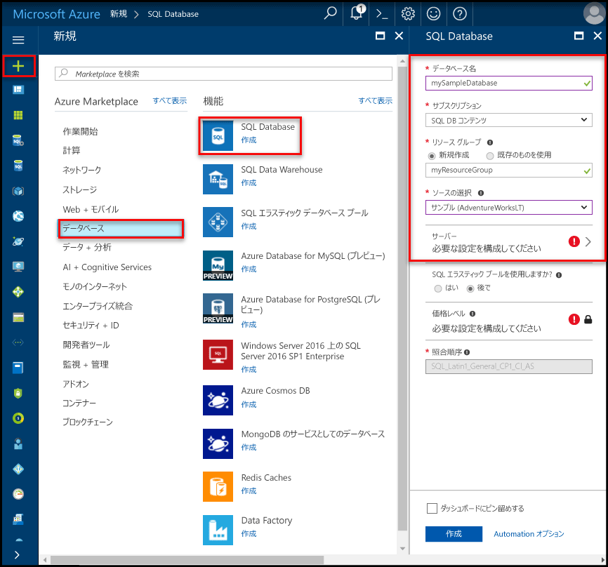

# Azure SQL Database での論理サーバーと単一データベースの作成と管理 

Azure portal、PowerShell、Azure CLI、REST API、および Transact-SQL を使用して、Azure SQL Database の論理サーバーと単一データベースを作成および管理することができます。

## Azure portal: 論理サーバーとデータベースを管理する

サーバー自体を作成する前に、あるいは作成するときに Azure SQL データベースのリソース グループを作成できます。 新しい SQL サーバーのフォームは新しい SQL サーバーか新しいデータベースを作成するときに表示されます。 

### 空の SQL サーバー (論理サーバー) を作成する

[Azure ポータル](https://portal.azure.com)を利用して Azure SQL Database サーバーを作成するには、空の SQL サーバー (論理サーバー) フォームに移動します。  

### 空またはサンプルの SQL データベースを作成する

[Azure ポータル](https://portal.azure.com)を利用して Azure SQL データベースを作成するには、空の SQL データベース フォームに移動し、要求された情報を指定します。 データベース自体を作成する前に、あるいは作成するときに Azure SQL データベースのリソース グループや論理サーバーを作成できます。 Adventure Works LT に基づいて空のデータベースやサンプル データベースを作成できます。 

  

> [!IMPORTANT]
> データベースの価格レベルを選択する方法については、[DTU ベースの購入モデル](sql-database-service-tiers-dtu.md)および[仮想コアベースの購入モデル ](sql-database-service-tiers-vcore.md)に関するページを参照してください。

Azure SQL Database マネージド インスタンスを作成する方法については、[マネージド インスタンスを作成する](sql-database-managed-instance-create-tutorial-portal.md)を参照してください。

### 既存の SQL Server を管理する

既存のサーバーを管理するには、さまざまな方法を利用してサーバーに移動します。たとえば、特定の SQL データベース ページ、**SQL サーバー** ページ、**すべてのリソース** ページから移動します。 

既存のデータベースを管理するには、**SQL データベース** ページに移動し、管理するデータベースをクリックします。 次のスクリーンショットでは、データベースの**概要**ページからデータベースにサーバーレベルのファイアウォールを設定する方法を確認できます。 

    

> [!IMPORTANT]
> データベースのパフォーマンス プロパティを構成するには、[DTU ベースの購入モデル](sql-database-service-tiers-dtu.md)および[仮想コアベースの購入モデル](sql-database-service-tiers-vcore.md)に関するページを参照してください。
>

> [!TIP]
> Azure ポータル クイックスタートについては、「[Azure ポータルで Azure SQL データベースを作成する](sql-database-get-started-portal.md)」を参照してください。

## PowerShell: 論理サーバーとデータベースを管理する

Azure PowerShell を利用して Azure SQL のサーバー、データベース、ファイアウォールを作成し、管理するには、次の PowerShell コマンドレットを使用します。 PowerShell をインストールまたはアップグレードする必要がある場合は、[Azure PowerShell モジュールのインストール](/powershell/azure/install-azurerm-ps)に関するページを参照してください。 

> [!TIP]
> PowerShell クイックスタートについては、「[PowerShell を使用して単一の Azure SQL データベースを作成する](sql-database-get-started-portal.md)」を参照してください。 PowerShell のスクリプトの例については、「[PowerShell を使用して Azure SQL データベースを 1 つ作成し、ファイアウォール規則を構成する](scripts/sql-database-create-and-configure-database-powershell.md)」および「[PowerShell を使用して単一の SQL データベースを監視およびスケーリングする](scripts/sql-database-monitor-and-scale-database-powershell.md)」を参照してください。
>

| コマンドレット | 説明 |
| --- | --- |
|[New-AzureRmSqlDatabase](/powershell/module/azurerm.sql/new-azurermsqldatabase)|データベースを作成します。 |
|[Get-AzureRmSqlDatabase](/powershell/module/azurerm.sql/get-azurermsqldatabase)|1 つまたは複数のデータベースを取得します。|
|[Set-AzureRmSqlDatabase](/powershell/module/azurerm.sql/set-azurermsqldatabase)|データベースのプロパティを設定するか、既存のデータベースをエラスティック プールに移動します。|
|[Remove-AzureRmSqlDatabase](/powershell/module/azurerm.sql/remove-azurermsqldatabase)|データベースを削除します。|
|[New-AzureRmResourceGroup](/powershell/module/azurerm.resources/new-azurermresourcegroup)|リソース グループを作成します。|
|[New-AzureRmSqlServer](/powershell/module/azurerm.sql/new-azurermsqlserver)|サーバーを作成します。|
|[Get-AzureRmSqlServer](/powershell/module/azurerm.sql/get-azurermsqlserver)|サーバーに関する情報を返します。|
|[Set-AzureRmSqlServer](https://docs.microsoft.com/powershell/module/azurerm.sql/set-azurermsqlserver)|サーバーのプロパティを変更します。|
|[Remove-AzureRmSqlServer](/powershell/module/azurerm.sql/remove-azurermsqlserver)|サーバーを削除します。|
|[New-AzureRmSqlServerFirewallRule](/powershell/module/azurerm.sql/new-azurermsqlserverfirewallrule)|サーバーレベルのファイアウォール規則を作成します。 |
|[Get-AzureRmSqlServerFirewallRule](/powershell/module/azurerm.sql/get-azurermsqlserverfirewallrule)|サーバーのファイアウォール規則を取得します。|
|[Set-AzureRmSqlServerFirewallRule](/powershell/module/azurerm.sql/set-azurermsqlserverfirewallrule)|サーバーのファイアウォール規則を変更します。|
|[Remove-AzureRmSqlServerFirewallRule](/powershell/module/azurerm.sql/remove-azurermsqlserverfirewallrule)|サーバーからファイアウォール規則を削除します。|
| New-AzureRmSqlServerVirtualNetworkRule | Virtual Network のサービス エンドポイントであるサブネットに基づいて、[*仮想ネットワーク規則*](sql-database-vnet-service-endpoint-rule-overview.md)を作成します。 |

## Azure CLI: 論理サーバーとデータベースを管理する

[Azure CLI](/cli/azure) を利用して Azure SQL のサーバー、データベース、ファイアウォールを作成し、管理するには、次の [Azure CLI SQL Database](/cli/azure/sql/db) コマンドを使用します。 [Cloud Shell](/azure/cloud-shell/overview) を使用して CLI をブラウザーで実行することも、macOS、Linux、または Windows に[インストール](/cli/azure/install-azure-cli)することもできます。 エラスティック プールの作成と管理については、[エラスティック プール](sql-database-elastic-pool.md)に関する記事をご覧ください。

> [!TIP]
> Azure CLI クイックスタートについては、「[Azure CLI を使用して単一の Azure SQL データベースを作成する](sql-database-get-started-cli.md)」を参照してください。 Azure CLI のスクリプトの例については、「[CLI を使用して Azure SQL データベースを 1 つ作成し、ファイアウォール規則を構成する](scripts/sql-database-create-and-configure-database-cli.md)」および「[CLI を使用して単一の SQL データベースを監視し、スケーリングする](scripts/sql-database-monitor-and-scale-database-cli.md)」を参照してください。
>

| コマンドレット | 説明 |
| --- | --- |
|[az sql db create](/cli/azure/sql/db#az_sql_db_create) |データベースを作成します。|
|[az sql db list](/cli/azure/sql/db#az_sql_db_list)|サーバー内のすべてのデータベースとデータ ウェアハウス、またはエラスティック プール内のすべてのデータベースを一覧表示します。|
|[az sql db list-editions](/cli/azure/sql/db#az_sql_db_list_editions)|利用可能なサービス目標と容量の上限を一覧表示します。|
|[az sql db list-usages](/cli/azure/sql/db#az_sql_db_list_usages)|データベースの使用状況を返します。|
|[az sql db show](/cli/azure/sql/db#az_sql_db_show)|データベースまたはデータ ウェアハウスを取得します。|
|[az sql db update](/cli/azure/sql/db#az_sql_db_update)|データベースを更新します。|
|[az sql db delete](/cli/azure/sql/db#az_sql_db_delete)|データベースを削除します。|
|[az group create](/cli/azure/group#az_group_create)|リソース グループを作成します。|
|[az sql server create](/cli/azure/sql/server#az_sql_server_create)|サーバーを作成します。|
|[az sql server list](/cli/azure/sql/server#az_sql_server_list)|サーバーを一覧表示します。|
|[az sql server list-usages](/cli/azure/sql/server#az_sql_server_list_usages)|サーバーの使用状況を返します。|
|[az sql server show](/cli/azure/sql/server#az_sql_server_show)|サーバーを取得します。|
|[az sql server update](/cli/azure/sql/server#az_sql_server_update)|サーバーを更新します。|
|[az sql server delete](/cli/azure/sql/server#az_sql_server_delete)|サーバーを削除します。|
|[az sql server firewall-rule create](/cli/azure/sql/server/firewall-rule#az_sql_server_firewall_rule_create)|サーバーのファイアウォール規則を作成します。|
|[az sql server firewall-rule list](/cli/azure/sql/server/firewall-rule#az_sql_server_firewall_rule_list)|サーバーのファイアウォール規則を一覧表示します。|
|[az sql server firewall-rule show](/cli/azure/sql/server/firewall-rule#az_sql_server_firewall_rule_show)|ファイアウォール規則の詳細を表示します。|
|[az sql server firewall-rule update](/cli/azure/sql/server/firewall-rule##az_sql_server_firewall_rule_update)|ファイアウォール規則を更新します。|
|[az sql server firewall-rule delete](/cli/azure/sql/server/firewall-rule#az_sql_server_firewall_rule_delete)|ファイアウォール規則を削除します。|

## Transact-SQL: 論理サーバーとデータベースを管理する

Transact-SQL を利用して Azure SQL のサーバー、データベース、ファイアウォールを作成し、管理するには、次の T-SQL コマンドレットを使用します。 これらのコマンドは、Azure Portal、[SQL Server Management Studio](/sql/ssms/use-sql-server-management-studio)、[Visual Studio Code](https://code.visualstudio.com/docs)、または Azure SQL Database サーバーに接続して Transact-SQL コマンドを渡すことができるその他のプログラムを使用して実行できます。 エラスティック プールの管理については、[エラスティック プール](sql-database-elastic-pool.md)に関する記事をご覧ください。

> [!TIP]
> Microsoft Windows で SQL Server Management Studio を使用する方法に関するクイックスタートについては、「[Azure SQL Database: SQL Server Management Studio を使って接続とデータの照会を行う](sql-database-connect-query-ssms.md)」を参照してください。 macOS、Linux、Windows で Visual Studio Code を使用する方法に関するクイックスタートについては、「[Azure SQL Database: Visual Studio Code を使って接続とデータの照会を行う](sql-database-connect-query-vscode.md)」を参照してください。

> [!IMPORTANT]
> Transact-SQL を利用してサーバーを作成または削除することはできません。
>

| コマンド | 説明 |
| --- | --- |
|[CREATE DATABASE (Azure SQL Database)](/sql/t-sql/statements/create-database-azure-sql-database)|新しいデータベースを作成します。 新しいデータベースを作成するには、マスター データベースに接続する必要があります。|
| [ALTER DATABASE (Azure SQL Database)](/sql/t-sql/statements/alter-database-azure-sql-database) |Azure SQL データベースを変更します。 |
|[ALTER DATABASE (Azure SQL Data Warehouse)](/sql/t-sql/statements/alter-database-azure-sql-data-warehouse)|Azure SQL Data Warehouse を変更します。|
|[DROP DATABASE (Transact-SQL)](/sql/t-sql/statements/drop-database-transact-sql)|データベースを削除します。|
|[sys.database_service_objectives (Azure SQL Database)](/sql/relational-databases/system-catalog-views/sys-database-service-objectives-azure-sql-database)|Azure SQL Database または Azure SQL Data Warehouse のエディション (サービス レベル)、サービス目標 (価格レベル)、およびエラスティック プール名 (存在する場合) を返します。 Azure SQL Database サーバーの master データベースにログオンしている場合は、すべてのデータベースの情報が返されます。 Azure SQL Data Warehouse の場合は、master データベースに接続する必要があります。|
|[sys.dm_db_resource_stats (Azure SQL Database)](/sql/relational-databases/system-dynamic-management-views/sys-dm-db-resource-stats-azure-sql-database)| Azure SQL Database データベースの CPU、IO、メモリ使用量を返します。 データベースにアクティビティがない場合でも、15 秒ごとに 1 つの行が存在します。|
|[sys.resource_stats (Azure SQL Database)](/sql/relational-databases/system-catalog-views/sys-resource-stats-azure-sql-database)|Azure SQL Database の CPU 使用率とストレージ データを返します。 データは 5 分間隔で収集され、集計されます。|
|[sys.database_connection_stats (Azure SQL Database)](/sql/relational-databases/system-catalog-views/sys-database-connection-stats-azure-sql-database)|SQL Database のデータベース接続のイベントの統計が含まれており、データベース接続の成功と失敗の概要を示します。 |
|[sys.event_log (Azure SQL Database)](/sql/relational-databases/system-catalog-views/sys-event-log-azure-sql-database)|成功した Azure SQL Database のデータベース接続、接続エラー、デッドロックを返します。 この情報を使用して、SQL Database を使用したデータベース アクティビティの追跡またはトラブルシューティングを行うことができます。|
|[sp_set_firewall_rule (Azure SQL Database)](/sql/relational-databases/system-stored-procedures/sp-set-firewall-rule-azure-sql-database)|SQL Database サーバーにサーバーレベルのファイアウォール設定を作成するか、更新します。 このストアド プロシージャは、マスター データベースのサーバーレベル プリンシパル ログインでのみ利用できます。 サーバーレベルのファイアウォール規則は、Azure レベルのアクセス許可を持つユーザーにより最初のサーバーレベルのファイアウォール規則が作成された後で Transact-SQL を使用しなければ作成できません。|
|[sys.firewall_rules (Azure SQL Database)](/sql/relational-databases/system-catalog-views/sys-firewall-rules-azure-sql-database)|Microsoft Azure SQL Database に関連付けられているサーバーレベルのファイアウォール設定に関する情報を返します。|
|[sp_delete_firewall_rule (Azure SQL Database)](/sql/relational-databases/system-stored-procedures/sp-delete-firewall-rule-azure-sql-database)|SQL Database サーバーからサーバーレベルのファイアウォール設定を削除します。 このストアド プロシージャは、マスター データベースのサーバーレベル プリンシパル ログインでのみ利用できます。|
|[sp_set_database_firewall_rule (Azure SQL Database)](/sql/relational-databases/system-stored-procedures/sp-set-database-firewall-rule-azure-sql-database)|Azure SQL Database または SQL Data Warehouse のデータベースレベルのファイアウォール規則を作成または更新します。 マスター データベースと SQL Database のユーザー データベースにデータベース ファイアウォール規則を構成できます。 データベース ファイアウォール規則は、包含データベース ユーザーの利用時に便利です。 |
|[sys.database_firewall_rules (Azure SQL Database)](/sql/relational-databases/system-catalog-views/sys-database-firewall-rules-azure-sql-database)|Microsoft Azure SQL Database に関連付けられているデータベースレベルのファイアウォール設定に関する情報を返します。 |
|[sp_delete_database_firewall_rule (Azure SQL Database)](/sql/relational-databases/system-stored-procedures/sp-delete-database-firewall-rule-azure-sql-database)|Azure SQL Database または SQL Data Warehouse からデータベースレベルのファイアウォール設定を削除します。 |

## REST API: 論理サーバーとデータベースを管理する

Azure SQL のサーバー、データベース、ファイアウォールを作成して管理するには、以下の REST API 要求を使います。

| コマンド | 説明 |
| --- | --- |
|[サーバー - 作成または更新](/rest/api/sql/servers/createorupdate)|新しいサーバーを作成または更新します。|
|[サーバー - 削除](/rest/api/sql/servers/delete)|SQL サーバーを削除します。|
|[サーバー - 取得](/rest/api/sql/servers/get)|サーバーを取得します。|
|[サーバー - 一覧取得](/rest/api/sql/servers/list)|サーバーの一覧を返します。|
|[サーバー - リソース グループで一覧取得](/rest/api/sql/servers/listbyresourcegroup)|リソース グループ内のサーバーの一覧を取得します。|
|[サーバー - 更新](/rest/api/sql/servers/update)|既存のサーバーを更新します。|
|[データベース - 作成または更新](/rest/api/sql/databases/createorupdate)|新しいデータベースを作成するか、既存のデータベースを更新します。|
|[データベース - 取得](/rest/api/sql/databases/get)|データベースを取得します。|
|[データベース - エラスティック プールごとに取得](/rest/api/sql/databases/getbyelasticpool)|エラスティック プール内のデータベースを取得します。|
|[データベース - 推奨されるエラスティック プールごとに取得](/rest/api/sql/databases/getbyrecommendedelasticpool)|推奨されるエラスティック プール内のデータベースを取得します。|
|[データベース - エラスティック プールごとの一覧取得](/rest/api/sql/databases/listbyelasticpool)|エラスティック プール内のデータベースの一覧を返します。|
|[データベース - 推奨されるエラスティック プールごとの一覧取得](/rest/api/sql/databases/listbyrecommendedelasticpool)|推奨されるエラスティック プール内のデータベースの一覧を返します。|
|[データベース - サーバーごとの一覧取得](/rest/api/sql/databases/listbyserver)|サーバー内のデータベースの一覧を返します。|
|[データベース - 更新](/rest/api/sql/databases/update)|既存のデータベースを更新します。|
|[ファイアウォール規則 - 作成または更新](/rest/api/sql/firewallrules/createorupdate)|ファイアウォール規則を作成または更新します。|
|[ファイアウォール規則 - 削除](/rest/api/sql/firewallrules/delete)|ファイアウォール規則を作成します。|
|[ファイアウォール規則 - 取得](/rest/api/sql/firewallrules/get)|ファイアウォール規則を取得します。|
|[ファイアウォール規則 - サーバーで一覧取得](/rest/api/sql/firewallrules/listbyserver)|ファイアウォール規則の一覧を返します。|

## 次の手順

- SQL Server データベースを Azure に移行する方法については、「[Azure SQL Database に移行](sql-database-cloud-migrate.md)」を参照してください。
- サポートされている機能については、[機能](sql-database-features.md)に関する記事をご覧ください。
