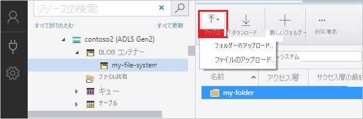

# Azure Storage Explorer を使用して Azure Data Lake Storage Gen2 のディレクトリ、ファイル、ACL を管理する

この記事では、[Azure Storage Explorer](https://azure.microsoft.com/features/storage-explorer/) を使用して、階層型名前空間 (HNS) が有効なストレージ アカウントでディレクトリ、ファイル、アクセス許可を作成および管理する方法について説明します。

## 前提条件

> [!div class="checklist"]
> * Azure サブスクリプション。 [Azure 無料試用版の取得](https://azure.microsoft.com/pricing/free-trial/)に関するページを参照してください。
> * 階層型名前空間 (HNS) が有効になっているストレージ アカウント。 作成するには、[こちら](data-lake-storage-quickstart-create-account.md)の手順に従います。
> * ローカル コンピューターにインストールされた Azure Storage Explorer。 Windows、Macintosh、または Linux 用の Azure Storage Explorer をインストールする方法については、「[Azure Storage Explorer](https://azure.microsoft.com/features/storage-explorer/)」をご覧ください。

## Storage Explorer にサインインする

Storage Explorer を初めて起動すると、 **[Microsoft Azure Storage Explorer - 接続]** ウィンドウが表示されます。 Storage Explorer にはストレージ アカウントに接続する方法がいくつか用意されていますが、現在のところ、ACL の管理にサポートされている方法は 1 つのみです。

|タスク|目的|
|---|---|
|Azure アカウントを追加する | Azure に対する認証を行うための組織のサインイン ページにリダイレクトします。 現在のところ、これが ACL を管理および設定する場合にサポートされている唯一の認証方法です。|
|接続文字列または Shared Access Signature URI を使用する | SAS トークンまたは共有の接続文字列でコンテナーまたはストレージ アカウントに直接アクセスするために使用できます。 |
|ストレージ アカウントの名前とキーを使用する| ストレージ アカウントの名前とキーを使用して、Azure Storage に接続します。|

**[Add an Azure Account\(Azure アカウントの追加\)]** を選択し、 **[サインイン]** をクリックします。画面上のプロンプトに従って Azure アカウントにサインインします。

![[Microsoft Azure Storage Explorer - 接続] ウィンドウ](media/storage-quickstart-blobs-storage-explorer/connect.png)

接続が完了すると、Azure Storage Explorer が読み込まれて **[Explorer]** タブが表示されます。 このビューには、すべての Azure ストレージ アカウント、[Azure ストレージ エミュレーター](../common/storage-use-emulator.md?toc=%2fazure%2fstorage%2fblobs%2ftoc.json)、[Cosmos DB](../../cosmos-db/storage-explorer.md?toc=%2fazure%2fstorage%2fblobs%2ftoc.json) アカウント、または [Azure Stack](/azure-stack/user/azure-stack-storage-connect-se?toc=%2fazure%2fstorage%2fblobs%2ftoc.json) 環境を使用して構成されたおよびローカル ストレージの情報が表示されます。

![[Microsoft Azure Storage Explorer - 接続] ウィンドウ](media/storage-quickstart-blobs-storage-explorer/mainpage.png)

## コンテナーを作成する

コンテナーには、ディレクトリとファイルが保持されます。 作成するには、前の手順で作成したストレージ アカウントを展開します。 **[BLOB コンテナー]** を選択し、 **[BLOB コンテナーの作成]** を右クリックして選択します。 コンテナーの名前を入力します。 コンテナーの名前付けに関する規則と制限の一覧については、「[コンテナーを作成する](storage-quickstart-blobs-dotnet.md#create-a-container)」セクションを参照してください。 完了したら、**Enter** キーを押してコンテナーを作成します。 コンテナーは、正常に作成されると、選択されたストレージ アカウントの **[BLOB コンテナー]** フォルダーの下に表示されます。

## ディレクトリを作成する

ディレクトリを作成するには、前の手順で作成したコンテナーを選択します。 コンテナーのリボンで、 **[新しいフォルダー]** ボタンを選択します。 ディレクトリの名前を入力します。 完了したら、**Enter** キーを押してディレクトリを作成します。 ディレクトリが正常に作成されると、エディター ウィンドウに表示されます。

## BLOB をディレクトリにアップロードする

ディレクトリのリボンで、 **[アップロード]** ボタンを選択します。 この操作によって、フォルダーまたはファイルをアップロードするためのオプションが表示されます。

アップロードするファイルまたはフォルダーを選択します。

**[OK]** を選択すると、選択したファイルがキューに登録され、各ファイルがアップロードされます。 アップロードが完了すると、 **[アクティビティ]** ウィンドウに結果が表示されます。

## ディレクトリ内の BLOB を表示する

**Azure Storage Explorer** アプリケーションで、ストレージ アカウント以下のディレクトリを選択します。 選択したディレクトリ内の BLOB の一覧がメイン ウィンドウに表示されます。

## BLOB をダウンロードする

**Azure Storage Explorer** を使用してファイルをダウンロードするには、ファイルを選択した状態で、リボンの **[ダウンロード]** を選択します。 ファイル ダイアログが開き、ファイル名を入力するオプションが表示されます。 **[保存]** を選択して、ローカルの場所へのファイルのダウンロードを開始します。

## アクセスの管理

コンテナーのルートにアクセス許可を設定することができます。 これを行うには、(接続文字列を使用するのではなく) その操作のアクセス権を持つ自分の個人アカウントで Azure Storage Explorer にログインする必要があります。 コンテナーを右クリックし、 **[アクセス許可の管理]** を選択し、 **[アクセス許可の管理]** ダイアログ ボックスを開きます。

**[アクセス許可の管理]** ダイアログ ボックスでは、所有者と所有者グループのアクセス許可を管理できます。 また、アクセス制御リストに新しいユーザーとグループを追加して、アクセス許可を管理することもできます。

新しいユーザーまたはグループをアクセス制御リストに追加するには、 **[ユーザーまたはグループの追加]** フィールドを選択します。

リストに追加する、対応する Azure Active Directory (AAD) エントリを入力し、 **[追加]** を選択します。

ユーザーまたはグループが **[ユーザーとグループ:]** フィールドに表示され、そのアクセス許可の管理を始めることができます。

> [!NOTE]
> ベスト プラクティスであり、推奨される方法は、AAD にセキュリティ グループを作成し、個々のユーザーではなくグループに対するアクセス許可を保守することです。 この推奨事項やその他のベスト プラクティスの詳細については、[Data Lake Storage Gen2 のベスト プラクティス](data-lake-storage-best-practices.md)に関するページを参照してください。

割り当てることができるアクセス許可には、アクセス ACL と既定の ACL という 2 つのカテゴリがあります。

* **アクセス**:アクセス ACL はオブジェクトへのアクセスを制御します。 ファイルとディレクトリの両方がアクセス ACL を持っています。

* **既定**:ディレクトリに関連付けられた ACL のテンプレートです。この ACL によって、そのディレクトリの下に作成されるすべての子項目のアクセス ACL が決まります。 ファイルには既定の ACL がありません。

これらの両方のカテゴリ内には、ファイルまたはディレクトリに割り当てることができるアクセス許可が 3 つあります。**読み取り**、**書き込み**、**実行**です。

>[!NOTE]
> ここで選択しても、ディレクトリ内に現在ある項目に対してアクセス許可は設定されません。 ファイルが既に存在する場合は、個々の項目に移動して、アクセス許可を手動で設定する必要があります。

個々のディレクトリだけでなく、個々のファイルに対するアクセス許可を管理できるので、アクセス制御を微調整することができます。 ディレクトリとファイルの両方のアクセス許可を管理する場合のプロセスは、前述の方法と同じです。 アクセス許可を管理するファイルまたはディレクトリを右クリックし、同じプロセスに従います。

## 次のステップ

Data Lake Storage Gen2 のアクセス制御リストについて説明します。

> [!div class="nextstepaction"]
> [Azure Data Lake Storage Gen2 のアクセス制御](https://docs.microsoft.com/azure/storage/blobs/data-lake-storage-access-control)
