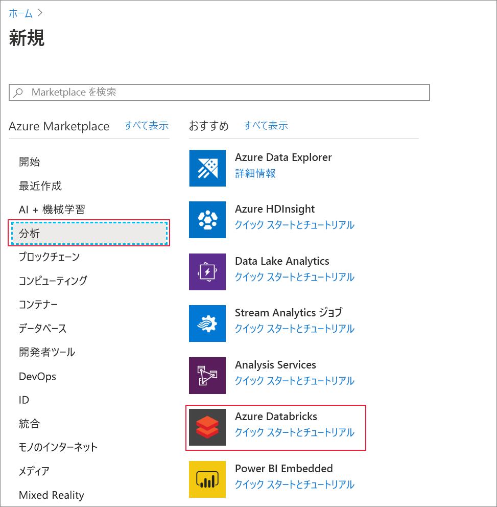
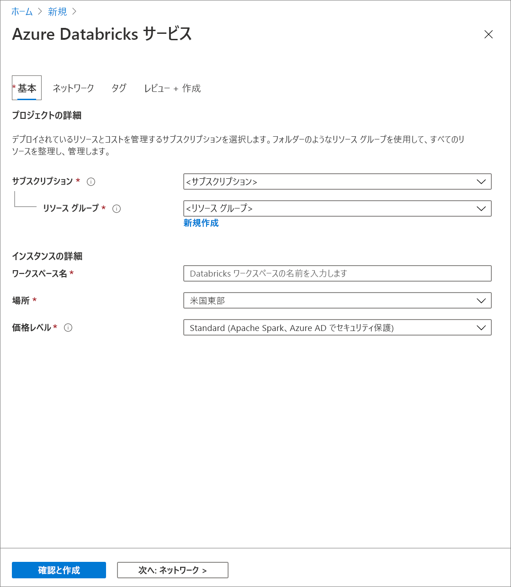
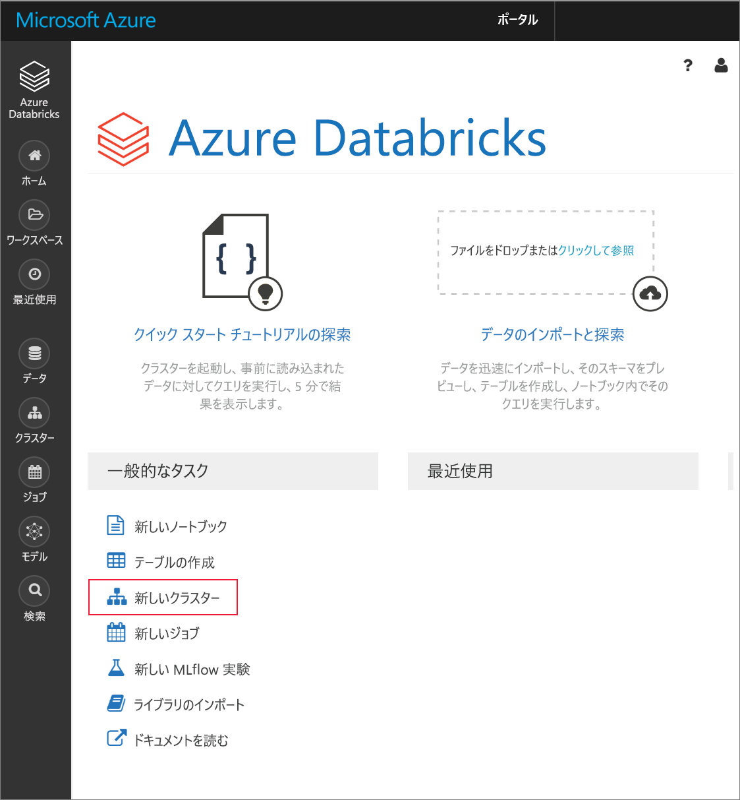
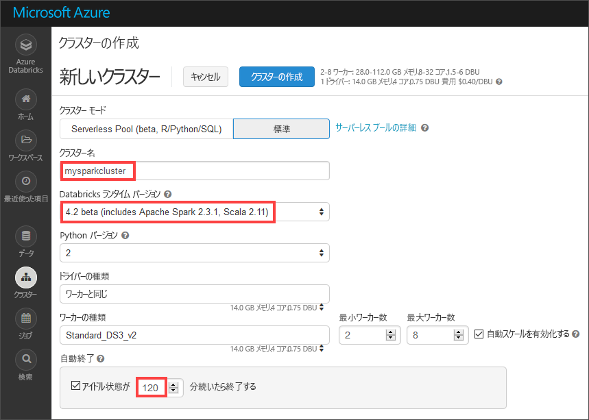
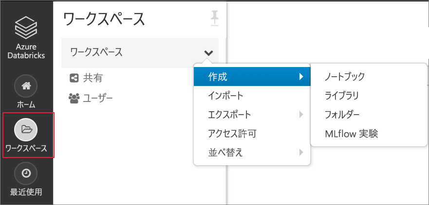
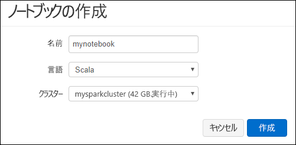
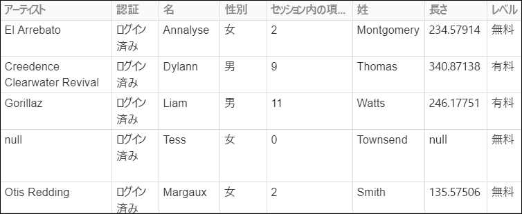
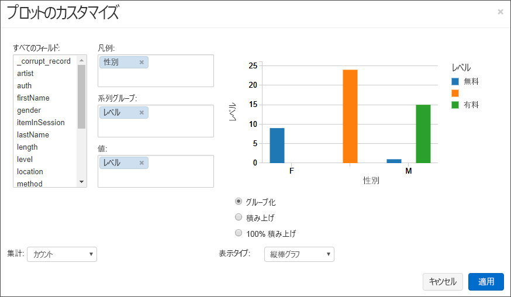
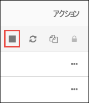

# <a name="quickstart-analyze-data-with-databricks"></a>クイック スタート:Databricks を使用したデータの分析

このクイックスタートでは、Azure Databricks を使って Apache Spark ジョブを実行し、ストレージ アカウントに格納されているデータで分析を行います。 Spark ジョブの一環として、ラジオ チャンネルのサブスクリプション データを分析し、人口統計学的属性に基づく無料/有料使用についての分析情報を取得します。

## <a name="prerequisites"></a>前提条件

* アクティブなサブスクリプションが含まれる Azure アカウント。 [無料でアカウントを作成できます](https://azure.microsoft.com/free/?ref=microsoft.com&utm_source=microsoft.com&utm_medium=docs&utm_campaign=visualstudio)。

* Azure Data Lake Gen2 ストレージ アカウントの名前。 [Azure Data Lake Storage Gen2 ストレージ アカウントを作成します](data-lake-storage-quickstart-create-account.md)。

* **ストレージ BLOB データ共同作成者**のロールが割り当てられた Azure サービス プリンシパルのテナント ID、アプリ ID、パスワード。 [サービス プリンシパルを作成します](../../active-directory/develop/howto-create-service-principal-portal.md)。

  > [!IMPORTANT]
  > Data Lake Storage Gen2 ストレージ アカウントの範囲内のロールを割り当ててください。 親リソース グループまたはサブスクリプションにロールを割り当てることはできますが、それらのロール割り当てがストレージ アカウントに伝達されるまで、アクセス許可関連のエラーが発生します。

## <a name="create-an-azure-databricks-workspace"></a>Azure Databricks ワークスペースを作成する

このセクションでは、Azure Portal を使って Azure Databricks ワークスペースを作成します。

1. Azure portal で、 **[リソースの作成]**  >  **[分析]**  >  **[Azure Databricks]** の順に選択します。

    

2. **[Azure Databricks サービス]** で値を指定して、Databricks ワークスペースを作成します。

    

    次の値を指定します。

    |プロパティ  |説明  |
    |---------|---------|
    |**ワークスペース名**     | Databricks ワークスペースの名前を指定します        |
    |**サブスクリプション**     | ドロップダウンから Azure サブスクリプションを選択します。        |
    |**リソース グループ**     | 新しいリソース グループを作成するか、既存のリソース グループを使用するかを指定します。 リソース グループは、Azure ソリューションの関連するリソースを保持するコンテナーです。 詳しくは、[Azure リソース グループの概要](../../azure-resource-manager/management/overview.md)に関するページをご覧ください。 |
    |**場所**     | **[米国西部 2]** を選択します。 他のパブリック リージョンを選択してもかまいません。        |
    |**価格レベル**     |  **Standard** と **Premium** のいずれかを選択します。 これらのレベルの詳細については、[Databricks の価格に関するページ](https://azure.microsoft.com/pricing/details/databricks/)を参照してください。       |

3. アカウントの作成には数分かかります。 操作の状態を監視するには、上部の進行状況バーを確認します。

4. **[ダッシュボードにピン留めする]** チェック ボックスをオンにして、 **[作成]** を選択します。

## <a name="create-a-spark-cluster-in-databricks"></a>Databricks に Spark クラスターを作成する

1. Azure Portal で、作成した Databricks ワークスペースに移動して、 **[Launch Workspace]\(ワークスペースの起動\)** を選択します。

2. Azure Databricks ポータルにリダイレクトされます。 ポータルで **[新規]**  >  **[クラスター]** を選択します。

    

3. **[New cluster]\(新しいクラスター\)** ページで、クラスターを作成するための値を指定します。

    

    次のフィールドに値を入力し、他のフィールドの既定値はそのまま使用します。

    - クラスターの名前を入力します。
     
    - **[Terminate after 120 minutes of inactivity]** \(アクティビティが 120 分ない場合は終了する\) チェック ボックスをオンにします。 クラスターが使われていない場合にクラスターを終了するまでの時間 (分単位) を指定します。

4. **[クラスターの作成]** を選択します。 クラスターが実行されたら、ノートブックをクラスターにアタッチして、Spark ジョブを実行できます。

クラスターの作成について詳しくは、[Azure Databricks での Spark クラスターの作成に関するページ](https://docs.azuredatabricks.net/user-guide/clusters/create.html)をご覧ください。

## <a name="create-storage-account-container"></a>ストレージ アカウントのコンテナーを作成する

このセクションでは、Azure Databricks ワークスペースにノートブックを作成し、ストレージ アカウントを構成するコード スニペットを実行します。

1. [Azure Portal](https://portal.azure.com) で、作成した Azure Databricks ワークスペースに移動して、 **[Launch Workspace]\(ワークスペースの起動\)** を選択します。

2. 左側のウィンドウで、 **[ワークスペース]** を選択します。 **[ワークスペース]** ドロップダウンで、 **[作成]**  >  **[ノートブック]** の順に選択します。

    

3. **[ノートブックの作成]** ダイアログ ボックスでノートブックの名前を入力します。 言語として **[Scala]** を選んで、前に作成した Spark クラスターを選びます。

    

    **作成** を選択します。

4. 次のコード ブロックをコピーして最初のセルに貼り付けます。ただし、このコードはまだ実行しないでください。

   ```scala
   spark.conf.set("fs.azure.account.auth.type.<storage-account-name>.dfs.core.windows.net", "OAuth")
   spark.conf.set("fs.azure.account.oauth.provider.type.<storage-account-name>.dfs.core.windows.net", "org.apache.hadoop.fs.azurebfs.oauth2.ClientCredsTokenProvider")
   spark.conf.set("fs.azure.account.oauth2.client.id.<storage-account-name>.dfs.core.windows.net", "<appID>")
   spark.conf.set("fs.azure.account.oauth2.client.secret.<storage-account-name>.dfs.core.windows.net", "<password>")
   spark.conf.set("fs.azure.account.oauth2.client.endpoint.<storage-account-name>.dfs.core.windows.net", "https://login.microsoftonline.com/<tenant-id>/oauth2/token")
   spark.conf.set("fs.azure.createRemoteFileSystemDuringInitialization", "true")
   dbutils.fs.ls("abfss://<container-name>@<storage-account-name>.dfs.core.windows.net/")
   spark.conf.set("fs.azure.createRemoteFileSystemDuringInitialization", "false")

   ```
5. このコード ブロックでは、`storage-account-name`、`appID`、`password`、および `tenant-id` のプレースホルダー値を、サービス プリンシパルの作成中に収集した値で置き換えます。 `container-name` プレースホルダーの値を、コンテナーに付けたい名前に設定します。

6. **Shift + Enter** キーを押して、このブロック内のコードを実行します。

## <a name="ingest-sample-data"></a>サンプル データを取り込む

このセクションで始める前に、次の前提条件を満たす必要があります。

ノートブックのセルに次のコードを入力します。

    %sh wget -P /tmp https://raw.githubusercontent.com/Azure/usql/master/Examples/Samples/Data/json/radiowebsite/small_radio_json.json

セル内で **Shift + Enter** キーを押して、コードを実行します。

次に、その下の新しいセルに次のコードを入力します。ブラケットで囲まれている値は、前に使用したのと同じ値に置き換えてください。

    dbutils.fs.cp("file:///tmp/small_radio_json.json", "abfss://<container-name>@<storage-account-name>.dfs.core.windows.net/")

セル内で **Shift + Enter** キーを押して、コードを実行します。

## <a name="run-a-spark-sql-job"></a>Spark SQL ジョブを実行する

次のタスクを実行して、データで Spark SQL ジョブを実行します。

1. SQL ステートメントを実行し、サンプルの JSON データ ファイル **small_radio_json.json** のデータを使って、一時テーブルを作成します。 次のスニペットでは、プレースホルダーの値をコンテナー名およびストレージ アカウント名に置き換えます。 前に作成したノートブックを使用し、スニペットをノートブックの新しいコード セルに貼り付けて、Shift + Enter キーを押します。

    ```sql
    %sql
    DROP TABLE IF EXISTS radio_sample_data;
    CREATE TABLE radio_sample_data
    USING json
    OPTIONS (
     path  "abfss://<container-name>@<storage-account-name>.dfs.core.windows.net/small_radio_json.json"
    )
    ```

    コマンドが正常に完了すると、JSON ファイルのすべてのデータが Databricks クラスター内のテーブルとして取り込まれます。

    `%sql` 言語のマジック コマンドを使うと、ノートブックから SQL コードを実行できます (ノートブックが別の種類であっても)。 詳しくは、「[Mixing languages in a notebook](https://docs.azuredatabricks.net/user-guide/notebooks/index.html#mixing-languages-in-a-notebook)」(ノートブックに言語を混在させる) をご覧ください。

2. 実行するクエリについて詳しく理解するため、サンプルの JSON データのスナップショットを見てみます。 次のスニペットをコード セルに貼り付けて、**Shift + Enter** キーを押します。

    ```sql
    %sql
    SELECT * from radio_sample_data
    ```

3. 次のスクリーンショットのような表形式の出力が表示されます (一部の列のみ示してあります)。

    

    サンプルには、ラジオ チャンネルの視聴者の性別 (列名: **gender**) および登録が無料か有料か (列名: **level**) に関するデータが含まれます。

4. このデータのビジュアル表現を作成し、各性別について、無料アカウント ユーザーの数と有料登録者の数がわかるようにします。 表形式の出力の下部で、 **[Bar chart]\(棒グラフ\)** アイコンをクリックした後、 **[Plot Options]\(プロット オプション\)** をクリックします。

    

5. **[Customize Plot]\(プロットのカスタマイズ\)** で、スクリーンショットに示すように値をドラッグ アンド ドロップします。

    

    - **[Keys]\(キー\)** を **gender** に設定します。
    - **[Series groupings]\(系列グループ\)** を **level** に設定します。
    - **[Values]\(値\)** を **level** に設定します。
    - **[Aggregation]\(集計\)** を **[COUNT]\(個数\)** に設定します。

6. **[Apply]** をクリックします。

7. 出力は、次のスクリーンショットのようなビジュアル表現になります。

     

## <a name="clean-up-resources"></a>リソースをクリーンアップする

この記事を完了したら、クラスターを終了できます。 Azure Databricks ワークスペースから、 **[クラスター]** を選択し、終了するクラスターを見つけます。 **[アクション]** 列の下にある省略記号にマウス カーソルを合わせて、 **[終了]** アイコンを選択します。



クラスター作成時に **[Terminate after \_\_ minutes of inactivity]** \(アクティビティが \_\_ 分ない場合は終了する\) チェック ボックスをオンにした場合は、手動で終了しなくても、クラスターは自動的に停止します。 このオプションを設定した場合、クラスターは、指定した時間だけ非アクティブの状態が続いた後に停止します。

## <a name="next-steps"></a>次のステップ

この記事では、Azure Databricks に Spark クラスターを作成し、Data Lake Storage Gen2 対応のストレージ アカウントにあるデータを使って Spark ジョブを実行しました。

次の記事に進んで、Azure Databricks を使った ETL (データの抽出、変換、読み込み) 操作の実行方法について学びましょう。

> [!div class="nextstepaction"]
>[Azure Databricks を使ったデータの抽出、変換、読み込み](../../azure-databricks/databricks-extract-load-sql-data-warehouse.md)。

- 他のデータ ソースから Azure Databricks にデータをインポートする方法については、[Spark データ ソース](https://docs.azuredatabricks.net/spark/latest/data-sources/index.html)に関するページを参照してください。

- Azure Databricks ワークスペースから Azure Data Lake Storage Gen2 にアクセスするその他の方法については、「[Azure Data Lake Storage Gen2](https://docs.azuredatabricks.net/spark/latest/data-sources/azure/azure-datalake-gen2.html)」を参照してください。
