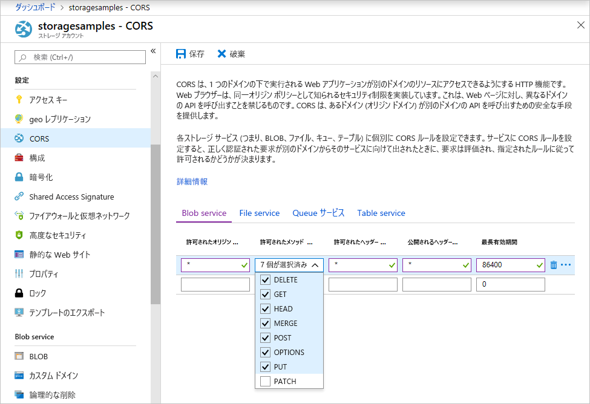

<!-- Customer intent: As a web application developer I want to interface with Azure Blob storage entirely on the client so that I can build a SPA application that is able to upload and delete files on blob storage. -->

# <a name="quickstart-manage-blobs-with-javascript-v12-sdk-in-a-browser"></a>クイック スタート:ブラウザーで JavaScript v12 SDK を使用して BLOB を管理する

Azure Blob Storage は、大量の非構造化データを格納するために最適化されています。 BLOB は、テキストやバイナリ データ (画像、ドキュメント、ストリーミング メディア、アーカイブ データなど) を保持できるオブジェクトです。 このクイックスタートでは、ブラウザーで JavaScript を使用して BLOB を管理する方法について説明します。 ここでは、BLOB のアップロードと一覧表示のほか、コンテナーの作成と削除を行います。

[API リファレンスのドキュメント](/javascript/api/@azure/storage-blob) | [ライブラリのソース コード](https://github.com/Azure/azure-sdk-for-js/tree/master/sdk/storage/storage-blob) | [パッケージ (npm)](https://www.npmjs.com/package/@azure/storage-blob) | [サンプル](https://docs.microsoft.com/azure/storage/common/storage-samples-javascript?toc=%2fazure%2fstorage%2fblobs%2ftoc.json#blob-samples)

> [!NOTE]
> 以前の SDK バージョンを使ってみるには、「[クイックスタート: Node.js で JavaScript v10 SDK を使用して BLOB を管理する](storage-quickstart-blobs-nodejs-legacy.md)」を参照してください。

## <a name="prerequisites"></a>前提条件

* [アクティブなサブスクリプションが含まれる Azure アカウント](https://azure.microsoft.com/free/?ref=microsoft.com&utm_source=microsoft.com&utm_medium=docs&utm_campaign=visualstudio)
* [Azure Storage アカウント](../common/storage-account-create.md)
* [Node.js](https://nodejs.org)
* [Microsoft Visual Studio Code](https://code.visualstudio.com)
* 次のような、ブラウザー デバッグ用の Visual Studio Code 拡張機能。
    * [Debugger for Microsoft Edge](vscode:extension/msjsdiag.debugger-for-edge)
    * [Debugger for Chrome](vscode:extension/msjsdiag.debugger-for-chrome)
    * [Debugger for Firefox](vscode:extension/firefox-devtools.vscode-firefox-debug)


[!INCLUDE [storage-multi-protocol-access-preview](../../../includes/storage-multi-protocol-access-preview.md)]

## <a name="object-model"></a>オブジェクト モデル

Blob Storage には、3 種類のリソースがあります。

* ストレージ アカウント
* ストレージ アカウント内のコンテナー
* コンテナー内の BLOB

次の図に、これらのリソースの関係を示します。


このクイックスタートでは、これらのリソースとやり取りするために、以下の JavaScript クラスを使用します。

* [BlobServiceClient](/javascript/api/@azure/storage-blob/blobserviceclient):`BlobServiceClient` クラスを使用して、Azure Storage リソースと BLOB コンテナーを操作できます。
* [ContainerClient](/javascript/api/@azure/storage-blob/containerclient):`ContainerClient` クラスを使用して、Azure Storage コンテナーとその BLOB を操作できます。
* [BlockBlobClient](/javascript/api/@azure/storage-blob/blockblobclient): `BlockBlobClient` クラスを使用して、Azure Storage BLOB を操作できます。

## <a name="setting-up"></a>設定

このセクションでは、JavaScript 用 Azure Blob Storage クライアント ライブラリ v12 を操作するためのプロジェクトの準備について説明します。

### <a name="create-a-cors-rule"></a>CORS ルールを作成する

Web アプリケーションでクライアントから BLOB ストレージにアクセスするには、アカウントを構成して、[クロス オリジン リソース共有](https://docs.microsoft.com/rest/api/storageservices/cross-origin-resource-sharing--cors--support-for-the-azure-storage-services) (CORS) を有効にしておく必要があります。

Azure portal で、自分のストレージ アカウントを選択します。 新しい CORS ルールを定義するために、 **[設定]** セクションに移動し、 **[CORS]** を選択します。 このクイック スタートでは、オープン CORS ルールを作成します。



次の表は、各 CORS 設定の説明と、ルールを定義するために使用する値を示しています。

|設定  |値  | 説明 |
|---------|---------|---------|
| **許可されたオリジン** | **\*** | 許容されるオリジンとして設定されるドメインの、コンマ区切りの一覧を受け入れます。 値を `*` に設定すると、すべてのドメインがストレージ アカウントにアクセスできるようになります。 |
| **許可されたメソッド** | **DELETE**、**GET**、**HEAD**、**MERGE**、**POST**、**OPTIONS**、**PUT** | ストレージ アカウントに対して実行できる HTTP 動詞の一覧です。 このクイック スタートの目的に合わせて、利用可能なすべてのオプションを選択します。 |
| **許可されたヘッダー** | **\*** | ストレージ アカウントによって許可される要求ヘッダー (プレフィックス付きヘッダーを含む) の一覧を定義します。 値を `*` に設定すると、すべてのヘッダーがアクセスできるようになります。 |
| **公開されるヘッダー** | **\*** | アカウントによって許可される応答ヘッダーの一覧です。 値を `*` に設定すると、アカウントは任意のヘッダーを送信できるようになります。 |
| **最長有効期間** | **86400** | ブラウザーがプレフライト OPTIONS 要求をキャッシュする最大時間 (秒)。 値を *86,400* にすると、キャッシュが丸 1 日保持されます。 |

この表の値を各フィールドに入力したら、 **[保存]** ボタンをクリックします。

> [!IMPORTANT]
> アクセスの安全性を保つため、運用環境で使用するすべての設定で、公開するアクセスの量は、ストレージ アカウントに必要な最小限度に抑えるようにしてください。 ここで説明されている CORS 設定は、緩やかなセキュリティ ポリシーを定義するため、クイック スタートに適しています。 ただし、これらの設定は、現実的なコンテキストには推奨しません。

### <a name="create-a-shared-access-signature"></a>Shared Access Signature を作成する

Shared Access Signature (SAS) は、Azure Blob Storage への要求を承認するために、ブラウザーで実行されているコードによって使用されます。 SAS を使用すると、クライアントはアカウント アクセス キーまたは接続文字列がなくても、ストレージ リソースへのアクセスを承認することができます。 SAS の詳細については、「[Shared Access Signatures (SAS) の使用](../common/storage-sas-overview.md)」を参照してください。

Blob service の SAS URL を取得するには、次の手順に従います。

1. Azure portal で、自分のストレージ アカウントを選択します。
2. **[設定]** セクションに移動し、 **[Shared Access Signature]** を選択します。
3. 下へスクロールし、 **[SAS と接続文字列を生成する]** ボタンをクリックします。
4. さらに下へスクロールし、 **[Blob service の SAS URL]** フィールドを見つけます。
5. **[Blob service の SAS URL]** フィールドの右端にある **[クリップボードにコピー]** ボタンをクリックします。
6. 後の手順で使用できるよう、コピーした URL をどこかに保存します。

### <a name="add-the-azure-blob-storage-client-library"></a>Azure Blob Storage クライアント ライブラリを追加する

ローカル コンピューターに *azure-blobs-js-browser* という新しいフォルダーを作成し、Visual Studio Code で開きます。

**[表示] > [ターミナル]** の順に選択して、Visual Studio Code 内のコンソール ウィンドウを開きます。 ターミナル ウィンドウで次の Node.js パッケージ マネージャー (npm) コマンドを実行して、[package.json](https://docs.npmjs.com/files/package.json) ファイルを作成します。

```console
npm init -y
```

Azure SDK は、多数の独立したパッケージで構成されています。 使用するサービスに応じて必要なパッケージを選ぶことができます。 `@azure/storage-blob` パッケージをインストールするには、ターミナル ウィンドウで次の `npm` コマンドを実行します。

```console
npm install --save @azure/storage-blob
```

#### <a name="bundle-the-azure-blob-storage-client-library"></a>Azure Blob Storage クライアント ライブラリをバンドルする

Azure SDK ライブラリを Web サイトで使用するには、コードを変換してブラウザー内で動作するようにします。 この作業は、バンドラーと呼ばれるツールを使用して行います。 バンドラーは、[Node.js](https://nodejs.org) の規約に従って記述された JavaScript コードを受け取り、それをブラウザーが認識できる形式に変換します。 このクイックスタート記事では、[Parcel](https://parceljs.org/) バンドラーを使用します。

ターミナル ウィンドウで次の `npm` コマンドを実行して Parcel をインストールします。

```console
npm install -g parcel-bundler
```

Visual Studio Code で *package.json* ファイルを開き、`license` エントリと `dependencies` エントリの間に `browserlist` を追加します。 この `browserlist` では、広く使われている 3 つのブラウザーの最新バージョンを対象にしています。 完成した *package.json* ファイルは、次のようになります。

:::code language="json" source="~/azure-storage-snippets/blobs/quickstarts/JavaScript/V12/azure-blobs-js-browser/package.json" highlight="12-16":::

*package.json* ファイルを保存します。

### <a name="import-the-azure-blob-storage-client-library"></a>Azure Blob Storage クライアント ライブラリをインポートする

Azure SDK ライブラリを JavaScript 内で使用するために、`@azure/storage-blob` パッケージをインポートします。 次の JavaScript コードを含んだ新しいファイルを Visual Studio Code で作成してください。

:::code language="javascript" source="~/azure-storage-snippets/blobs/quickstarts/JavaScript/V12/azure-blobs-js-browser/index.js" id="snippet_ImportLibrary":::

このファイルを *index.js* として *azure-blobs-js-browser* ディレクトリに保存します。

### <a name="implement-the-html-page"></a>HTML ページを実装する

Visual Studio Code で新しいファイルを作成し、次の HTML コードを追加します。

:::code language="html" source="~/azure-storage-snippets/blobs/quickstarts/JavaScript/V12/azure-blobs-js-browser/index.html":::

このファイルを *index.html* として *azure-blobs-js-browser* フォルダーに保存します。

## <a name="code-examples"></a>コード例

JavaScript 用 Azure Blob Storage クライアント ライブラリを使用して次のタスクを実行する方法を示すコード例を紹介します。

* [UI 要素のフィールドを宣言する](#declare-fields-for-ui-elements)
* [ストレージ アカウントの情報を追加する](#add-your-storage-account-info)
* [クライアント オブジェクトを作成する](#create-client-objects)
* [ストレージ コンテナーを作成および削除する](#create-and-delete-a-storage-container)
* [BLOB をリストする](#list-blobs)
* [BLOB をアップロードする](#upload-blobs)
* [BLOB を削除する](#delete-blobs)

すべてのスニペットを *index.js* ファイルに追加した後でコードを実行してください。

### <a name="declare-fields-for-ui-elements"></a>UI 要素のフィールドを宣言する

*index.js* ファイルの末尾に次のコードを追加します。

:::code language="JavaScript" source="~/azure-storage-snippets/blobs/quickstarts/JavaScript/V12/azure-blobs-js-browser/index.js" id="snippet_DeclareVariables":::

*index.js* ファイルを保存します。

このコードでは、各 HTML 要素用のフィールドを宣言してから、出力を表示する `reportStatus` 関数を実装しています。

以降のセクションでは、上記ブロックの後に新しい各 JavaScript コード ブロックを追加していきます。

### <a name="add-your-storage-account-info"></a>ストレージ アカウントの情報を追加する

ストレージ アカウントにアクセスするためのコードを追加します。 プレースホルダーは、先ほど生成した、実際の Blob service の SAS URL に置き換えてください。 *index.js* ファイルの末尾に次のコードを追加します。

:::code language="javascript" source="~/azure-storage-snippets/blobs/quickstarts/JavaScript/V12/azure-blobs-js-browser/index.js" id="snippet_StorageAcctInfo":::

*index.js* ファイルを保存します。

### <a name="create-client-objects"></a>クライアント オブジェクトを作成する

Azure Blob Storage サービスとやり取りするための [BlobServiceClient](/javascript/api/@azure/storage-blob/blobserviceclient) オブジェクトと [ContainerClient](/javascript/api/@azure/storage-blob/containerclient) オブジェクトを作成します。 *index.js* ファイルの末尾に次のコードを追加します。

:::code language="javascript" source="~/azure-storage-snippets/blobs/quickstarts/JavaScript/V12/azure-blobs-js-browser/index.js" id="snippet_CreateClientObjects":::

*index.js* ファイルを保存します。

### <a name="create-and-delete-a-storage-container"></a>ストレージ コンテナーを作成および削除する

ストレージ コンテナーの作成と削除は、Web ページ上の対応するボタンがクリックされたときに行います。 *index.js* ファイルの末尾に次のコードを追加します。

:::code language="javascript" source="~/azure-storage-snippets/blobs/quickstarts/JavaScript/V12/azure-blobs-js-browser/index.js" id="snippet_CreateDeleteContainer":::

*index.js* ファイルを保存します。

### <a name="list-blobs"></a>BLOB を一覧表示する

**[List files]\(ファイルの一覧表示\)** ボタンがクリックされたときは、ストレージ コンテナーの内容を一覧表示します。 *index.js* ファイルの末尾に次のコードを追加します。

:::code language="javascript" source="~/azure-storage-snippets/blobs/quickstarts/JavaScript/V12/azure-blobs-js-browser/index.js" id="snippet_ListBlobs":::

*index.js* ファイルを保存します。

このコードは、[ContainerClient.listBlobsFlat](/javascript/api/@azure/storage-blob/containerclient#listblobsflat-containerlistblobsoptions-) 関数を呼び出し、返された各 [BlobItem](/javascript/api/@azure/storage-blob/blobitem) の名前を、反復子を使用して取得します。 `BlobItem` ごとに、[name](/javascript/api/@azure/storage-blob/blobitem#name) プロパティの値で **Files** リストを更新します。

### <a name="upload-blobs"></a>BLOB をアップロードする

**[Select and upload files]\(ファイルを選択してアップロード\)** ボタンがクリックされたときは、ストレージ コンテナーにファイルをアップロードします。 *index.js* ファイルの末尾に次のコードを追加します。

:::code language="javascript" source="~/azure-storage-snippets/blobs/quickstarts/JavaScript/V12/azure-blobs-js-browser/index.js" id="snippet_UploadBlobs":::

*index.js* ファイルを保存します。

このコードでは、 **[Select and upload files]\(ファイルを選択してアップロード\)** ボタンを非表示の `file-input` 要素に結び付けています。 ボタンの `click` イベントによりファイル入力の `click` イベントがトリガーされ、ファイル ピッカーが表示されます。 ファイルを選択してダイアログ ボックスを閉じると、`input` イベントが発生して `uploadFiles` 関数が呼び出されます。 この関数によって [BlockBlobClient](/javascript/api/@azure/storage-blob/blockblobclient) オブジェクトが作成され、選択したファイルごとに、ブラウザー専用の [uploadBrowserData](/javascript/api/@azure/storage-blob/blockblobclient#uploadbrowserdata-blob---arraybuffer---arraybufferview--blockblobparalleluploadoptions-) 関数が呼び出されます。 各呼び出しでは `Promise` が返されます。 各 `Promise` をリストに追加してすべてのファイルをまとめて待機状態にすることで、全ファイルを並列でアップロードしています。

### <a name="delete-blobs"></a>BLOB を削除する

**[Delete selected files]\(選択したファイルを削除\)** ボタンがクリックされたときは、ストレージ コンテナーからファイルを削除します。 *index.js* ファイルの末尾に次のコードを追加します。

:::code language="javascript" source="~/azure-storage-snippets/blobs/quickstarts/JavaScript/V12/azure-blobs-js-browser/index.js" id="snippet_DeleteBlobs":::

*index.js* ファイルを保存します。

このコードでは、[ContainerClient.deleteBlob](/javascript/api/@azure/storage-blob/containerclient#deleteblob-string--blobdeleteoptions-) 関数を呼び出して、一覧で選択された各ファイルを削除しています。 その後、先ほど紹介した `listFiles` 関数を呼び出して、**ファイル**一覧の内容を更新しています。

## <a name="run-the-code"></a>コードの実行

Visual Studio Code デバッガー内でコードを実行するために、ご利用のブラウザーの *launch.json* ファイルを構成します。

### <a name="configure-the-debugger"></a>デバッガーを構成する

Visual Studio Code にデバッガー拡張機能を設定するには、次の手順に従います。

1. **[実行] > [構成の追加]** を選択します。
2. 前の「[前提条件](#prerequisites)」セクションでインストールした拡張機能に応じて **Edge**、**Chrome**、**Firefox** のいずれかを選択します。

新しい構成を追加することにより、*launch.json* ファイルが作成され、エディターで開かれます。 *launch.json* ファイルを編集して、下記のように `url` の値が `http://localhost:1234/index.html` となるようにします。

:::code language="json" source="~/azure-storage-snippets/blobs/quickstarts/JavaScript/V12/azure-blobs-js-browser/.vscode/launch.json" highlight="11":::

更新後、*launch.json* ファイルを保存します。 この構成により、開くブラウザーと読み込む URL が Visual Studio Code に伝えられます。

### <a name="launch-the-web-server"></a>Web サーバーを起動する

ローカル開発用の Web サーバーを起動するために、Visual Studio Code 内で **[表示] > [ターミナル]** の順に選択してコンソール ウィンドウを開き、次のコマンドを入力します。

```console
parcel index.html
```

Parcel によってコードがバンドルされ、ローカル開発サーバーが起動されて `http://localhost:1234/index.html` ページが表示されます。 *index.js* に加えた変更は、ファイルを保存するたびに自動的にビルドされて開発サーバーに反映されます。

**構成されているポート 1234 が使用できない**という内容のメッセージが返された場合は、`parcel -p <port#> index.html` コマンドを実行してポートを変更してください。 *launch.json* ファイルで、URL パスに含まれるポートを適宜更新します。

### <a name="start-debugging"></a>デバッグを開始する

このページをデバッガーで実行し、Blob Storage がどのように動作しているか感触をつかんでください。 エラーが発生した場合、返されたエラー メッセージが Web ページの **[Status]\(状態\)** ペインに表示されます。

Visual Studio Code デバッガーをブラウザーにアタッチした状態で *index.html* を開くには、Visual Studio Code で **[実行] > [デバッグの開始]** の順に選択するか、F5 キーを押します。

### <a name="use-the-web-app"></a>Web アプリを使用する

[Azure portal](https://portal.azure.com) で以下の手順に従いながら、API 呼び出しの結果を確認します。

#### <a name="step-1---create-a-container"></a>手順 1 - コンテナーを作成する

1. Web アプリで **[Create container]\(コンテナーの作成\)** を選択します。 状態を見ると、コンテナーが作成されたことがわかります。
2. Azure portal で確認するために、ストレージ アカウントを選択します。 **[Blob service]** で **[コンテナー]** を選択します。 新しいコンテナーが表示されることを確認します。 必要に応じて、 **[Refresh]\(最新の情報に更新\)** を選択してください。

#### <a name="step-2---upload-a-blob-to-the-container"></a>手順 2 - コンテナーに BLOB をアップロードする

1. ローカル コンピューターでテスト ファイル (*test.txt* など) を作成し、保存します。
2. Web アプリの **[Select and upload files]\(ファイルを選択してアップロード\)** をクリックします。
3. テスト ファイルを参照し、 **[開く]** を選択します。 状態を見ると、ファイルがアップロードされたこと、またファイル リストが取得されたことがわかります。
4. Azure portal で、先ほど作成した新しいコンテナーの名前を選択します。 テスト ファイルが表示されることを確認します。

#### <a name="step-3---delete-the-blob"></a>手順 3 - BLOB を削除する

1. Web アプリの **[Files]\(ファイル\)** で、テスト ファイルを選択します。
2. **[Delete selected files]\(選択したファイルを削除\)** を選択します。 状態を見ると、ファイルが削除されたこと、またコンテナーにファイルが存在しないことがわかります。
3. Azure portal で **[Refresh]\(最新の情報に更新\)** を選択します。 "**BLOB が見つかりませんでした**" と表示されていることを確認します。

#### <a name="step-4---delete-the-container"></a>手順 4 - コンテナーを削除する

1. Web アプリで **[Delete container]\(コンテナーの削除\)** を選択します。 状態を見ると、コンテナーが削除されていることがわかります。
2. Azure portal のペインの左上にある **\<account-name\> | [コンテナー]** リンクを選択します。
3. **[最新の情報に更新]** を選択します。 新しいコンテナーが消えます。
4. Web アプリを閉じます。

### <a name="clean-up-resources"></a>リソースをクリーンアップする

Visual Studio Code の**ターミナル** コンソールをクリックし、Ctrl キーを押しながら C キーを押して Web サーバーを停止します。

このクイックスタートで作成したリソースを削除するには、[Azure portal](https://portal.azure.com) にアクセスして、「[前提条件](#prerequisites)」セクションで作成したリソース グループを削除します。

## <a name="next-steps"></a>次のステップ

このクイックスタートでは、JavaScript を使用して BLOB をアップロード、一覧表示、削除する方法について説明しました。 また、Blob Storage コンテナーの作成方法と削除方法についても説明しました。

チュートリアル、サンプル、クイックスタートなどのドキュメントについては、次のページを参照してください。

> [!div class="nextstepaction"]
> [Azure for JavaScript のドキュメント](/azure/javascript/)

* 詳細については、[JavaScript 用 Azure Blob Storage クライアント ライブラリ](https://github.com/Azure/azure-sdk-for-js/blob/master/sdk/storage/storage-blob)に関するページを参照してください。
* Blob Storage のサンプル アプリの詳細については、[Azure Blob Storage クライアント ライブラリ v12 JavaScript サンプル](https://github.com/Azure/azure-sdk-for-js/tree/master/sdk/storage/storage-blob/samples) ページを参照してください。
