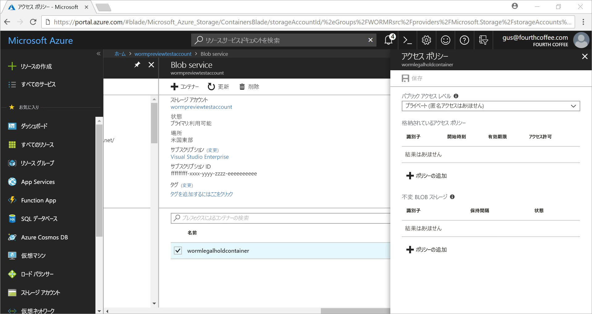

# <a name="store-business-critical-data-in-azure-blob-storage-preview"></a>ビジネスに不可欠なデータを Azure Blob Storage (プレビュー) 内に保管する

Azure Blob (オブジェクト) Storage の不変ストレージを使用すると、ユーザーはビジネスに不可欠なデータを WORM (Write Once Read Many) 状態で保存できます。 この状態では、ユーザーが指定した期間、データを消去および変更できなくなります。 保持間隔の間、BLOB の作成と読み取りは可能ですが、変更または削除することはできません。

## <a name="overview"></a>概要

不変ストレージを使用すると、金融機関やそれに関連する業界 (特に、ブローカー ディーラー組織) は、データを安全に保存できるようになります。

一般的な用途は次のとおりです。

- **法令遵守**: Azure Blob Storage の不変ストレージは、組織が SEC 17a-4(f)、CFTC 1.31(d)、FINRA などの規制に準拠するのに役立ちます。

- **セキュリティ保護されたドキュメント リテンション**: Blob Storage により、アカウント管理特権を持つユーザーを含め、どのユーザーもデータを変更したり、削除したりできなくなります。

- **訴訟ホールド**: Azure Blob Storage の不変ストレージを使用すると、ユーザーは訴訟や犯罪捜査などに不可欠な機密情報を、必要な期間中、改ざん防止状態で保存できます。

不変ストレージでは、次のことが可能です。

- **時間ベースのリテンション ポリシーのサポート:** ユーザーは、指定した期間、データを保存するポリシーを設定できます。

- **訴訟ホールド ポリシーのサポート:** 保持間隔がわからない場合は、訴訟ホールドを設定することで、訴訟ホールドがクリアされるまでデータを不変状態で保存できます。  訴訟ホールドを設定すると、BLOB の作成と読み取りは可能ですが、変更または削除はできません。 各訴訟ホールドは、識別子文字列 (ケース ID など) として使用されるユーザー定義の英数字のタグに関連付けられています。

- **すべての BLOB 層のサポート:** WORM ポリシーは Azure Blob Storage 層から独立しており、ホット、クール、アーカイブのすべての層に適用されます。 ユーザーは、データの不変性を維持しながら、ワークロードに対応する最もコストが最適化された層にデータを保存できます。

- **コンテナー レベルの構成:** ユーザーは、時間ベースのリテンション ポリシーと訴訟ホールド タグをコンテナー レベルで構成できます。 ユーザーは、コンテナー レベルの簡単な設定を使用して、時間ベースのリテンション ポリシーの作成とロック、保持間隔の延長、訴訟ホールドの設定とクリアなどを行うことができます。 これらのポリシーは、コンテナー内の既存および新規のすべての BLOB に適用されます。

- **監査ログのサポート**: 各コンテナーには、監査ログが含まれています。 各コンテナーでは、保持間隔の延長の最大 3 つのログと共に、ロック済みの時間ベースのリテンション ポリシーの時間ベースのリテンション コマンドが最大 5 つ表示されます。 時間ベースのリテンションの場合、ログにはユーザー ID、コマンドの種類、タイム スタンプ、保持間隔が含まれます。 訴訟ホールドの場合、ログにはユーザー ID、コマンドの種類、タイム スタンプ、訴訟ホールド タグが含まれます。 このログは、SEC 17a-4(f) 規制ガイドラインに従い、コンテナーの有効期間の間保持されます。 コントロール プレーンのすべてのアクティビティのより包括的なログは、[Azure アクティビティ ログ](https://docs.microsoft.com/azure/monitoring-and-diagnostics/monitoring-overview-activity-logs)に表示されます。 規制や他の目的で必要になる可能性のあるログは、ユーザーが永続的に保存する必要があります。

不変ストレージは、すべての Azure パブリック リージョン内で有効になっています。

## <a name="how-it-works"></a>動作のしくみ

Azure Blob Storage の不変ストレージでは、時間ベースのリテンションと訴訟ホールドの 2 種類の WORM (不変) ポリシーがサポートされています。 これらの不変ポリシーの作成方法の詳細については、「[Getting started](#Getting-started)」 (使用の開始) セクションを参照してください。

時間ベースのリテンション ポリシーまたは訴訟ホールドをコンテナーに適用すると、既存のすべての BLOB が不変 (書き込みおよび削除禁止) 状態に移行します。 コンテナーにアップロードされるすべての新しい BLOB も不変状態に移行します。

> [!IMPORTANT]
> SEC 17a-4(f) や他の規制を順守するために BLOB を不変 (書き込みおよび削除禁止) 状態にするには、時間ベースのリテンション ポリシーを"*ロック*"する必要があります。 適切な時間内 (通常は 24 時間以内) にポリシーをロックすることをお勧めします。 短期間の機能評価以外の目的で、"*ロック解除*"状態を使用しないことをお勧めします。

時間ベースのリテンション ポリシーをコンテナーに適用すると、"*有効な*"リテンション期間中、コンテナー内のすべての BLOB が不変状態のままになります。 既存の BLOB の有効なリテンション期間は、BLOB の作成時刻とユーザーが指定した保持間隔の差になります。 

新しい BLOB の場合、有効なリテンション期間はユーザーが指定した保持間隔と同じです。 ユーザーは保持間隔を変更できるので、不変ストレージでは、ユーザー指定の保持間隔の最新の値が有効なリテンション期間の計算に使用されます。

> [!TIP]
> 例:
> 
> ユーザーが、保持間隔が 5 年の時間ベースのリテンション ポリシーを作成しました。
>
> そのコンテナー内の既存の BLOB である testblob1 は、1 年前に作成されました。 testblob1 の有効なリテンション期間は、4 年です。
>
> 新しい BLOB (testblob2) がコンテナーにアップロードされました。 この新しい BLOB の有効なリテンション期間は、5 年です。

### <a name="legal-holds"></a>訴訟ホールド

訴訟ホールドを設定する場合、訴訟ホールドがクリアされるまで、既存および新規のすべての BLOB が不変状態のままになります。 訴訟ホールドを設定およびクリアする方法の詳細については、「[Getting started](#Getting-started)」 (使用の開始) セクションを参照してください。

コンテナーには、訴訟ホールドと時間ベースのリテンション ポリシーの両方を同時に適用できます。 有効なリテンション期間が終了していても、すべての訴訟ホールドがクリアされるまで、そのコンテナー内のすべての BLOB が不変状態のままになります。 逆に、すべての訴訟ホールドがクリアされていても、有効なリテンション期間が終了するまで、BLOB は不変状態のままになります。

次の表に、さまざまな不変シナリオで無効になる BLOB 操作の種類を示します。 詳細については、「[Azure Blob Service API に関する記事](https://docs.microsoft.com/rest/api/storageservices/blob-service-rest-api)」を参照してください。

|シナリオ  |BLOB の状態  |禁止されている BLOB 操作  |
|---------|---------|---------|
|BLOB の有効なリテンション期間がまだ終了していないか、訴訟ホールドが設定されている     |不変: 削除および書き込み禁止         |Delete Container、Delete Blob、Put Blob1、Put Block、Put Block List、Set Blob Metadata、Put Page、Set Blob Properties、Snapshot Blob、Incremental Copy Blob、Append Block         |
|BLOB の有効なリテンション期間が終了している     |書き込み禁止のみ (削除操作は可能)         |Put Blob、Put Block、Put Block List、Set Blob Metadata、Put Page、Set Blob Properties、Snapshot Blob、Incremental Copy Blob、Append Block         |
|すべての訴訟ホールドがクリアされており、時間ベースのリテンション ポリシーがコンテナー上で設定されていない     |変更可能         |なし         |
|WORM ポリシーが作成されていない (時間ベースのリテンションまたは訴訟ホールド)     |変更可能         |なし         |

> [!NOTE]
> 上記の表の先頭の 2 つのシナリオでは、最初の Put Blob、および BLOB の作成に必要な Put Block List と Put Block が許可されます。 以降のすべての操作は許可されません。
>
> 不変ストレージは、GPv2 および Blob Storage アカウントでのみ使用できます。 不変ストレージを作成するには、[Azure Resource Manager](https://docs.microsoft.com/azure/azure-resource-manager/resource-group-overview) を使用する必要があります。

## <a name="pricing"></a>価格

この機能の使用に対する追加料金はありません。 不変データは、通常の変更可能データと同様に価格が設定されます。 価格設定の詳細については、「[Azure Storage の価格設定に関するページ](https://azure.microsoft.com/pricing/details/storage/blobs/)」を参照してください。

### <a name="restrictions"></a>制限

パブリック プレビュー期間中は、次の制限が適用されます。

- "*実稼働データやビジネスに不可欠なデータは保存しないでください。*"
- プレビュー/NDA のすべての制限が適用されます。

## <a name="getting-started"></a>使用の開始

[Azure Portal](http://portal.azure.com)、[Azure CLI 2.0](https://docs.microsoft.com/cli/azure/install-azure-cli?view=azure-cli-latest)、および [Azure PowerShell](https://github.com/Azure/azure-powershell/releases/tag/Azure.Storage.v4.4.0-preview-May2018) の最新リリースでは、Azure Blob Storage の不変ストレージがサポートされます。

### <a name="azure-portal"></a>Azure ポータル

1. 新しいコンテナーを作成するか、既存のコンテナーを選択して、不変状態に維持する必要がある BLOB を格納します。
 コンテナーは、GPv2 ストレージ アカウント内に存在する必要があります。
2. [コンテナーの設定] 内にある **[アクセス ポリシー]** を選択します。 次に、**[Immutable blob storage]\(不変 BLOB ストレージ\)** の下で **[+ Add policy]\(+ポリシーの追加\)** を選択します。

    

3. 時間ベースのリテンションを有効にするには、ドロップダウン メニューから **[時間ベースの保持]** を選択します。

    ![[ポリシーの種類] の下で選択されている [時間ベースの保持]](media/storage-blob-immutable-storage/portal-image-2.png)

4. 保持間隔を日数で入力します (最小値は 1 日です)。

    ![[Update retention period to]\(保持期間を次に更新\) ボックス](media/storage-blob-immutable-storage/portal-image-5-retention-interval.png)

    スクリーンショットのように、ポリシーの初期状態は [ロック解除] です。 ポリシーをロックする前に、保持間隔を短くして機能をテストし、ポリシーに変更を加えることができます。 ロックは、SEC 17a-4 などの規制に準拠するために必要です。

5. ポリシーをロックします。 省略記号 (**...**) を右クリックすると、次のメニューが表示されます。

    ![メニュー上の [ポリシーのロック]](media/storage-blob-immutable-storage/portal-image-4-lock-policy.png)

    **[Lock Policy]\(ポリシーのロック\)** を選択すると、ポリシーの状態が [locked]\(ロック\) として表示されます。 ロックしたポリシーは、削除することができなくなり、保持間隔の延長だけが許可されます。

6. 訴訟ホールドを有効にするには、**[+ Add Policy]\(+ ポリシーの追加\)** を選択します。 ドロップダウン メニューから **[訴訟ホールド]** を選択します。

    ![[ポリシーの種類] の下のメニューにある [訴訟ホールド]](media/storage-blob-immutable-storage/portal-image-legal-hold-selection-7.png)

7. 1 つ以上のタグを持つ訴訟ホールドを作成します。

    ![[ポリシーの種類] の下にある [タグ名] ボックス](media/storage-blob-immutable-storage/portal-image-set-legal-hold-tags.png)

### <a name="azure-cli-20"></a>Azure CLI 2.0

`az extension add -n storage-preview` を使用して、[Azure CLI 拡張機能](http://docs.microsoft.com/cli/azure/install-azure-cli?view=azure-cli-latest)をインストールします。

拡張機能が既にインストールされている場合は、`az extension update -n storage-preview` コマンドを使用して、不変ストレージを有効にします。

この機能は、`az storage container immutability-policy` および `az storage container legal-hold` コマンド グループに含まれています。 これらに対して `-h` を実行すると、コマンドが表示されます。

### <a name="powershell"></a>PowerShell

[PowerShell バージョン 4.4.0 プレビュー](https://github.com/Azure/azure-powershell/releases/tag/Azure.Storage.v4.4.0-preview-May20180) では、不変ストレージがサポートされています。
この機能を有効にするには、次の手順を実行します。

1. `Install-Module PowerShellGet –Repository PSGallery –Force` を実行し、最新バージョンの PowerShellGet がインストールされていることを確認します。
2. Azure PowerShell の以前のインストールを削除します。
3. `Install-Module AzureRM –Repository PSGallery –AllowClobber` を実行し、AzureRM をインストールします。 Azure は、このリポジトリから同様にインストールできます。
4. `Install-Module -Name AzureRM.Storage -AllowPrerelease -Repository PSGallery -AllowClobber` を実行し、ストレージ管理プレーンのコマンドレットのプレビュー バージョンをインストールします。

この機能の使用法については、後で「[PowerShell コードの例](#sample-powershell-code)」で説明します。

## <a name="client-libraries"></a>クライアント ライブラリ

Azure Blob Storage の不変ストレージは、次のクライアント ライブラリでサポートされます。

- [.NET クライアント ライブラリ (バージョン 7.2.0-preview 以上)](https://www.nuget.org/packages/Microsoft.Azure.Management.Storage/7.2.0-preview)
- [Node.js クライアント ライブラリ (バージョン 4.0.0 以上)](https://www.npmjs.com/package/azure-arm-storage)
- [Python クライアント ライブラリ (バージョン 2.0.0 Release Candidate 2 以上)](https://pypi.org/project/azure-mgmt-storage/2.0.0rc1/)

## <a name="supported-values"></a>サポートされている値

- 最小保持間隔は 1 日です。 最大保持間隔は 400 年です。
- ストレージ アカウントで、ロック済みの不変ポリシーが適用されたコンテナーの最大数は 1000 です。
- ストレージ アカウントで、訴訟ホールドが設定されたコンテナーの最大数は 1000 です。
- コンテナーで、訴訟ホールド タグの最大数は 10 です。
- 訴訟ホールド タグの最大長は英数字 23 文字です。 最小長は 3 文字です。
- コンテナーで、ロック済みの不変ポリシーの許容される保持間隔の延長の最大回数は 3 回です。
- ロック済みの不変ポリシーが適用されたコンテナーでは、コンテナーの存続期間中、最大 5 個の時間ベースのリテンション ポリシー ログと、最大 10 個の訴訟ホールド ポリシー ログが保持されます。

## <a name="faq"></a>FAQ

**この機能が適用されるのはブロック BLOB だけですか? それとも、ページ BLOB と追加 BLOB にも適用されますか?**

不変ストレージは、どの種類の BLOB でも使用できます。  ただし、主としてブロック BLOB 用に使用することをお勧めします。 ブロック BLOB とは異なり、ページ BLOB と追加 BLOB は WORM コンテナーの外部で作成し、コンテナー内にコピーする必要があります。 これらの BLOB を WORM コンテナー内にコピーした後は、追加 BLOB への"*追加*"やページ BLOB の変更を行うことはできなくなります。

**この機能を使用するために、常に新しいストレージ アカウントを作成する必要がありますか?**

不変ストレージは、既存の GPv2 アカウントまたは新しいストレージ アカウント (アカウントの種類が GPv2 の場合) で使用できます。 この機能は、BLOB ストレージでのみ使用できます。

**"*ロック済み*" の時間ベースのリテンション ポリシーまたは訴訟ホールドが適用されたコンテナーを削除しようとするとどうなりますか?**

ロック済みの時間ベースの保持ポリシーまたは訴訟ホールドが適用された BLOB が 1 つ以上あると、Delete Container 操作は失敗します。 これは、データを[論理的に削除](storage-blob-soft-delete.md)した場合も当てはまります。 保持間隔がアクティブな BLOB がなく、訴訟ホールドもなければ、Delete Container 操作は成功します。 コンテナーを削除するには、事前に BLOB を削除しておく必要があります。 

**"*ロック済み*" の時間ベースのリテンション ポリシーまたは訴訟ホールドが適用された WORM コンテナーを含むストレージ アカウントを削除しようとするとどうなりますか?**

訴訟ホールドまたは保持間隔がアクティブな BLOB が格納された WORM コンテナーが 1 つ以上ある場合、ストレージ アカウントの削除は失敗します。  ストレージ アカウントを削除するには、事前にすべての WORM コンテナーを削除しておく必要があります。 コンテナーの削除については、前の質問を参照してください。

**BLOB が不変状態のときに、異なる BLOB 層 (ホット、クール、コールド) の間でデータを移動できますか?**

はい。データを不変状態に保ちながら、Set Blob Tier コマンドを使用して、BLOB 層の間でデータを移動できます。 不変ストレージは、ホット、クール、コールドの各 BLOB 層でサポートされています。

**支払いを怠ったときに、リテンション期間がまだ終了していない場合はどうなりますか?**

未払いの場合、Microsoft との契約条件に明記されているように、通常のデータ保有ポリシーが適用されます。

**機能を試してみるだけの試用期間または猶予期間は設けられていますか?**

はい。 時間ベースのリテンション ポリシーを最初に作成したとき、ポリシーは"*ロック解除*"状態です。 この状態にある間は、保持間隔に必要な変更 (延長、短縮など) を加えることができ、ポリシーを削除することもできます。 ポリシーは、ロックされると、永久にロックされたままになり、削除できなくなります。 また、ポリシーがロックされると、保持間隔も短縮できなくなります。 "*ロック解除*"状態は試用の目的でのみ使用し、24 時間以内にポリシーをロックすることを強くお勧めします。 この手順により、SEC 17a-4(f) やその他の規制に準拠することができます。

**この機能は国内のクラウドや政府機関のクラウドで利用できますか?**

現在、不変ストレージは、Azure パブリック リージョンでのみ利用できます。 国内の特定のクラウドに関心がおありの場合は、azurestoragefeedback@microsoft.com までメールにてお問い合わせください。

## <a name="sample-powershell-code"></a>PowerShell コードの例

ご参考までに、PowerShell スクリプトの例を次に示します。 このスクリプトでは、新しいストレージ アカウントとコンテナーが作成されます。 そのあと、訴訟ホールドを設定およびクリアする方法、時間ベースのリテンション ポリシー (不変ポリシーとも呼ばれる) を作成およびロックする方法、および保持間隔を延長する方法が示されています。

```powershell
$ResourceGroup = "<Enter your resource group>”
$StorageAccount = "<Enter your storage account name>"
$container = "<Enter your container name>"
$container2 = "<Enter another container name>”
$location = "<Enter the storage account location>"

# Log in to the Azure Resource Manager account
Login-AzureRMAccount
Register-AzureRmResourceProvider -ProviderNamespace "Microsoft.Storage"

# Create your Azure resource group
New-AzureRmResourceGroup -Name $ResourceGroup -Location $location

# Create your Azure storage account
New-AzureRmStorageAccount -ResourceGroupName $ResourceGroup -StorageAccountName `
    $StorageAccount -SkuName Standard_LRS -Location $location -Kind Storage

# Create a new container
New-AzureRmStorageContainer -ResourceGroupName $ResourceGroup `
    -StorageAccountName $StorageAccount -Name $container

# Create Container 2 with a storage account object
$accountObject = Get-AzureRmStorageAccount -ResourceGroupName $ResourceGroup `
    -StorageAccountName $StorageAccount
New-AzureRmStorageContainer -StorageAccount $accountObject -Name $container2

# Get a container
Get-AzureRmStorageContainer -ResourceGroupName $ResourceGroup `
    -StorageAccountName $StorageAccount -Name $container

# Get a container with an account object
$containerObject = Get-AzureRmStorageContainer -StorageAccount $accountObject -Name $container

# List containers
Get-AzureRmStorageContainer -ResourceGroupName $ResourceGroup `
    -StorageAccountName $StorageAccount

# Remove a container (add -Force to dismiss the prompt)
Remove-AzureRmStorageContainer -ResourceGroupName $ResourceGroup `
    -StorageAccountName $StorageAccount -Name $container2

# Remove a container with an account object
Remove-AzureRmStorageContainer -StorageAccount $accountObject -Name $container2

# Remove a container with a container object
$containerObject2 = Get-AzureRmStorageContainer -StorageAccount $accountObject -Name $container2
Remove-AzureRmStorageContainer -InputObject $containerObject2

# Set a legal hold
Add-AzureRmStorageContainerLegalHold -ResourceGroupName $ResourceGroup `
    -StorageAccountName $StorageAccount -Name $container -Tag tag1,tag2

# Set a legal hold with an account object
Add-AzureRmStorageContainerLegalHold -StorageAccount $accountObject -Name $container -Tag tag3

# Set a legal hold with a container object
Add-AzureRmStorageContainerLegalHold -Container $containerObject -Tag tag4,tag5

# Clear a legal hold
Remove-AzureRmStorageContainerLegalHold -ResourceGroupName $ResourceGroup `
    -StorageAccountName $StorageAccount -Name $container -Tag tag2

# Clear a legal hold with an account object
Remove-AzureRmStorageContainerLegalHold -StorageAccount $accountObject -Name $container -Tag tag3,tag5

# Clear a legal hold with a container object
Remove-AzureRmStorageContainerLegalHold -Container $containerObject -Tag tag4

# Create or update an immutability policy
## with an account name or container name

Set-AzureRmStorageContainerImmutabilityPolicy -ResourceGroupName $ResourceGroup `
    -StorageAccountName $StorageAccount -ContainerName $container -ImmutabilityPeriod 10

## with an account object
Set-AzureRmStorageContainerImmutabilityPolicy -StorageAccount $accountObject `
    -ContainerName $container -ImmutabilityPeriod 1 -Etag $policy.Etag

## with a container object
$policy = Set-AzureRmStorageContainerImmutabilityPolicy -Container `
    $containerObject -ImmutabilityPeriod 7

## with an immutability policy object
Set-AzureRmStorageContainerImmutabilityPolicy -ImmutabilityPolicy $policy -ImmutabilityPeriod 5

# Get an immutability policy
Get-AzureRmStorageContainerImmutabilityPolicy -ResourceGroupName $ResourceGroup `
    -StorageAccountName $StorageAccount -ContainerName $container

# Get an immutability policy with an account object
Get-AzureRmStorageContainerImmutabilityPolicy -StorageAccount $accountObject `
    -ContainerName $container

# Get an immutability policy with a container object
Get-AzureRmStorageContainerImmutabilityPolicy -Container $containerObject

# Lock an immutability policy (add -Force to dismiss the prompt)
## with an immutability policy object

$policy = Get-AzureRmStorageContainerImmutabilityPolicy -ResourceGroupName `
    $ResourceGroup -StorageAccountName $StorageAccount -ContainerName $container
$policy = Lock-AzureRmStorageContainerImmutabilityPolicy -ImmutabilityPolicy $policy -force

## with an account name or container name
$policy = Lock-AzureRmStorageContainerImmutabilityPolicy -ResourceGroupName `
    $ResourceGroup -StorageAccountName $StorageAccount -ContainerName $container `
    -Etag $policy.Etag

## with an account object
$policy = Lock-AzureRmStorageContainerImmutabilityPolicy -StorageAccount `
    $accountObject -ContainerName $container -Etag $policy.Etag

## with a container object
$policy = Lock-AzureRmStorageContainerImmutabilityPolicy -Container `
    $containerObject -Etag $policy.Etag -force

# Extend an immutability policy
## with an immutability policy object

$policy = Get-AzureRmStorageContainerImmutabilityPolicy -ResourceGroupName `
    $ResourceGroup -StorageAccountName $StorageAccount -ContainerName $container

$policy = Set-AzureRmStorageContainerImmutabilityPolicy -ImmutabilityPolicy `
    $policy -ImmutabilityPeriod 11 -ExtendPolicy

## with an account name or container name
$policy = Set-AzureRmStorageContainerImmutabilityPolicy -ResourceGroupName `
    $ResourceGroup -StorageAccountName $StorageAccount -ContainerName $container `
    -ImmutabilityPeriod 11 -Etag $policy.Etag -ExtendPolicy

## with an account object
$policy = Set-AzureRmStorageContainerImmutabilityPolicy -StorageAccount `
    $accountObject -ContainerName $container -ImmutabilityPeriod 12 -Etag `
    $policy.Etag -ExtendPolicy

## with a container object
$policy = Set-AzureRmStorageContainerImmutabilityPolicy -Container `
    $containerObject -ImmutabilityPeriod 13 -Etag $policy.Etag -ExtendPolicy

# Remove an immutability policy (add -Force to dismiss the prompt)
## with an immutability policy object
$policy = Get-AzureRmStorageContainerImmutabilityPolicy -ResourceGroupName `
    $ResourceGroup -StorageAccountName $StorageAccount -ContainerName $container
Remove-AzureRmStorageContainerImmutabilityPolicy -ImmutabilityPolicy $policy

## with an account name or container name
Remove-AzureRmStorageContainerImmutabilityPolicy -ResourceGroupName `
    $ResourceGroup -StorageAccountName $StorageAccount -ContainerName $container `
    -Etag $policy.Etag

## with an account object
Remove-AzureRmStorageContainerImmutabilityPolicy -StorageAccount $accountObject `
    -ContainerName $container -Etag $policy.Etag

## with a container object
Remove-AzureRmStorageContainerImmutabilityPolicy -Container $containerObject `
    -Etag $policy.Etag
    
```
