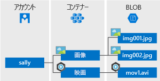

# <a name="introduction-to-azure-blob-storage"></a>Azure Blob Storage の概要

[!INCLUDE [storage-blob-concepts-include](../../../includes/storage-blob-concepts-include.md)]

## <a name="blob-storage-resources"></a>Blob Storage のリソース

Blob Storage には、3 種類のリソースがあります。

- **ストレージ アカウント** 
- ストレージ アカウント内の**コンテナー**
- コンテナー内の **BLOB** 

次の図に、これらのリソースの関係を示します。



### <a name="storage-accounts"></a>ストレージ アカウント

ストレージ アカウントは、データ用の一意の名前空間を Azure 内に用意します。 Azure Storage 内に格納されるすべてのオブジェクトには、一意のアカウント名を含むアドレスが割り当てられます。 アカウント名と Azure Storage サービス エンドポイントの組み合わせによって、ストレージ アカウント用のエンドポイントが形成されます。

たとえば、ストレージ アカウントの名前が *mystorageaccount* の場合、Blob Storage の既定のエンドポイントは次のようになります。

```
http://mystorageaccount.blob.core.windows.net 
```

ストレージ アカウントを作成する場合は、「[ストレージ アカウントの作成](../common/storage-quickstart-create-account.md)」を参照してください。 ストレージ アカウントの詳細については、「[Azure ストレージ アカウントの概要](../common/storage-account-overview.md?toc=%2fazure%2fstorage%2fblobs%2ftoc.json)」を参照してください。

### <a name="containers"></a>コンテナー

ファイル システムのディレクトリと同じように、コンテナーを使用して BLOB のセットを整理できます。 ストレージ アカウントに含めることができるコンテナーの数には制限がなく、1 つのコンテナーに格納できる BLOB の数にも制限はありません。 

  > [!NOTE]
  > コンテナー名は小文字で入力する必要があります。 コンテナーの詳細については、「[Naming and Referencing Containers, Blobs, and Metadata](https://docs.microsoft.com/rest/api/storageservices/Naming-and-Referencing-Containers--Blobs--and-Metadata)」(コンテナー、BLOB、およびメタデータの名前付けと参照) を参照してください。

### <a name="blobs"></a>BLOB
 
Azure Storage では、3 種類の BLOB がサポートされています。

* **ブロック BLOB** には、約 4.7 TB までのテキストとバイナリ データが格納されます。 ブロック BLOB は、個別に管理できるデータ ブロックで構成されます。
* **追加 BLOB** は、ブロック BLOB と同様にブロックで構成されますが、追加操作用に最適化されています。 追加 BLOB は、仮想マシンのデータのログ記録などのシナリオに最適です。
* **ページ BLOB** には、最大 8 TB のランダム アクセス ファイルが格納されます。 ページ BLOB には、Azure 仮想マシン用のディスクとして機能する仮想ハード ドライブ (VHD) ファイルが格納されます。 ページ BLOB の詳細については、(../articles/storage/blobs/storage-blob-pageblob-overview.md) を参照してください。

異なる種類の BLOB の詳細については、「[Understanding Block Blobs, Append Blobs, and Page Blobs](https://docs.microsoft.com/rest/api/storageservices/understanding-block-blobs--append-blobs--and-page-blobs)」(ブロック BLOB、追加 BLOB、ページ BLOB について) をご覧ください。

## <a name="move-data-to-blob-storage"></a>Blob Storage にデータを移動する

既存のデータを Blob Storage に移行するためのソリューションは多数存在します。

- **AzCopy** は Windows と Linux 用の使いやすいコマンド ライン ツールであり、Blob Storage 間、コンテナー間、またはストレージ アカウント間でデータをコピーします。 AzCopy の詳細については、「[AzCopy v10 (プレビュー) を使用してデータを転送する](../common/storage-use-azcopy-v10.md)」をご覧ください。 
- **Azure Storage Data Movement Library** は、Azure Storage サービス間でデータを移動するための .NET ライブラリです。 AzCopy ユーティリティは、Data Movement Library を使用して構築されています。 詳細については、Data Movement Library の[参照ドキュメント](https://docs.microsoft.com/dotnet/api/microsoft.windowsazure.storage.datamovement)をご覧ください。 
- **Azure Data Factory** では、Azure リソースを認証するためのアカウント キー、Shared Access Signature、サービス プリンシパル、またはマネージド ID を使用した Blob Storage 間のデータのコピーをサポートしています。 詳しくは、「[Azure Data Factory を使用した Azure Blob Storage との間でのデータのコピー](https://docs.microsoft.com/azure/data-factory/connector-azure-blob-storage?toc=%2fazure%2fstorage%2fblobs%2ftoc.json)」をご覧ください。 
- **blobfuse** は Azure Blob Storage 用の仮想ファイル システム ドライバーです。 Linux ファイル システムでは、blobfuse を使用して、お客様のストレージ アカウント内の既存のブロック BLOB データにアクセスできます。 詳しくは、「[blobfuse を使用して Blob Storage をファイル システムとしてマウントする方法](storage-how-to-mount-container-linux.md)」をご覧ください。
- **Azure Data Box Disk** は、大規模なデータセットやネットワーク上の制約によって有線でのデータのアップロードが非現実的になったときに、オンプレミスのデータを Blob Storage に転送するサービスです。 [Azure Data Box Disk](../../databox/data-box-disk-overview.md) を使用すると、Microsoft から SSD (Solid State Disk) を取り寄せることができます。 必要なデータは、それらのディスクにコピーし、Microsoft に送り返すことで、BLOB ストレージにアップロードすることができます。
- **Azure Import/Export サービス**を使用すると、大量のデータをお客様のストレージ アカウントからハード ディスクにエクスポートすることができます。ハード ディスクはお客様が用意し、処理後に Microsoft からお客様のデータと共に送り返されます。 詳しくは、[Microsoft Azure Import/Export サービスを使用した Blob Storage へのデータの転送](../common/storage-import-export-service.md)に関する記事をご覧ください。

## <a name="next-steps"></a>次の手順

* [ストレージ アカウントの作成](../common/storage-create-storage-account.md?toc=%2fazure%2fstorage%2fblobs%2ftoc.json)
* [Azure Storage のスケーラビリティおよびパフォーマンスのターゲット](../common/storage-scalability-targets.md)
