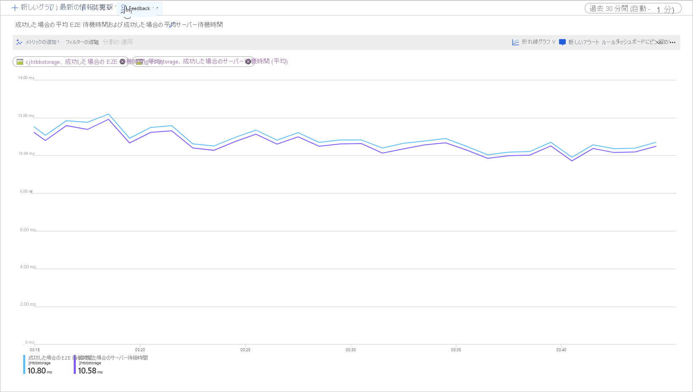

# Blob Storage での待ち時間

待ち時間とは、要求の完了をアプリケーションが待機しなければならない時間であり、応答時間と呼ばれることもあります。 待ち時間はアプリケーションのパフォーマンスに直接的な影響を及ぼすことがあります。 クレジット カード トランザクションの実行や Web ページの読み込みなど、人間が介在するシナリオでは多くの場合、低遅延が重要となります。 また、テレメトリのログ記録や IoT イベントなど、受信イベントを高速に処理する必要のあるシステムでも低遅延が要求されます。 この記事では、ブロック BLOB に対する操作の待ち時間を把握、測定する方法のほか、低遅延を実現するアプリケーションの設計方法について説明します。

Azure Storage では、ブロック BLOB に関して Premium と Standard の 2 種類のパフォーマンス オプションが用意されています。 Premium ブロック BLOB は、ハイパフォーマンスの SSD ディスクにより、Standard ブロック BLOB と比較してきわめて短い待ち時間と高い一貫性を備えています。 詳細については、「[Azure Blob Storage: ホット、クール、アーカイブ ストレージ層](storage-blob-storage-tiers.md)」の「**Premium パフォーマンス ブロック BLOB ストレージ**」を参照してください。

## Azure Storage の待ち時間について

Azure Storage の待ち時間は、Azure Storage の操作に対する要求レートに関係しています。 要求レートは、1 秒あたりの入出力操作 (IOPS) とも呼ばれています。

要求レートを計算するには、まずそれぞれの要求が完了するのにかかる時間を特定したうえで、1 秒間に処理できる要求数を計算します。 たとえば、要求の完了に 50 ミリ秒 (ms) かかるとしましょう。 未処理の読み取りまたは書き込み操作 1 つに対して 1 つのスレッドを使用するアプリケーションでは 20 IOPS となります (1 秒つまり 1,000 ms を、要求あたりにかかる 50 ms で除算)。 理論上、スレッド数が 2 倍になれば、アプリケーションは 40 IOPS を達成できることになります。 未処理になっている読み取りまたは書き込みの非同期操作がそれぞれのスレッドで 2 倍になれば、アプリケーションは 80 IOPS を達成できることになります。

実際には、タスクのスケジューリングから生じるクライアントのオーバーヘッドやコンテキスト切り替えなどがあり、要求レートが常に線形的にスケーリングされるわけではありません。 サービス側では、Azure Storage システムにかかる負荷や、使用ストレージ メディアの違い、他のワークロードからのノイズ、メンテナンス タスクといった要因により、待ち時間にばらつきが生じることがあります。 また、輻輳や再ルーティングなどの混乱が原因で、クライアントとサーバーの間のネットワーク接続が Azure Storage の待ち時間に影響を及ぼすこともあります。

Azure Storage の帯域幅 (スループットとも呼ばれる) は要求レートに関係しており、要求レート (IOPS) に要求サイズを乗算することによって算出できます。 たとえば、毎秒 160 要求であると仮定すると、256 KiB のデータのスループットはそれぞれ毎秒 40,960 KiB (40 MiB) となります。

## ブロック BLOB の待ち時間のメトリック

Azure Storage には、ブロック BLOB の待ち時間に関して 2 つのメトリックが用意されています。 それらのメトリックは Azure portal で確認できます。

- **エンド ツー エンド (E2E) の待ち時間**: Azure Storage が 1 つ目の要求パケットを受け取ってから、最後の応答パケットについてクライアントの受信確認を受け取るまでの間隔を測定します。

- **サーバーの待ち時間**: Azure Storage が最後の要求パケットを受け取ってから、1 つ目の応答パケットを返すまでの間隔を測定します。

次の画像は、`Get Blob` 操作を呼び出すサンプル ワークロードについて、**成功した場合の E2E 平均待ち時間**と**成功した場合の平均サーバー待ち時間**を示しています。

通常の条件下では、エンド ツー エンドの待ち時間とサーバーの待ち時間との間に差はほとんどありません。このことは、サンプル ワークロードについての画像が示しています。

エンド ツー エンドの待ち時間とサーバーの待ち時間のメトリックを確認して、エンド ツー エンドの待ち時間の方がサーバーの待ち時間よりも著しく長い場合は、余分な待ち時間が生じている原因を調査して解決してください。

エンド ツー エンドとサーバーで待ち時間に大きな差は見られないものの、待ち時間をもっと短縮する必要がある場合は、Premium ブロック BLOB ストレージへの移行を検討してください。

## 待ち時間に影響する要因

待ち時間に影響する主な要因は、操作のサイズです。 操作のサイズが大きくなると、ネットワーク経由で転送され Azure Storage で処理されるデータの量により、完了までの時間が長くなります。

次の図は、さまざまなサイズの操作にかかる合計時間を示したものです。 少量のデータでは、待ち時間の大部分は、データの転送にではなく要求の処理に費やされます。 操作のサイズが増えると、待ち時間も少しだけ増えます (下図の 1 で示した部分)。 操作のサイズがさらに増えると、データの転送にかかる時間が長くなるため、待ち時間の合計は要求の処理とデータの転送とで二分されます (下図の 2 で示した部分)。 さらに操作のサイズが大きくなると、待ち時間はもっぱらデータの転送に費やされ、要求の処理に費やされる時間は無視できるほど小さくなります (下図の 3 で示した部分)。

コンカレンシーやスレッドなど、クライアントの構成の要因も待ち時間に影響します。 全体的なスループットは、その時点で転送されているストレージ要求の数や、アプリケーションによるスレッドの処理方法によって異なります。 CPU やメモリ、ローカル ストレージ、ネットワーク インターフェイスなど、クライアントのリソースも待ち時間に影響します。

Azure Storage 要求の処理には、クライアントの CPU リソースとメモリ リソースが必要となります。 システムにおけるプロセスの暴走や仮想マシンの性能不足が原因でクライアントに負荷がかかっていると、Azure Storage の要求処理に利用できるリソースが少なくなっていきます。 クライアント リソースの競合や不足は、サーバーの待ち時間の増加を伴わない、エンド ツー エンドの待ち時間だけが増える状況を招き、2 つのメトリックに差が生じる原因となります。

同じくらい重要なのは、クライアントと Azure Storage との間のネットワーク パイプとネットワーク インターフェイスです。 クライアント VM が別の Azure リージョンやオンプレミスに存在するなど、物理的な距離だけでも大きな要因となることがあります。 その他、ネットワーク ホップ数や ISP ルーティング、インターネットの状態などの要因が、全体的なストレージの待ち時間に影響を及ぼすこともあります。

待ち時間を評価するには、まず実際のシナリオのベースライン メトリックを確立します。 ベースライン メトリックにより、実際のワークロード プロファイル、アプリケーションの構成設定、クライアント リソース、ネットワーク パイプなどの要因に応じて、アプリケーション環境のコンテキストで予想されるエンド ツー エンドの待ち時間とサーバーの待ち時間を得ることができます。 ベースライン メトリックがあれば、異常な状況と正常な状況とをより容易に見分けることができます。 また、アプリケーションの構成や VM サイズなど、パラメーターを変更した場合の効果も、ベースライン メトリックを基に観察することができます。

## 次のステップ

- [BLOB ストレージのスケーラビリティとパフォーマンスのターゲット](scalability-targets.md)
- [BLOB ストレージのパフォーマンスとスケーラビリティのチェックリスト](storage-performance-checklist.md)
