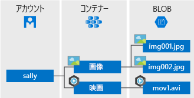

# <a name="quickstart-azure-blob-storage-client-library-for-net"></a>クイック スタート:.NET 用 Azure Blob Storage クライアント ライブラリ

.NET 用 Azure Blob Storage クライアント ライブラリを使用してみましょう。 Azure Blob Storage は、Microsoft のクラウド用オブジェクト ストレージ ソリューションです。 手順に従ってパッケージをインストールし、基本タスクのコード例を試してみましょう。 Blob Storage は、テキスト データやバイナリ データなどの大量の非構造化データを格納するために最適化されています。

.NET 用 Azure Blob Storage クライアント ライブラリを使用すると、以下のことができます。

* コンテナーを作成する
* コンテナーに対するアクセス許可を設定する
* Azure Storage 内に BLOB を作成する
* ローカル コンピューターに BLOB をダウンロードする
* コンテナー内のすべての BLOB を一覧表示する
* コンテナーを削除する

[API のリファレンスのドキュメント](https://docs.microsoft.com/dotnet/api/overview/azure/storage?view=azure-dotnet) | [ライブラリのソース コード](https://github.com/Azure/azure-storage-net/tree/master/Blob) | [パッケージ (NuGet)](https://www.nuget.org/packages/Microsoft.Azure.Storage.Blob/) | [サンプル](https://azure.microsoft.com/resources/samples/?sort=0&service=storage&platform=dotnet&term=blob)

## <a name="prerequisites"></a>前提条件

* Azure サブスクリプション - [無料アカウントを作成する](https://azure.microsoft.com/free/)
* Azure Storage アカウント - [ストレージ アカウントを作成する](https://docs.microsoft.com/azure/storage/common/storage-quickstart-create-account)
* 使用するオペレーティング システム用の [NET Core 2.1 SDK](https://dotnet.microsoft.com/download/dotnet-core) またはそれ以降

## <a name="setting-up"></a>設定

このセクションでは、.NET 用 Azure Blob Storage クライアント ライブラリを操作するためのプロジェクトの準備について説明します。

### <a name="create-the-project"></a>プロジェクトを作成する

まず、**blob-quickstart** という名前の .NET Core アプリケーションを作成します。

1. コンソール ウィンドウ (cmd、PowerShell、Bash など) で、`dotnet new` コマンドを使用し、**blob-quickstart** という名前で新しいコンソール アプリを作成します。 このコマンドにより、1 つのソース ファイルを使用する単純な "Hello World" C# プロジェクトが作成されます。**Program.cs**。

   ```console
   dotnet new console -n blob-quickstart
   ```

2. 新しく作成された **blob-quickstart** フォルダーに切り替え、アプリをビルドし、すべて問題なく動作していることを確認します。

   ```console
   cd blob-quickstart
   ```

   ```console
   dotnet build
   ```

ビルドからの予想される出力は、次のようになります。

```output
C:\QuickStarts\blob-quickstart> dotnet build
Microsoft (R) Build Engine version 16.0.450+ga8dc7f1d34 for .NET Core
Copyright (C) Microsoft Corporation. All rights reserved.

  Restore completed in 44.31 ms for C:\QuickStarts\blob-quickstart\blob-quickstart.csproj.
  blob-quickstart -> C:\QuickStarts\blob-quickstart\bin\Debug\netcoreapp2.1\blob-quickstart.dll

Build succeeded.
    0 Warning(s)
    0 Error(s)

Time Elapsed 00:00:03.08
```

### <a name="install-the-package"></a>パッケージをインストールする

まだアプリケーション ディレクトリにいる間に、`dotnet add package` コマンドを使用して、.NET 用の Azure Blob Storage クライアント ライブラリ パッケージをインストールします。

```console
dotnet add package Microsoft.Azure.Storage.Blob
```

### <a name="set-up-the-app-framework"></a>アプリのフレームワークを設定する

プロジェクト ディレクトリで次の操作を行います。

1. エディターで Program.cs ファイルを開きます
2. **Console.WriteLine** ステートメントを削除します
3. **using** ディレクティブを追加します
4. 例のメイン コードが配置される **ProcessAsync** メソッドを作成します
5. **Main** から **ProcessAsync** メソッドを非同期的に呼び出します

コードは次のとおりです。

```csharp
using System;
using System.IO;
using System.Threading.Tasks;
using Microsoft.Azure.Storage;
using Microsoft.Azure.Storage.Blob;

namespace blob_quickstart
{
    class Program
    {
        public static void Main()
        {
            Console.WriteLine("Azure Blob Storage - .NET quickstart sample\n");

            // Run the examples asynchronously, wait for the results before proceeding
            ProcessAsync().GetAwaiter().GetResult();

            Console.WriteLine("Press any key to exit the sample application.");
            Console.ReadLine();
        }

        private static async Task ProcessAsync()
        {
        }
    }
}
```

### <a name="copy-your-credentials-from-the-azure-portal"></a>Azure Portal で資格情報をコピーする

サンプル アプリケーションは、ストレージ アカウントへのアクセスを認証する必要があります。 認証するには、ストレージ アカウントの資格情報を接続文字列としてアプリケーションに追加します。 次の手順に従って、ストレージ アカウントの資格情報を表示します。

1. [Azure Portal](https://portal.azure.com) に移動します。
2. 自分のストレージ アカウントを探します。
3. ストレージ アカウントの概要の **[設定]** セクションで、 **[アクセス キー]** を選択します。 ここでは、アカウント アクセス キーと各キーの完全な接続文字列を表示できます。
4. **[Key1]** の **[接続文字列]** の値を見つけ、 **[コピー]** ボタンを選択して接続文字列をコピーします。 すぐ後の手順で、接続文字列の値を環境変数に追加します。

    

### <a name="configure-your-storage-connection-string"></a>ストレージ接続文字列の構成

接続文字列をコピーした後、アプリケーションを実行しているローカル マシンの新しい環境変数にそれを書き込みます。 環境変数を設定するには、コンソール ウィンドウを開いて、お使いのオペレーティング システムの手順に従います。 `<yourconnectionstring>` は、実際の接続文字列に置き換えてください。

実行中のプログラムのうち、環境変数の読み取りを必要とするプログラムについては、環境変数を追加した後で再起動が必要となる場合があります。 たとえば、Visual Studio をエディターとして使用している場合、サンプルを実行する前に Visual Studio を再起動します。

#### <a name="windows"></a>Windows

```cmd
setx STORAGE_CONNECTION_STRING "<yourconnectionstring>"
```

#### <a name="linux"></a>Linux

```bash
export STORAGE_CONNECTION_STRING="<yourconnectionstring>"
```

#### <a name="macos"></a>MacOS

```bash
export STORAGE_CONNECTION_STRING="<yourconnectionstring>"
```

## <a name="object-model"></a>オブジェクト モデル

Azure Blob Storage は、大量の非構造化データを格納するために最適化されています。 非構造化データとは、特定のデータ モデルや定義に従っていないデータであり、テキスト データやバイナリ データなどがあります。 Blob Storage には、3 種類のリソースがあります。

* ストレージ アカウント。
* ストレージ アカウント内のコンテナー
* コンテナー内の BLOB

次の図に、これらのリソースの関係を示します。



これらのリソースとやり取りするには、以下の .NET クラスを使用します。

* [CloudStorageAccount](/dotnet/api/microsoft.azure.storage.cloudstorageaccount): **CloudStorageAccount** クラスは、Azure Storage アカウントを表します。 アカウント アクセス キーを使用して BLOB ストレージへのアクセスを承認するには、このクラスを使用します。
* [CloudBlobClient](/dotnet/api/microsoft.azure.storage.blob.cloudblobclient): **CloudBlobClient** クラスは、コード内の Blob service へのアクセス ポイントを提供します。
* [CloudBlobContainer](/dotnet/api/microsoft.azure.storage.blob.cloudblobcontainer): **CloudBlobContainer** クラスは、コード内の BLOB コンテナーを表します。
* [CloudBlockBlob](/dotnet/api/microsoft.azure.storage.blob.cloudblockblob): **CloudBlockBlob** オブジェクトは、コード内のブロック BLOB を表します。 ブロック BLOB は、個別に管理できるデータ ブロックで構成されます。

## <a name="code-examples"></a>コード例

以下のサンプル コード スニペットは、.NET 用 Azure Blob Storage クライアント ライブラリを使用して以下を実行する方法を示します。

   * [クライアントを認証する](#authenticate-the-client)
   * [コンテナーの作成](#create-a-container)
   * [コンテナーに対するアクセス許可を設定する](#set-permissions-on-a-container)
   * [コンテナーに BLOB をアップロードする](#upload-blobs-to-a-container)
   * [コンテナー内の BLOB を一覧表示する](#list-the-blobs-in-a-container)
   * [BLOB をダウンロードする](#download-blobs)
   * [コンテナーの削除](#delete-a-container)

### <a name="authenticate-the-client"></a>クライアントを認証する

次のコードでは、ストレージ アカウントを指す [CloudStorageAccount](/dotnet/api/microsoft.azure.storage.cloudstorageaccount?view=azure-dotnet) オブジェクトを作成するために解析できる接続文字列が環境変数に含まれていることを確認します。 接続文字列が有効であることを確認するには、[TryParse](/dotnet/api/microsoft.azure.storage.cloudstorageaccount.tryparse?view=azure-dotnet) メソッドを使用します。 **TryParse** が成功すると、*storageAccount* 変数が初期化され、**true** が返されます。

このコードを **ProcessAsync** メソッド内に追加します。

```csharp
// Retrieve the connection string for use with the application. The storage 
// connection string is stored in an environment variable on the machine 
// running the application called STORAGE_CONNECTION_STRING. If the 
// environment variable is created after the application is launched in a 
// console or with Visual Studio, the shell or application needs to be closed
// and reloaded to take the environment variable into account.
string storageConnectionString = Environment.GetEnvironmentVariable("STORAGE_CONNECTION_STRING");

// Check whether the connection string can be parsed.
CloudStorageAccount storageAccount;
if (CloudStorageAccount.TryParse(storageConnectionString, out storageAccount))
{
    // If the connection string is valid, proceed with operations against Blob
    // storage here.
    // ADD OTHER OPERATIONS HERE
}
else
{
    // Otherwise, let the user know that they need to define the environment variable.
    Console.WriteLine(
        "A connection string has not been defined in the system environment variables. " +
        "Add an environment variable named 'STORAGE_CONNECTION_STRING' with your storage " +
        "connection string as a value.");
    Console.WriteLine("Press any key to exit the application.");
    Console.ReadLine();
}
```

> [!NOTE]
> この記事の残りの操作を実行するには、上のコードの **// ADD OTHER OPERATIONS HERE (//その他の操作をここに追加)** を以降のセクションのコード スニペットに置き換えてください。

### <a name="create-a-container"></a>コンテナーを作成する

コンテナーを作成するには、まず、ストレージ アカウント内の BLOB ストレージを指す [CloudBlobClient](/dotnet/api/microsoft.azure.storage.blob.cloudblobclient) オブジェクトのインスタンスを作成します。 次に、[CloudBlobContainer](/dotnet/api/microsoft.azure.storage.blob.cloudblobcontainer) オブジェクトのインスタンスを作成し、コンテナーを作成します。

この場合、コードはコンテナーを作成するために [CreateAsync](/dotnet/api/microsoft.azure.storage.blob.cloudblobcontainer.createasync) メソッドを呼び出します。 コンテナー名には、一意になるように、GUID 値が追加されます。 運用環境では、コンテナーがまだ存在していない場合にだけ作成するために、[CreateIfNotExistsAsync](/dotnet/api/microsoft.azure.storage.blob.cloudblobcontainer.createifnotexistsasync) メソッドの使用が望ましいことがよくあります。

> [!IMPORTANT]
> コンテナーの名前は小文字にする必要があります。 コンテナーと BLOB の名前付けの詳細については、「[Naming and Referencing Containers, Blobs, and Metadata (コンテナー、BLOB、メタデータの名前付けと参照)](https://docs.microsoft.com/rest/api/storageservices/naming-and-referencing-containers--blobs--and-metadata)」を参照してください。

```csharp
// Create the CloudBlobClient that represents the 
// Blob storage endpoint for the storage account.
CloudBlobClient cloudBlobClient = storageAccount.CreateCloudBlobClient();

// Create a container called 'quickstartblobs' and 
// append a GUID value to it to make the name unique.
CloudBlobContainer cloudBlobContainer = 
    cloudBlobClient.GetContainerReference("quickstartblobs" + 
        Guid.NewGuid().ToString());
await cloudBlobContainer.CreateAsync();
```

### <a name="set-permissions-on-a-container"></a>コンテナーに対するアクセス許可を設定する

コンテナー内のすべての BLOB がパブリックになるように、コンテナーにアクセス権を設定します。 BLOB がパブリックの場合は、すべてのクライアントが匿名でアクセスすることができます。

```csharp
// Set the permissions so the blobs are public.
BlobContainerPermissions permissions = new BlobContainerPermissions
{
    PublicAccess = BlobContainerPublicAccessType.Blob
};
await cloudBlobContainer.SetPermissionsAsync(permissions);
```

### <a name="upload-blobs-to-a-container"></a>コンテナーに BLOB をアップロードする

次のコード スニペットでは、前のセクションで作成したコンテナーで [GetBlockBlobReference](/dotnet/api/microsoft.azure.storage.blob.cloudblobcontainer.getblockblobreference) メソッドを呼び出して、**CloudBlockBlob** オブジェクトへの参照を取得します。 次に、[UploadFromFileAsync](/dotnet/api/microsoft.azure.storage.blob.cloudblockblob.uploadfromfileasync) メソッドを呼び出して、選択されたローカル ファイルを BLOB にアップロードします。 このメソッドは、BLOB がまだ存在しない場合は作成し、既に存在する場合は上書きします。

```csharp
// Create a file in your local MyDocuments folder to upload to a blob.
string localPath = Environment.GetFolderPath(Environment.SpecialFolder.MyDocuments);
string localFileName = "QuickStart_" + Guid.NewGuid().ToString() + ".txt";
string sourceFile = Path.Combine(localPath, localFileName);
// Write text to the file.
File.WriteAllText(sourceFile, "Hello, World!");

Console.WriteLine("Temp file = {0}", sourceFile);
Console.WriteLine("Uploading to Blob storage as blob '{0}'", localFileName);

// Get a reference to the blob address, then upload the file to the blob.
// Use the value of localFileName for the blob name.
CloudBlockBlob cloudBlockBlob = cloudBlobContainer.GetBlockBlobReference(localFileName);
await cloudBlockBlob.UploadFromFileAsync(sourceFile);
```

### <a name="list-the-blobs-in-a-container"></a>コンテナー内の BLOB を一覧表示する

[ListBlobsSegmentedAsync](/dotnet/api/microsoft.azure.storage.blob.cloudblobcontainer.listblobssegmentedasync) メソッドを使用して、コンテナー内の BLOB を一覧表示します。 この場合、コンテナーに BLOB が 1 つだけ追加されているので、一覧表示操作ではその 1 つの BLOB だけが返されます。

1 回の呼び出しで返す BLOB が多すぎる場合 (既定では 5,000 を超える場合)、**ListBlobsSegmentedAsync** メソッドは結果セット全体のうちの一部のセグメントと継続トークンを返します。 BLOB の次のセグメントを取得するには、前の呼び出しから返された継続トークンを指定します。この操作を、継続トークンが null になるまで繰り返します。 null の継続トークンは、すべての BLOB を取得し終わったことを示します。 コードは、ベスト プラクティスのために継続トークンを使用する方法を示しています。

```csharp
// List the blobs in the container.
Console.WriteLine("List blobs in container.");
BlobContinuationToken blobContinuationToken = null;
do
{
    var results = await cloudBlobContainer.ListBlobsSegmentedAsync(null, blobContinuationToken);
    // Get the value of the continuation token returned by the listing call.
    blobContinuationToken = results.ContinuationToken;
    foreach (IListBlobItem item in results.Results)
    {
        Console.WriteLine(item.Uri);
    }
} while (blobContinuationToken != null); // Loop while the continuation token is not null.

```

### <a name="download-blobs"></a>BLOB をダウンロードする

[DownloadToFileAsync](/dotnet/api/microsoft.azure.storage.blob.cloudblob.downloadtofileasync) メソッドを使用して、以前に作成した BLOB をローカル ファイル システムにダウンロードします。 サンプル コードは、ローカル ファイル システムで両方のファイルを見ることができるように、BLOB の名前に "_DOWNLOADED" というサフィックスを追加します。

```csharp
// Download the blob to a local file, using the reference created earlier.
// Append the string "_DOWNLOADED" before the .txt extension so that you 
// can see both files in MyDocuments.
string destinationFile = sourceFile.Replace(".txt", "_DOWNLOADED.txt");
Console.WriteLine("Downloading blob to {0}", destinationFile);
await cloudBlockBlob.DownloadToFileAsync(destinationFile, FileMode.Create);
```

### <a name="delete-a-container"></a>コンテナーを削除する

次のコードは、[CloudBlobContainer.DeleteAsync](/dotnet/api/microsoft.azure.storage.blob.cloudblobcontainer.deleteasync) を使用してコンテナー全体を削除することによって、アプリが作成したリソースをクリーンアップします。 また、必要に応じてローカル ファイルを削除することもできます。

```csharp
Console.WriteLine("Press the 'Enter' key to delete the example files, " +
    "example container, and exit the application.");
Console.ReadLine();
// Clean up resources. This includes the container and the two temp files.
Console.WriteLine("Deleting the container");
if (cloudBlobContainer != null)
{
    await cloudBlobContainer.DeleteIfExistsAsync();
}
Console.WriteLine("Deleting the source, and downloaded files");
File.Delete(sourceFile);
File.Delete(destinationFile);
```

## <a name="run-the-code"></a>コードの実行

このアプリは、ローカルの **[マイ ドキュメント]** フォルダーにテスト ファイルを作成し、BLOB ストレージにアップロードします。 次に、コンテナー内の BLOB を一覧表示し、ファイルを新しい名前でダウンロードして、古いファイルと新しいファイルを比較できるようにします。

Visual Studio をエディターとして使用している場合は、**F5** キーを押して実行することができます。

それ以外の場合は、お使いのアプリケーションのディレクトリに移動し、アプリケーションをビルドして実行します。

```console
dotnet build
```

```console
dotnet run
```

サンプル アプリケーションの出力は次の例のようになります。

```output
Azure Blob storage - .NET Quickstart example

Created container 'quickstartblobs33c90d2a-eabd-4236-958b-5cc5949e731f'

Temp file = C:\Users\myusername\Documents\QuickStart_c5e7f24f-a7f8-4926-a9da-96
97c748f4db.txt
Uploading to Blob storage as blob 'QuickStart_c5e7f24f-a7f8-4926-a9da-9697c748f
4db.txt'

Listing blobs in container.
https://storagesamples.blob.core.windows.net/quickstartblobs33c90d2a-eabd-4236-
958b-5cc5949e731f/QuickStart_c5e7f24f-a7f8-4926-a9da-9697c748f4db.txt

Downloading blob to C:\Users\myusername\Documents\QuickStart_c5e7f24f-a7f8-4926
-a9da-9697c748f4db_DOWNLOADED.txt

Press any key to delete the example files and example container.
```

**Enter** キーを押すと、ストレージ コンテナーとファイルが削除されます。 削除する前に、 **[マイ ドキュメント]** フォルダーで 2 つのファイルをチェックします。 それらを開いて、同じであるかどうかを確認します。 コンソール ウィンドウから BLOB の URL をコピーしてブラウザーに貼り付け、BLOB の内容を表示します。

ファイルを確認した後、任意のキーを押してデモを終了し、テスト ファイルを削除します。

## <a name="next-steps"></a>次の手順

このクイック スタートでは、.NET を使用して BLOB をアップロード、ダウンロード、および一覧表示する方法について説明しました。

BLOB ストレージに画像をアップロードする Web アプリの作成方法を学習するには、続けて次の記事をご覧ください:

> [!div class="nextstepaction"]
> [画像をアップロードして処理する](storage-upload-process-images.md)

* .NET Core の詳細については、「[Get started with .NET in 10 minutes (10 分で .NET を使い始める)](https://www.microsoft.com/net/learn/get-started/)」を参照してください。
* Windows 用 Visual Studio からデプロイできるサンプル アプリケーションを調べるには、「[.NET Photo Gallery Web Application Sample with Azure Blob Storage (Azure Blob Storage を使用した .NET フォト ギャラリー Web アプリケーション サンプル)](https://azure.microsoft.com/resources/samples/storage-blobs-dotnet-webapp/)」を参照してください。
