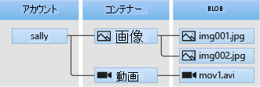

# <a name="quickstart-manage-blobs-with-java-v12-sdk"></a>クイック スタート:Java v12 SDK で BLOB を管理する

このクイックスタートでは、Java を使用して BLOB を管理する方法について説明します。 BLOB は、大量のテキストやバイナリ データ (画像、ドキュメント、ストリーミング メディア、アーカイブ データなど) を保持できるオブジェクトです。 ここでは、BLOB のアップロード、ダウンロード、一覧表示のほか、コンテナーの作成と削除を行います。

[API リファレンスのドキュメント](https://azuresdkdocs.blob.core.windows.net/$web/java/azure-storage-blob/12.0.0/index.html) | [ライブラリのソース コード](https://github.com/Azure/azure-sdk-for-java/tree/master/sdk/storage/azure-storage-blob) | [パッケージ (Maven)](https://mvnrepository.com/artifact/com.azure/azure-storage-blob?repo=jcenter) | [サンプル](https://docs.microsoft.com/azure/storage/common/storage-samples-java?toc=%2fazure%2fstorage%2fblobs%2ftoc.json#blob-samples)

## <a name="prerequisites"></a>前提条件

- アクティブなサブスクリプションが含まれる Azure アカウント。 [無料でアカウントを作成できます](https://azure.microsoft.com/free/?ref=microsoft.com&utm_source=microsoft.com&utm_medium=docs&utm_campaign=visualstudio)。
- Azure Storage のアカウント [ストレージ アカウントの作成](../common/storage-account-create.md)。
- [Java Development Kit (JDK)](/java/azure/jdk/?view=azure-java-stable) バージョン 8 以降。
- [Apache Maven](https://maven.apache.org/download.cgi)。

> [!NOTE]
> 以前の SDK バージョンを使ってみるには、「[クイックスタート: Java v8 SDK で BLOB を管理する](storage-quickstart-blobs-java-legacy.md)」を参照してください。

[!INCLUDE [storage-multi-protocol-access-preview](../../../includes/storage-multi-protocol-access-preview.md)]

## <a name="setting-up"></a>設定

このセクションでは、Java 用 Azure Blob Storage クライアント ライブラリ v12 を操作するためのプロジェクトの準備について説明します。

### <a name="create-the-project"></a>プロジェクトを作成する

*blob-quickstart-v12* という名前の Java アプリケーションを作成します。

1. コンソール ウィンドウ (cmd、PowerShell、Bash など) で、Maven コマンドを使用し、*blob-quickstart-v12* という名前で新しいコンソール アプリを作成します。 次の **mvn** コマンドを入力して "Hello world!" を作成します。 Java プロジェクト。

   ```console
   mvn archetype:generate -DgroupId=com.blobs.quickstart \
                          -DartifactId=blob-quickstart-v12 \
                          -DarchetypeArtifactId=maven-archetype-quickstart \
                          -DarchetypeVersion=1.4 \
                          -DinteractiveMode=false
   ```

1. プロジェクトの生成からの出力は、次のようになります。

    ```console
    [INFO] Scanning for projects...
    [INFO]
    [INFO] ------------------< org.apache.maven:standalone-pom >-------------------
    [INFO] Building Maven Stub Project (No POM) 1
    [INFO] --------------------------------[ pom ]---------------------------------
    [INFO]
    [INFO] >>> maven-archetype-plugin:3.1.2:generate (default-cli) > generate-sources @ standalone-pom >>>
    [INFO]
    [INFO] <<< maven-archetype-plugin:3.1.2:generate (default-cli) < generate-sources @ standalone-pom <<<
    [INFO]
    [INFO]
    [INFO] --- maven-archetype-plugin:3.1.2:generate (default-cli) @ standalone-pom ---
    [INFO] Generating project in Batch mode
    [INFO] ----------------------------------------------------------------------------
    [INFO] Using following parameters for creating project from Archetype: maven-archetype-quickstart:1.4
    [INFO] ----------------------------------------------------------------------------
    [INFO] Parameter: groupId, Value: com.blobs.quickstart
    [INFO] Parameter: artifactId, Value: blob-quickstart-v12
    [INFO] Parameter: version, Value: 1.0-SNAPSHOT
    [INFO] Parameter: package, Value: com.blobs.quickstart
    [INFO] Parameter: packageInPathFormat, Value: com/blobs/quickstart
    [INFO] Parameter: version, Value: 1.0-SNAPSHOT
    [INFO] Parameter: package, Value: com.blobs.quickstart
    [INFO] Parameter: groupId, Value: com.blobs.quickstart
    [INFO] Parameter: artifactId, Value: blob-quickstart-v12
    [INFO] Project created from Archetype in dir: C:\QuickStarts\blob-quickstart-v12
    [INFO] ------------------------------------------------------------------------
    [INFO] BUILD SUCCESS
    [INFO] ------------------------------------------------------------------------
    [INFO] Total time:  7.056 s
    [INFO] Finished at: 2019-10-23T11:09:21-07:00
    [INFO] ------------------------------------------------------------------------
        ```

1. Switch to the newly created *blob-quickstart-v12* folder.

   ```console
   cd blob-quickstart-v12
   ```

1. *blob-quickstart-v12* ディレクトリ内に、*data* という別のディレクトリを作成します。 BLOB データ ファイルは、ここに作成され格納されます。

    ```console
    mkdir data
    ```

### <a name="install-the-package"></a>パッケージをインストールする

テキスト エディターで *pom.xml* ファイルを開きます。 依存関係のグループに、次の dependency 要素を追加します。

```xml
<dependency>
    <groupId>com.azure</groupId>
    <artifactId>azure-storage-blob</artifactId>
    <version>12.0.0</version>
</dependency>
```

### <a name="set-up-the-app-framework"></a>アプリのフレームワークを設定する

プロジェクト ディレクトリで次の操作を行います。

1. */src/main/java/com/blobs/quickstart* ディレクトリに移動します
1. 使用しているエディターで *App.java* ファイルを開きます
1. `System.out.println("Hello world!");` ステートメントを削除します
1. `import` ディレクティブを追加します

コードは次のとおりです。

```java
package com.blobs.quickstart;

/**
 * Azure blob storage v12 SDK quickstart
 */
import com.azure.storage.blob.*;
import com.azure.storage.blob.models.*;
import java.io.*;

public class App
{
    public static void main( String[] args ) throws IOException
    {
    }
}
```

[!INCLUDE [storage-quickstart-credentials-include](../../../includes/storage-quickstart-credentials-include.md)]

## <a name="object-model"></a>オブジェクト モデル

Azure Blob Storage は、大量の非構造化データを格納するために最適化されています。 非構造化データとは、特定のデータ モデルや定義に従っていないデータであり、テキスト データやバイナリ データなどがあります。 Blob Storage には、3 種類のリソースがあります。

* ストレージ アカウント
* ストレージ アカウント内のコンテナー
* コンテナー内の BLOB

次の図に、これらのリソースの関係を示します。



これらのリソースとやり取りするには、以下の Java クラスを使用します。

* [BlobServiceClient](https://azuresdkdocs.blob.core.windows.net/$web/java/azure-storage-blob/12.0.0/com/azure/storage/blob/BlobServiceClient.html):`BlobServiceClient` クラスを使用して、Azure Storage リソースと BLOB コンテナーを操作できます。 ストレージ アカウントでは、Blob service に対して最上位の名前空間が提供されます。
* [BlobServiceClientBuilder](https://azuresdkdocs.blob.core.windows.net/$web/java/azure-storage-blob/12.0.0/com/azure/storage/blob/BlobServiceClientBuilder.html):`BlobServiceClientBuilder` クラスでは、`BlobServiceClient` オブジェクトの構成とインスタンス化を支援する fluent ビルダー API が提供されています。
* [BlobContainerClient](https://azuresdkdocs.blob.core.windows.net/$web/java/azure-storage-blob/12.0.0/com/azure/storage/blob/BlobContainerClient.html):`BlobContainerClient` クラスを使用して、Azure Storage コンテナーとその BLOB を操作できます。
* [BlobClient](https://azuresdkdocs.blob.core.windows.net/$web/java/azure-storage-blob/12.0.0/com/azure/storage/blob/BlobClient.html):`BlobClient` クラスを使用して、Azure Storage BLOB を操作できます。
* [BlobItem](https://azuresdkdocs.blob.core.windows.net/$web/java/azure-storage-blob/12.0.0/com/azure/storage/blob/models/BlobItem.html):`BlobItem` クラスでは、`listBlobsFlat` の呼び出しから返された個々の BLOB が示されます。

## <a name="code-examples"></a>コード例

これらのコード例のスニペットは、Java 用 Azure Blob Storage クライアント ライブラリを使用して以下を実行する方法を示します。

* [接続文字列を取得する](#get-the-connection-string)
* [コンテナーの作成](#create-a-container)
* [コンテナーに BLOB をアップロードする](#upload-blobs-to-a-container)
* [コンテナー内の BLOB を一覧表示する](#list-the-blobs-in-a-container)
* [BLOB をダウンロードする](#download-blobs)
* [コンテナーの削除](#delete-a-container)

### <a name="get-the-connection-string"></a>接続文字列を取得する

以下のコードでは、「[ストレージ接続文字列の構成](#configure-your-storage-connection-string)」セクションで作成した環境変数から、ストレージ アカウントに対する接続文字列を取得します。

このコードを `Main` メソッド内に追加します。

```java
System.out.println("Azure Blob storage v12 - Java quickstart sample\n");

// Retrieve the connection string for use with the application. The storage
// connection string is stored in an environment variable on the machine
// running the application called AZURE_STORAGE_CONNECTION_STRING. If the environment variable
// is created after the application is launched in a console or with
// Visual Studio, the shell or application needs to be closed and reloaded
// to take the environment variable into account.
String connectStr = System.getenv("AZURE_STORAGE_CONNECTION_STRING");
```

### <a name="create-a-container"></a>コンテナーを作成する

新しいコンテナーの名前を決定します。 次のコードでは、確実に一意になるように、コンテナー名に UUID 値を追加します。

> [!IMPORTANT]
> コンテナーの名前は小文字にする必要があります。 コンテナーと BLOB の名前付けの詳細については、「[Naming and Referencing Containers, Blobs, and Metadata (コンテナー、BLOB、メタデータの名前付けと参照)](/rest/api/storageservices/naming-and-referencing-containers--blobs--and-metadata)」を参照してください。

次に、[BlobContainerClient](https://azuresdkdocs.blob.core.windows.net/$web/java/azure-storage-blob/12.0.0/com/azure/storage/blob/BlobContainerClient.html) クラスのインスタンスを作成し、[create](https://azuresdkdocs.blob.core.windows.net/$web/java/azure-storage-blob/12.0.0/com/azure/storage/blob/BlobContainerClient.html#create--) メソッドを呼び出して、ストレージ アカウントに実際にコンテナーを作成します。

`Main` メソッドの末尾に次のコードを追加します。

```java
// Create a BlobServiceClient object which will be used to create a container client
BlobServiceClient blobServiceClient = new BlobServiceClientBuilder().connectionString(connectStr).buildClient();

//Create a unique name for the container
String containerName = "quickstartblobs" + java.util.UUID.randomUUID();

// Create the container and return a container client object
BlobContainerClient containerClient = blobServiceClient.createBlobContainer(containerName);
```

### <a name="upload-blobs-to-a-container"></a>コンテナーに BLOB をアップロードする

次のコード スニペット:

1. ローカルの *data* ディレクトリにテキスト ファイルを作成します。
1. 「[コンテナーを作成する](#create-a-container)」セクションでのコンテナー上で [getBlobClient](https://azuresdkdocs.blob.core.windows.net/$web/java/azure-storage-blob/12.0.0/com/azure/storage/blob/BlobContainerClient.html#getBlobClient-java.lang.String-) メソッドを呼び出すことで、[BlobClient](https://azuresdkdocs.blob.core.windows.net/$web/java/azure-storage-blob/12.0.0/com/azure/storage/blob/BlobClient.html) オブジェクトへの参照を取得します。
1. [uploadFromFile](https://azuresdkdocs.blob.core.windows.net/$web/java/azure-storage-blob/12.0.0/com/azure/storage/blob/BlobClient.html#uploadFromFile-java.lang.String-) メソッドを呼び出して、ローカル テキスト ファイルを BLOB にアップロードします。 このメソッドは、BLOB がまだ存在しない場合は作成しますが、既に存在する場合は上書きしません。

`Main` メソッドの末尾に次のコードを追加します。

```java
// Create a local file in the ./data/ directory for uploading and downloading
String localPath = "./data/";
String fileName = "quickstart" + java.util.UUID.randomUUID() + ".txt";
File localFile = new File(localPath + fileName);

// Write text to the file
FileWriter writer = new FileWriter(localPath + fileName, true);
writer.write("Hello, World!");
writer.close();

// Get a reference to a blob
BlobClient blobClient = containerClient.getBlobClient(fileName);

System.out.println("\nUploading to Blob storage as blob:\n\t" + blobClient.getBlobUrl());

// Upload the blob
blobClient.uploadFromFile(localPath + fileName);
```

### <a name="list-the-blobs-in-a-container"></a>コンテナー内の BLOB を一覧表示する

[listBlobs](https://azuresdkdocs.blob.core.windows.net/$web/java/azure-storage-blob/12.0.0/com/azure/storage/blob/BlobContainerClient.html#listBlobs--) メソッドを呼び出して、コンテナー内の BLOB を一覧表示します。 この場合、コンテナーに BLOB が 1 つだけ追加されているので、一覧表示操作ではその 1 つの BLOB だけが返されます。

`Main` メソッドの末尾に次のコードを追加します。

```java
System.out.println("\nListing blobs...");

// List the blob(s) in the container.
for (BlobItem blobItem : containerClient.listBlobs()) {
    System.out.println("\t" + blobItem.getName());
}
```

### <a name="download-blobs"></a>BLOB をダウンロードする

[downloadToFile](https://azuresdkdocs.blob.core.windows.net/$web/java/azure-storage-blob/12.0.0/com/azure/storage/blob/specialized/BlobClientBase.html#downloadToFile-java.lang.String-) メソッドを呼び出して、以前に作成した BLOB をダウンロードします。 サンプル コードでは、ローカル ファイル システム内で両方のファイルを見ることができるように、ファイル名に "DOWNLOAD" というサフィックスを追加します。

`Main` メソッドの末尾に次のコードを追加します。

```java
// Download the blob to a local file
// Append the string "DOWNLOAD" before the .txt extension so that you can see both files.
String downloadFileName = fileName.replace(".txt", "DOWNLOAD.txt");
File downloadedFile = new File(localPath + downloadFileName);

System.out.println("\nDownloading blob to\n\t " + localPath + downloadFileName);

blobClient.downloadToFile(localPath + downloadFileName);
```

### <a name="delete-a-container"></a>コンテナーを削除する

次のコードでは、[delete](https://azuresdkdocs.blob.core.windows.net/$web/java/azure-storage-blob/12.0.0/com/azure/storage/blob/BlobContainerClient.html#delete--) メソッドを使用して、コンテナー全体を削除することで、アプリによって作成されたリソースをクリーンアップします。 また、アプリによって作成されたローカル ファイルも削除します。

アプリでは、BLOB、コンテナー、およびローカル ファイルを削除する前に、`System.console().readLine()` を呼び出すことで、ユーザーの入力を一時停止します。 このとき、リソースが削除される前に、正しく作成されたことを確認できます。

`Main` メソッドの末尾に次のコードを追加します。

```java
// Clean up
System.out.println("\nPress the Enter key to begin clean up");
System.console().readLine();

System.out.println("Deleting blob container...");
containerClient.delete();

System.out.println("Deleting the local source and downloaded files...");
localFile.delete();
downloadedFile.delete();

System.out.println("Done");
```

## <a name="run-the-code"></a>コードの実行

このアプリでは、ローカル フォルダーにテスト ファイルが作成され、BLOB ストレージにアップロードされます。 次に、コンテナー内の BLOB を一覧表示し、ファイルを新しい名前でダウンロードして、古いファイルと新しいファイルを比較できるようにします。

*pom.xml* ファイルが格納されているディレクトリに移動し、次の `mvn` コマンドを使用してプロジェクトをコンパイルします。

```console
mvn compile
```

次に、パッケージをビルドします。

```console
mvn package
```

次の `mvn` コマンドを実行して、アプリを実行します。

```console
mvn exec:java -Dexec.mainClass="com.blobs.quickstart.App" -Dexec.cleanupDaemonThreads=false
```

アプリの出力は、次の例のようになります。

```output
Azure Blob storage v12 - Java quickstart sample

Uploading to Blob storage as blob:
        https://mystorageacct.blob.core.windows.net/quickstartblobsf9aa68a5-260e-47e6-bea2-2dcfcfa1fd9a/quickstarta9c3a53e-ae9d-4863-8b34-f3d807992d65.txt

Listing blobs...
        quickstarta9c3a53e-ae9d-4863-8b34-f3d807992d65.txt

Downloading blob to
        ./data/quickstarta9c3a53e-ae9d-4863-8b34-f3d807992d65DOWNLOAD.txt

Press the Enter key to begin clean up

Deleting blob container...
Deleting the local source and downloaded files...
Done
```

クリーンアップ プロセスを開始する前に、*data* フォルダー内の 2 つのファイルをチェックします。 それらを開いて、同じであるかどうかを確認します。

ファイルを確認した後、**Enter** キーを押してテスト ファイルを削除し、デモを終了します。

## <a name="next-steps"></a>次のステップ

このクイックスタートでは、Java を使用して BLOB をアップロード、ダウンロード、および一覧表示する方法について説明しました。

BLOB ストレージのサンプル アプリを確認するには、以下に進んでください。

> [!div class="nextstepaction"]
> [Azure Blob Storage SDK v12 の Java サンプル](https://github.com/Azure/azure-sdk-for-java/tree/master/sdk/storage/azure-storage-blob/src/samples/java/com/azure/storage/blob)

* 詳細については、「[Azure SDK for Java (Java 用の Azure SDK)](https://github.com/Azure/azure-sdk-for-java/blob/master/README.md)」を参照してください。
* チュートリアル、サンプル、クイックスタートなどのドキュメントについては、「[Java クラウド開発者向けの Azure](/azure/developer/java/)」を参照してください。
