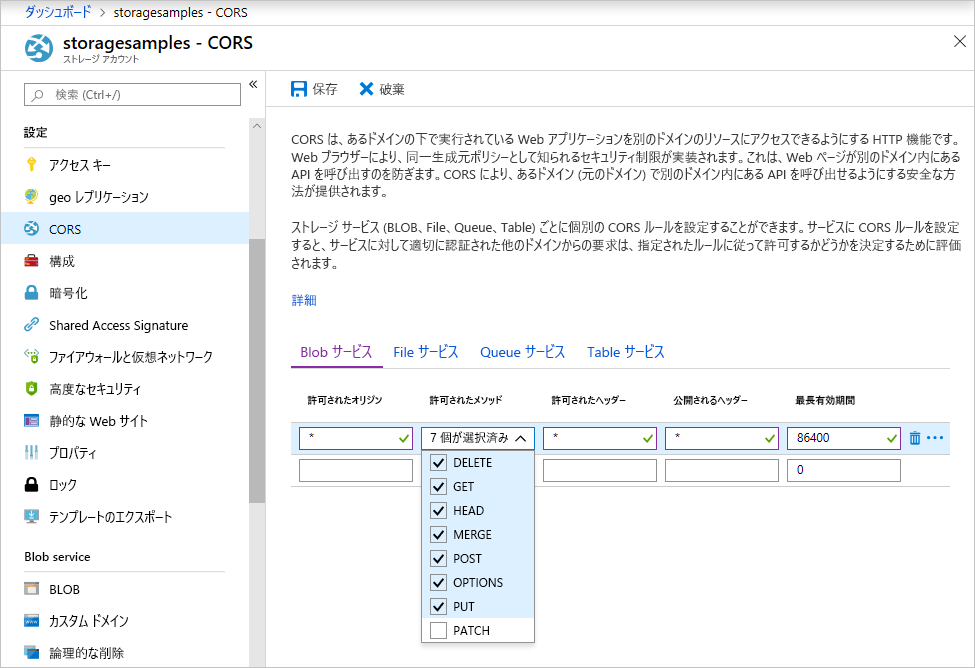

<!-- Customer intent: As a web application developer I want to interface with Azure Blob storage entirely on the client so that I can build a SPA application that is able to upload and delete files on blob storage. -->

# <a name="quickstart-manage-blobs-with-javascript-v10-sdk-in-browser"></a>クイック スタート:ブラウザーで JavaScript v10 SDK を使用して BLOB を管理する

このクイックスタートでは、すべてブラウザー内で実行される JavaScript コードを使用して BLOB を管理する方法について説明します。 BLOB は、大量のテキストやバイナリ データ (画像、ドキュメント、ストリーミング メディア、アーカイブ データなど) を保持できるオブジェクトです。 必要なセキュリティ対策を使用して BLOB ストレージ アカウントへの保護されたアクセスを確保します。

## <a name="prerequisites"></a>前提条件

- アクティブなサブスクリプションが含まれる Azure アカウント。 [無料でアカウントを作成できます](https://azure.microsoft.com/free/?ref=microsoft.com&utm_source=microsoft.com&utm_medium=docs&utm_campaign=visualstudio)。
- Azure Storage のアカウント [ストレージ アカウントの作成](../common/storage-account-create.md)。
- ローカル Web サーバー。 この記事では、[Node.js](https://nodejs.org) を使用して基本的なサーバーを起動します。
- [Visual Studio Code](https://code.visualstudio.com)。
- ブラウザー デバッグ用の VS Code 拡張機能 ([Debugger for Chrome](https://marketplace.visualstudio.com/items?itemName=msjsdiag.debugger-for-chrome)、[Debugger for Microsoft Edge](https://marketplace.visualstudio.com/items?itemName=msjsdiag.debugger-for-edge) など)。

## <a name="setting-up-storage-account-cors-rules"></a>ストレージ アカウントの CORS ルールの設定

Web アプリケーションでクライアントから BLOB ストレージにアクセスするには、アカウントの構成を変更して、[クロス オリジン リソース共有](https://docs.microsoft.com/rest/api/storageservices/cross-origin-resource-sharing--cors--support-for-the-azure-storage-services) (CORS) を有効化しておく必要があります。

Azure Portal に戻り、ストレージ アカウントを選択します。 新しい CORS ルールを定義するために、 **[設定]** セクションに移動し、 **[CORS]** リンクをクリックします。 次に、 **[追加]** ボタンをクリックして、 **[CORS ルールの追加]** ウィンドウを開きます。 このクイック スタートでは、オープン CORS ルールを作成します。



次の表は、各 CORS 設定の説明と、ルールを定義するために使用する値を示しています。

|設定  |値  | 説明 |
|---------|---------|---------|
| 許可されるオリジン | * | 許容されるオリジンとして設定されるドメインの、コンマ区切りの一覧を受け入れます。 値を `*` に設定すると、すべてのドメインがストレージ アカウントにアクセスできるようになります。 |
| 許可されたメソッド     | delete、get、head、merge、post、options、および put | ストレージ アカウントに対して実行できる HTTP 動詞の一覧です。 このクイック スタートの目的に合わせて、利用可能なすべてのオプションを選択します。 |
| 許可されるヘッダー | * | ストレージ アカウントによって許可される要求ヘッダー (プレフィックス付きヘッダーを含む) の一覧を定義します。 値を `*` に設定すると、すべてのヘッダーがアクセスできるようになります。 |
| 公開されるヘッダー | * | アカウントによって許可される応答ヘッダーの一覧です。 値を `*` に設定すると、アカウントは任意のヘッダーを送信できるようになります。  |
| 最長有効期間 (秒) | 86400 | ブラウザーがプレフライト OPTIONS 要求をキャッシュする最大時間。 値を *86,400* にすると、キャッシュが丸 1 日保持されます。 |

> [!IMPORTANT]
> アクセスの安全性を保つため、運用環境で使用するすべての設定で、公開するアクセスの量は、ストレージ アカウントに必要な最小限度に抑えるようにしてください。 ここで説明されている CORS 設定は、緩やかなセキュリティ ポリシーを定義するため、クイック スタートに適しています。 ただし、これらの設定は、現実的なコンテキストには推奨しません。

次に、Azure Cloud Shell を使用して、セキュリティ トークンを作成します。

[!INCLUDE [Open the Azure cloud shell](../../../includes/cloud-shell-try-it.md)]

## <a name="create-a-shared-access-signature"></a>Shared Access Signature を作成する

Shared Access Signature (SAS) は、ブラウザーで実行されているコードによって、BLOB ストレージへの要求を承認するために使用されます。 SAS を使用すると、クライアントはアカウント アクセス キーまたは接続文字列がなくても、ストレージ リソースへのアクセスを承認することができます。 SAS の詳細については、「[Shared Access Signatures (SAS) の使用](../common/storage-sas-overview.md)」を参照してください。

SAS は、Azure Cloud Shell 経由で Azure CLI を利用するか、Azure portal または Azure Storage Explorer を使用して作成できます。 次の表に、CLI で SAS を生成するために値を指定する必要があるパラメーターを示します。

| パラメーター      |説明  | プレースホルダー |
|----------------|-------------|-------------|
| *expiry*       | YYYY-MM-DD の形式の、アクセス トークンの有効期限。 このクイック スタートで使用する場合は、翌日の日付を入力します。 | *FUTURE_DATE* |
| *account-name* | ストレージ アカウント名。 前の手順で控えておいた名前を使用します。 | *YOUR_STORAGE_ACCOUNT_NAME* |
| *account-key*  | ストレージ アカウント キー。 前の手順で控えておいたキーを使用します。 | *YOUR_STORAGE_ACCOUNT_KEY* |

以下の CLI コマンドを、各プレースホルダーを実際の値に置き換えたうえで使用して、JavaScript コードで使用可能な SAS を生成します。

```azurecli-interactive
az storage account generate-sas \
  --permissions racwdl \
  --resource-types sco \
  --services b \
  --expiry FUTURE_DATE \
  --account-name YOUR_STORAGE_ACCOUNT_NAME \
  --account-key YOUR_STORAGE_ACCOUNT_KEY
```

各パラメーターの後の一連の値が、少しわかりにくいかもしれません。 これらのパラメーター値は、各アクセス許可の頭文字です。 次の表は、値が何の頭文字であるかを示しています。

| パラメーター        | 値   | 説明  |
|------------------|---------|---------|
| *アクセス許可*    | racwdl  | この SAS は、*read (読み取り)* 、*append (追加)* 、*create (作成)* 、*write (書き込み)* 、*delete (削除)* 、および *list (一覧表示)* 機能を許可します。 |
| *resource-types* | sco     | SAS の影響を受けるリソースは、*service (サービス)* 、*container (コンテナー)* 、および *object (オブジェクト)* です。 |
| *services*       | b       | SAS の影響を受けるサービスは、*BLOB* サービスです。 |

SAS が生成されたら、戻り値をコピーして、後の手順で使用できるように任意の場所に保存します。 Azure CLI 以外の方法で SAS を生成した場合は、先頭に `?` が付いていたら削除する必要があります。 この文字は URL 区切り記号であり、本トピックの後半にある、SAS を使用する URL テンプレートでは既に入力されています。

> [!IMPORTANT]
> 運用環境では、常に TLS を使用して SAS トークンを渡します。 また、SAS トークンはサーバーで生成され、HTML ページに送信されて、Azure Blob Storage に戻される必要があります。 考えられる 1 つのアプローチとして、サーバーレス機能を使用して SAS トークンを生成する方法があります。 Azure portal には、JavaScript 関数を使用して SAS を生成する機能を備えた関数テンプレートが含まれています。

## <a name="implement-the-html-page"></a>HTML ページを実装する

このセクションでは、基本的な Web ページを作成してから、VS Code を構成してページの起動とデバッグを行います。 ただし、起動を行うには、Node.js を使用してローカル Web サーバーを立ち上げて、ブラウザーからの要求に応じてページを提供する必要があります。 その後、各種 BLOB ストレージ API を呼び出して、ページ上に結果を表示する JavaScript コードを追加します。 これらの呼び出しの結果は、[Azure portal](https://portal.azure.com)、[Azure Storage Explorer](https://azure.microsoft.com/features/storage-explorer)、および VS Code 用の [Azure Storage 拡張機能](https://marketplace.visualstudio.com/items?itemName=ms-azuretools.vscode-azurestorage)でも確認できます。

### <a name="set-up-the-web-application"></a>Web アプリケーションをセットアップする

初めに、VS Code で *azure-blobs-javascript* という名前の新しいフォルダーを作成し、開きます。 次に VS Code で新しいファイルを作成して以下の HTML を入力し、*azure-blobs-javascript* フォルダーに *index.html* という名前で保存します。

```html
<!DOCTYPE html>
<html>

<body>
    <button id="create-container-button">Create container</button>
    <button id="delete-container-button">Delete container</button>
    <button id="select-button">Select and upload files</button>
    <input type="file" id="file-input" multiple style="display: none;" />
    <button id="list-button">List files</button>
    <button id="delete-button">Delete selected files</button>
    <p><b>Status:</b></p>
    <p id="status" style="height:160px; width: 593px; overflow: scroll;" />
    <p><b>Files:</b></p>
    <select id="file-list" multiple style="height:222px; width: 593px; overflow: scroll;" />
</body>

<!-- You'll add code here later in this quickstart. -->

</html>
```

### <a name="configure-the-debugger"></a>デバッガーを構成する

VS Code でデバッガー拡張機能を設定するには、 **[デバッグ] > [構成の追加]** の順に選択し、前の「前提条件」セクションでインストールした拡張機能に応じて **[Chrome]** または **[Edge]** を選択します。 この操作により、*launch.json* ファイルが作成され、エディターで開かれます。

次に、*launch.json* ファイルを編集して、下記のように `url` の値に `/index.html` を追加します。

```json
{
    // Use IntelliSense to learn about possible attributes.
    // Hover to view descriptions of existing attributes.
    // For more information, visit: https://go.microsoft.com/fwlink/?linkid=830387
    "version": "0.2.0",
    "configurations": [
        {
            "type": "chrome",
            "request": "launch",
            "name": "Launch Chrome against localhost",
            "url": "http://localhost:8080/index.html",
            "webRoot": "${workspaceFolder}"
        }
    ]
}
```

この構成により、起動するブラウザーと読み込む URL を VS Code に指示します。

### <a name="launch-the-web-server"></a>Web サーバーを起動する

ローカルの Node.js Web サーバーを起動するには、VS Code 内で **[表示] > [ターミナル]** の順に選択してコンソール ウィンドウを開き、次のコマンドを入力します。

```console
npx http-server
```

このコマンドにより、*http-server* パッケージがインストールされてサーバーが起動され、前の手順で指定した URL を含む既定の URL を介して、現在のフォルダーが公開されます。

### <a name="start-debugging"></a>デバッグを開始する

VS Code デバッガーをアタッチした状態で *index.html* をブラウザーで開くには、VS Code で **[デバッグ] > [デバッグの開始]** の順に選択するか、F5 キーを押します。

表示される UI はまだ何の動作もしませんが、以降のセクションで JavaScript コードを追加し、示されている機能のそれぞれを実装していきます。 その後、ブレークポイントを設定し、コードを一時停止しながらデバッガーを操作できます。

*index.html* に変更を加えた場合は、ページを再読み込みしてブラウザーで変更内容を確認してください。 VS Code で、 **[デバッグ] > [デバッグの再起動]** の順に選択するか、CTRL + SHIFT + F5 キーを押すこともできます。

### <a name="add-the-blob-storage-client-library"></a>BLOB ストレージ クライアント ライブラリを追加する

BLOB ストレージ API の呼び出しを有効にするには、まず [Azure Storage SDK for JavaScript - BLOB クライアント ライブラリをダウンロード](https://aka.ms/downloadazurestoragejsblob)し、この ZIP ファイルの中身を展開して、*azure-storage-blob.js* ファイルを *azure-blobs-javascript* フォルダー内に配置します。

次に、以下の HTML を *index.html* 内の `</body>` 終了タグの後に貼り付けて、プレースホルダーのコメントを置き換えます。

```html
<script src="azure-storage-blob.js" charset="utf-8"></script>

<script>
// You'll add code here in the following sections.
</script>
```

このコードはスクリプト ファイルへの参照を追加するものであり、独自の JavaScript コードの入力場所にもなります。 このクイック スタートでは、スクリプト ファイルを VS Code で開き、内容を確認してブレークポイントを設定できるように、*azure-storage-blob.js* スクリプト ファイルを使用します。 運用環境では、ZIP ファイルに同梱されている、よりコンパクトな *azure-storage.blob.min.js* ファイルを使ってください。

各 BLOB ストレージ関数の詳細については、[リファレンス ドキュメント](https://docs.microsoft.com/javascript/api/%40azure/storage-blob/index)を参照してください。 SDK の関数の中には、Node.js とブラウザーのいずれか一方でしか使用できないものがあることに注意してください。

*azure-storage-blob.js* のコードでは、JavaScript コード内で BLOB ストレージ API へのアクセスに使用する、`azblob` というグローバル変数がエクスポートされます。

### <a name="add-the-initial-javascript-code"></a>最初の JavaScript コードを追加する

次に、前述のコード ブロック内にある `<script>` 要素に以下のコードを貼り付けて、プレースホルダーのコメントを置き換えます。

```javascript
const createContainerButton = document.getElementById("create-container-button");
const deleteContainerButton = document.getElementById("delete-container-button");
const selectButton = document.getElementById("select-button");
const fileInput = document.getElementById("file-input");
const listButton = document.getElementById("list-button");
const deleteButton = document.getElementById("delete-button");
const status = document.getElementById("status");
const fileList = document.getElementById("file-list");

const reportStatus = message => {
    status.innerHTML += `${message}<br/>`;
    status.scrollTop = status.scrollHeight;
}
```

このコードでは、今後のコードで使用する各 HTML 要素用のフィールドを作成してから、出力を表示する `reportStatus` 関数を実装しています。

以降のセクションでは、上記ブロックの後に新しい各 JavaScript コード ブロックを追加していきます。

### <a name="add-your-storage-account-info"></a>ストレージ アカウントの情報を追加する

次に、ストレージ アカウントにアクセスするためのコードを追加し、プレースホルダーを、アカウント名および前の手順で生成した SAS に置き換えます。

```javascript
const accountName = "<Add your storage account name>";
const sasString = "<Add the SAS you generated earlier>";
const containerName = "testcontainer";
const containerURL = new azblob.ContainerURL(
    `https://${accountName}.blob.core.windows.net/${containerName}?${sasString}`,
    azblob.StorageURL.newPipeline(new azblob.AnonymousCredential));
```

このコードでは、アカウントの情報と SAS を使用して、ストレージ コンテナーの作成と操作に役立つ [ContainerURL](https://docs.microsoft.com/javascript/api/@azure/storage-blob/ContainerURL) インスタンスを作成します。

### <a name="create-and-delete-a-storage-container"></a>ストレージ コンテナーを作成および削除する

次に、対応するボタンが押されるとストレージ コンテナーを作成および削除するコードを追加します。

```javascript
const createContainer = async () => {
    try {
        reportStatus(`Creating container "${containerName}"...`);
        await containerURL.create(azblob.Aborter.none);
        reportStatus(`Done.`);
    } catch (error) {
        reportStatus(error.body.message);
    }
};

const deleteContainer = async () => {
    try {
        reportStatus(`Deleting container "${containerName}"...`);
        await containerURL.delete(azblob.Aborter.none);
        reportStatus(`Done.`);
    } catch (error) {
        reportStatus(error.body.message);
    }
};

createContainerButton.addEventListener("click", createContainer);
deleteContainerButton.addEventListener("click", deleteContainer);
```

このコードでは、[Aborter](https://docs.microsoft.com/javascript/api/@azure/storage-blob/aborter) インスタンスは使用せず、containerURL の [create](https://docs.microsoft.com/javascript/api/@azure/storage-blob/containerclient#create-containercreateoptions-) 関数と [delete](https://docs.microsoft.com/javascript/api/@azure/storage-blob/containerclient#delete-containerdeletemethodoptions-) 関数を使用しています。 このクイック スタートの内容をシンプルにしておくため、上記コードでは、ストレージ アカウントが作成済みであり有効化されていることを前提としています。 運用環境のコードで、タイムアウト機能を追加するには、Aborter インスタンスを使用してください。

### <a name="list-blobs"></a>BLOB を一覧表示する

次に、 **[List files]\(ファイルの一覧表示\)** ボタンが押されるとストレージ コンテナーの内容を一覧表示するコードを追加します。

```javascript
const listFiles = async () => {
    fileList.size = 0;
    fileList.innerHTML = "";
    try {
        reportStatus("Retrieving file list...");
        let marker = undefined;
        do {
            const listBlobsResponse = await containerURL.listBlobFlatSegment(
                azblob.Aborter.none, marker);
            marker = listBlobsResponse.nextMarker;
            const items = listBlobsResponse.segment.blobItems;
            for (const blob of items) {
                fileList.size += 1;
                fileList.innerHTML += `<option>${blob.name}</option>`;
            }
        } while (marker);
        if (fileList.size > 0) {
            reportStatus("Done.");
        } else {
            reportStatus("The container does not contain any files.");
        }
    } catch (error) {
        reportStatus(error.body.message);
    }
};

listButton.addEventListener("click", listFiles);
```

このコードでは、すべてのセグメントが確実に取得されるよう、[containerURL.listBlobFlatSegment](https://docs.microsoft.com/javascript/api/@azure/storage-blob/containerclient#listblobsflat-containerlistblobsoptions-) 関数をループ内で呼び出しています。 各セグメントについて、含まれる BLOB 項目の一覧をループ処理し、**ファイル**一覧を更新しています。

### <a name="upload-blobs"></a>BLOB をアップロードする

次に、 **[Select and upload files]\(ファイルを選択してアップロード\)** ボタンが押されると、ストレージ コンテナーにファイルをアップロードするコードを追加します。

```javascript
const uploadFiles = async () => {
    try {
        reportStatus("Uploading files...");
        const promises = [];
        for (const file of fileInput.files) {
            const blockBlobURL = azblob.BlockBlobURL.fromContainerURL(containerURL, file.name);
            promises.push(azblob.uploadBrowserDataToBlockBlob(
                azblob.Aborter.none, file, blockBlobURL));
        }
        await Promise.all(promises);
        reportStatus("Done.");
        listFiles();
    } catch (error) {
        reportStatus(error.body.message);
    }
}

selectButton.addEventListener("click", () => fileInput.click());
fileInput.addEventListener("change", uploadFiles);
```

このコードでは、 **[Select and upload files]\(ファイルを選択してアップロード\)** ボタンを非表示の `file-input` 要素に結び付けています。 こうすることで、ボタンの `click` イベントによりファイル入力の `click` イベントがトリガーされ、ファイル ピッカーが表示されます。 ファイルを選択してダイアログ ボックスを閉じると、`input` イベントが発生して `uploadFiles` 関数が呼び出されます。 この関数では、選択したファイルごとに、ブラウザー専用の [uploadBrowserDataToBlockBlob](https://docs.microsoft.com/javascript/api/@azure/storage-blob/blockblobclient#uploadbrowserdata-blob---arraybuffer---arraybufferview--blockblobparalleluploadoptions-) 関数を呼び出しています。 各呼び出しでは Promise が返されます。これを一覧に追加してすべてのファイルをまとめて待機状態にすることで、全ファイルを並列でアップロードしています。

### <a name="delete-blobs"></a>BLOB を削除する

次に、 **[Delete selected files]\(選択したファイルを削除\)** ボタンが押されると、ストレージ コンテナーからファイルを削除するコードを追加します。

```javascript
const deleteFiles = async () => {
    try {
        if (fileList.selectedOptions.length > 0) {
            reportStatus("Deleting files...");
            for (const option of fileList.selectedOptions) {
                const blobURL = azblob.BlobURL.fromContainerURL(containerURL, option.text);
                await blobURL.delete(azblob.Aborter.none);
            }
            reportStatus("Done.");
            listFiles();
        } else {
            reportStatus("No files selected.");
        }
    } catch (error) {
        reportStatus(error.body.message);
    }
};

deleteButton.addEventListener("click", deleteFiles);
```

このコードでは、[blobURL.delete](https://docs.microsoft.com/javascript/api/@azure/storage-blob/BlobURL#delete-aborter--iblobdeleteoptions-) 関数を呼び出して、一覧で選択された各ファイルを削除しています。 その後、先ほど紹介した `listFiles` 関数を呼び出して、**ファイル**一覧の内容を更新しています。

### <a name="run-and-test-the-web-application"></a>Web アプリケーションを実行してテストする

これで、ページを起動して、BLOB ストレージの動作を試すことができるようになりました。 (たとえば、コンテナーの作成前にファイルを一覧表示しようとして) エラーが発生すると、 **[ステータス]** ウィンドウに、受信したエラー メッセージが表示されます。 また、JavaScript コード内にブレークポイントを設定して、ストレージ API で返される値を調べることもできます。

## <a name="clean-up-resources"></a>リソースをクリーンアップする

このクイック スタートで作成したリソースを削除するには、[Azure portal](https://portal.azure.com) にアクセスして、「前提条件」セクションで作成したリソース グループを削除します。

## <a name="next-steps"></a>次のステップ

このクイック スタートでは、ブラウザーベースの JavaScript から BLOB ストレージにアクセスする単純な Web サイトを作成しました。 BLOB ストレージ上で Web サイト自体をホストする方法について学習するには、次のチュートリアルに進んでください。

> [!div class="nextstepaction"]
> [Blob Storage で静的な Web サイトをホストする](https://docs.microsoft.com/azure/storage/blobs/storage-blob-static-website-host)
