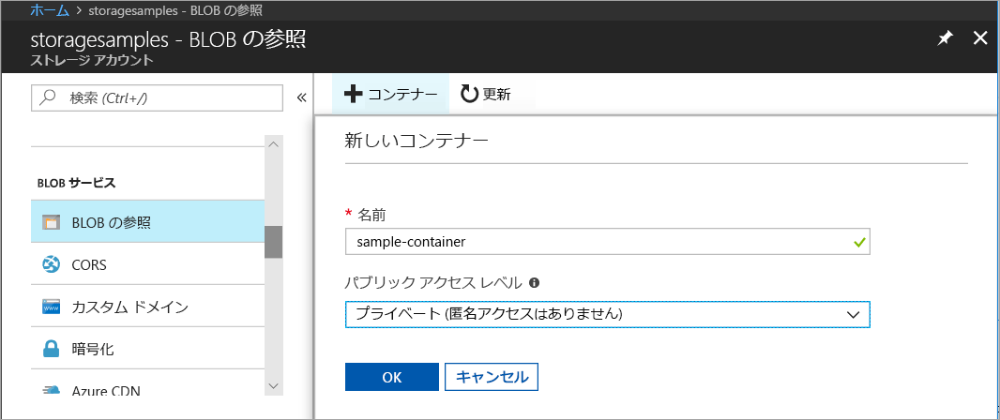
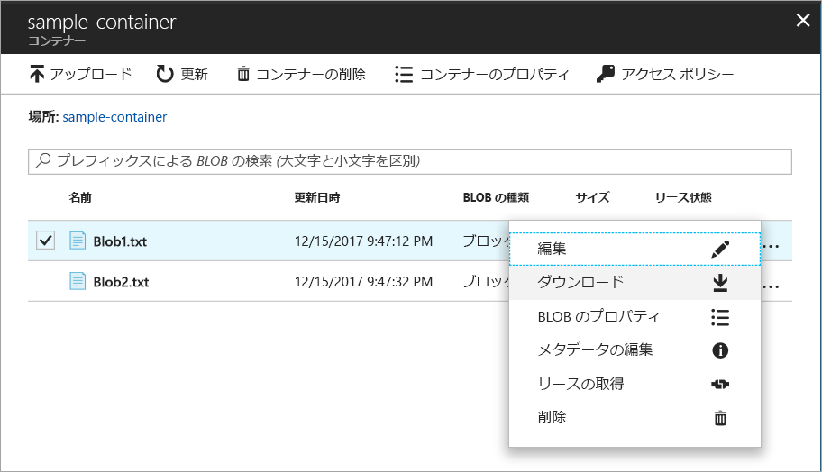
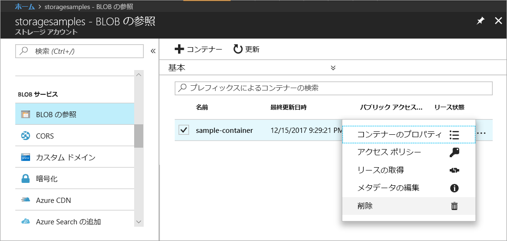

# クイック スタート: Azure Portal を使用して BLOB をアップロード、ダウンロード、および一覧表示する

このクイックスタートでは、[Azure Portal](https://portal.azure.com/) を使用して、Asure Storage 内にコンテナーを作成したり、そのコンテナー内のブロック BLOB をアップロードおよびダウンロードしたりする方法を説明します。

## 前提条件

Azure サブスクリプションをお持ちでない場合は、開始する前に [無料アカウント](https://azure.microsoft.com/free/?WT.mc_id=A261C142F) を作成してください。

[!INCLUDE [storage-quickstart-tutorial-create-account-portal](../../../includes/storage-quickstart-tutorial-create-account-portal.md)]

## コンテナーを作成する

Azure Portal でコンテナーを作成するには、次の手順に従います。

1. Azure Portal で新しいストレージ アカウントに移動します。
2. ストレージ アカウントの左側のメニューで、**[Blob Service]** セクションまでスクロールしてから、**[Browse Blobs (Blob の参照)]** を選択します。
3. **[コンテナーの追加]** ボタンをクリックします。
4. 新しいコンテナーの名前を入力します。 コンテナー名は小文字である必要があり、英文字または数字で始まる必要があり、英文字、数字、ダッシュ (-) 文字のみを含めることができます。 コンテナーと BLOB の名前の詳細については、「[コンテナー、BLOB、メタデータの名前付けと参照](https://docs.microsoft.com/rest/api/storageservices/naming-and-referencing-containers--blobs--and-metadata)」を参照してください。
5. コンテナーにパブリック アクセスのレベルを設定します。 既定のレベルは **[ プライベート (匿名アクセスなし)]** です。
6. **[OK]** をクリックしてコンテナーを作成します。

    

## ブロック BLOB をアップロードする

ブロック BLOB は、BLOB を作成するためにまとめられたデータのブロックで構成されます。 Blob ストレージを使用するほとんどのシナリオでは、ブロック BLOB を使用します。 ブロック BLOB は、クラウドでファイル、画像、およびビデオのようなテキストやバイナリ データを格納するために最適です。 このクイックスタートでは、ブロック BLOB を使用する方法を示します。 

Azure Portal で新しいコンテナーにブロック BLOB をアップロードするには、次の手順に従います。

1. Azure Portal で、前のセクションで作成したコンテナーに移動します。
2. コンテナーを選択して、それに含まれている BLOB の一覧を表示します。 この場合は、新しいコンテナーを作成したため、BLOB はまだ含まれていません。
3. **[アップロード]** ボタンをクリックして、コンテナーに BLOB をアップロードします。
4. ローカル ファイル システムを参照して、ブロック BLOB としてアップロードするファイルを見つけて、**[アップロード]** をクリックします。
     
    

5. この方法で、希望する数の BLOB をアップロードします。 これで新しい BLOB がコンテナー内で一覧表示されていることを確認できます。

    

## ブロック BLOB をダウンロードする

ブロック BLOB をダウンロードして、ブラウザーで表示したり、ローカル ファイル システムに保存したりできます。 ブロック BLOB をダウンロードするには、次の手順に従います。

1. 前のセクションでアップロードした BLOB の一覧に移動します。 
2. ダウンロードする BLOB を選択します。
3. **[詳細]** ボタン (**...**) を右クリックし、**[ダウンロード]** を選択します。 

## リソースのクリーンアップ

このクイックスタートで作成したリソースは、単にコンテナーを削除するだけで削除できます。 コンテナー内のすべての BLOB も削除されます。

コンテナーを削除するには:

1. Azure Portal でストレージ アカウント内のコンテナーの一覧に移動します。
2. 削除するコンテナーを選択します。
3. **[詳細]** ボタン (**...**) を右クリックし、**[削除]** を選択します。
4. コンテナーを削除することを確認します。

       

## 次の手順

このクイックスタートでは、.NET を使ってローカル ディスクと Azure Blob Storage との間でファイルを転送する方法について学習しました。 Blob Storage の操作についてさらに学習するには、Blob Storage の操作方法に関するトピックに進んでください。

> [!div class="nextstepaction"]
> [Blob Storage の操作方法](storage-dotnet-how-to-use-blobs.md)

