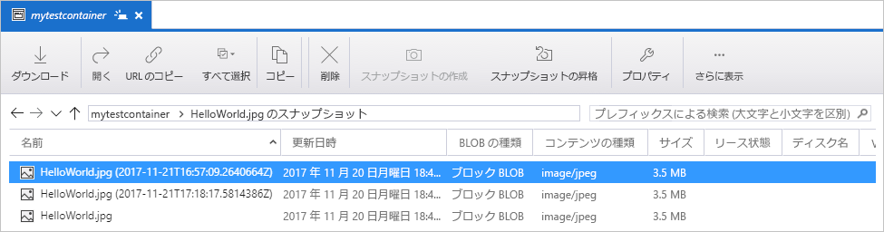
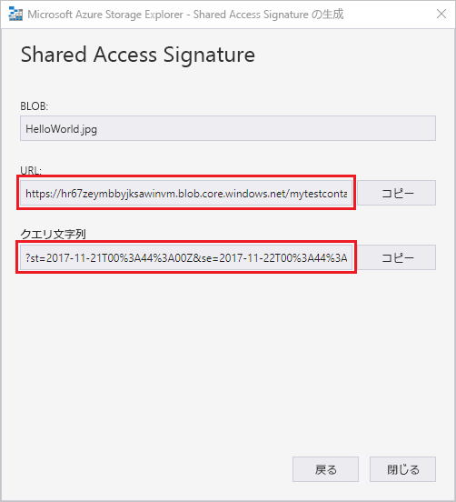

# クイック スタート:Azure Storage Explorer を使用して BLOB を作成する

このクイック スタートでは、[Azure Storage Explorer](https://azure.microsoft.com/features/storage-explorer/) を使用して、コンテナーと BLOB を作成する方法を学習します。 次に、ローカル コンピューターに BLOB をダウンロードする方法と、コンテナー内のすべての BLOB を表示する方法について説明します。 また、BLOB のスナップショットを作成する方法、コンテナーのアクセス ポリシーを管理する方法、共有アクセス署名を作成する方法についても学習します。

## 前提条件

[!INCLUDE [storage-quickstart-prereq-include](../../../includes/storage-quickstart-prereq-include.md)]

このクイックスタートでは、Azure Storage Explorer をインストールする必要があります。 Windows、Macintosh、または Linux 用の Azure Storage Explorer をインストールする方法については、「[Azure Storage Explorer](https://azure.microsoft.com/features/storage-explorer/)」をご覧ください。

## Storage Explorer にログインする

初回の起動時には、 **[Microsoft Azure Storage Explorer - 接続]** ウィンドウが表示されます。 Storage Explorer には、ストレージ アカウントに対する接続方法がいくつか用意されています。 次の表は、さまざまな接続方法を示しています。

|タスク|目的|
|---|---|
|Azure アカウントを追加する | Azure に対する認証を行うための組織のサインイン ページにリダイレクトします。 |
|接続文字列または Shared Access Signature URI を使用する | SAS トークンまたは共有の接続文字列でコンテナーまたはストレージ アカウントに直接アクセスするために使用できます。 |
|ストレージ アカウントの名前とキーを使用する| ストレージ アカウントの名前とキーを使用して、Azure Storage に接続します。|

**[Add an Azure Account\(Azure アカウントの追加\)]** を選択し、 **[サインイン]** をクリックします。画面上のプロンプトに従って Azure アカウントにサインインします。

![[Microsoft Azure Storage Explorer - 接続] ウィンドウ](media/storage-quickstart-blobs-storage-explorer/connect.png)

接続が完了すると、Azure Storage Explorer が読み込まれて **[Explorer]** タブが表示されます。 このビューには、すべての Azure ストレージ アカウント、[Azure ストレージ エミュレーター](../common/storage-use-emulator.md?toc=%2fazure%2fstorage%2fblobs%2ftoc.json)、[Cosmos DB](../../cosmos-db/storage-explorer.md?toc=%2fazure%2fstorage%2fblobs%2ftoc.json) アカウント、または [Azure Stack](/azure-stack/user/azure-stack-storage-connect-se?toc=%2fazure%2fstorage%2fblobs%2ftoc.json) 環境を使用して構成されたおよびローカル ストレージの情報が表示されます。

![[Microsoft Azure Storage Explorer - 接続] ウィンドウ](media/storage-quickstart-blobs-storage-explorer/mainpage.png)

## コンテナーを作成する

BLOB は常にコンテナーにアップロードされます。 これにより、フォルダー内でコンピューター上のファイルを整理するように、BLOB のグループを整理できます。

コンテナーを作成するには、前の手順で作成したストレージ アカウントを展開します。 **[BLOB コンテナー]** を選択し、 **[BLOB コンテナーの作成]** を右クリックして選択します。 BLOB コンテナーの名前を入力します。 BLOB コンテナーの名前付けに関する規則と制限の一覧については、[コンテナーの作成](storage-quickstart-blobs-dotnet.md#create-a-container)に関するセクションを参照してください。 完了したら、**Enter**キーを押して BLOB コンテナーを作成します。 BLOB コンテナーは、正常に作成されると、選択されたストレージ アカウントの **[BLOB コンテナー]** フォルダーの下に表示されます。

## BLOB をコンテナーにアップロードする

Blob Storage は、ブロック BLOB、追加 BLOB、およびページ BLOB をサポートします。 IaaS VM をバックアップするために使用される VHD ファイルはページ BLOB です。 追加 BLOB は、ファイルに書き込んでから詳細情報を追加し続ける場合などの、ログ記録に使用されます。 BLOB ストレージに格納されているほとんどのファイルはブロック BLOB です。

コンテナー リボンで、 **[アップロード]** を選択します。 この操作によって、フォルダーまたはファイルをアップロードするためのオプションが表示されます。

アップロードするファイルまたはフォルダーを選択します。 **BLOB の種類**を選択します。 **追加**、**ページ**、または**ブロック**の各 BLOB を選択できます。

.vhd または .vhdx ファイルをアップロードする場合は、 **[.vhd/.vhdx ファイルをページ BLOB としてアップロードする (推奨)]** を選択します。

**[アップロード先のフォルダー (オプション)]** フィールドで、ファイルを格納するフォルダーの名前またはコンテナーの下にあるフォルダー内のフォルダーを選択します。 フォルダーが選択されていない場合は、ファイルがコンテナーの下に直接アップロードされます。

**[OK]** を選択すると、選択したファイルがキューに登録され、各ファイルがアップロードされます。 アップロードが完了すると、 **[アクティビティ]** ウィンドウに結果が表示されます。

## コンテナー内の BLOB を表示する

**Azure Storage Explorer** アプリケーションで、ストレージ アカウントに基づいてコンテナーを選択します。 選択したコンテナー内の BLOB の一覧がメイン ウィンドウに表示されます。

## BLOB をダウンロードする

**Azure Storage Explorer** を使用して BLOB をダウンロードするには、BLOB を選択した状態で、リボンの **[ダウンロード]** を選択します。 ファイル ダイアログが開き、ファイル名を入力するオプションが表示されます。 **[保存]** を選択して、ローカルの場所への BLOB のダウンロードを開始します。

## スナップショットを管理する

Azure Storage Explorer には、BLOB の[スナップショット](storage-blob-snapshots.md)を作成して管理する機能が用意されています。 BLOB のスナップショットを作成するには、BLOB を右クリックして **[スナップショットの作成]** を選択します。 BLOB のスナップショットを表示するには、BLOB を右クリックして **[Manage Snapshots\(スナップショットの管理\)]** を選択します。 BLOB のスナップショットの一覧が現在のタブに表示されます。

## アクセス ポリシーを管理する

Storage Explorer には、ユーザー インターフェイス内のコンテナーのアクセス ポリシーを管理する機能が用意されています。 サービス レベルおよびアカウント レベルという 2 種類のセキュア アクセス ポリシー (SAS) があります。 アカウント レベル SAS は、ストレージ アカウントが対象となり、複数のサービスとリソースに適用できます。 サービス レベル SAS は、特定のサービスの下でリソースに対して定義されます。 サービス レベル SAS を生成するには、任意のコンテナーを右クリックして **[Manage Access Policies...\(アクセス ポリシーの管理...\)]** を選択します。アカウント レベル SAS を生成するには、ストレージ アカウントを右クリックします。

**[追加]** を選択して、新しいアクセス ポリシーを追加し、ポリシーのアクセス許可を定義します。 完了したら、 **[保存]** を選択してアクセス ポリシーを保存します。 これで、Shared Access Signature の構成時にこのポリシーを使用できます。

## Shared Access Signature を操作する

Shared Access Signature (SAS) は Storage Explorer を使用して取得できます。 ストレージ アカウント、コンテナー、または BLOB を右クリックして **[Get Shared Access Signature...\(Shared Access Signature の取得...\)]** を選択します。SAS URL の開始時刻と有効期限、およびアクセス許可を選択し、 **[作成]** を選択します。 クエリ文字列を含む完全な URL およびクエリ文字列自体が提供されます。これらは次の画面でコピーできます。

## 次の手順

このクイックスタートでは、**Azure Storage Explorer** を使用してローカル ディスクと Azure Blob Storage との間でファイルを転送する方法について学習しました。 Blob Storage の操作の詳細を学習するには、Blob Storage の操作方法に進みます。

> [!div class="nextstepaction"]
> [Blob Storage の操作方法](storage-how-to-use-blobs-powershell.md)
