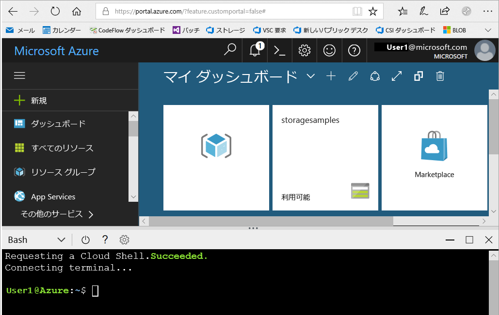
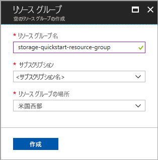
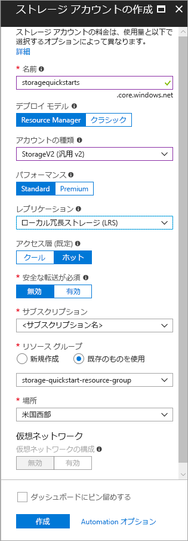

# <a name="create-a-storage-account"></a>ストレージ アカウントの作成

Azure ストレージ アカウントは、Azure Storage 内のデータ オブジェクトの格納およびアクセスのために、クラウド内の一意の名前空間を提供します。 ストレージ アカウントには、そのアカウントの下に作成する BLOB、ファイル、キュー、テーブル、およびディスクが含まれます。 

Azure Storage の使用を開始するには、最初に新しいストレージ アカウントを作成する必要があります。 Azure ストレージ アカウントは、[Azure Portal](https://portal.azure.com/)、[Azure PowerShell](https://docs.microsoft.com/powershell/azure/overview)、または [Azure CLI](https://docs.microsoft.com/cli/azure?view=azure-cli-latest) を使用して作成できます。 このクイックスタートは、これらの各オプションを使用して、新しいストレージ アカウントを作成する方法を示します。 


## <a name="prerequisites"></a>前提条件

Azure サブスクリプションをお持ちでない場合は、開始する前に [無料アカウント](https://azure.microsoft.com/free/) を作成してください。

# <a name="portaltabportal"></a>[ポータル](#tab/portal)

なし。

# <a name="powershelltabpowershell"></a>[PowerShell](#tab/powershell)

このクイック スタートには、Azure PowerShell モジュール バージョン 3.6 以降が必要です。 現在のバージョンを調べるには、`Get-Module -ListAvailable AzureRM` を実行します。 インストールまたはアップグレードする必要がある場合は、[Azure PowerShell モジュールのインストール](/powershell/azure/install-azurerm-ps)に関するページを参照してください。

# <a name="azure-clitabazure-cli"></a>[Azure CLI](#tab/azure-cli)

次の 2 つの方法のいずれかで Azure にログインし、Azure CLI コマンドを実行できます。

- Azure Portal 内から、Azure Cloud Shell で CLI コマンドを実行できます 
- CLI をインストールして、CLI コマンドをローカルで実行できます  

### <a name="use-azure-cloud-shell"></a>Azure Cloud Shell を使用する

Azure Cloud Shell は、Azure Portal 内で直接実行できる無料の Bash シェルです。 Azure CLI が事前にインストールされており、アカウントで使用できるように構成されています。 Azure Portal の右上のメニューの **[Cloud Shell]** ボタンをクリックします。

[](https://portal.azure.com)

このボタンによって対話型のシェルが起動されます。このクイックスタートの手順はこれを使って実行できます。

[](https://portal.azure.com)

### <a name="install-the-cli-locally"></a>CLI をローカルにインストールする

Azure CLI はローカルにインストールして使用することもできます。 このクイックスタートでは、Azure CLI バージョン 2.0.4 以降を実行している必要があります。 バージョンを確認するには、`az --version` を実行します。 インストールまたはアップグレードする必要がある場合は、「[Azure CLI 2.0 のインストール](/cli/azure/install-azure-cli)」を参照してください。 

---

## <a name="log-in-to-azure"></a>Azure にログインする

# <a name="portaltabportal"></a>[ポータル](#tab/portal)

[Azure Portal](https://portal.azure.com) にログインします。

# <a name="powershelltabpowershell"></a>[PowerShell](#tab/powershell)

`Connect-AzureRmAccount` コマンドで Azure サブスクリプションにログインし、画面上の指示に従って認証を行います。

```powershell
Connect-AzureRmAccount
```

# <a name="azure-clitabazure-cli"></a>[Azure CLI](#tab/azure-cli)

Azure Cloud Shell を起動するには、[Azure Portal](https://portal.azure.com) にログインします。

CLI のローカル インストールにログインするには、ログイン コマンドを実行します。

```cli
az login
```

---

## <a name="create-a-resource-group"></a>リソース グループの作成

Azure リソース グループとは、Azure リソースのデプロイと管理に使用する論理コンテナーです。 リソース グループの詳細については、「[Azure Resource Manager の概要](../../azure-resource-manager/resource-group-overview.md)」をご覧ください。

# <a name="portaltabportal"></a>[ポータル](#tab/portal)

Azure Portal でリソース グループを作成するには、次の手順に従います。

1. Azure Portal で左側のメニューを展開してサービスのメニューを開き、**[リソース グループ]** を選択します。
2. **[追加]** ボタンをクリックして新しいリソース グループを追加します。
3. 新しいリソース グループの名前を入力します。
4. 新しいリソース グループを作成するサブスクリプションを選択します。
5. リソース グループの場所を選択します。
6. **[作成]** ボタンをクリックします。  



# <a name="powershelltabpowershell"></a>[PowerShell](#tab/powershell)

PowerShell で新しいリソース グループを作成するには、[New-AzureRmResourceGroup](/powershell/module/azurerm.resources/new-azurermresourcegroup) コマンドを使用します。 

```powershell
# put resource group in a variable so you can use the same group name going forward,
# without hardcoding it repeatedly
$resourceGroup = "storage-quickstart-resource-group"
New-AzureRmResourceGroup -Name $resourceGroup -Location $location 
```

`-Location` パラメーターに指定するリージョンがわからない場合は、[Get-AzureRmLocation](/powershell/module/azurerm.resources/get-azurermlocation) コマンドで、サブスクリプションに対してサポートされているリージョンの一覧を取得できます。

```powershell
Get-AzureRmLocation | select Location 
$location = "westus"
```

# <a name="azure-clitabazure-cli"></a>[Azure CLI](#tab/azure-cli)

Azure CLI で新しいリソース グループを作成するには、[az group create](/cli/azure/group#az_group_create) コマンドを使用します。 

```azurecli-interactive
az group create \
    --name storage-quickstart-resource-group \
    --location westus
```

`--location` パラメーターに指定するリージョンがわからない場合は、[az account list-locations](/cli/azure/account#az_account_list) コマンドで、サブスクリプションに対してサポートされているリージョンの一覧を取得できます。

```azurecli-interactive
az account list-locations \
    --query "[].{Region:name}" \
    --out table
```

---

## <a name="create-a-general-purpose-storage-account"></a>汎用ストレージ アカウントの作成

汎用ストレージ アカウントでは、Azure Storage サービス (BLOB、ファイル、キュー、およびテーブル) のすべてにアクセスできます。 汎用ストレージ アカウントは、Standard 階層または Premium 階層のいずれかで作成できます。 この記事の例では、Standard 階層 (既定) で汎用ストレージ アカウントを作成する方法を示します。

Azure Storage には、2 種類の汎用ストレージ アカウントがあります。

- 汎用 v2 アカウント 
- 汎用 v1 アカウント。 

> [!NOTE]
> 新しいストレージ アカウントを**汎用 v2 アカウント**として作成して、このアカウントで利用できる新しい機能を活用することをお勧めします。  

ストレージ アカウントの種類の詳細については、「[Azure Storage アカウントのオプション](storage-account-options.md)」を参照してください。

ストレージ アカウントに名前を付けるときは、次の規則に注意してください。

- ストレージ アカウント名の長さは 3 ～ 24 文字で、数字と小文字のみを使用できます。
- ストレージ アカウント名は Azure 内で一意である必要があります。 複数のストレージ アカウントが同じ名前を持つことはできません。

# <a name="portaltabportal"></a>[ポータル](#tab/portal)

Azure Portal で汎用 v2 ストレージ アカウントを作成するには、次の手順に従います。

1. Azure Portal で左側のメニューを展開してサービスのメニューを開き、**[すべてのサービス]** を選択します。 次に、下へスクロールして **[ストレージ]** の **[ストレージ アカウント]** を選択します。 表示された **[ストレージ アカウント]** ウィンドウで **[追加]** を選択します。
2. ストレージ アカウントの名前を入力します。
3. **[アカウントの種類]** フィールドで **[StorageV2 (汎用 v2)]** を設定します。
4. **[レプリケーション]** フィールドは **[ローカル冗長ストレージ (LRS)]** のままにします。 または、**[ゾーン冗長ストレージ (ZRS) ]**、**[地理冗長ストレージ (GRS)]**、または **[読み取りアクセス地理冗長ストレージ (RA-GRS)]** を選択することもできます。
5. **[デプロイ モデル]**、**[パフォーマンス]**、**[安全な転送が必須]** の各フィールドは、既定値の設定のままにします。
6. ストレージ アカウントを作成するサブスクリプションを選択します。
7. **[リソース グループ]** セクションで、**[既存のものを使用]** を選択してから、前のセクションで作成したリソース グループを選択します。
8. 新しいストレージ アカウントの場所を選択します。
9. **[作成]** をクリックしてストレージ アカウントを作成します。      



# <a name="powershelltabpowershell"></a>[PowerShell](#tab/powershell)

ローカル冗長ストレージ (LRS) を使用して汎用 v2 ストレージ アカウントを PowerShell から作成するには、[New-AzureRmStorageAccount](/powershell/module/azurerm.storage/New-AzureRmStorageAccount) コマンドを使用します。 

```powershell
New-AzureRmStorageAccount -ResourceGroupName $resourceGroup `
  -Name "storagequickstart" `
  -Location $location `
  -SkuName Standard_LRS `
  -Kind StorageV2 
```

ゾーン冗長ストレージ (ZRS) (プレビュー)、geo 冗長ストレージ (GRS)、または読み取りアクセス geo 冗長ストレージ (RA-GRS) を使用して汎用 v2 ストレージ アカウントを作成するには、**SkuName** パラメーターの値を以下の表の該当する値で置き換えます。 

|レプリケーション オプション  |SkuName パラメーター  |
|---------|---------|
|ローカル冗長ストレージ (LRS)     |Standard_LRS         |
|ゾーン冗長ストレージ (ZRS)     |Standard_ZRS         |
|geo 冗長ストレージ (GRS)     |Standard_GRS         |
|読み取りアクセス geo 冗長ストレージ (GRS)     |Standard_RAGRS         |

# <a name="azure-clitabazure-cli"></a>[Azure CLI](#tab/azure-cli)

ローカル冗長ストレージを使用して汎用 v2 ストレージ アカウントを Azure CLI から作成するには、[az storage account create](/cli/azure/storage/account#az_storage_account_create) コマンドを使用します。

```azurecli-interactive
az storage account create \
    --name storagequickstart \
    --resource-group storage-quickstart-resource-group \
    --location westus \
    --sku Standard_LRS \
    --kind StorageV2
```

ゾーン冗長ストレージ (ZRS プレビュー)、geo 冗長ストレージ (GRS)、または読み取りアクセス geo 冗長ストレージ (RA-GRS) を使用して汎用 v2 ストレージ アカウントを作成するには、**sku** パラメーターの値を以下の表の該当する値で置き換えます。 

|レプリケーション オプション  |sku パラメーター  |
|---------|---------|
|ローカル冗長ストレージ (LRS)     |Standard_LRS         |
|ゾーン冗長ストレージ (ZRS)     |Standard_ZRS         |
|geo 冗長ストレージ (GRS)     |Standard_GRS         |
|読み取りアクセス geo 冗長ストレージ (GRS)     |Standard_RAGRS         |

---

利用可能なレプリケーション オプションの詳細については、[ストレージのレプリケーション オプション](storage-redundancy.md)に関するページを参照してください。

## <a name="clean-up-resources"></a>リソースのクリーンアップ

このクイックスタートで作成したリソースをクリーンアップする場合は、リソース グループを削除するだけです。 リソース グループを削除すると、関連付けられているストレージ アカウント、およびリソース グループに関連付けられているその他のリソースも削除されます。

# <a name="portaltabportal"></a>[ポータル](#tab/portal)

Azure Portal を使用してリソース グループを削除するには:

1. Azure Portal で左側のメニューを展開してサービスのメニューを開き、**[リソース グループ]** を選択して、リソース グループの一覧を表示します。
2. 削除するリソース グループを見つけて、一覧の右側にある **[詳細]** ボタン (**...**) を右クリックします。
3. **[リソース グループの削除]** を選択し、確認します。

# <a name="powershelltabpowershell"></a>[PowerShell](#tab/powershell)

リソース グループと関連付けられているリソース (新しいストレージ アカウントを含む) を削除するには、[Remove-AzureRmResourceGroup](/powershell/module/azurerm.resources/remove-azurermresourcegroup) コマンドを使用します。 

```powershell
Remove-AzureRmResourceGroup -Name $resourceGroup
```

# <a name="azure-clitabazure-cli"></a>[Azure CLI](#tab/azure-cli)

リソース グループと関連付けられているリソース (新しいストレージ アカウントを含む) を削除するには、[az group delete](/cli/azure/group#az_group_delete) コマンドを使用します。

```azurecli-interactive
az group delete --name myResourceGroup
```

---

## <a name="next-steps"></a>次の手順

このクイック スタートでは、汎用的な標準ストレージ アカウントを作成しました。 ストレージ アカウントとの間で BLOB をアップロードおよびダウンロードする方法を学習するには、Blob Storage のクイックスタートに進みます。

# <a name="portaltabportal"></a>[ポータル](#tab/portal)

> [!div class="nextstepaction"]
> [Azure Portal を使用して Azure Blob Storage との間でオブジェクトを転送する](../blobs/storage-quickstart-blobs-portal.md)

# <a name="powershelltabpowershell"></a>[PowerShell](#tab/powershell)

> [!div class="nextstepaction"]
> [PowerShell を使用して Azure Blob Storage との間でオブジェクトを転送する](../blobs/storage-quickstart-blobs-powershell.md)

# <a name="azure-clitabazure-cli"></a>[Azure CLI](#tab/azure-cli)

> [!div class="nextstepaction"]
> [Azure CLI を使用した Azure Blob Storage との間でのオブジェクトの転送](../blobs/storage-quickstart-blobs-cli.md)

---
