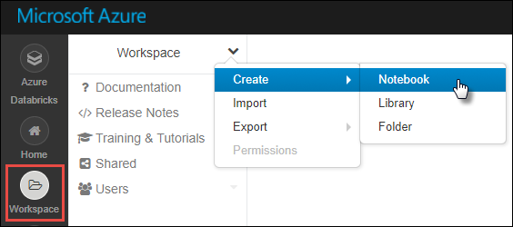
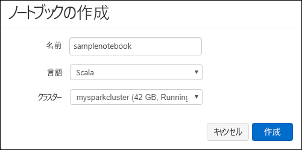

# <a name="tutorial-extract-transform-and-load-data-using-azure-databricks"></a>チュートリアル: Azure Databricks を使用したデータの抽出、変換、読み込み

このチュートリアルでは、Azure Databricks を使用して、ETL (データの抽出、変換、および読み込み) 操作を実行して、Azure Data Lake Storage Gen2 プレビューから Azure SQL Data Warehouse にデータを移動します。

次の図に、アプリケーション フローを示します。


このチュートリアルに含まれるタスクは次のとおりです。

> [!div class="checklist"]
> * Azure Databricks ワークスペースを作成する
> * Azure Databricks で Spark クラスターを作成する
> * Azure Data Lake Storage Gen2 対応のアカウントを作成する
> * Azure Data Lake Storage Gen2 にデータをアップロードする
> * Azure Databricks でノートブックを作成する
> * Data Lake Storage Gen2 からデータを抽出する
> * Azure Databricks でデータを変換する
> * Azure SQL Data Warehouse へのデータの読み込み

Azure サブスクリプションをお持ちでない場合は、開始する前に[無料アカウントを作成](https://azure.microsoft.com/free/)してください。

## <a name="prerequisites"></a>前提条件

このチュートリアルを完了するには、以下が必要です。

* Azure SQL Data Warehouse を作成し、サーバー レベルのファイアウォール規則を作成して、サーバー管理者としてサーバーに接続します。[Azure SQL Data Warehouse の作成に関するクイック スタート](../../sql-data-warehouse/create-data-warehouse-portal.md)の手順に従ってください。
* Azure SQL Data Warehouse に使用するデータベース マスター キーを作成します。 「[データベース マスター キーの作成](https://docs.microsoft.com/sql/relational-databases/security/encryption/create-a-database-master-key)」の手順に従ってください。
* [Azure Data Lake Storage Gen2 アカウントを作成する](quickstart-create-account.md)

## <a name="sign-in-to-the-azure-portal"></a>Azure Portal にサインインする

[Azure Portal](https://portal.azure.com/) にサインインします。

## <a name="create-an-azure-databricks-workspace"></a>Azure Databricks ワークスペースを作成する

このセクションでは、Azure Portal を使って Azure Databricks ワークスペースを作成します。 

1. Azure portal で、**[リソースの作成]** > **[分析]** > **[Azure Databricks]** の順に選択します。

    

2. **[Azure Databricks サービス]** で値を指定して、Databricks ワークスペースを作成します。

    

    次の値を指定します。

    |プロパティ  |[説明]  |
    |---------|---------|
    |**[ワークスペース名]**     | Databricks ワークスペースの名前を指定します。        |
    |**サブスクリプション**     | ドロップダウンから Azure サブスクリプションを選択します。        |
    |**[リソース グループ]**     | 新しいリソース グループを作成するか、既存のリソース グループを使用するかを指定します。 リソース グループは、Azure ソリューションの関連するリソースを保持するコンテナーです。 詳しくは、[Azure リソース グループの概要](../../azure-resource-manager/resource-group-overview.md)に関するページをご覧ください。 |
    |**場所**     | **[米国西部 2]** を選択します。 使用可能な他のリージョンについては、「[リージョン別の利用可能な製品](https://azure.microsoft.com/regions/services/)」をご覧ください。        |
    |**価格レベル**     |  **Standard** と **Premium** のいずれかを選択します。 これらのレベルの詳細については、[Databricks の価格に関するページ](https://azure.microsoft.com/pricing/details/databricks/)を参照してください。       |

    **[ダッシュボードにピン留めする]** チェック ボックスをオンにして、**[作成]** を選択します。

3. アカウントの作成には数分かかります。 アカウント作成時に、ポータルの右側に **[Submitting deployment for Azure Databricks]\(Azure Databricks のデプロイを送信しています\)** タイルが表示されます。 このタイルを表示するために、ダッシュボードを右へスクロールしなければならない場合があります。 スクリーンの上部に進行状況バーも表示されます。 いずれかの領域で進行状況を確認できます。

    

## <a name="create-a-spark-cluster-in-databricks"></a>Databricks に Spark クラスターを作成する

1. Azure Portal で、作成した Databricks ワークスペースに移動して、**[Launch Workspace]\(ワークスペースの起動\)** を選択します。

2. Azure Databricks ポータルにリダイレクトされます。 ポータルで **[クラスター]** を選択します。

    

3. **[New cluster]\(新しいクラスター\)** ページで、クラスターを作成するための値を指定します。

    

    次のフィールドに値を入力し、他のフィールドの既定値はそのまま使用します。

    * クラスターの名前を入力します。
    * この記事では、**4.2** ランタイムを使用してクラスターを作成します。
    * **[Terminate after ____ minutes of inactivity]\(アクティビティが ____ 分ない場合は終了する\)** チェック ボックスをオンにします。 クラスターが使われていない場合にクラスターを終了するまでの時間 (分単位) を指定します。

    **[クラスターの作成]** を選択します。 クラスターが実行されたら、ノートブックをクラスターにアタッチして、Spark ジョブを実行できます。

## <a name="create-storage-account-file-system"></a>ストレージ アカウント ファイル システムを作成する

このセクションでは、Azure Databricks ワークスペースにノートブックを作成し、ストレージ アカウントを構成するコード スニペットを実行します。

1. [Azure Portal](https://portal.azure.com) で、作成した Azure Databricks ワークスペースに移動して、**[Launch Workspace]\(ワークスペースの起動\)** を選択します。

2. 左側のウィンドウで、**[ワークスペース]** を選択します。 **[ワークスペース]** ドロップダウンで、**[作成]** > **[ノートブック]** の順に選択します。

    

3. **[ノートブックの作成]** ダイアログ ボックスでノートブックの名前を入力します。 言語として **[Scala]** を選んで、前に作成した Spark クラスターを選びます。

    

    **作成**を選択します。

4. 次のコードを最初のセルに入力し、コードを実行します。

    ```scala
    spark.conf.set("fs.azure.account.key.<ACCOUNT_NAME>.dfs.core.windows.net", "<ACCOUNT_KEY>") 
    spark.conf.set("fs.azure.createRemoteFileSystemDuringInitialization", "true")
    dbutils.fs.ls("abfs://<FILE_SYSTEM_NAME>@<ACCOUNT_NAME>.dfs.core.windows.net/")
    spark.conf.set("fs.azure.createRemoteFileSystemDuringInitialization", "false") 
    ```

    **Shift + Enter** キーを押して、コード セルを実行します。

    これで、ストレージ アカウントのファイル システムが作成されます。

## <a name="upload-data-to-the-storage-account"></a>ストレージ アカウントにデータをアップロードする

次の手順では、後ほど Azure Databricks で変換するために、サンプル データ ファイルをストレージ アカウントにアップロードします。 

> [!NOTE]
> Azure Data Lake Storage Gen2 対応のアカウントがまだない場合は、[アカウントの作成に関するクイック スタート](./quickstart-create-account.md)に従ってください。

1. [U-SQL の例と問題追跡](https://github.com/Azure/usql/blob/master/Examples/Samples/Data/json/radiowebsite/small_radio_json.json)のリポジトリから **small_radio_json.json** をダウンロードし、ファイルを保存したパスをメモしておきます。

2. 次に、ストレージ アカウントにサンプル データをアップロードします。 ストレージ アカウントにデータをアップロードする際に使用する方法は、階層名前空間が有効かどうかによって異なります。

    階層名前空間が Gen2 アカウント用に作成された Azure Storage アカウントで有効になっている場合は、Azure Data Factory、distp、または AzCopy (バージョン 10) を使用してアップロードを処理できます。 AzCopy バージョン 10 は、プレビューのお客様のみが使用できます。 AzCopy を使うには、次のコードをコマンド ウィンドウに貼り付けます。

    ```bash
    set ACCOUNT_NAME=<ACCOUNT_NAME>
    set ACCOUNT_KEY=<ACCOUNT_KEY>
    azcopy cp "<DOWNLOAD_PATH>\small_radio_json.json" https://<ACCOUNT_NAME>.dfs.core.windows.net/data --recursive 
    ```
    
## <a name="extract-data-from-azure-storage"></a>Azure Storage からデータを抽出する

Databricks Notebook に戻り、次のコードを新しいセルに入力します。

1. 空のコード セルに次のスニペットを追加します。プレースホルダーの値は、先ほど保存したストレージ アカウントの値で置き換えてください。

    ```scala
    dbutils.widgets.text("storage_account_name", "STORAGE_ACCOUNT_NAME", "<YOUR_STORAGE_ACCOUNT_NAME>")
    dbutils.widgets.text("storage_account_access_key", "YOUR_ACCESS_KEY", "<YOUR_STORAGE_ACCOUNT_SHARED_KEY>")
    ```

    **Shift + Enter** キーを押して、コード セルを実行します。

2. これで、サンプル json ファイルをデータフレームとして Azure Databricks に読み込むことができます。 新しいセルに次のコードを貼り付けて、**Shift + Enter** キーを押します (プレースホルダーの値を必ず置き換えてください)。

    ```scala
    val df = spark.read.json("abfs://<FILE_SYSTEM_NAME>@<ACCOUNT_NAME>.dfs.core.windows.net/data/small_radio_json.json")
    ```

3. 次のコードを実行して、データ フレームの内容を表示します。

    ```scala
    df.show()
    ```

    次のスニペットのような出力が表示されます。

    ```bash
    +---------------------+---------+---------+------+-------------+----------+---------+-------+--------------------+------+--------+-------------+---------+--------------------+------+-------------+------+
    |               artist|     auth|firstName|gender|itemInSession|  lastName|   length|  level|            location|method|    page| registration|sessionId|                song|status|           ts|userId|
    +---------------------+---------+---------+------+-------------+----------+---------+-------+--------------------+------+--------+-------------+---------+--------------------+------+-------------+------+
    | El Arrebato         |Logged In| Annalyse|     F|            2|Montgomery|234.57914| free  |  Killeen-Temple, TX|   PUT|NextSong|1384448062332|     1879|Quiero Quererte Q...|   200|1409318650332|   309|
    | Creedence Clearwa...|Logged In|   Dylann|     M|            9|    Thomas|340.87138| paid  |       Anchorage, AK|   PUT|NextSong|1400723739332|       10|        Born To Move|   200|1409318653332|    11|
    | Gorillaz            |Logged In|     Liam|     M|           11|     Watts|246.17751| paid  |New York-Newark-J...|   PUT|NextSong|1406279422332|     2047|                DARE|   200|1409318685332|   201|
    ...
    ...
    ```

Azure Data Lake Storage Gen2 から Azure Databricks にデータが抽出されました。

## <a name="transform-data-in-azure-databricks"></a>Azure Databricks でデータを変換する

未加工のサンプル データ **small_radio_json.json** は、ラジオ局のリスナーを収集したものであり、さまざまな列を含んでいます。 このセクションでは、このデータを変換して、データセットから特定の列だけを取得します。

1. まず、あらかじめ作成しておいたデータフレームから、*firstName*、*lastName*、*gender*、*location*、*level* の各列だけを取得します。

    ```scala
    val specificColumnsDf = df.select("firstname", "lastname", "gender", "location", "level")
    ```

    次のスニペットに示されているような出力が得られます。

    ```bash
    +---------+----------+------+--------------------+-----+
    |firstname|  lastname|gender|            location|level|
    +---------+----------+------+--------------------+-----+
    | Annalyse|Montgomery|     F|  Killeen-Temple, TX| free|
    |   Dylann|    Thomas|     M|       Anchorage, AK| paid|
    |     Liam|     Watts|     M|New York-Newark-J...| paid|
    |     Tess|  Townsend|     F|Nashville-Davidso...| free|
    |  Margaux|     Smith|     F|Atlanta-Sandy Spr...| free|
    |     Alan|     Morse|     M|Chicago-Napervill...| paid|
    |Gabriella|   Shelton|     F|San Jose-Sunnyval...| free|
    |   Elijah|  Williams|     M|Detroit-Warren-De...| paid|
    |  Margaux|     Smith|     F|Atlanta-Sandy Spr...| free|
    |     Tess|  Townsend|     F|Nashville-Davidso...| free|
    |     Alan|     Morse|     M|Chicago-Napervill...| paid|
    |     Liam|     Watts|     M|New York-Newark-J...| paid|
    |     Liam|     Watts|     M|New York-Newark-J...| paid|
    |   Dylann|    Thomas|     M|       Anchorage, AK| paid|
    |     Alan|     Morse|     M|Chicago-Napervill...| paid|
    |   Elijah|  Williams|     M|Detroit-Warren-De...| paid|
    |  Margaux|     Smith|     F|Atlanta-Sandy Spr...| free|
    |     Alan|     Morse|     M|Chicago-Napervill...| paid|
    |   Dylann|    Thomas|     M|       Anchorage, AK| paid|
    |  Margaux|     Smith|     F|Atlanta-Sandy Spr...| free|
    +---------+----------+------+--------------------+-----+
    ```

2.  さらにこのデータを変換し、**level** 列の名前を **subscription_type** に変更することができます。

    ```scala
    val renamedColumnsDF = specificColumnsDf.withColumnRenamed("level", "subscription_type")
    renamedColumnsDF.show()
    ```

    次のスニペットに示されているような出力が得られます。

    ```bash
    +---------+----------+------+--------------------+-----------------+
    |firstname|  lastname|gender|            location|subscription_type|
    +---------+----------+------+--------------------+-----------------+
    | Annalyse|Montgomery|     F|  Killeen-Temple, TX|             free|
    |   Dylann|    Thomas|     M|       Anchorage, AK|             paid|
    |     Liam|     Watts|     M|New York-Newark-J...|             paid|
    |     Tess|  Townsend|     F|Nashville-Davidso...|             free|
    |  Margaux|     Smith|     F|Atlanta-Sandy Spr...|             free|
    |     Alan|     Morse|     M|Chicago-Napervill...|             paid|
    |Gabriella|   Shelton|     F|San Jose-Sunnyval...|             free|
    |   Elijah|  Williams|     M|Detroit-Warren-De...|             paid|
    |  Margaux|     Smith|     F|Atlanta-Sandy Spr...|             free|
    |     Tess|  Townsend|     F|Nashville-Davidso...|             free|
    |     Alan|     Morse|     M|Chicago-Napervill...|             paid|
    |     Liam|     Watts|     M|New York-Newark-J...|             paid|
    |     Liam|     Watts|     M|New York-Newark-J...|             paid|
    |   Dylann|    Thomas|     M|       Anchorage, AK|             paid|
    |     Alan|     Morse|     M|Chicago-Napervill...|             paid|
    |   Elijah|  Williams|     M|Detroit-Warren-De...|             paid|
    |  Margaux|     Smith|     F|Atlanta-Sandy Spr...|             free|
    |     Alan|     Morse|     M|Chicago-Napervill...|             paid|
    |   Dylann|    Thomas|     M|       Anchorage, AK|             paid|
    |  Margaux|     Smith|     F|Atlanta-Sandy Spr...|             free|
    +---------+----------+------+--------------------+-----------------+
    ```

## <a name="load-data-into-azure-sql-data-warehouse"></a>Azure SQL Data Warehouse へのデータの読み込み

このセクションでは、変換したデータを Azure SQL Data Warehouse にアップロードします。 Azure Databricks 用の Azure SQL Data Warehouse コネクタを使用すると、データフレームを SQL Data Warehouse のテーブルとして直接アップロードすることができます。

前述のように、SQL Data Warehouse コネクタは、Azure Blob Storage を一時記憶域として使用し、Azure Databricks と Azure SQL Data Warehouse との間でデータをアップロードします。 それにはまず、そのストレージ アカウントに接続するための構成を指定します。 このアカウントは、この記事の前提条件としてあらかじめ作成しておく必要があります。

1. Azure Databricks から Azure Storage アカウントにアクセスするための構成を指定します。

    ```scala
    val storageURI = "<STORAGE_ACCOUNT_NAME>.dfs.core.windows.net"
    val fileSystemName = "<FILE_SYSTEM_NAME>"
    val accessKey =  "<ACCESS_KEY>"
    ```

2. Azure Databricks と Azure SQL Data Warehouse との間でデータを移動するときに使用する一時フォルダーを指定します。

    ```scala
    val tempDir = "abfs://" + fileSystemName + "@" + storageURI +"/tempDirs"
    ```

3. 次のスニペットを実行して、Azure Blob Storage のアクセス キーを構成に格納します。 これにより、アクセス キーをプレーンテキストのままノートブックに保持せずに済みます。

    ```scala
    val acntInfo = "fs.azure.account.key."+ storageURI
    sc.hadoopConfiguration.set(acntInfo, accessKey)
    ```

4. Azure SQL Data Warehouse インスタンスに接続するための値を指定します。 SQL Data Warehouse は、前提条件の 1 つとして、あらかじめ作成しておく必要があります。

    ```scala
    //SQL Data Warehouse related settings
    val dwDatabase = "<DATABASE NAME>"
    val dwServer = "<DATABASE SERVER NAME>" 
    val dwUser = "<USER NAME>"
    val dwPass = "<PASSWORD>"
    val dwJdbcPort =  "1433"
    val dwJdbcExtraOptions = "encrypt=true;trustServerCertificate=true;hostNameInCertificate=*.database.windows.net;loginTimeout=30;"
    val sqlDwUrl = "jdbc:sqlserver://" + dwServer + ".database.windows.net:" + dwJdbcPort + ";database=" + dwDatabase + ";user=" + dwUser+";password=" + dwPass + ";$dwJdbcExtraOptions"
    val sqlDwUrlSmall = "jdbc:sqlserver://" + dwServer + ".database.windows.net:" + dwJdbcPort + ";database=" + dwDatabase + ";user=" + dwUser+";password=" + dwPass
    ```

5. 次のスニペットを実行して、変換済みのデータフレーム (**renamedColumnsDF**) をテーブルとして SQL Data Warehouse に読み込みます。 このスニペットは、SQL データベースに **SampleTable** というテーブルを作成します。

    ```scala
    spark.conf.set(
        "spark.sql.parquet.writeLegacyFormat",
        "true")
    
    renamedColumnsDF.write
        .format("com.databricks.spark.sqldw")
        .option("url", sqlDwUrlSmall) 
        .option("dbtable", "SampleTable")
        .option( "forward_spark_azure_storage_credentials","True")
        .option("tempdir", tempDir)
        .mode("overwrite")
        .save()
    ```

6. SQL データベースに接続し、**SampleTable** が見えることを確認します。

    

7. 選択クエリを実行して、テーブルの内容を確認します。 **renamedColumnsDF** データフレームと同じデータが存在します。

    

## <a name="clean-up-resources"></a>リソースのクリーンアップ

チュートリアルの実行が完了したら、クラスターを終了できます。 そのためには、Azure Databricks ワークスペースの左側のウィンドウで、**[クラスター]** を選択します。 終了するクラスターで、**[アクション]** 列の下にある省略記号をポイントし、**[終了]** アイコンを選択します。


クラスター作成時に **[Terminate after __ minutes of inactivity]\(アクティビティが __ 分ない場合は終了する\)** チェック ボックスをオンにしていた場合、手動で終了しなくともクラスターは自動で停止します。 このような場合、クラスターは、一定の時間だけ非アクティブな状態が続くと自動的に停止します。

## <a name="next-steps"></a>次の手順

このチュートリアルで学習した内容は次のとおりです。

> [!div class="checklist"]
> * Azure Databricks ワークスペースを作成する
> * Azure Databricks で Spark クラスターを作成する
> * Azure Data Lake Storage Gen2 対応のアカウントを作成する
> * Azure Data Lake Storage Gen2 にデータをアップロードする
> * Azure Databricks でノートブックを作成する
> * Data Lake Storage Gen2 からデータを抽出する
> * Azure Databricks でデータを変換する
> * Azure SQL Data Warehouse へのデータの読み込み

次のチュートリアルに進み、Azure Event Hubs を使ってリアルタイム データを Azure Databricks にストリーミングする方法について見てみましょう。

> [!div class="nextstepaction"]
>[Event Hubs を使用してデータを Azure Databricks にストリーム配信する](../../azure-databricks/databricks-stream-from-eventhubs.md)
