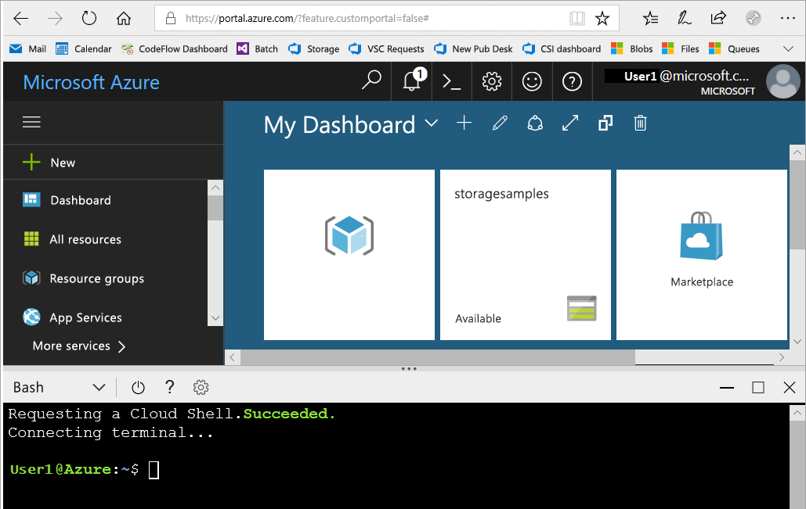
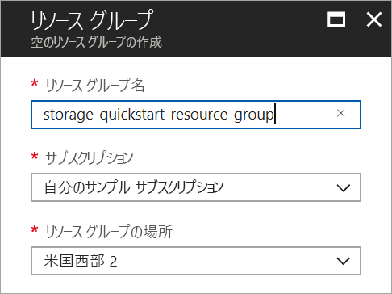
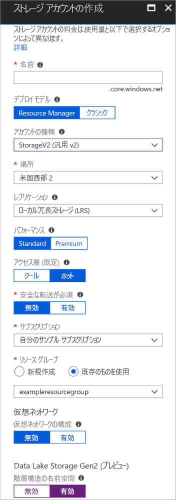

# <a name="quickstart-create-an-azure-data-lake-storage-gen2-preview-storage-account"></a>クイック スタート: Azure Data Lake Storage Gen2 プレビュー ストレージ アカウントを作成する

Azure Data Lake Storage Gen2 プレビュー アカウントでは、Hadoop 分散ファイル システム (HDFS) と連携するように調整された、ネイティブ ディレクトリ ベースのファイル システムを提供する[階層構造の名前空間サービスがサポート](introduction.md)されています。 HDFS から Data Lake Storage Gen2 データにアクセスするには、[ABFS ドライバー](abfs-driver.md)を使用します。

ご自身のストレージ アカウントで Data Lake Storage Gen2 機能を有効にするには、[プレビューに関するアンケートに記入して、アクセスを要求](https://aka.ms/adlsgen2signup)してください。 承認されると、新しい Data Lake Storage Gen2 アカウントを作成できます。 このクイック スタートでは、[Azure portal](https://portal.azure.com/)、[Azure PowerShell](https://docs.microsoft.com/powershell/azure/overview)、または [Azure CLI](https://docs.microsoft.com/cli/azure?view=azure-cli-latest) を使用して、アカウントを作成する方法を説明します。

> [!NOTE]
> Azure portal のアカウントの作成 UI は、Data Lake Storage Gen2 アカウントの作成が承認された時点で更新されます。 同様に、Data Lake Storage Gen2 関連の PowerShell および CLI の引数は、プレビューが承認された場合にのみ動作します。

## <a name="prerequisites"></a>前提条件

Azure サブスクリプションをお持ちでない場合は、開始する前に [無料アカウント](https://azure.microsoft.com/free/) を作成してください。

|           | 前提条件 |
|-----------|--------------|
|ポータル     | なし         |
|PowerShell | このクイック スタートには、Azure PowerShell モジュール バージョン **5.0.4-preview** 以降が必要です。 現在のバージョンを調べるには、`Get-Module -ListAvailable AzureRM` を実行します。 インストールまたはアップグレードする必要がある場合は、[Azure PowerShell モジュールのインストール](/powershell/azure/install-azurerm-ps)に関するページを参照してください。 |
|CLI        | 次の 2 つの方法のいずれかで Azure にログインし、Azure CLI コマンドを実行できます。 <ul><li>Azure Portal 内から、Azure Cloud Shell で CLI コマンドを実行できます </li><li>CLI をインストールして、CLI コマンドをローカルで実行できます</li></ul>|

コマンド ラインを使用する場合は、Azure Cloud Shell を実行するか、CLI をローカルにインストールするオプションがあります。

### <a name="use-azure-cloud-shell"></a>Azure Cloud Shell を使用する

Azure Cloud Shell は、Azure Portal 内で直接実行できる無料の Bash シェルです。 Azure CLI が事前にインストールされており、アカウントで使用できるように構成されています。 Azure Portal の右上のメニューの **[Cloud Shell]** ボタンをクリックします。

[](https://portal.azure.com)

このボタンによって対話型のシェルが起動されます。このクイックスタートの手順はこれを使って実行できます。

[](https://portal.azure.com)

### <a name="install-the-cli-locally"></a>CLI をローカルにインストールする

Azure CLI はローカルにインストールして使用することもできます。 このクイック スタートでは、Azure CLI バージョン 2.0.38 以降を実行している必要があります。 バージョンを確認するには、`az --version` を実行します。 インストールまたはアップグレードする必要がある場合は、「[Azure CLI 2.0 のインストール](/cli/azure/install-azure-cli)」を参照してください。

## <a name="overview-of-creating-an-azure-data-lake-storage-gen2-account"></a>Azure Data Lake Storage Gen2 アカウント作成の概要

アカウントを作成する前に、作成するストレージ アカウントまたは他の Azure リソースに対して、論理コンテナーとして機能するリソース グループを作成する必要があります。 このクイックスタートで作成したリソースをクリーンアップする場合は、リソース グループを削除するだけです。 リソース グループを削除すると、関連付けられているストレージ アカウント、およびリソース グループに関連付けられているその他のリソースも削除されます。 リソース グループの詳細については、「[Azure Resource Manager の概要](../../azure-resource-manager/resource-group-overview.md)」を参照してください。

> [!NOTE]
> Data Lake Storage Gen2 機能を利用するには、作成する新しいストレージ アカウントの種類を **StorageV2 (汎用 V2)** にする必要があります。  

ストレージ アカウントの種類の詳細については、「[Azure Storage アカウントのオプション](../common/storage-account-options.md)」を参照してください。

ストレージ アカウントに名前を付けるときは、次の規則に注意してください。

- ストレージ アカウント名の長さは 3 ～ 24 文字で、数字と小文字のみを使用できます。
- ストレージ アカウント名は Azure 内で一意である必要があります。 複数のストレージ アカウントが同じ名前を持つことはできません。

## <a name="create-an-account-using-the-azure-portal"></a>Azure portal を使用してアカウントを作成する

[Azure Portal](https://portal.azure.com) にログインします。

### <a name="create-a-resource-group"></a>リソース グループの作成

Azure Portal でリソース グループを作成するには、次の手順に従います。

1. Azure Portal で左側のメニューを展開してサービスのメニューを開き、**[リソース グループ]** を選択します。
2. **[追加]** ボタンをクリックして新しいリソース グループを追加します。
3. 新しいリソース グループの名前を入力します。
4. 新しいリソース グループを作成するサブスクリプションを選択します。
5. リソース グループの場所を選択します。
6. **[作成]** ボタンをクリックします。  



### <a name="create-a-general-purpose-v2-storage-account"></a>汎用 v2 ストレージ アカウントを作成する

Azure Portal で汎用 v2 ストレージ アカウントを作成するには、次の手順に従います。

> [!NOTE]
> 階層構造の名前空間は、米国西部 2 と米国中西部でのみ有効です。 ストレージ アカウントを作成するとき、これらの場所のいずれかが指定されていることを確認してください。

1. Azure Portal で左側のメニューを展開してサービスのメニューを開き、**[すべてのサービス]** を選択します。 次に、下へスクロールして **[ストレージ]** の **[ストレージ アカウント]** を選択します。 表示された **[ストレージ アカウント]** ウィンドウで **[追加]** を選択します。
2. ストレージ アカウントの名前を入力します。
3. **[デプロイ モデル]** の設定は、既定値のままにします。
4. **[アカウントの種類]** フィールドで **[StorageV2 (汎用 v2)]** を設定します。
5. **[場所]** を **[米国西部 2]** に設定します
6. **[レプリケーション]** フィールドは **[ローカル冗長ストレージ (LRS)]** のままにします。
7. 次のフィールドの設定は、既定値のままにします: **[レプリケーション]**、 **[パフォーマンス]**、**[アクセス レベル]**。
8. ストレージ アカウントを作成するサブスクリプションを選択します。
9. **[リソース グループ]** セクションで、**[既存のものを使用]** を選択してから、前のセクションで作成したリソース グループを選択します。
10. **[仮想ネットワーク]** では既定値をそのまま使用します。
11. **[Data Lake Storage Gen2 (preview)]\(Data Lake Storage Gen2 (プレビュー)\)** セクションで、**[Hierarchical namespace]\(階層構造の名前空間\)** を **[有効]** に設定します。
12. **[作成]** をクリックしてストレージ アカウントを作成します。



これで、ご自身のストレージ アカウントがポータルで作成されました。

### <a name="clean-up-resources"></a>リソースのクリーンアップ

Azure Portal を使用してリソース グループを削除するには:

1. Azure Portal で左側のメニューを展開してサービスのメニューを開き、**[リソース グループ]** を選択して、リソース グループの一覧を表示します。
2. 削除するリソース グループを見つけて、一覧の右側にある **[詳細]** ボタン (**...**) を右クリックします。
3. **[リソース グループの削除]** を選択し、確認します。


## <a name="upgrade-your-powershell-module"></a>PowerShell モジュールのアップグレード

PowerShell を使用して Data Lake Storage Gen2 と対話するには、お使いのモジュールをプレビュー バージョンにアップグレードする必要があります。

そのためには、管理者特権の PowerShell を開いて次のコマンドを入力します。`Install-Module AzureRM.Storage –Repository PSGallery -RequiredVersion 5.0.4-preview –AllowPrerelease –AllowClobber –Force `

その後、シェルを再起動してください。

## <a name="create-an-account-using-powershell"></a>PowerShell を使用してアカウントを作成する

`Login-AzureRmAccount` コマンドで Azure サブスクリプションにログインし、画面上の指示に従って認証を行います。

```powershell
Login-AzureRmAccount
```

### <a name="create-a-resource-group"></a>リソース グループの作成

PowerShell で新しいリソース グループを作成するには、[New-AzureRmResourceGroup](/powershell/module/azurerm.resources/new-azurermresourcegroup) コマンドを使用します。 

> [!NOTE]
> 階層構造の名前空間は、米国西部 2 と米国中西部でのみ有効です。 ストレージ アカウントを作成するとき、これらの場所のいずれかが指定されていることを確認してください。

```powershell
# put resource group in a variable so you can use the same group name going forward,
# without hardcoding it repeatedly
$resourceGroup = "storage-quickstart-resource-group"
$location = "westus2"
New-AzureRmResourceGroup -Name $resourceGroup -Location $location
```

### <a name="create-a-general-purpose-v2-storage-account"></a>汎用 v2 ストレージ アカウントを作成する

ローカル冗長ストレージ (LRS) を使用して汎用 v2 ストレージ アカウントを PowerShell から作成するには、[New-AzureRmStorageAccount](/powershell/module/azurerm.storage/New-AzureRmStorageAccount) コマンドを使用します。

```powershell
Get-AzureRmLocation | select Location 
$location = "westus2"

New-AzureRmStorageAccount -ResourceGroupName $resourceGroup `
  -Name "storagequickstart" `
  -Location $location `
  -SkuName Standard_LRS `
  -Kind StorageV2 
  -EnableHierarchicalNamespace $True
```

### <a name="clean-up-resources"></a>リソースのクリーンアップ

リソース グループと関連付けられているリソース (新しいストレージ アカウントを含む) を削除するには、[Remove-AzureRmResourceGroup](/powershell/module/azurerm.resources/remove-azurermresourcegroup) コマンドを使用します。 

```powershell
Remove-AzureRmResourceGroup -Name $resourceGroup
```

## <a name="upgrade-your-cli-module"></a>CLI モジュールのアップグレード

CLI を使用して Data Lake Storage Gen2 と対話するには、お使いのシェルに拡張機能を追加する必要があります。

具体的には、Cloud Shell またはローカル シェルを使用し、次のコマンドを入力してください。`az extension add --name storage-preview`

## <a name="create-an-account-using-azure-cli"></a>Azure CLI を使用してアカウントを作成する 

Azure Cloud Shell を起動するには、[Azure Portal](https://portal.azure.com) にログインします。

CLI のローカル インストールにログインするには、ログイン コマンドを実行します。

```cli
az login
```

### <a name="create-a-resource-group"></a>リソース グループの作成

Azure CLI で新しいリソース グループを作成するには、[az group create](/cli/azure/group#az_group_create) コマンドを使用します。 

```azurecli-interactive
az group create \
    --name storage-quickstart-resource-group \
    --location westus2
```

> [!NOTE]
> 階層構造の名前空間は、米国西部 2 と米国中西部でのみ有効です。 ストレージ アカウントを作成するとき、これらの場所のいずれかが指定されていることを確認してください。

### <a name="create-a-general-purpose-v2-storage-account"></a>汎用 v2 ストレージ アカウントを作成する

ローカル冗長ストレージを使用して汎用 v2 ストレージ アカウントを Azure CLI から作成するには、[az storage account create](/cli/azure/storage/account#az_storage_account_create) コマンドを使用します。

```azurecli-interactive
az storage account create \
    --name storagequickstart \
    --resource-group storage-quickstart-resource-group \
    --location westus2 \
    --sku Standard_LRS \
    --kind StorageV2 \
    --hierarchical-namespace true
```

### <a name="clean-up-resources"></a>リソースのクリーンアップ

リソース グループと関連付けられているリソース (新しいストレージ アカウントを含む) を削除するには、[az group delete](/cli/azure/group#az_group_delete) コマンドを使用します。

```azurecli-interactive
az group delete --name myResourceGroup
```

## <a name="next-steps"></a>次の手順

このクイック スタートでは、Data Lake Storage Gen2 ストレージ アカウントを作成しました。 ストレージ アカウントとの間で BLOB をアップロードおよびダウンロードする方法を学習するには、Blob Storage のクイックスタートに進みます。

* [AzCopy を使用して Azure Blob Storage 間でデータを移動する](https://docs.microsoft.com/en-us/azure/machine-learning/team-data-science-process/move-data-to-azure-blob-using-azcopy)