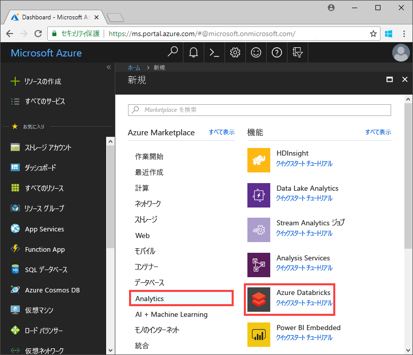
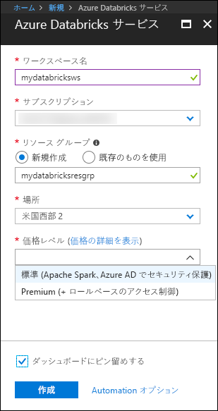
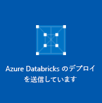
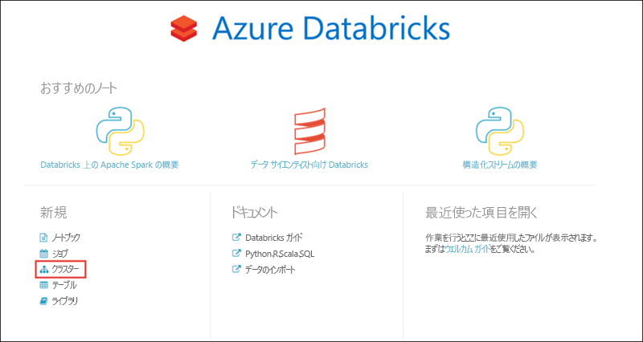
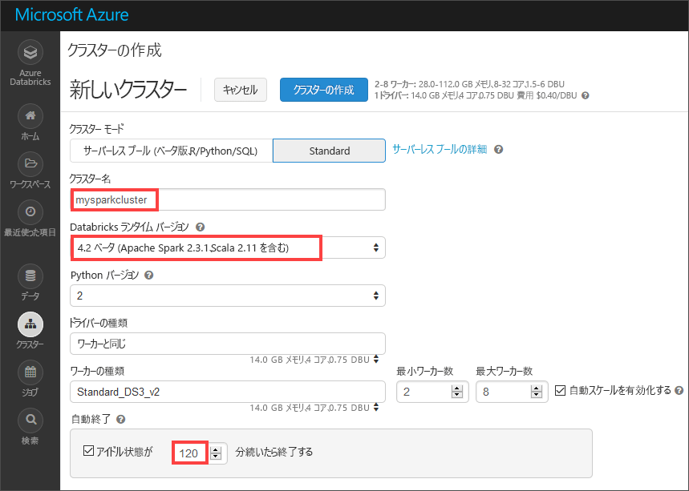
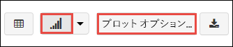
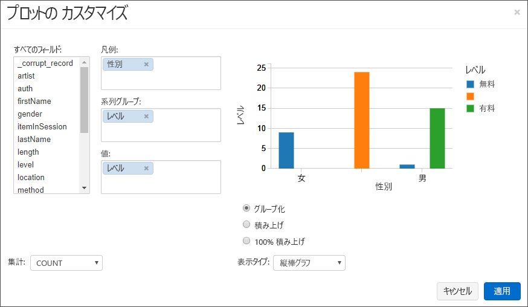
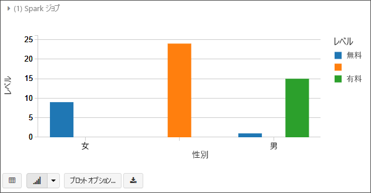
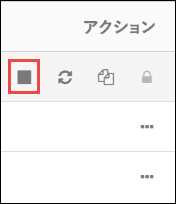

# <a name="quickstart-run-a-spark-job-on-azure-databricks-using-the-azure-portal"></a>クイックスタート: Azure Portal を使用して Azure Databricks で Spark ジョブを実行する

このクイック スタートでは、Azure Databricks を使って Apache Spark ジョブを実行し、Azure Data Lake Storage Gen2 プレビューに格納されているデータで分析を実行する方法を示します。

Spark ジョブの一環として、ラジオ チャンネルのサブスクリプション データを分析し、人口統計学的属性に基づく無料/有料使用についての分析情報を取得します。

Azure サブスクリプションをお持ちでない場合は、開始する前に[無料アカウントを作成](https://azure.microsoft.com/free/)してください。

## <a name="prerequisites"></a>前提条件

- [Azure Data Lake Storage Gen2 アカウントを作成する](quickstart-create-account.md)

## <a name="set-aside-storage-account-configuration"></a>ストレージ アカウント構成を確保する

> [!IMPORTANT]
> このチュートリアルでは、ストレージ アカウント名とアクセス キーにアクセスする必要があります。 Azure portal で、**[すべてのサービス]** を選択して、"*ストレージ*" でフィルター処理します。 **[ストレージ アカウント]** を選択し、このチュートリアル用に作成したアカウントを見つけます。
>
> **[概要]** で、ストレージ アカウントの**名前**をテキスト エディターにコピーします。 次に、**[アクセス キー]** を選択し、**key1** の値をテキスト エディターにコピーします。この値は両方とも、後のコマンドで必要になります。

## <a name="create-an-azure-databricks-workspace"></a>Azure Databricks ワークスペースを作成する

このセクションでは、Azure Portal を使って Azure Databricks ワークスペースを作成します。

1. Azure portal で、**[リソースの作成]** > **[分析]** > **[Azure Databricks]** の順に選択します。 

    

2. **[Azure Databricks サービス]** で値を指定して、Databricks ワークスペースを作成します。

    

    次の値を指定します。
     
    |プロパティ  |[説明]  |
    |---------|---------|
    |**[ワークスペース名]**     | Databricks ワークスペースの名前を指定します        |
    |**サブスクリプション**     | ドロップダウンから Azure サブスクリプションを選択します。        |
    |**[リソース グループ]**     | 新しいリソース グループを作成するか、既存のリソース グループを使用するかを指定します。 リソース グループは、Azure ソリューションの関連するリソースを保持するコンテナーです。 詳しくは、[Azure リソース グループの概要](../../azure-resource-manager/resource-group-overview.md)に関するページをご覧ください。 |
    |**場所**     | **[米国西部 2]** を選択します。 使用可能な他のリージョンについては、「[リージョン別の利用可能な製品](https://azure.microsoft.com/regions/services/)」をご覧ください。        |
    |**価格レベル**     |  **Standard** と **Premium** のいずれかを選択します。 これらのレベルの詳細については、[Databricks の価格に関するページ](https://azure.microsoft.com/pricing/details/databricks/)を参照してください。       |

    **[ダッシュボードにピン留めする]** チェック ボックスをオンにし、**[作成]** をクリックします。

3. ワークスペースの作成には数分かかります。 ワークスペース作成時に、ポータルの右側に **[Submitting deployment for Azure Databricks]\(Azure Databricks のデプロイを送信しています\)** タイルが表示されます。 このタイルを表示するために、ダッシュボードを右へスクロールしなければならない場合があります。 スクリーンの上部に進行状況バーも表示されます。 いずれかの領域で進行状況を確認できます。

    

## <a name="create-a-spark-cluster-in-databricks"></a>Databricks に Spark クラスターを作成する

1. Azure Portal で、作成した Databricks ワークスペースに移動して、**[Launch Workspace]\(ワークスペースの起動\)** を選択します。

2. Azure Databricks ポータルにリダイレクトされます。 ポータルで **[新規]** > **[クラスター]** を選択します。

    

3. **[New cluster]\(新しいクラスター\)** ページで、クラスターを作成するための値を指定します。

    

    以下を除くすべての値は、既定値のままにします。

    * クラスターの名前を入力します。
    * **4.2 (ベータ)** ランタイムを使用してクラスターを作成します。
    * **[Terminate after 120 minutes of inactivity]\(アクティビティが 120 分ない場合は終了する\)** チェック ボックスをオンにします。 クラスターが使われていない場合にクラスターを終了するまでの時間 (分単位) を指定します。

4. **[クラスターの作成]** を選択します。 クラスターが実行されたら、ノートブックをクラスターにアタッチして、Spark ジョブを実行できます。

クラスターの作成について詳しくは、[Azure Databricks での Spark クラスターの作成に関するページ](https://docs.azuredatabricks.net/user-guide/clusters/create.html)をご覧ください。

## <a name="create-storage-account-file-system"></a>ストレージ アカウント ファイル システムを作成する

このセクションでは、Azure Databricks ワークスペースにノートブックを作成し、ストレージ アカウントを構成するコード スニペットを実行します。

1. [Azure Portal](https://portal.azure.com) で、作成した Azure Databricks ワークスペースに移動して、**[Launch Workspace]\(ワークスペースの起動\)** を選択します。

2. 左側のウィンドウで、**[ワークスペース]** を選択します。 **[ワークスペース]** ドロップダウンで、**[作成]** > **[ノートブック]** の順に選択します。

    

3. **[ノートブックの作成]** ダイアログ ボックスでノートブックの名前を入力します。 言語として **[Scala]** を選んで、前に作成した Spark クラスターを選びます。

    

    **作成**を選択します。

4. 次のコードでは、**ACCOUNT_NAME** および **ACCOUNT_KEY** のテキストをこのクイック スタートの開始時に保存した値に置き換えます。 さらに、**FILE_SYSTEM_NAME** テキストを、ファイル システムに付ける名前に置き換えてください。 次に、最初のセルにコードを入力します。

    ```scala
    spark.conf.set("fs.azure.account.key.<ACCOUNT_NAME>.dfs.core.windows.net", "<ACCOUNT_KEY>") 
    spark.conf.set("fs.azure.createRemoteFileSystemDuringInitialization", "true")
    dbutils.fs.ls("abfs://<FILE_SYSTEM_NAME>@<ACCOUNT_NAME>.dfs.core.windows.net/")
    spark.conf.set("fs.azure.createRemoteFileSystemDuringInitialization", "false") 
    ```

    **Shift + Enter** キーを押して、コード セルを実行します。

    これで、ストレージ アカウントのファイル システムが作成されます。

## <a name="ingest-sample-data"></a>サンプル データを取り込む

このセクションで始める前に、次の前提条件を満たす必要があります。

ノートブックのセルに次のコードを入力します。

    %sh wget -P /tmp https://github.com/Azure/usql/blob/master/Examples/Samples/Data/json/radiowebsite/small_radio_json.json

セル内で `Shift` + `Enter` キーを押してコードを実行します。

この下の新しいセルに、次のコードを入力します (**FILE_SYSTEM** と **ACCOUNT_NAME** を前に使用したのと同じ値に置き換えてください)。

    dbutils.fs.cp("file:///tmp/small_radio_json.json", "abfs://<FILE_SYSTEM>@<ACCOUNT_NAME>.dfs.core.windows.net/")

セル内で `Shift` + `Enter` キーを押してコードを実行します。

## <a name="run-a-spark-sql-job"></a>Spark SQL ジョブを実行する

次のタスクを実行して、データで Spark SQL ジョブを実行します。

1. SQL ステートメントを実行し、サンプルの JSON データ ファイル **small_radio_json.json** のデータを使って、一時テーブルを作成します。 次のスニペットでは、プレースホルダーの値を、ファイル システム名およびストレージ アカウント名で置き換えます。 前に作成したノートブックを使用し、スニペットをノートブックの新しいコード セルに貼り付けて、Shift + Enter キーを押します。

    ```sql
    %sql
    DROP TABLE IF EXISTS radio_sample_data;
    CREATE TABLE radio_sample_data
    USING json
    OPTIONS (
     path  "abfs://<FILE_SYSTEM_NAME>@<ACCOUNT_NAME>.dfs.core.windows.net/<PATH>/small_radio_json.json"
    )
    ```

    コマンドが正常に完了すると、JSON ファイルのすべてのデータが Databricks クラスター内のテーブルとして取り込まれます。

    `%sql` 言語のマジック コマンドを使うと、ノートブックから SQL コードを実行できます (ノートブックが別の種類であっても)。 詳しくは、「[Mixing languages in a notebook](https://docs.azuredatabricks.net/user-guide/notebooks/index.html#mixing-languages-in-a-notebook)」(ノートブックに言語を混在させる) をご覧ください。

2. 実行するクエリについて詳しく理解するため、サンプルの JSON データのスナップショットを見てみます。 次のスニペットをコード セルに貼り付けて、**Shift + Enter** キーを押します。

    ```sql
    %sql 
    SELECT * from radio_sample_data
    ```

3. 次のスクリーンショットのような表形式の出力が表示されます (一部の列のみ示してあります)。

    

    サンプルには、ラジオ チャンネルの視聴者の性別 (列名: **gender**) および登録が無料か有料か (列名: **level**) に関するデータが含まれます。

4. このデータのビジュアル表現を作成し、各性別について、無料アカウント ユーザーの数と有料登録者の数がわかるようにします。 表形式の出力の下部で、**[Bar chart]\(棒グラフ\)** アイコンをクリックした後、**[Plot Options]\(プロット オプション\)** をクリックします。

    

5. **[Customize Plot]\(プロットのカスタマイズ\)** で、スクリーンショットに示すように値をドラッグ アンド ドロップします。

    

    - **[Keys]\(キー\)** を **gender** に設定します。
    - **[Series groupings]\(系列グループ\)** を **level** に設定します。
    - **[Values]\(値\)** を **level** に設定します。
    - **[Aggregation]\(集計\)** を **[COUNT]\(個数\)** に設定します。

6. **[Apply]** をクリックします。

7. 出力は、次のスクリーンショットのようなビジュアル表現になります。

     

## <a name="clean-up-resources"></a>リソースのクリーンアップ

この記事を完了したら、クラスターを終了できます。 Azure Databricks ワークスペースから、**[クラスター]** を選択し、終了するクラスターを見つけます。 **[アクション]** 列の下にある省略記号にマウス カーソルを合わせて、**[終了]** アイコンを選択します。



クラスター作成時に **[Terminate after __ minutes of inactivity]\(アクティビティが __ 分ない場合は終了する\)** チェック ボックスをオンにした場合は、手動で終了しなくても、クラスターは自動的に停止します。 このオプションを設定した場合、クラスターは、指定した時間だけ非アクティブの状態が続いた後に停止します。

## <a name="next-steps"></a>次の手順

この記事では、Azure Databricks に Spark クラスターを作成し、Data Lake Storage Gen2 のデータを使って Spark ジョブを実行しました。 [Spark のデータ ソース](https://docs.azuredatabricks.net/spark/latest/data-sources/index.html)を見て、他のデータ ソースから Azure Databricks にデータをインポートする方法を学習することもできます。 次の記事に進んで、Azure Databricks を使った ETL (データの抽出、変換、読み込み) 操作の実行方法について学びましょう。

> [!div class="nextstepaction"]
>[Azure Databricks を使ったデータの抽出、変換、読み込み](../../azure-databricks/databricks-extract-load-sql-data-warehouse.md)
