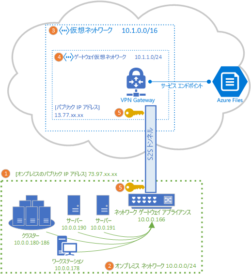

# Azure Files で使用するサイト間 VPN を構成する
サイト間 (S2S) VPN 接続を使用すると、ポート 445 を開くことなく、オンプレミス ネットワークから SMB 経由で Azure ファイル共有をマウントできます。 サイト間 VPN は、Azure リソース オファリングの VPN サービスであり、ストレージ アカウントまたはその他の Azure リソースと共にリソース グループにデプロイされる [Azure VPN Gateway](../../vpn-gateway/vpn-gateway-about-vpngateways.md) を使用して設定できます。

このハウツー記事を読み進める前に、Azure Files で使用可能なネットワーク オプションの完全な説明について [Azure Files のネットワークの概要](storage-files-networking-overview.md)に関するページを参照することを強くお勧めします。

この記事では、Azure ファイル共有をオンプレミスに直接マウントするためにサイト間 VPN を構成する手順について詳細に説明します。 Azure File Sync の同期トラフィックをサイト間 VPN 経由でルーティングすることを検討している場合は、[Azure File Sync のプロキシとファイアウォールの設定の構成](storage-sync-files-firewall-and-proxy.md)に関するページを参照してください。

## 前提条件
- オンプレミスにマウントする Azure ファイル共有。 ストレージ アカウント内にデプロイされた Azure ファイル共有は、複数のファイル共有だけでなく、BLOB コンテナーやキューなどのその他のストレージ リソースをデプロイできるストレージの共有プールを表す管理構造です。 Azure ファイル共有とストレージ アカウントをデプロイする方法の詳細については、「[Azure ファイル共有を作成する](storage-how-to-create-file-share.md)」を参照してください。

- オンプレミスにマウントする Azure ファイル共有を含むストレージ アカウント用のプライベート エンドポイント。 プライベート エンドポイントを作成する方法の詳細については、「[Azure Files ネットワーク エンドポイントの構成](storage-files-networking-endpoints.md?tabs=azure-portal)」を参照してください。 

- Azure VPN Gateway と互換性のある、オンプレミスのデータセンター内のネットワーク アプライアンスまたはサーバー。 Azure Files は、選択されたオンプレミス ネットワーク アプライアンスに依存しませんが、Azure VPN Gateway には[テスト済みのデバイスの一覧](../../vpn-gateway/vpn-gateway-about-vpn-devices.md)が保持されています。 提供される機能、パフォーマンス特性、および管理機能はネットワーク アプライアンスによって異なるため、ネットワーク アプライアンスを選択する場合はこれらを考慮してください。

    既存のネットワーク アプライアンスが存在しない場合、Windows Server には組み込みのサーバー ロールであるルーティングとリモート アクセス (RRAS) が含まれており、これをオンプレミス ネットワーク アプライアンスとして使用できます。 Windows Server でルーティングとリモート アクセスを構成する方法の詳細については、「[RAS ゲートウェイ](https://docs.microsoft.com/windows-server/remote/remote-access/ras-gateway/ras-gateway)」を参照してください。

## VNet にストレージ アカウントを追加する
Azure portal で、オンプレミスにマウントする Azure ファイル共有を含むストレージ アカウントに移動します。 ストレージ アカウントの目次で、 **[ファイアウォールと仮想ネットワーク]** エントリを選択します。 ストレージ アカウントの作成時にそのアカウントに仮想ネットワークを追加していない限り、結果のウィンドウでは **[すべてのネットワーク]** の **[許可するアクセス元]** ラジオ ボタンが選択されています。

目的の仮想ネットワークにストレージ アカウントを追加するには、 **[選択されたネットワーク]** を選択します。 **[仮想ネットワーク]** の小見出しで、目的の状態に応じて **[+ 既存の仮想ネットワークを追加]** または **[+ 新しい仮想ネットワークを追加]** のどちらかをクリックします。 新しい仮想ネットワークを作成すると、新しい Azure リソースが作成されます。 新規または既存の VNet リソースは、ストレージ アカウントと同じリソース グループまたはサブスクリプションに存在する必要はありませんが、ストレージ アカウントと同じリージョンに存在する必要があり、VNet のデプロイ先のリソース グループとサブスクリプションは VPN Gateway のデプロイ先と一致している必要があります。 

既存の仮想ネットワークを追加する場合は、ストレージ アカウントの追加先として、その仮想ネットワークの 1 つ以上のサブネットを選択するよう求められます。 新しい仮想ネットワークを選択した場合は、仮想ネットワークの作成の一部として 1 つのサブネットを作成するため、後でその仮想ネットワークの結果の Azure リソースを使用してさらに追加できます。

以前にサブスクリプションにストレージ アカウントを追加していない場合は、仮想ネットワークに Microsoft.Storage サービス エンドポイントを追加する必要があります。 これには少し時間がかかることがあり、この操作が完了するまで、そのストレージ アカウント内の Azure ファイル共有にはアクセスできません (VPN 接続経由を含む)。 

## Azure VPN Gateway をデプロイする
Azure portal の目次で、 **[新しいリソースを作成]** を選択し、*仮想ネットワーク ゲートウェイ*を検索します。 その仮想ネットワーク ゲートウェイは、前の手順でデプロイした仮想ネットワークと同じサブスクリプション、Azure リージョン、およびリソース グループに存在する必要があります (仮想ネットワークが選択されると、リソース グループが自動的に選択されることに注意してください)。 

Azure VPN Gateway をデプロイする目的のために、次のフィールドにデータを入力する必要があります。

- **Name**:VPN Gateway の Azure リソースの名前。 この名前には、管理に役立つ任意の名前を指定できます。
- **[リージョン]** :VPN Gateway のデプロイ先のリージョン。
- **[ゲートウェイの種類]** : サイト間 VPN をデプロイする目的のために、 **[VPN]** を選択する必要があります。
- **VPN の種類**:VPN デバイスに応じて、 *[ルート ベース]* * または **[Policy-based] (ポリシー ベース)** のどちらかを選択できます。 ルート ベースの VPN が IKEv2 をサポートするのに対して、ポリシー ベースの VPN は IKEv1 のみをサポートします。 2 種類の VPN ゲートウェイの詳細については、「[ポリシー ベースおよびルート ベースの VPN ゲートウェイについて](../../vpn-gateway/vpn-gateway-connect-multiple-policybased-rm-ps.md#about)」を参照してください。
- **SKU**:SKU は、許可されるサイト間トンネルの数と VPN の目的のパフォーマンスを制御します。 ユース ケースに適した SKU を選択するには、[ゲートウェイ SKU](../../vpn-gateway/vpn-gateway-about-vpngateways.md#gwsku) の一覧を参照してください。 VPN Gateway の SKU は、後で必要に応じて変更できます。
- **仮想ネットワーク**:前の手順で作成した仮想ネットワーク。
- **[パブリック IP アドレス]** : インターネットに公開される VPN Gateway の IP アドレス。 おそらく、新しい IP アドレスを作成する必要がありますが、既存の未使用の IP アドレスが適切であればそれを使用することもできます。 **[新規作成]** を選択した場合は、VPN Gateway と同じリソース グループ内に新しい IP アドレス Azure リソースが作成され、 **[パブリック IP アドレス名]** は新しく作成された IP アドレスの名前になります。 **[既存のものを使用]** を選択した場合は、既存の未使用の IP アドレスを選択する必要があります。
- **[アクティブ/アクティブ モードの有効化]** : **[有効]** は、アクティブ/アクティブ ゲートウェイ構成を作成する場合にのみ選択し、それ以外の場合は **[無効]** が選択されたままにします。 アクティブ/アクティブ モードの詳細については、「[高可用性のクロスプレミス接続および VNet 間接続](../../vpn-gateway/vpn-gateway-highlyavailable.md)」を参照してください。
- **[BGP ASN の構成]** : **[有効]** は、構成で特にこの設定が必要な場合にのみ選択します。 この設定の詳細については、「[BGP と Azure VPN Gateway について](../../vpn-gateway/vpn-gateway-bgp-overview.md)」を参照してください。

**[確認および作成]** を選択して VPN Gateway を作成します。 VPN Gateway を完全に作成してデプロイするには最大 45 分かかることがあります。

### オンプレミスのゲートウェイ用のローカル ネットワーク ゲートウェイを作成する 
ローカル ネットワーク ゲートウェイは、オンプレミス ネットワーク アプライアンスを表す Azure リソースです。 Azure portal の目次で、 **[新しいリソースを作成]** を選択し、*ローカル ネットワーク ゲートウェイ*を検索します。 ローカル ネットワーク ゲートウェイは、ストレージ アカウント、仮想ネットワーク、および VPN Gateway と共にデプロイされる Azure リソースですが、ストレージ アカウントと同じリソース グループまたはサブスクリプションに存在する必要はありません。 

ローカル ネットワーク ゲートウェイ リソースをデプロイする目的のために、次のフィールドにデータを入力する必要があります。

- **Name**:ローカル ネットワーク ゲートウェイの Azure リソースの名前。 この名前には、管理に役立つ任意の名前を指定できます。
- **IP アドレス**: オンプレミスのローカル ゲートウェイのパブリック IP アドレス。
- **[アドレス空間]** : このローカル ネットワーク ゲートウェイが表すネットワークのアドレス範囲。 複数のアドレス空間範囲を追加できますが、ここで指定する範囲が、接続先の他のネットワークの範囲と重複しないようにしてください。 
- **[BGP 設定の構成]** : BGP 設定は、構成でこの設定が必要な場合にのみ構成します。 この設定の詳細については、「[BGP と Azure VPN Gateway について](../../vpn-gateway/vpn-gateway-bgp-overview.md)」を参照してください。
- **サブスクリプション**:目的のサブスクリプション。 これは、VPN Gateway またはストレージ アカウントに使用されるサブスクリプションと一致している必要はありません。
- **[リソース グループ]** :目的のリソース グループ。 これは、VPN Gateway またはストレージ アカウントに使用されるリソース グループと一致している必要はありません。
- **[場所]** :ローカル ネットワーク ゲートウェイ リソースが作成される Azure リージョン。 これは、VPN Gateway とストレージ アカウントのために選択したリージョンと一致している必要があります。

**[作成]** を選択してローカル ネットワーク ゲートウェイ リソースを作成します。  

## オンプレミス ネットワーク アプライアンスを構成する
オンプレミス ネットワーク アプライアンスを構成するための具体的な手順は、組織が選択したネットワーク アプライアンスによって異なります。 組織が選択したデバイスによっては、[テスト済みのデバイスの一覧](../../vpn-gateway/vpn-gateway-about-vpn-devices.md)に、Azure VPN Gateway と共に構成するためのデバイス ベンダーの指示へのリンクが含まれている可能性があります。

## サイト間接続を作成する
S2S VPN のデプロイを完了するには、オンプレミス ネットワーク アプライアンス (ローカル ネットワーク ゲートウェイ リソースによって表されます) と VPN Gateway の間の接続を作成する必要があります。 これを行うには、前に作成した VPN Gateway に移動します。 VPN Gateway の目次で、 **[接続]** を選択し、 **[追加]** をクリックします。 結果の **[接続の追加]** ウィンドウには、次のフィールドが必要です。

- **Name**:接続の名前。 VPN Gateway は複数の接続をホストできるため、この特定の接続を区別する、管理に役立つ名前を選択します。
- **[接続の種類]** : これは S2S 接続であるため、ドロップダウン リストで **[サイト間 (IPSec)]** を選択します。
- **[仮想ネットワーク ゲートウェイ]** :このフィールドは、接続を作成している VPN Gateway に自動的に選択され、変更できません。
- **[ローカル ネットワーク ゲートウェイ]** : これは、VPN Gateway に接続するローカル ネットワーク ゲートウェイです。 結果の選択ウィンドウには、前に作成したローカル ネットワーク ゲートウェイの名前が含まれています。
- **共有キー (PSK)** :接続の暗号化を確立するために使用される、文字と数字の組み合わせ。 仮想ネットワーク ゲートウェイとローカル ネットワーク ゲートウェイの両方で同じ共有キーを使用する必要があります。 ゲートウェイ デバイスに設定されていない場合は、ここで作成し、それをそのデバイスに指定することができます。

**[OK]** を選択して接続を作成します。 **[接続]** ページで、接続が正常に作成されていることを確認できます。

## Azure ファイル共有をマウントする 
S2S VPN の構成の最後の手順では、それが Azure Files に対して機能することを確認します。 これは、希望する OS でオンプレミスの Azure ファイル共有をマウントすることによって行うことができます。 OS ごとのマウント手順については、次を参照してください。

- [Windows](storage-how-to-use-files-windows.md)
- [macOS](storage-how-to-use-files-mac.md)
- [Linux](storage-how-to-use-files-linux.md)

## 関連項目
- [Azure Files のネットワークの概要](storage-files-networking-overview.md)
- [Windows 上で Azure Files で使用するポイント対サイト (P2S) VPN を構成する](storage-files-configure-p2s-vpn-windows.md)
- [Linux 上で Azure Files で使用するポイント対サイト (P2S) VPN を構成する](storage-files-configure-p2s-vpn-linux.md)