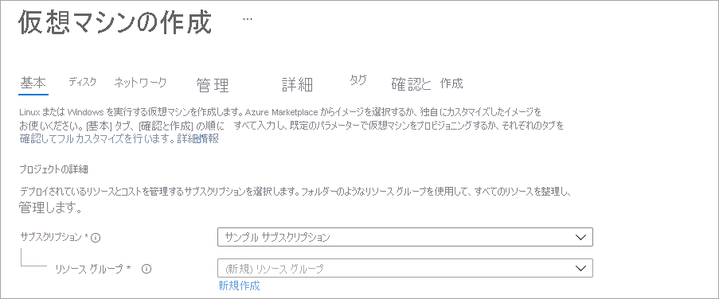
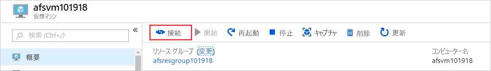
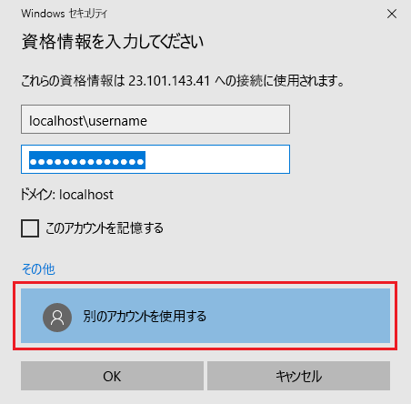
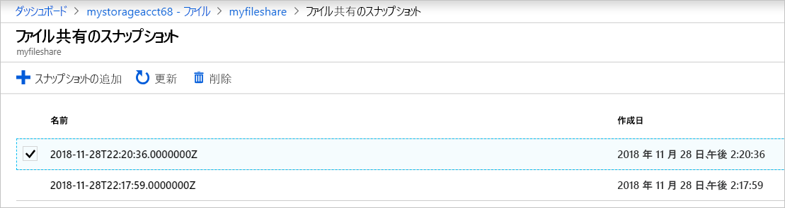
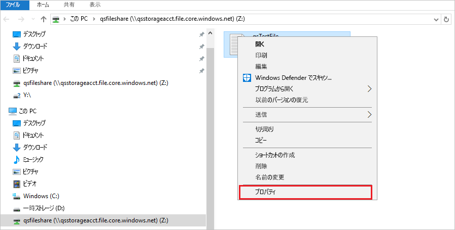

# クイックスタート: Windows Virtual Machines で Azure のファイル共有を作成して管理する

この記事では、Azure Files 共有を作成して使用する基本的な手順について説明します。 このクイック スタートでは、Azure Files 共有サービスを体験できるよう、Azure ファイル共有をすばやく設定することに重点を置いています。 ご利用の環境に Azure ファイル共有を作成して使用するさらに詳しい手順については、「[Windows で Azure ファイル共有を使用する](storage-how-to-use-files-windows.md)」を参照してください。

Azure サブスクリプションをお持ちでない場合は、開始する前に [無料アカウント](https://azure.microsoft.com/free/?WT.mc_id=A261C142F) を作成してください。

## 適用対象
| ファイル共有の種類 | SMB | NFS |
|-|:-:|:-:|
| Standard ファイル共有 (GPv2)、LRS/ZRS |  |  |
| Standard ファイル共有 (GPv2)、GRS/GZRS |  |  |
| Premium ファイル共有 (FileStorage)、LRS/ZRS |  |  |

## Azure へのサインイン

[Azure portal](https://portal.azure.com) にサインインします。

## 環境を準備する

このクイック スタートでは、次の項目を設定します。

- Azure ストレージ アカウントと Azure ファイル共有
- Windows Server 2016 Datacenter VM

### ストレージ アカウントを作成する

Azure ファイル共有を使用するためには、あらかじめ Azure ストレージ アカウントを作成しておく必要があります。 汎用 v2 ストレージ アカウントでは、Azure Storage サービス (BLOB、ファイル、キュー、およびテーブル) のすべてにアクセスできます。 このクイック スタートでは汎用 v2 ストレージ アカウントを作成しますが、作成手順はどの種類のストレージ アカウントでも似ています。 1 つのストレージ アカウントに格納できる共有の数に制限はありません。 1 つの共有に格納できるファイルの数に制限はなく、ストレージ アカウントの容量の上限までファイルを格納できます。

[!INCLUDE [storage-create-account-portal-include](../../../includes/storage-create-account-portal-include.md)]

### Azure ファイル共有を作成する

次に、ファイル共有を作成します。

1. Azure ストレージ アカウントのデプロイが完了したら、**[リソースに移動]** を選択します。
1. ストレージ アカウント ペインで **[ファイル共有]** を選択します。

    ![[ファイル共有] を選択します。](./media/storage-files-quick-create-use-windows/click-files.png)

1. **+ [ファイル共有]** を選択します。

    ![[+ ファイル共有] を選択して、新しいファイル共有を作成します。](./media/storage-files-quick-create-use-windows/create-file-share.png)

1. 新しいファイル共有に *qsfileshare* という名前を付け、 **[クォータ]** に「1」と入力します。 **[トランザクションが最適化されました]** を選択したままにして、 **[作成]** を選択します。 クォータは最大で 5 TiB (大きいファイルの共有を有効にした場合は 100 TiB) にすることができますが、このクイックスタートでは 1 GiB しか必要ありません。
1. ローカル コンピューター上に、*qsTestFile* という新しいテキスト ファイルを作成します。
1. 新しいファイル共有を選択し、ファイル共有上の場所に対して **[アップロード]** を選択します。

    

1. .txt ファイルを作成した場所に移動して *qsTestFile.txt* を選択し、**[アップロード]** を選択します。

この時点で、Azure ストレージ アカウントと、1 つのファイルを含む Azure のファイル共有を作成できました。 次に、このクイック スタートでのオンプレミス サーバーを表す、Windows Server 2016 Datacenter がある Azure VM を作成します。

### VM をデプロイする

1. 次に、ポータルの左側にあるメニューを展開して、Azure portal の左上隅にある **[リソースの作成]** を選択します。
1. **[人気のあるサービス]** で、 **[仮想マシン]** を選択します。
1. **[基本]** タブの **[プロジェクトの詳細]** で、このクイック スタートのために作成したリソース グループを選択します。

   

1. **[インスタンスの詳細]** で、VM に *qsVM* という名前を付けます。
1. **[イメージ]** に **[Windows Server 2016 Datacenter - Gen2]** を選択します。
1. **[リージョン]** 、 **[可用性オプション]** 、 **[サイズ]** は、既定の設定のままにしておきます。
1. **[管理者アカウント]** で、**ユーザー名** を追加し、VM の **パスワード** を入力します。
1. **[受信ポートの規則]** で、**[Allow selected ports] (選択されたポートを許可する)** を選択してから、ドロップダウンから **[RDP (3389)]** と **[HTTP]** を選択します。
1. **[Review + create]\(レビュー + 作成\)** を選択します。
1. **［作成］** を選択します 新しい VM の作成が完了するまでに数分かかります。

1. VM のデプロイが完了したら、**[リソースに移動]** を選択します。

この時点で、新しい仮想マシンを作成し、データ ディスクを接続できました。 次に、VM に接続する必要があります。

### VM に接続する

1. 仮想マシンのプロパティ ページで、**[接続]** を選択します。

   

1. **[Connect to virtual machine]\(仮想マシンへの接続\)** ページで、**ポート番号** *3389* を介して **IP アドレス** を使って接続する既定のオプションをそのまま使用して、**[RDP ファイルのダウンロード]** を選択します。
1. ダウンロードした RDP ファイルを開き、プロンプトが表示されたら **[接続]** を選択します。
1. **[Windows セキュリティ]** ウィンドウで、 **[その他]** 、 **[別のアカウントを使用する]** の順に選択します。 ユーザー名に「*localhost\username*」と入力します。ここで &lt;username&gt; は、仮想マシン用に作成した VM 管理者のユーザー名です。 仮想マシン用に作成したパスワードを入力し、**[OK]** を選択します。

   

1. サインイン処理中に証明書の警告が表示される場合があります。 **[はい]** または **[続行]** を選択して接続を作成します。

## Azure ファイル共有を Windows ドライブにマップする

1. Azure portal で *qsfileshare* ファイル共有に移動し、**[接続]** を選択します。
1. ドライブ文字を選択し、2 つ目のボックスの内容をコピーして **メモ帳** に貼り付けます。

   :::image type="content" source="media/storage-how-to-use-files-windows/files-portal-mounting-cmdlet-resize.png" alt-text="コピーしてメモ帳に貼り付けるボックスの内容を示すスクリーンショット。" lightbox="media/storage-how-to-use-files-windows/files-portal-mounting-cmdlet-resize.png":::

1. VM で **PowerShell** を開きます。**メモ帳** の内容を貼り付け、Enter キーを押してコマンドを実行します。 これで、ドライブがマップされます。

## 共有スナップショットを作成する

ドライブをマップしたら、スナップショットを作成できます。

1. ポータルで、対象のファイル共有に移動します。 **[スナップショット]** を選択し、 **[+ スナップショットの追加]** を選択します。

   ![[operations]\(操作\) セクションで [スナップショット] を選択し、[スナップショットの追加] を選択します。](./media/storage-files-quick-create-use-windows/create-snapshot.png)

1. VM で *qstestfile.txt* を開き、「this file has been modified」と入力した後、ファイルを保存して閉じます。
1. 別のスナップショットを作成します。

## 共有スナップショットを参照する

1. 対象のファイル共有で **[スナップショット]** を選択します。
1. **[スナップショット]** ブレードで、一覧にある最初のスナップショットを選択します。

   

1. そのスナップショットを開き、*qsTestFile.txt* を選択します。

## スナップショットから復元する

1. [ファイル共有のスナップショット] ブレードで、*[qsTestFile]* を右クリックし、**[復元]** をクリックします。

    :::image type="content" source="media/storage-files-quick-create-use-windows/restore-share-snapshot.png" alt-text="[スナップショット] ブレードのスクリーンショット。qstestfile が選択され、[復元] が強調表示されています。":::

1. **[元のファイルを上書きする]** を選択します。

   ![[復元] ポップアップのスクリーンショット。[元のファイルを上書きする] が選択されています。](./media/storage-files-quick-create-use-windows/snapshot-download-restore-portal.png)

1. VM でそのファイルを開きます。 未変更のバージョンが復元されています。

## 共有スナップショットの削除

1. 対象のファイル共有で **[スナップショット]** を選択します。
1. **[スナップショット]** ブレードで、一覧にある最後のスナップショットを選択し、 **[削除]** を選択します。

   ![[スナップショット] ブレードのスクリーンショット。最後のスナップショットが選択され、[削除] ボタンが強調表示されています。](./media/storage-files-quick-create-use-windows/portal-snapshots-delete.png)

## Windows で共有スナップショットを使用する

オンプレミスの VSS スナップショットと同様、マウントした Azure ファイル共有にあるスナップショットも [以前のバージョン] タブを使用して表示できます。

1. マウントされた共有をエクスプローラーで探します。

   

1. *[qsTestFile.txt]* を選択して右クリックし、メニューから **[プロパティ]** を選択します。

   

1. **[以前のバージョン]** を選択して、このディレクトリの共有スナップショットの一覧を表示します。

1. **[開く]** を選択して、スナップショットを開きます。

   ![[以前のバージョン] タブ](./media/storage-files-quick-create-use-windows/snapshot-windows-list.png)

## 以前のバージョンから復元する

1. **[復元]** を選択します。 この操作により、ディレクトリ全体の内容が、共有スナップショットを作成したときの元の場所に再帰的にコピーされます。

   ![警告メッセージ内の [復元] ボタン](./media/storage-files-quick-create-use-windows/snapshot-windows-restore.png)
    
    > [!NOTE]
    > ファイルが変更されていない場合、そのファイルはスナップショットと同じバージョンであるため、そのファイルの以前のバージョンは表示されません。 これは、Windows ファイル サーバーでの動作と一致しています。

## リソースをクリーンアップする

[!INCLUDE [storage-files-clean-up-portal](../../../includes/storage-files-clean-up-portal.md)]

## 次のステップ

> [!div class="nextstepaction"]
> [Windows で Azure ファイル共有を使用する](storage-how-to-use-files-windows.md)
