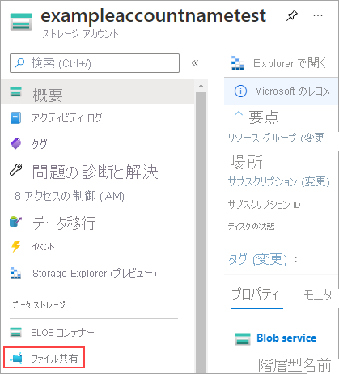

# Azure Portal での Azure ファイル共有の管理 
[Azure Files](storage-files-introduction.md) は、Microsoft の使いやすいクラウド ファイル システムです。 Azure ファイル共有は、Windows、Linux、macOS でマウントできます。 このガイドでは、[Azure Portal](https://portal.azure.com/) を使用して Azure ファイル共有を操作する方法の基本について説明します。 以下の項目について説明します。

> [!div class="checklist"]
> * リソース グループとストレージ アカウントを作成する
> * Azure ファイル共有を作成する 
> * ディレクトリを作成する
> * ファイルをアップロードする 
> * ファイルをダウンロードする
> * 共有スナップショットを作成して使用する

Azure サブスクリプションをお持ちでない場合は、開始する前に[無料アカウント](https://azure.microsoft.com/free/?WT.mc_id=A261C142F)を作成できます。

## ストレージ アカウントの作成
[!INCLUDE [storage-files-create-storage-account-portal](../../../includes/storage-files-create-storage-account-portal.md)]

## ファイル共有を作成する
ファイル共有を作成するには:

1. ダッシュボードからストレージ アカウントを選択します。
2. ストレージ アカウント ページの **[サービス]** セクションで、**[ファイル]** を選択します。
    

3. **[File サービス]** ページの上部にあるメニューで、**[+ ファイル共有]** をクリックします。 **[新しいファイル共有]** ページが表示されます。
4. **[名前]** で、「*myshare*」と入力します。
5. **[OK]** をクリックして、Azure ファイル共有を作成します。

## Azure ファイル共有の内容の操作
Azure ファイル共有を作成したところで、SMB でファイル共有を [Windows](storage-how-to-use-files-windows.md)、[Linux](storage-how-to-use-files-linux.md)、または [macOS](storage-how-to-use-files-mac.md) にマウントできます。 別の方法として、Azure Portal を使用して Azure ファイル共有を操作することもできます。 Azure Portal 経由で実行されるすべての要求はファイル REST API で処理されるため、SMB アクセスのないクライアント上のファイルとディレクトリを作成、変更、削除できます。

### ディレクトリを作成する
Azure ファイル共有のルートで *myDirectory* という名前の新しいディレクトリを作成するには:

1. **[File サービス]** ページで、**myshare** ファイル共有を選択します。 ファイル共有の名前ページが開きます。
2. ページ上部のメニューで、**[+ ディレクトリの追加]** を選択します。 **[新しいディレクトリ]** ページが表示されます。
3. 「*myDirectory*」と入力し、**[OK]** をクリックします。

### ファイルをアップロードする 
ファイルのアップロードを行うには、最初にアップロードされるファイルを作成または選択する必要があります。 これは、必要に応じた方法で実行できます。 アップロードしたいファイルを選択したら:

1. **myDirectory** ディレクトリをクリックします。 **myDirectory** パネルが開きます。
2. 上部のメニューで **[アップロード]** をクリックします。 **[ファイルのアップロード]** パネルが開きます。  
    ![[ファイルのアップロード] パネルのスクリーンショット](media/storage-how-to-use-files-portal/upload-file-1.png)

3. フォルダー アイコンをクリックして、ローカル ファイルを参照するためのウィンドウを開きます。 
4. ファイルを選択して **[開く]** をクリックします。 
5. **[ファイルのアップロード]** ページで、ファイル名を確認して **[アップロード]** をクリックします。
6. 完了したら、ファイルが **myDirectory** ページの一覧に表示されます。

### ファイルをダウンロードする
ファイルを右クリックすると、アップロードしたファイルのコピーをダウンロードできます。 ダウンロード ボタンをクリックした後の正確なエクスペリエンスは、使用しているオペレーティング システムとブラウザーによって異なります。

## 共有スナップショットの作成と変更
さらに、Azure ファイル共有で実行できる便利なタスクの 1 つとして、共有スナップショットの作成があります。 スナップショットでは、特定の時点の Azure ファイル共有が保存されます。 共有スナップショットは、場合によっては既に使い慣れている、次のようなオペレーティング システム テクノロジに類似しています。
- NTFS や ReFS などの Windows ファイル システム用の[ボリューム シャドウ コピー サービス (VSS)](https://docs.microsoft.com/en-us/windows/desktop/VSS/volume-shadow-copy-service-portal)
- Linux システム用の[論理ボリューム マネージャー (LVM)](https://en.wikipedia.org/wiki/Logical_Volume_Manager_(Linux)#Basic_functionality) スナップショット
- macOS 用の [Apple File System (APFS)](https://developer.apple.com/library/content/documentation/FileManagement/Conceptual/APFS_Guide/Features/Features.html) スナップショット。 

共有スナップショットを作成するには:

1. ダッシュボードでストレージ アカウントを開き、**[ファイル]** > **myshare** の順に移動して、ファイル共有のページを開きます。 
2. ファイル共有のページで、ページの上部にあるメニューの **[スナップショット]** ボタンをクリックして、**[スナップショットの作成]** を選択します。  
    ![[スナップショットの作成] ボタンを見つける方法を示すスクリーンショット](media/storage-how-to-use-files-portal/create-snapshot-1.png)

### 共有スナップショットの一覧表示と参照
スナップショットが作成されたら、もう一度 **[スナップショット]** をクリックして **[スナップショットの表示]** を選択し、共有のスナップショットを一覧表示できます。 結果のウィンドウに、その共有のスナップショットが表示されます。 共有スナップショットをクリックして参照します。

### 共有スナップショットからの復元
共有スナップショットからのファイルの復元を行うには、最初に有効な Azure ファイル共有からファイルを削除する必要があります。 *myDirectory* フォルダーに移動し、アップロードしたファイルを右クリックしてから、**[削除]** をクリックします。 次に、共有スナップショットからそのファイルを復元します。

1. 上部のメニューで **[スナップショット]** をクリックし、**[スナップショットの表示]** を選択します。 
2. 先ほど作成したスナップショットをクリックします。それにより、新しいページに内容が表示されます。 
3. スナップショットの **myDirectory** をクリックすると、削除したファイルが表示されます。 
4. 削除したファイルを右クリックして、**[復元]** を選択します。
5. ファイルをコピーとして復元するか、それとも元のファイルを上書きするかを選択できるポップアップが表示されます。 元のファイルを削除しているので、**[元のファイルを上書きする]** を選択して、削除する前の元の状態にファイルを復元できます。 **[OK]** をクリックして、ファイルを Azure ファイル共有に復元します。  
    

6. ファイルの復元が完了したら、スナップショットのページを閉じて、**myshare** > **myDirectory** の順に移動します。ファイルは元の場所に戻っています。

### 共有スナップショットの削除
共有スナップショットを削除するには、[共有スナップショットの一覧に移動します](#list-and-browse-a-share-snapshot)。 共有スナップショットの名前の横にあるチェックボックスをオンにして、**[削除]** ボタンを選択します。

## リソースのクリーンアップ
[!INCLUDE [storage-files-clean-up-portal](../../../includes/storage-files-clean-up-portal.md)]

## 次の手順
- [Azure PowerShell でのファイル共有の管理](storage-how-to-use-files-powershell.md)
- [Azure CLI でのファイル共有の管理](storage-how-to-use-files-cli.md)
- [Azure Storage Explorer でのファイル共有の管理](storage-how-to-use-files-storage-explorer.md)
- [Azure Files のデプロイの計画](storage-files-planning.md)