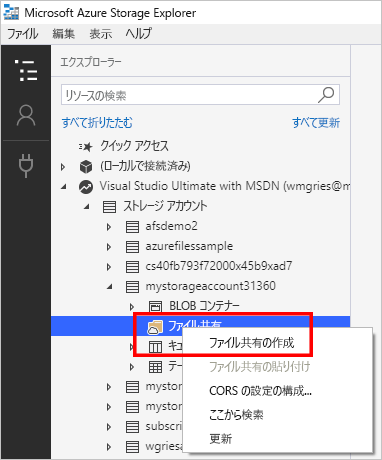

# Azure Storage Explorer を使用した Azure ファイル共有の管理 
[Azure Files](storage-files-introduction.md) は、Microsoft の使いやすいクラウド ファイル システムです。 この記事では、[Azure Storage Explorer](https://azure.microsoft.com/features/storage-explorer/) を使用して Azure ファイル共有を操作する方法の基本について説明します。 Azure Storage Explorer は、Windows、macOS、および Linux で使用できる、広く使用されているクライアント ツールです。 Storage Explorer を使用すると、Azure ファイル共有やその他のストレージ リソースを管理することができます。

このクイック スタートでは、Storage Explorer がインストールされていることを前提としています。 Azure Storage Explorer をダウンロードしてインストールするには、「[Azure Storage Explorer](https://azure.microsoft.com/features/storage-explorer/)」にアクセスしてください。

この記事では、次のことについて説明します:

> [!div class="checklist"]
> * リソース グループとストレージ アカウントを作成する
> * Azure ファイル共有を作成する 
> * ディレクトリを作成する
> * ファイルをアップロードする
> * ファイルをダウンロードする
> * 共有スナップショットを作成して使用する

Azure サブスクリプションをお持ちでない場合は、開始する前に[無料アカウント](https://azure.microsoft.com/free/?WT.mc_id=A261C142F)を作成できます。

## ストレージ アカウントの作成
Storage Explorer を使用して新しいリソースを作成することはできません。 このデモでは、[Azure Portal](https://portal.azure.com/) にストレージ アカウントを作成します。 

[!INCLUDE [storage-files-create-storage-account-portal](../../../includes/storage-files-create-storage-account-portal.md)]

## Storage Explorer と Azure リソースの接続
Storage Explorer を初めて起動すると、**[Microsoft Azure Storage Explorer - 接続]** ウィンドウが表示されます。 Storage Explorer には、ストレージ アカウントに対する接続方法がいくつか用意されています。 

- **Azure アカウントを使用してサインインする**: 所属する組織のユーザー資格情報または Microsoft アカウントを使用してログインできます。 
- **接続文字列または SAS トークンを使用して特定のストレージ アカウントに接続する**: 接続文字列は、ストレージ アカウント名とストレージ アカウント キー/SAS トークンを含む特別な文字列です。 Storage Explorer は、トークンを使用して、(単に Azure アカウント内のすべてのストレージ アカウントを表示するのではなく) ストレージ アカウントに直接アクセスします。 接続文字列の詳細については、「[Azure Storage の接続文字列を構成する](../common/storage-configure-connection-string.md?toc=%2fazure%2fstorage%2ffiles%2ftoc.json)」を参照してください。
- **ストレージ アカウントの名前とキーを使用して、特定のストレージ アカウントに接続する**: ストレージ アカウントの名前とキーを使用して、Azure Storage に接続します。

このクイック スタートでは、Azure アカウントを使用してサインインします。 **[Add an Azure Account]\(Azure アカウントの追加\)** を選択し、**[サインイン]** を選択します。 プロンプトに従って Azure アカウントにサインインします。

![[Microsoft Azure Storage Explorer - 接続] ウィンドウのスクリーンショット](./media/storage-how-to-use-files-storage-explorer/connect-to-azure-storage-1.png)

### ファイル共有を作成する
最初の Azure ファイル共有を *storageacct<random number>* ストレージ アカウント内に作成するには:

1. 作成したストレージ アカウントを展開します。
2. **[ファイル共有]** を右クリックして、**[ファイル共有の作成]** を選択します。  
    

3. ファイル共有名として「*myshare*」と入力して、Enter キーを押します。

> [!IMPORTANT]  
> 共有名には、小文字の英字、数字、単一ハイフンのみを使用することができます (ただし、名前をハイフンで始めることはできません)。 ファイル共有とファイルの名前付けの詳細については、「[Naming and referencing shares, directories, files, and metadata (共有、ディレクトリ、ファイル、およびメタデータの名前付けおよび参照)](https://docs.microsoft.com/rest/api/storageservices/Naming-and-Referencing-Shares--Directories--Files--and-Metadata)」を参照してください。

ファイル共有が作成されると、ファイル共有のタブが右ウィンドウに表示されます。 

## Azure ファイル共有の内容の操作
Azure ファイル共有を作成したところで、SMB でファイル共有を [Windows](storage-how-to-use-files-windows.md)、[Linux](storage-how-to-use-files-linux.md)、または [macOS](storage-how-to-use-files-mac.md) にマウントできます。 別の方法として、Azure CLI を使用して Azure ファイル共有を操作することもできます。 SMB を使用してファイル共有をマウントする代わりに Azure CLI を使用する利点として、Azure CLI を使用して実行されるすべての要求がファイル REST API を使用して処理されることが挙げられます。 ファイル REST API を使用して、SMB アクセス権がないクライアント上のファイルとディレクトリを作成、変更、および削除することができます。

### ディレクトリを作成する
ディレクトリを追加すると、ファイル共有を管理するための階層構造が生じます。 ディレクトリには複数のレベルを作成できます。 ただし、サブディレクトリを作成する前に、親ディレクトリが存在することを確認する必要があります。 たとえば、パス myDirectory/mySubDirectory の場合は、最初に *myDirectory* ディレクトリを作成する必要があります。 その後、*mySubDirectory* を作成できます。 

1. ファイル共有のタブの上部のメニューで、**[新しいフォルダー]** ボタンを選択します。 **[新しいディレクトリの作成]** ウィンドウが開きます。
    ![コンテキストの [新しいフォルダー] ボタンのスクリーンショット](media/storage-how-to-use-files-storage-explorer/create-directory-1.png)

2. ディレクトリ名として「*myDirectory*」と入力し、**[OK]** を選択します。 

*myDirectory* ディレクトリが *myshare* ファイル共有のタブに表示されます。

### ファイルをアップロードする 
ローカル コンピューターからファイル共有の新しいディレクトリにファイルをアップロードできます。 フォルダー全体をアップロードすることも、単一のファイルをアップロードすることもできます。

1. 上部のメニューで、**[アップロード]** を選択します。 これにより、フォルダーまたはファイルをアップロードするオプションが表示されます。
2. **[ファイルのアップロード]** を選択して、ローカル コンピューターからアップロードするファイルを選択します。
3. **[Upload to a directory]\(ディレクトリにアップロードする\)** で「*myDirectory*」と入力し、**[アップロード]** を選択します。 

完了すると、ファイルが *myDirectory* ウィンドウの一覧に表示されます。

### ファイルをダウンロードする
ファイル共有からファイルのコピーをダウンロードするには、ファイルを右クリックして、**[ダウンロード]** を選択します。 ファイルの保存先にするローカル コンピューター上の場所を選択して、**[保存]** を選択します。

ウィンドウの下部にある **[アクティビティ]** ウィンドウに、ダウンロードの進行状況が表示されます。

## 共有スナップショットの作成と変更
スナップショットでは、Azure ファイル共有の特定時点のコピーが保存されます。 ファイル共有スナップショットは、場合によっては既に使い慣れている、次のような他のテクノロジに類似しています。
- NTFS や ReFS などの Windows ファイル システム用の[ボリューム シャドウ コピー サービス (VSS)](https://docs.microsoft.com/en-us/windows/desktop/VSS/volume-shadow-copy-service-portal)
- Linux システム用の[論理ボリューム マネージャー (LVM)](https://en.wikipedia.org/wiki/Logical_Volume_Manager_(Linux)#Basic_functionality) スナップショット
- macOS 用の [Apple File System (APFS)](https://developer.apple.com/library/content/documentation/FileManagement/Conceptual/APFS_Guide/Features/Features.html) スナップショット

共有スナップショットを作成するには:

1. *myshare* ファイル共有のタブを選択します。
2. 上部のメニューから、**[スナップショットの作成]** を選択します  (Storage Explorer のウィンドウのサイズによっては、このオプションを表示するために最初に **[More]\(詳細\)** を選択する必要があります)。  
    ![コンテキストの [スナップショットの作成] ボタンのスクリーンショット](media/storage-how-to-use-files-storage-explorer/create-share-snapshot-1.png)

### 共有スナップショットの一覧表示と参照
スナップショットを作成した後、共有のスナップショットを一覧表示するには、**[View Snapshots for File Share]\(ファイル共有のスナップショットを参照する\)** を選択します  (Storage Explorer のウィンドウのサイズによっては、このオプションを表示するために最初に **[More]\(詳細\)** を選択する必要があります)。共有スナップショットを参照するには、目的のスナップショットをダブルクリックします。

### 共有スナップショットからの復元
共有スナップショットからファイルを復元する方法を示すために、最初に有効な Azure ファイル共有からファイルを削除します。 *myDirectory* フォルダーに移動します。アップロードしたファイルを右クリックし、**[削除]** を選択します。 このファイルを共有スナップショットから復元するには、次の操作を実行します。

1. **[View Snapshots for File Share]\(ファイル共有のスナップショットを参照する\)** を選択します  (Storage Explorer のウィンドウのサイズによっては、このオプションを表示するために最初に **[More]\(詳細\)** を選択する必要があります)。
2. 共有スナップショットの一覧で、目的の共有スナップショットをダブルクリックします。
3. スナップショットを参照して、削除したファイルを見つけます。 ファイル共有を選択し、**[スナップショットの復元]** を選択します  (Storage Explorer のウィンドウのサイズによっては、このオプションを表示するために最初に **[More]\(詳細\)** を選択する必要があります)。ウィンドウが開き、ファイルを復元するとファイル共有の内容が上書きされること、およびこの操作を元に戻すことができないことを示す警告が表示されます。 **[OK]** を選択します。
4. これで、有効な Azure ファイル共有の元の場所にファイルが戻ります。

### 共有スナップショットの削除
共有スナップショットを削除するには、[共有スナップショットの一覧](#list-and-browse-share-snapshots)に移動します。 削除する共有スナップショットを右クリックし、**[削除]** を選択します。

## リソースのクリーンアップ
Storage Explorer を使用してリソースを削除することはできません。 このクイック スタートからクリーンアップするには、[Azure Portal](https://portal.azure.com/) を使用します。 

[!INCLUDE [storage-files-clean-up-portal](../../../includes/storage-files-clean-up-portal.md)]

## 次の手順
- [Azure Portal を使用したファイル共有の管理](storage-how-to-use-files-portal.md)
- [Azure PowerShell を使用したファイル共有の管理](storage-how-to-use-files-powershell.md)
- [Azure CLI を使用したファイル共有の管理](storage-how-to-use-files-cli.md)
- [Azure Files のデプロイの計画](storage-files-planning.md)