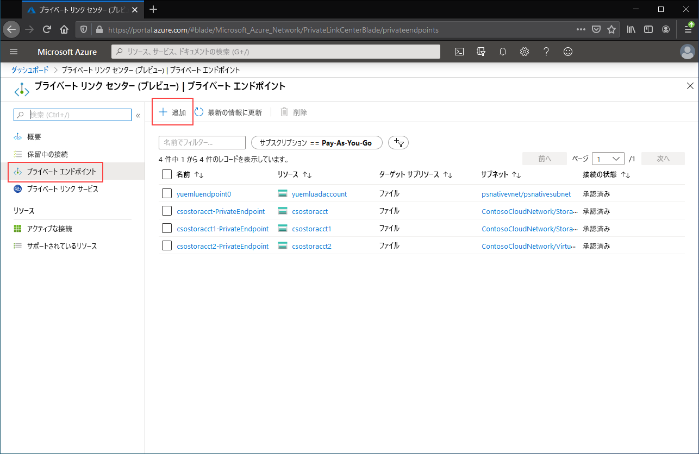

# <a name="configuring-azure-file-sync-network-endpoints"></a>Azure File Sync ネットワーク エンドポイントの構成
Azure Files および Azure File Sync では、Azure ファイル共有にアクセスするための次の主な 2 種類のエンドポイントが提供されます。 
- パブリック エンドポイント。パブリック IP アドレスを持ち、世界中のどこからでもアクセスできます。
- プライベート エンドポイント。仮想ネットワーク内に存在し、その仮想ネットワークのアドレス空間内からのプライベート IP アドレスを持ちます。

Azure Files と Azure File Sync はどちらも、それぞれに Azure 管理オブジェクト、ストレージ アカウント、ストレージ同期サービスによって、パブリック エンドポイントとプライベート エンドポイントの両方を制御します。 ストレージ アカウントは、複数のファイル共有だけでなく、BLOB コンテナーやキューなどのその他のストレージ リソースをデプロイできるストレージの共有プールを表す管理構造です。 ストレージ同期サービスは、Azure File Sync との信頼関係が確立された Windows ファイル サーバーである登録済みサーバーと、同期関係のトポロジを定義する同期グループを表す管理構造です。 

この記事では、Azure Files と Azure File Sync の両方のネットワーク エンドポイントを構成する方法について説明します。Azure File Sync を使用してオンプレミスにキャッシュするのではなく、Azure ファイル共有に直接アクセスするためにネットワーク エンドポイントを構成する方法の詳細については、「[Azure Files ネットワーク エンドポイントの構成](storage-files-networking-endpoints.md)」を参照してください。

この攻略ガイドを読む前に、「[Azure File Sync のネットワークに関する考慮事項](storage-sync-files-networking-overview.md)」を読むことをお勧めします。

## <a name="prerequisites"></a>前提条件 
この記事では、以下のことを前提としています。
- Azure サブスクリプションがある。 サブスクリプションをお持ちでない場合は、開始する前に[無料アカウント](https://azure.microsoft.com/free/?WT.mc_id=A261C142F)を作成してください。
- オンプレミスから接続する Azure ファイル共有をストレージ アカウント内に既に作成している。 Azure ファイル共有を作成する方法については、「[Azure ファイル共有を作成する](storage-how-to-create-file-share.md)」をご覧ください。
- ストレージ同期サービスを既に作成し、それにご使用の Windows ファイル サーバーを登録している。 Azure File Sync をデプロイする方法については、[Azure File Sync のデプロイ](storage-sync-files-deployment-guide.md)に関するページを参照してください。

追加として:
- Azure PowerShell を使用する場合は、[最新バージョンをインストールしてください](/powershell/azure/install-az-ps)。
- Azure CLI を使用する場合は、[最新バージョンをインストールしてください](/cli/azure/install-azure-cli)。

## <a name="create-the-private-endpoints"></a>プライベート エンドポイントを作成する
Azure リソースのプライベート エンドポイントを作成すると、次のリソースがデプロイされます。

- **プライベート エンドポイント**: ストレージ アカウントまたはストレージ同期サービスのプライベート エンドポイントを表す Azure リソース。 これは、ご使用の Azure リソースとネットワーク インターフェイスを接続するリソースと考えることができます。
- **ネットワーク インターフェイス (NIC)** : 指定された仮想ネットワークおよびサブネット内のプライベート IP アドレスを保持するネットワーク インターフェイス。 これは、仮想マシンをデプロイするとデプロイされるリソースとまったく同じものですが、VM に割り当てられるのではなく、プライベート エンドポイントによって所有されます。
- **プライベート DNS ゾーン**: 以前にこの仮想ネットワークに対してプライベート エンドポイントをデプロイしたことがない場合は、新しいプライベート DNS ゾーンが仮想ネットワークにデプロイされます。 この DNS ゾーン内には、Azure リソースの DNS A レコードも作成されます。 この仮想ネットワーク内にプライベート エンドポイントを既にデプロイしてある場合は、Azure リソースの新しい A レコードが既存の DNS ゾーンに追加されます。 DNS ゾーンのデプロイは任意ですが、必要な DNS 管理を簡素化するために強くお勧めします。

> [!Note]  
> この記事では、Azure パブリック リージョンを対象に DNS サフィックス (ストレージ アカウントには `core.windows.net`、ストレージ同期サービスには `afs.azure.net`) を使用しています。 この解説は、Azure ソブリン クラウド (Azure US Government クラウドなど) にも当てはまります。ご利用の環境の適切なサフィックスに置き換えてください。

### <a name="create-the-storage-account-private-endpoint"></a>ストレージ アカウントのプライベート エンドポイントを作成する
# <a name="portal"></a>[ポータル](#tab/azure-portal)
[!INCLUDE [storage-files-networking-endpoints-private-portal](../../../includes/storage-files-networking-endpoints-private-portal.md)]

ご使用の仮想ネットワーク内に仮想マシンがある場合、または「[Azure Files の DNS 転送の構成](storage-files-networking-dns.md)」で説明されているような DNS 転送を構成してある場合は、PowerShell、コマンド ライン、またはターミナル (Windows、Linux、または macOS で動作) から次のコマンドを実行して、ご使用のプライベート エンドポイントが正しく設定されていることをテストできます。 `<storage-account-name>` を適切なストレージ アカウント名に置き換える必要があります。

```console
nslookup <storage-account-name>.file.core.windows.net
```

すべてが正常に動作した場合は、次のような出力が表示されます。`192.168.0.5` は、仮想ネットワーク内のプライベート エンドポイントのプライベート IP アドレスです (Windows の場合に表示される出力)。

```output
Server:  UnKnown
Address:  10.2.4.4

Non-authoritative answer:
Name:    storageaccount.privatelink.file.core.windows.net
Address:  192.168.0.5
Aliases:  storageaccount.file.core.windows.net
```

# <a name="powershell"></a>[PowerShell](#tab/azure-powershell)
[!INCLUDE [storage-files-networking-endpoints-private-powershell](../../../includes/storage-files-networking-endpoints-private-powershell.md)]

ご使用の仮想ネットワーク内に仮想マシンがある場合、または「[Azure Files の DNS 転送の構成](storage-files-networking-dns.md)」で説明されているような DNS 転送を構成してある場合は、次のコマンドを使用して、ご使用のプライベート エンドポイントが正しく設定されていることをテストできます。

```powershell
$storageAccountHostName = [System.Uri]::new($storageAccount.PrimaryEndpoints.file) | `
    Select-Object -ExpandProperty Host

Resolve-DnsName -Name $storageAccountHostName
```

すべてが正常に動作した場合は、次のような出力が表示されます。`192.168.0.5` は、仮想ネットワーク内のプライベート エンドポイントのプライベート IP アドレスです。

```output
Name                             Type   TTL   Section    NameHost
----                             ----   ---   -------    --------
storageaccount.file.core.windows CNAME  60    Answer     storageaccount.privatelink.file.core.windows.net
.net

Name       : storageaccount.privatelink.file.core.windows.net
QueryType  : A
TTL        : 600
Section    : Answer
IP4Address : 192.168.0.5
```

# <a name="azure-cli"></a>[Azure CLI](#tab/azure-cli)
[!INCLUDE [storage-files-networking-endpoints-private-cli](../../../includes/storage-files-networking-endpoints-private-cli.md)]

ご使用の仮想ネットワーク内に仮想マシンがある場合、または「[Azure Files の DNS 転送の構成](storage-files-networking-dns.md)」で説明されているような DNS 転送を構成してある場合は、次のコマンドを使用して、ご使用のプライベート エンドポイントが正しく設定されていることをテストできます。

```bash
httpEndpoint=$(az storage account show \
        --resource-group $storageAccountResourceGroupName \
        --name $storageAccountName \
        --query "primaryEndpoints.file" | \
    tr -d '"')

hostName=$(echo $httpEndpoint | cut -c7-$(expr length $httpEndpoint) | tr -d "/")
nslookup $hostName
```

すべてが正常に動作した場合は、次のような出力が表示されます。`192.168.0.5` は、仮想ネットワーク内のプライベート エンドポイントのプライベート IP アドレスです。

```output
Server:         127.0.0.53
Address:        127.0.0.53#53

Non-authoritative answer:
storageaccount.file.core.windows.net      canonical name = storageaccount.privatelink.file.core.windows.net.
Name:   storageaccount.privatelink.file.core.windows.net
Address: 192.168.0.5
```

---

### <a name="create-the-storage-sync-service-private-endpoint"></a>ストレージ同期サービス プライベート エンドポイントを作成する
> [!Important]  
> ストレージ同期サービス リソースに対してプライベート エンドポイントを使用するには、Azure File Sync エージェント バージョン10.1 以降を使用する必要があります。 10.1 より前のバージョンのエージェントでは、ストレージ同期サービスに対するプライベート エンドポイントはサポートされません。 以前のすべてのエージェント バージョンでは、ストレージ アカウント リソースに対するプライベート エンドポイントがサポートされています。

# <a name="portal"></a>[ポータル](#tab/azure-portal)
Azure portal の上部にある検索バーに「*プライベート リンク*」と入力して、**プライベート リンク センター** に移動します。 プライベート リンク センターの目次で **[プライベート エンドポイント]** を選択した後、 **[+ 追加]** を選択して、新しいプライベート エンドポイントを作成します。

[](media/storage-sync-files-networking-endpoints/create-storage-sync-private-endpoint-0.png#lightbox)

表示されるウィザードには、設定するページが複数あります。

**[基本]** ブレードで、プライベート エンドポイントの目的のリソース グループ、名前、リージョンを選択します。 これらには任意の内容を指定でき、ストレージ同期サービスと一致している必要はまったくありませんが、プライベート エンドポイントは、そのプライベート エンドポイントを作成しようとしている仮想ネットワークと同じリージョン内に作成する必要があります。

![[プライベート エンドポイントの作成] セクションの [基本] セクションのスクリーンショット](media/storage-sync-files-networking-endpoints/create-storage-sync-private-endpoint-1.png)

**[リソース]** ブレードで、 **[マイ ディレクトリ内の Azure リソースに接続します]** のラジオ ボタンを選択します。 **[リソースの種類]** で、リソースの種類として **[Microsoft.StorageSync/storageSyncServices]** を選択します。 

**[構成]** ブレードでは、プライベート エンドポイントを追加する特定の仮想ネットワークとサブネットを選択できます。 上のストレージ アカウントに使用したものと同じ仮想ネットワークを選択します。 [構成] ブレードには、プライベート DNS ゾーンを作成または更新するための情報も含まれています。

**[確認および作成]** をクリックしてプライベート エンドポイントを作成します。

PowerShell から次のコマンドを実行して、ご使用のプライベート エンドポイントが正しく設定されていることをテストできます。 

```powershell
$privateEndpointResourceGroupName = "<your-private-endpoint-resource-group>"
$privateEndpointName = "<your-private-endpoint-name>"

Get-AzPrivateEndpoint `
        -ResourceGroupName $privateEndpointResourceGroupName `
        -Name $privateEndpointName `
        -ErrorAction Stop | `
    Select-Object -ExpandProperty NetworkInterfaces | `
    Select-Object -ExpandProperty Id | `
    ForEach-Object { Get-AzNetworkInterface -ResourceId $_ } | `
    Select-Object -ExpandProperty IpConfigurations | `
    Select-Object -ExpandProperty PrivateLinkConnectionProperties | `
    Select-Object -ExpandProperty Fqdns | `
    ForEach-Object { Resolve-DnsName -Name $_ } | `
    Format-List
```

すべてが正常に動作した場合は、次のような出力が表示されます。`192.168.1.4`、`192.168.1.5`、`192.168.1.6`、`192.168.1.7` は、プライベート エンドポイントに割り当てられているプライベート IP アドレスです。

```output
Name     : mysssmanagement.westus2.afs.azure.net
Type     : CNAME
TTL      : 60
Section  : Answer
NameHost : mysssmanagement.westus2.privatelink.afs.azure.net


Name       : mysssmanagement.westus2.privatelink.afs.azure.net
QueryType  : A
TTL        : 60
Section    : Answer
IP4Address : 192.168.1.4

Name     : myssssyncp.westus2.afs.azure.net
Type     : CNAME
TTL      : 60
Section  : Answer
NameHost : myssssyncp.westus2.privatelink.afs.azure.net


Name       : myssssyncp.westus2.privatelink.afs.azure.net
QueryType  : A
TTL        : 60
Section    : Answer
IP4Address : 192.168.1.5

Name     : myssssyncs.westus2.afs.azure.net
Type     : CNAME
TTL      : 60
Section  : Answer
NameHost : myssssyncs.westus2.privatelink.afs.azure.net


Name       : myssssyncs.westus2.privatelink.afs.azure.net
QueryType  : A
TTL        : 60
Section    : Answer
IP4Address : 192.168.1.6

Name     : mysssmonitoring.westus2.afs.azure.net
Type     : CNAME
TTL      : 60
Section  : Answer
NameHost : mysssmonitoring.westus2.privatelink.afs.azure.net


Name       : mysssmonitoring.westus2.privatelink.afs.azure.net
QueryType  : A
TTL        : 60
Section    : Answer
IP4Address : 192.168.1.7

```

# <a name="powershell"></a>[PowerShell](#tab/azure-powershell)
ご使用のストレージ同期サービスのプライベート エンドポイントを作成するには、まず、ご使用のストレージ同期サービスへの参照を取得する必要があります。 忘れずに、`<storage-sync-service-resource-group>` および `<storage-sync-service>` を実際の環境の適切な値に置き換えてください。 実際の使用を想定している次の PowerShell コマンドには、上記の仮想ネットワークの情報が既に設定されています。 

```powershell
$storageSyncServiceResourceGroupName = "<storage-sync-service-resource-group>"
$storageSyncServiceName = "<storage-sync-service>"

$storageSyncService = Get-AzStorageSyncService `
        -ResourceGroupName $storageSyncServiceResourceGroupName `
        -Name $storageSyncServiceName `
        -ErrorAction SilentlyContinue

if ($null -eq $storageSyncService) {
    $errorMessage = "Storage Sync Service $storageSyncServiceName not found "
    $errorMessage += "in resource group $storageSyncServiceResourceGroupName."
    Write-Error -Message $errorMessage -ErrorAction Stop
}
```

プライベート エンドポイントを作成するには、ストレージ同期サービスに対するプライベート リンク サービス接続を作成する必要があります。 プライベート リンク接続は、プライベート エンドポイントの作成に対する入力です。

```powershell 
# Disable private endpoint network policies
$subnet.PrivateEndpointNetworkPolicies = "Disabled"
$virtualNetwork = $virtualNetwork | `
    Set-AzVirtualNetwork -ErrorAction Stop

# Create a private link service connection to the storage account.
$privateEndpointConnection = New-AzPrivateLinkServiceConnection `
        -Name "$storageSyncServiceName-Connection" `
        -PrivateLinkServiceId $storageSyncService.ResourceId `
        -GroupId "Afs" `
        -ErrorAction Stop

# Create a new private endpoint.
$privateEndpoint = New-AzPrivateEndpoint `
        -ResourceGroupName $storageSyncServiceResourceGroupName `
        -Name "$storageSyncServiceName-PrivateEndpoint" `
        -Location $virtualNetwork.Location `
        -Subnet $subnet `
        -PrivateLinkServiceConnection $privateEndpointConnection `
        -ErrorAction Stop
```

Azure プライベート DNS ゾーンを作成すると、ストレージ同期サービスのホスト名 (`mysssmanagement.westus2.afs.azure.net` など) を仮想ネットワーク内のストレージ同期サービスの正しいプライベート IP に解決できます。 プライベート エンドポイントの作成の観点からは省略可能ですが、Azure File Sync エージェントがストレージ同期サービスにアクセスする場合は、明示的に必要になります。 

```powershell
# Get the desired Storage Sync Service suffix (afs.azure.net for public cloud).
# This is done like this so this script will seamlessly work for non-public Azure.
$azureEnvironment = Get-AzContext | `
    Select-Object -ExpandProperty Environment | `
    Select-Object -ExpandProperty Name

switch($azureEnvironment) {
    "AzureCloud" {
        $storageSyncSuffix = "afs.azure.net"
    }

    "AzureUSGovernment" {
        $storageSyncSuffix = "afs.azure.us"
    }
    
    default {
        Write-Error 
                -Message "The Azure environment $_ is not currently supported by Azure File Sync." `
                -ErrorAction Stop
    }
}

# For public cloud, this will generate the following DNS suffix:
# privatelink.afs.azure.net
$dnsZoneName = "privatelink.$storageSyncSuffix"

# Find a DNS zone matching desired name attached to this virtual network.
$dnsZone = Get-AzPrivateDnsZone | `
    Where-Object { $_.Name -eq $dnsZoneName } | `
    Where-Object {
        $privateDnsLink = Get-AzPrivateDnsVirtualNetworkLink `
                -ResourceGroupName $_.ResourceGroupName `
                -ZoneName $_.Name `
                -ErrorAction SilentlyContinue
        
        $privateDnsLink.VirtualNetworkId -eq $virtualNetwork.Id
    }

if ($null -eq $dnsZone) {
    # No matching DNS zone attached to virtual network, so create new one.
    $dnsZone = New-AzPrivateDnsZone `
            -ResourceGroupName $virtualNetworkResourceGroupName `
            -Name $dnsZoneName `
            -ErrorAction Stop

    $privateDnsLink = New-AzPrivateDnsVirtualNetworkLink `
            -ResourceGroupName $virtualNetworkResourceGroupName `
            -ZoneName $dnsZoneName `
            -Name "$virtualNetworkName-DnsLink" `
            -VirtualNetworkId $virtualNetwork.Id `
            -ErrorAction Stop
}
```
これで、プライベート DNS ゾーンへの参照を用意できたので、ご使用のストレージ同期サービスの A レコードを作成する必要があります。

```powershell 
$privateEndpointIpFqdnMappings = $privateEndpoint | `
    Select-Object -ExpandProperty NetworkInterfaces | `
    Select-Object -ExpandProperty Id | `
    ForEach-Object { Get-AzNetworkInterface -ResourceId $_ } | `
    Select-Object -ExpandProperty IpConfigurations | `
    ForEach-Object { 
        $privateIpAddress = $_.PrivateIpAddress; 
        $_ | `
            Select-Object -ExpandProperty PrivateLinkConnectionProperties | `
            Select-Object -ExpandProperty Fqdns | `
            Select-Object `
                @{ 
                    Name = "PrivateIpAddress"; 
                    Expression = { $privateIpAddress } 
                }, `
                @{ 
                    Name = "FQDN"; 
                    Expression = { $_ } 
                } 
    }

foreach($ipFqdn in $privateEndpointIpFqdnMappings) {
    $privateDnsRecordConfig = New-AzPrivateDnsRecordConfig `
        -IPv4Address $ipFqdn.PrivateIpAddress
    
    $dnsEntry = $ipFqdn.FQDN.Substring(0, 
        $ipFqdn.FQDN.IndexOf(".", $ipFqdn.FQDN.IndexOf(".") + 1))

    New-AzPrivateDnsRecordSet `
            -ResourceGroupName $virtualNetworkResourceGroupName `
            -Name $dnsEntry `
            -RecordType A `
            -ZoneName $dnsZoneName `
            -Ttl 600 `
            -PrivateDnsRecords $privateDnsRecordConfig `
            -ErrorAction Stop | `
        Out-Null
}
```

# <a name="azure-cli"></a>[Azure CLI](#tab/azure-cli)
ご使用のストレージ同期サービスのプライベート エンドポイントを作成するには、まず、ご使用のストレージ同期サービスへの参照を取得する必要があります。 忘れずに、`<storage-sync-service-resource-group>` および `<storage-sync-service>` を実際の環境の適切な値に置き換えてください。 実際の使用を想定している次の CLI コマンドには、上記の仮想ネットワークの情報が既に設定されています。 

```bash
storageSyncServiceResourceGroupName="<storage-sync-service-resource-group>"
storageSyncServiceName="<storage-sync-service>"

storageSyncService=$(az resource show \
        --resource-group $storageSyncServiceResourceGroupName \
        --name $storageSyncServiceName \
        --resource-type "Microsoft.StorageSync/storageSyncServices" \
        --query "id" | \
    tr -d '"')

storageSyncServiceRegion=$(az resource show \
        --resource-group $storageSyncServiceResourceGroupName \
        --name $storageSyncServiceName \
        --resource-type "Microsoft.StorageSync/storageSyncServices" \
        --query "location" | \
    tr -d '"')
```

プライベート エンドポイントを作成するには、まず、サブネットのプライベート エンドポイント ネットワーク ポリシーが無効に設定されていることを確認する必要があります。 次に、`az network private-endpoint create` コマンドを使用して、プライベート エンドポイントを作成できます。

```bash
# Disable private endpoint network policies
az network vnet subnet update \
        --ids $subnet \
        --disable-private-endpoint-network-policies \
        --output none

# Get virtual network location
region=$(az network vnet show \
        --ids $virtualNetwork \
        --query "location" | \
    tr -d '"')

# Create a private endpoint
privateEndpoint=$(az network private-endpoint create \
        --resource-group $storageSyncServiceResourceGroupName \
        --name "$storageSyncServiceName-PrivateEndpoint" \
        --location $region \
        --subnet $subnet \
        --private-connection-resource-id $storageSyncService \
        --group-id "Afs" \
        --connection-name "$storageSyncServiceName-Connection" \
        --query "id" | \
    tr -d '"')
```

Azure プライベート DNS ゾーンを作成すると、ストレージ同期サービスのホスト名 (`mysssmanagement.westus2.afs.azure.net` など) を仮想ネットワーク内のストレージ同期サービスの正しいプライベート IP に解決できます。 プライベート エンドポイントの作成の観点からは省略可能ですが、Azure File Sync エージェントがストレージ同期サービスにアクセスする場合は、明示的に必要になります。 

```bash
# Get the desired storage account suffix (afs.azure.net for public cloud).
# This is done like this so this script will seamlessly work for non-public Azure.
azureEnvironment=$(az cloud show \
        --query "name" |
    tr -d '"')

storageSyncSuffix=""
if [ $azureEnvironment == "AzureCloud" ]
then
    storageSyncSuffix="afs.azure.net"
elif [ $azureEnvironment == "AzureUSGovernment" ]
then
    storageSyncSuffix="afs.azure.us"
else
    echo "Unsupported Azure environment $azureEnvironment."
fi

# For public cloud, this will generate the following DNS suffix:
# privatelinke.afs.azure.net.
dnsZoneName="privatelink.$storageSyncSuffix"

# Find a DNS zone matching desired name attached to this virtual network.
possibleDnsZones=""
possibleDnsZones=$(az network private-dns zone list \
        --query "[?name == '$dnsZoneName'].id" \
        --output tsv)

dnsZone=""
possibleDnsZone=""
for possibleDnsZone in $possibleDnsZones
do
    possibleResourceGroupName=$(az resource show \
            --ids $possibleDnsZone \
            --query "resourceGroup" | \
        tr -d '"')
    
    link=$(az network private-dns link vnet list \
            --resource-group $possibleResourceGroupName \
            --zone-name $dnsZoneName \
            --query "[?virtualNetwork.id == '$virtualNetwork'].id" \
            --output tsv)
    
    if [ -z $link ]
    then
        echo "1" > /dev/null
    else 
        dnsZoneResourceGroup=$possibleResourceGroupName
        dnsZone=$possibleDnsZone
        break
    fi  
done

if [ -z $dnsZone ]
then
    # No matching DNS zone attached to virtual network, so create a new one
    dnsZone=$(az network private-dns zone create \
            --resource-group $virtualNetworkResourceGroupName \
            --name $dnsZoneName \
            --query "id" | \
        tr -d '"')
    
    az network private-dns link vnet create \
            --resource-group $virtualNetworkResourceGroupName \
            --zone-name $dnsZoneName \
            --name "$virtualNetworkName-DnsLink" \
            --virtual-network $virtualNetwork \
            --registration-enabled false \
            --output none
    
    dnsZoneResourceGroup=$virtualNetworkResourceGroupName
fi
```

これで、プライベート DNS ゾーンへの参照を用意できたので、ご使用のストレージ同期サービスの A レコードを作成する必要があります。

```bash
privateEndpointNIC=$(az network private-endpoint show \
        --ids $privateEndpoint \
        --query "networkInterfaces[0].id" | \
    tr -d '"')

privateIpAddresses=$(az network nic show \
        --ids $privateEndpointNIC \
        --query "ipConfigurations[].privateIpAddress" \
        --output tsv) 

hostNames=$(az network nic show \
        --ids $privateEndpointNIC \
        --query "ipConfigurations[].privateLinkConnectionProperties.fqdns[]" \
        --output tsv)

i=0
for privateIpAddress in $privateIpAddresses
do
    j=0
    targetHostName=""
    for hostName in $hostNames
    do
        if [ $i == $j ]
        then
            targetHostName=$hostName
            break
        fi

        j=$(expr $j + 1)
    done

    endpointName=$(echo $targetHostName | \
        cut -c1-$(expr $(expr index $targetHostName ".") - 1))

    az network private-dns record-set a create \
        --resource-group $dnsZoneResourceGroup \
        --zone-name $dnsZoneName \
        --name "$endpointName.$storageSyncServiceRegion" \
        --output none
    
    az network private-dns record-set a add-record \
        --resource-group $dnsZoneResourceGroup \
        --zone-name $dnsZoneName \
        --record-set-name "$endpointName.$storageSyncServiceRegion" \
        --ipv4-address $privateIpAddress \
        --output none

    i=$(expr $i + 1)
done
```
---

## <a name="restrict-access-to-the-public-endpoints"></a>パブリック エンドポイントへのアクセスを制限する
ストレージ アカウントとストレージ同期サービスの両方のパブリック エンドポイントへのアクセスを制限できます。 パブリック エンドポイントへのアクセスを制限して、承認済みの場所からのネットワーク パケットのみが受け入れられるようにすることで、セキュリティが強化されます。 

### <a name="restrict-access-to-the-storage-account-public-endpoint"></a>ストレージ アカウントのパブリック エンドポイントへのアクセスを制限する
パブリック エンドポイントへのアクセス制限は、ストレージ アカウントのファイアウォール設定を使用して行います。 一般に、ストレージ アカウントのほとんどのファイアウォール ポリシーではネットワーク アクセスが 1 つ以上の仮想ネットワークに制限されます。 ストレージ アカウントへのアクセスを仮想ネットワークに制限するには、次の 2 つの方法があります。

- [ストレージ アカウントに 1 つ以上のプライベート エンドポイントを作成](#create-the-storage-account-private-endpoint)し、パブリック エンドポイントへのアクセスを無効にします。 これで、そのストレージ アカウント内の Azure ファイル共有にアクセスできるのは、特定の仮想ネットワーク内から送信されたトラフィックだけになります。
- パブリック エンドポイントを 1 つ以上の仮想ネットワークに制限します。 これは、"*サービス エンドポイント*" と呼ばれる仮想ネットワークの機能を使用して実現できます。 ストレージ アカウントへのトラフィックをサービス エンドポイントを使用して制限していても、ストレージ アカウントへのアクセスには、やはりパブリック IP アドレスを使用します。

#### <a name="disable-access-to-the-storage-account-public-endpoint"></a>ストレージ アカウントのパブリック エンドポイントへのアクセスを無効にする
パブリック エンドポイントへのアクセスが無効にされている場合でも、そのプライベート エンドポイントを介してストレージ アカウントにアクセスできます。 それ以外の場合、ストレージ アカウントのパブリック エンドポイントに対する有効な要求は拒否されます。 

# <a name="portal"></a>[ポータル](#tab/azure-portal)
[!INCLUDE [storage-files-networking-endpoints-public-disable-portal](../../../includes/storage-files-networking-endpoints-public-disable-portal.md)]

# <a name="powershell"></a>[PowerShell](#tab/azure-powershell)
[!INCLUDE [storage-files-networking-endpoints-public-disable-powershell](../../../includes/storage-files-networking-endpoints-public-disable-powershell.md)]

# <a name="azure-cli"></a>[Azure CLI](#tab/azure-cli)
[!INCLUDE [storage-files-networking-endpoints-public-disable-cli](../../../includes/storage-files-networking-endpoints-public-disable-cli.md)]

---

#### <a name="restrict-access-to-the-storage-account-public-endpoint-to-specific-virtual-networks"></a>ストレージ アカウントのパブリック エンドポイントへのアクセスを特定の仮想ネットワークに制限する
ストレージ アカウントを特定の仮想ネットワークに制限すると、指定した仮想ネットワーク内からパブリック エンドポイントへの要求が許可されます。 これは、"*サービス エンドポイント*" と呼ばれる仮想ネットワークの機能を使用して実現できます。 これは、プライベート エンドポイントの有無に関係なく使用できます。

# <a name="portal"></a>[ポータル](#tab/azure-portal)
[!INCLUDE [storage-files-networking-endpoints-public-restrict-portal](../../../includes/storage-files-networking-endpoints-public-restrict-portal.md)]

# <a name="powershell"></a>[PowerShell](#tab/azure-powershell)
[!INCLUDE [storage-files-networking-endpoints-public-restrict-powershell](../../../includes/storage-files-networking-endpoints-public-restrict-powershell.md)]

# <a name="azure-cli"></a>[Azure CLI](#tab/azure-cli)
[!INCLUDE [storage-files-networking-endpoints-public-restrict-cli](../../../includes/storage-files-networking-endpoints-public-restrict-cli.md)]

---

### <a name="disable-access-to-the-storage-sync-service-public-endpoint"></a>ストレージ同期サービスのパブリック エンドポイントへのアクセスを無効にする
Azure File Sync を使用すると、プライベート エンドポイントによるアクセスを特定の仮想ネットワークのみに制限できます。Azure File Sync では、サービス エンドポイントによって、パブリック エンドポイントへのアクセスを特定の仮想ネットワークに制限することはサポートされていません。 つまり、ストレージ同期サービスのパブリックエンドポイントには有効と無効の 2 つの状態があるということです。

# <a name="portal"></a>[ポータル](#tab/azure-portal)
これは、Azure portal では実行できません。 ストレージ同期サービスのパブリック エンドポイントを無効にする方法については、Azure PowerShell タブの手順を選択してください。 

# <a name="powershell"></a>[PowerShell](#tab/azure-powershell)
ストレージ同期サービスのパブリック エンドポイントへのアクセスを無効にするには、ストレージ同期サービスの `incomingTrafficPolicy` プロパティを `AllowVirtualNetworksOnly` に設定します。 ストレージ同期サービスのパブリック エンドポイントへのアクセスを有効にする場合は、代わりに `incomingTrafficPolicy` を `AllowAllTraffic` に設定します。 `<storage-sync-service-resource-group>` と `<storage-sync-service>` を必ず置き換えてください。

```powershell
$storageSyncServiceResourceGroupName = "<storage-sync-service-resource-group>"
$storageSyncServiceName = "<storage-sync-service>"

Set-AzStorageSyncService `
    -ResourceGroupName $storageSyncServiceResourceGroupName `
    -Name $storageSyncServiceName `
    -IncomingTrafficPolicy AllowVirtualNetworksOnly
```

# <a name="azure-cli"></a>[Azure CLI](#tab/azure-cli)
Azure CLI では、Storage Sync Service に `incomingTrafficPolicy` プロパティを設定できません。 ストレージ同期サービスのパブリック エンドポイントを無効にする方法については、Azure PowerShell タブの手順を選択してください。

---

## <a name="azure-policy"></a>Azure Policy
Azure Policy を使用すると、組織の標準を適用し、標準に対するコンプライアンスを大規模に評価する場合に役立ちます。 Azure Files と Azure File Sync により、デプロイの監視と自動化に役立ついくつかの便利な監査および修復ネットワーク ポリシーが公開されています。

ポリシーによって環境が監査され、ストレージ アカウントまたはストレージ同期サービスが定義された動作から逸脱している場合は警告されます。 たとえば、パブリック エンドポイントを無効にするようにポリシーが設定されているときに、パブリック エンドポイントが有効な場合です。 変更またはデプロイ ポリシーはさらに一歩進み、ポリシーに合わせに合わせてリソース (ストレージ同期サービスなど) を事前に変更したり、リソース (プライベート エンドポイントなど) をデプロイしたりすることができます。

次の事前定義されたポリシーは、Azure Files と Azure File Sync で使用できます。

| アクション | サービス | 条件 | ポリシー名 |
|-|-|-|-|
| Audit | Azure Files | ストレージ アカウントのパブリック エンドポイントが有効になっています。 詳細については、「[ストレージ アカウントのパブリック エンドポイントへのアクセスを無効にする](#disable-access-to-the-storage-account-public-endpoint)」を参照してください。 | ストレージ アカウントではネットワーク アクセスを制限する必要がある |
| Audit | Azure File Sync | ストレージ同期サービスのパブリック エンドポイントが有効になっています。 詳細については、「[ストレージ同期サービスのパブリック エンドポイントへのアクセスを無効にする](#disable-access-to-the-storage-sync-service-public-endpoint)」を参照してください。 | Azure File Sync のパブリック ネットワーク アクセスを無効にする必要がある |
| Audit | Azure Files | ストレージ アカウントには、少なくとも 1 つのプライベート エンドポイントが必要です。 詳細については、「[ストレージ アカウントのプライベート エンドポイントを作成する](#create-the-storage-account-private-endpoint)」を参照してください。 | ストレージ アカウントではプライベート リンク接続を使用する必要がある |
| Audit | Azure File Sync | ストレージ同期サービスには、少なくとも 1 つのプライベート エンドポイントが必要です。 詳細については、「[ストレージ同期のプライベート エンドポイントを作成する](#create-the-storage-sync-service-private-endpoint)」を参照してください。 | Azure File Sync ではプライベート リンクを使用する必要がある |
| 変更 | Azure File Sync | ストレージ同期サービスのパブリック エンドポイントを無効にします。 | 変更 - パブリック ネットワーク アクセスを無効にするように Azure File Sync を構成する |
| デプロイ | Azure File Sync | ストレージ同期サービスのプライベート エンドポイントをデプロイします。 | プライベート エンドポイントを持つ Azure File Sync を構成する |
| デプロイ | Azure File Sync | A レコードを privatelink.afs.azure.net DNS ゾーンにデプロイします。 | プライベート DNS ゾーンを使用するように Azure File Sync を構成する |

### <a name="set-up-a-private-endpoint-deployment-policy"></a>プライベート エンドポイント デプロイ ポリシーを設定する
プライベート エンドポイント デプロイ ポリシーを設定するには、[Azure portal](https://portal.azure.com/) に移動し、**Policy** を検索します。 Azure Policy センターが一番上に表示されるはずです。 Policy センターの目次で、 **[作成]**  >  **[定義]** に移動します。 結果の **[定義]** ペインには、すべての Azure サービスにわたる事前に定義されたポリシーが表示されます。 特定のポリシーを見つけるには、カテゴリ フィルターで **[ストレージ]** カテゴリを選択するか、**プライベート エンドポイントを使用した Azure File Sync の構成** を検索します。 **[...]** と **[割り当て]** を選択し、定義から新しいポリシーを作成します。

**[ポリシーの割り当て]** ウィザードの **[基本]** ブレードを使用すると、スコープ、リソース、またはリソース グループの除外一覧を設定し、ポリシーにわかりやすい名前を付けて区別しやすくすることができます。 ポリシーを機能させるためにこれらを変更する必要はありませんが、変更することもできます。 **[次へ]** を選択し、 **[パラメーター]** ページに進みます。 

**[パラメーター]** ブレードで、 **[privateEndpointSubnetId]** ドロップダウン リストの横にある **[...]** を選択して、ストレージ同期サービス リソースのプライベート エンドポイントをデプロイする必要がある仮想ネットワークとサブネットを選択します。 結果のウィザードに、サブスクリプションで使用できる仮想ネットワークが読み込まれるまでに数秒かかる場合があります。 お使いの環境に適した仮想ネットワークとサブネットを選択し、 **[選択]** をクリックします。 **[次へ]** を選択して、 **[修復]** ブレードに進みます。

プライベート エンドポイントを持たないストレージ同期サービスが特定されたときにプライベート エンドポイントをデプロイするには、 **[修復]** ページで **[修復タスクを作成する]** を選択する必要があります。 最後に、 **[確認と作成]** を選択してポリシーの割り当てを確認し、 **[作成]** を選択して作成します。

結果のポリシーの割り当ては定期的に実行されます。また、作成された直後には実行されない場合があります。

## <a name="see-also"></a>関連項目
- [Azure File Sync のデプロイの計画](storage-sync-files-planning.md)
- [Azure File Sync をデプロイする](storage-sync-files-deployment-guide.md)